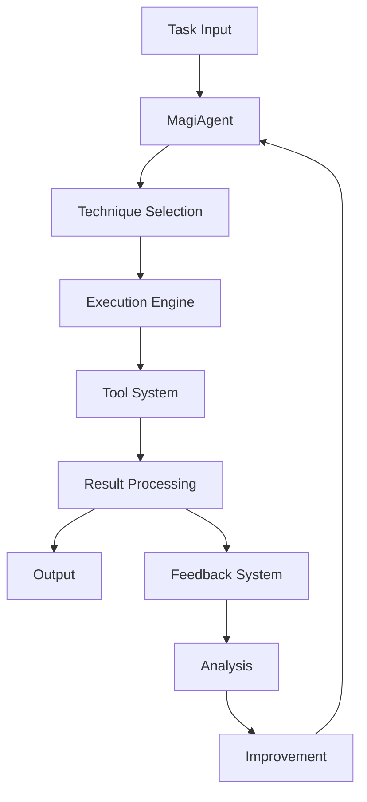

# MAGI System Architecture

## Overview

MAGI (Multi-Agent General Intelligence) is a sophisticated AI system designed for complex problem-solving and code generation. The system employs multiple reasoning techniques, feedback-driven improvement, and modular components to achieve high-quality results.

## Core Components

### 1. Core Module
- **MagiAgent**: Central orchestrator managing all system components
- **Config**: Configuration management and validation
- **Constants**: System-wide constants and defaults
- **Exceptions**: Custom exception handling

### 2. Techniques Module
Each technique implements a specific reasoning approach:

#### Chain of Thought
- Sequential reasoning process
- Step-by-step thought breakdown
- Confidence estimation per step

#### Tree of Thoughts
- Branching exploration of solutions
- Beam search for optimal paths
- Parallel evaluation of alternatives

#### Program of Thoughts
- Code-focused reasoning
- Execution validation
- Safety checks

#### Self Ask
- Question-driven problem solving
- Answer synthesis
- Recursive questioning

#### Least to Most
- Problem decomposition
- Incremental solution building
- Dependency tracking

#### Contrastive Chain
- Comparative reasoning
- Alternative analysis
- Best approach selection

#### Memory of Thought
- Experience-based reasoning
- Pattern recognition
- Solution reuse

#### Choice Annealing
- Temperature-based selection
- Exploration vs exploitation
- Convergence control

#### Prompt Chaining
- Sequential prompt composition
- Context preservation
- Result aggregation

#### Self Consistency
- Multiple solution generation
- Consistency checking
- Majority voting

#### Evolutionary Tournament
- Population-based optimization
- Fitness evaluation
- Genetic operations

### 3. Tools Module
- **Tool Creator**: Dynamic tool generation
- **Tool Management**: Version and dependency control
- **Tool Optimization**: Performance enhancement
- **Reverse Engineer**: Code analysis and understanding

### 4. Utils Module
- **Helpers**: Common utility functions
- **Logging**: Structured logging system
- **Visualization**: Result visualization tools
- **Resource Management**: System resource tracking

### 5. Feedback Module
- **Analysis**: Performance and error analysis
- **Improvement**: Automated system enhancement

### 6. Integrations Module
- **Database**: Persistent storage management
- **API**: External service integration

## System Flow

1. **Task Reception**
   - Task parsing and validation
   - Context extraction
   - Resource allocation

2. **Technique Selection**
   - Task analysis
   - Technique evaluation
   - Strategy formulation

3. **Execution**
   - Technique application
   - Tool utilization
   - Progress monitoring

4. **Result Processing**
   - Output validation
   - Quality assurance
   - Result formatting

5. **Feedback Loop**
   - Performance analysis
   - Error pattern detection
   - System improvement

## Data Flow

## Component Interactions

### Internal Communication
- Event-driven architecture
- Asynchronous processing
- Message queuing

### External Integration
- RESTful APIs
- Database connections
- File system operations

## Performance Optimization

### Caching
- Result caching
- Pattern caching
- Tool output caching

### Parallelization
- Concurrent technique execution
- Parallel tool operations
- Distributed processing

### Resource Management
- Memory monitoring
- CPU utilization tracking
- Resource allocation

## Security

### Code Execution
- Sandboxed environments
- Input validation
- Output sanitization

### Data Protection
- Secure storage
- Access control
- Encryption

## Error Handling

### Detection
- Error pattern recognition
- Performance monitoring
- Resource tracking

### Recovery
- Graceful degradation
- Automatic retry
- Fallback mechanisms

## Extensibility

### Plugin System
- Custom technique integration
- Tool extension
- Integration expansion

### Configuration
- Environment-based settings
- Dynamic configuration
- Feature flags

## Development Guidelines

### Code Organization
- Modular structure
- Clear separation of concerns
- Consistent naming conventions

### Testing
- Unit tests
- Integration tests
- Performance tests

### Documentation
- Code documentation
- API reference
- Usage examples

## Future Considerations

### Scalability
- Horizontal scaling
- Load balancing
- Distributed execution

### AI Enhancement
- Model improvements
- Technique refinement
- Tool optimization

### Integration
- Additional APIs
- New data sources
- Extended functionality
