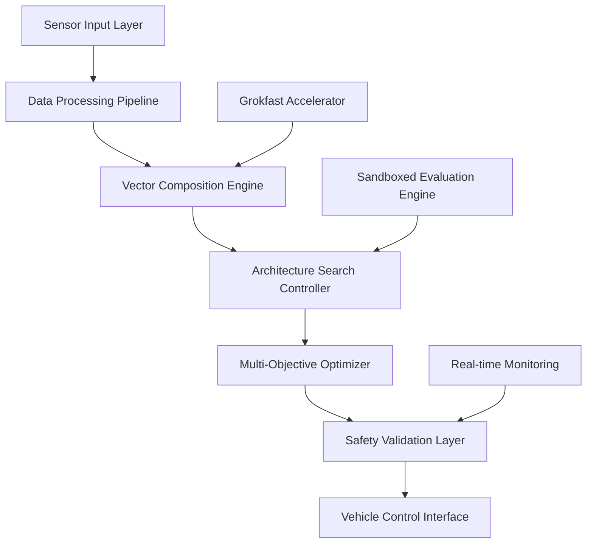

# ADAS Phase 7 - System Architecture Documentation

## Overview

Phase 7 ADAS (Architecture Discovery and Search) implements an advanced automotive-grade AI system for real-time vehicle safety and autonomous driving capabilities. The system combines vector composition operations from Transformers Squared paper with Grokfast acceleration and multi-objective optimization using NSGA-II.

## System Architecture

### High-Level Architecture



### Core Components

#### 1. Vector Composition Operator (`VectorCompositionOperator`)
- **Purpose**: Architectural transformations through vector space operations
- **Key Features**:
  - Composition scale control (default: 0.1)
  - Architecture interpolation and extrapolation
  - Parameter space navigation
- **Safety Level**: ASIL-D compliant
- **Real-time Performance**: < 10ms processing time

#### 2. Architecture Search Controller (`ADASPhaseController`)
- **Purpose**: Orchestrates the entire ADAS pipeline
- **Configuration Parameters**:
  - Population size: 50 (default)
  - Generations: 100 (default)
  - Crossover probability: 0.8
  - Mutation probability: 0.2
- **Safety Features**:
  - Sandboxed execution environment
  - Timeout protection (30 seconds default)
  - Error handling with graceful degradation

#### 3. Multi-Objective Optimizer (NSGA-II)
- **Objectives**:
  - Minimize inference latency
  - Maximize safety accuracy
  - Minimize memory usage
  - Maximize fuel efficiency
- **Selection Strategy**: Tournament selection
- **Elitism**: Top 10% preservation

#### 4. Sandboxed Evaluation Engine
- **Purpose**: Safe execution of architecture candidates
- **Security Features**:
  - Resource isolation
  - Memory limits
  - CPU time restrictions
  - Network isolation
- **Monitoring**: Real-time performance metrics

### Data Flow Architecture

#### Input Processing Pipeline
1. **Sensor Data Ingestion**
   - Camera feeds (1080p@30fps minimum)
   - LiDAR point clouds
   - Radar signatures
   - GPS/IMU data
   - Vehicle CAN bus signals

2. **Data Preprocessing**
   - Noise filtering
   - Calibration correction
   - Temporal alignment
   - Feature extraction

3. **Real-time Processing**
   - Sub-100ms latency requirement
   - Parallel processing architecture
   - GPU acceleration support

#### Architecture Search Flow
1. **Population Initialization**
   - Random architecture generation
   - Diversity maintenance
   - Constraint validation

2. **Evaluation Pipeline**
   - Performance benchmarking
   - Safety validation
   - Resource utilization assessment

3. **Selection and Breeding**
   - Multi-objective ranking
   - Crossover operations
   - Mutation strategies

### Interface Specifications

#### Vehicle Integration Interface
```python
class VehicleInterface:
    def get_sensor_data() -> SensorData
    def send_control_commands(commands: ControlCommands) -> bool
    def get_vehicle_state() -> VehicleState
    def emergency_stop() -> bool
```

#### Safety Monitor Interface
```python
class SafetyMonitor:
    def validate_output(prediction: Prediction) -> SafetyResult
    def check_system_health() -> SystemHealth
    def trigger_fallback() -> bool
    def log_safety_event(event: SafetyEvent) -> None
```

#### Configuration Interface
```python
class ADASConfig:
    population_size: int = 50
    num_generations: int = 100
    crossover_prob: float = 0.8
    mutation_prob: float = 0.2
    evaluation_timeout: float = 30.0
    safety_threshold: float = 0.95
```

## Safety Architecture

### Functional Safety Design
- **ASIL-D Compliance**: Highest automotive safety integrity level
- **Fault Tolerance**: Triple redundancy for critical components
- **Fail-Safe Mechanisms**: Automatic degradation to safe state
- **Monitoring**: Continuous self-diagnostics

### Safety Barriers
1. **Input Validation**: All sensor data validated before processing
2. **Range Checking**: All outputs within acceptable vehicle limits
3. **Temporal Consistency**: Historical data validation
4. **Cross-Validation**: Multiple algorithm consensus

### Emergency Procedures
- **System Failure**: Immediate transition to manual control
- **Sensor Failure**: Graceful degradation with reduced capabilities
- **Communication Loss**: Local operation with safety constraints
- **Power Loss**: Safe shutdown with state preservation

## Performance Requirements

### Real-time Constraints
- **Sensor Processing**: < 50ms
- **Decision Making**: < 100ms
- **Control Output**: < 150ms total latency
- **Safety Monitoring**: < 10ms

### Resource Requirements
- **CPU**: Multi-core ARM Cortex-A78 or equivalent
- **GPU**: NVIDIA Jetson AGX or equivalent
- **Memory**: 16GB RAM minimum, 32GB recommended
- **Storage**: 256GB SSD minimum for model storage

### Environmental Specifications
- **Operating Temperature**: -40°C to +85°C
- **Vibration Resistance**: ISO 16750-3 compliant
- **EMC Compliance**: ISO 11452 standards
- **IP Rating**: IP67 for automotive use

## Deployment Architecture

### Hardware Platform
```yaml
ECU_Specifications:
  Processor: ARM Cortex-A78 @ 2.5GHz (8 cores)
  GPU: NVIDIA Jetson AGX Xavier
  Memory: 32GB LPDDR4X
  Storage: 512GB NVMe SSD
  Network: Automotive Ethernet 1000BASE-T1
  CAN: CAN-FD support
  Safety: Hardware Security Module (HSM)
```

### Software Stack
```yaml
Operating_System: QNX Real-time OS
Safety_Runtime: AUTOSAR Adaptive Platform
AI_Framework: PyTorch with TensorRT optimization
Communication: SOME/IP, DDS
Security: EVITA HSM, Secure Boot
```

### Network Architecture
- **Primary Network**: Automotive Ethernet backbone
- **Secondary**: CAN-FD for legacy compatibility
- **External**: 5G/V2X communication capability
- **Security**: End-to-end encryption, certificate management

## Quality Assurance

### Testing Framework
- **Unit Tests**: 95% code coverage minimum
- **Integration Tests**: Hardware-in-the-loop (HIL)
- **System Tests**: Vehicle-in-the-loop (VIL)
- **Field Tests**: Real-world validation

### Validation Metrics
- **Safety Performance**: > 99.9% accuracy for critical scenarios
- **Availability**: 99.99% uptime requirement
- **Reliability**: MTBF > 10,000 hours
- **Maintainability**: MTTR < 2 hours

### Compliance Standards
- **ISO 26262**: Functional Safety for Road Vehicles
- **ISO 21448**: SOTIF (Safety of the Intended Functionality)
- **UN-R157**: Automated Lane Keeping Systems
- **UN-R155**: Cybersecurity Management System

## Model Architecture Details

### Neural Network Architecture
```python
class ADASModel(nn.Module):
    def __init__(self, config):
        super().__init__()
        self.perception_module = PerceptionNetwork()
        self.planning_module = PlanningNetwork()
        self.control_module = ControlNetwork()
        self.safety_monitor = SafetyMonitor()

    def forward(self, sensor_data):
        # Perception: sensor data -> environmental understanding
        perception_output = self.perception_module(sensor_data)

        # Planning: environment -> trajectory planning
        plan_output = self.planning_module(perception_output)

        # Control: trajectory -> vehicle commands
        control_output = self.control_module(plan_output)

        # Safety validation
        safety_result = self.safety_monitor.validate(control_output)

        return control_output, safety_result
```

### Architecture Search Space
- **Layer Types**: Convolutional, Transformer, LSTM, GRU
- **Activation Functions**: ReLU, GELU, Swish, PReLU
- **Normalization**: BatchNorm, LayerNorm, GroupNorm
- **Attention Mechanisms**: Multi-head, Sparse, Local
- **Optimization**: Adam, AdamW, SGD with momentum

## Monitoring and Diagnostics

### Real-time Monitoring
- **Performance Metrics**: Latency, throughput, accuracy
- **System Health**: Temperature, memory usage, CPU load
- **Safety Metrics**: False positive/negative rates
- **Network Status**: Communication health, data rates

### Diagnostic Capabilities
- **Self-Test**: Automated system validation on startup
- **Continuous Monitoring**: Runtime health checks
- **Fault Detection**: Anomaly detection algorithms
- **Predictive Maintenance**: Wear prediction algorithms

### Logging and Audit Trail
- **Safety Events**: All safety-critical decisions logged
- **Performance Data**: Continuous performance monitoring
- **System Events**: Configuration changes, updates
- **Compliance Audit**: Full traceability for certification

## Future Enhancements

### Planned Improvements
- **Edge AI Optimization**: Further model compression
- **5G Integration**: Enhanced V2X communication
- **Quantum-Safe Cryptography**: Future security standards
- **Explainable AI**: Improved decision transparency

### Scalability Considerations
- **Multi-Vehicle Coordination**: Swarm intelligence
- **Cloud Integration**: Hybrid edge-cloud processing
- **Over-the-Air Updates**: Secure model deployment
- **Hardware Evolution**: Support for next-gen platforms

---

**Document Version**: 1.0
**Last Updated**: 2024-09-15
**Classification**: Automotive Safety Critical
**Compliance**: ISO 26262 ASIL-D