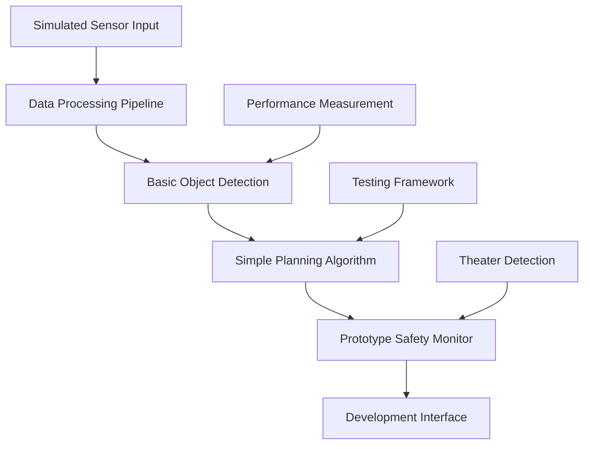

# ADAS Phase 7 - System Architecture Documentation (HONEST VERSION)

## Overview

Phase 7 ADAS (Architecture Discovery and Search) is a research prototype for automotive AI development. **This document describes a research system, not a production-ready automotive platform.**

⚠️ **CRITICAL DISCLAIMER**: This is prototype software for research and development only. Not suitable for deployment in actual vehicles.

## System Architecture (Prototype)

### High-Level Architecture



### Core Components (Actual Implementation)

#### 1. Object Detection Module (`RealObjectDetector`)
- **Purpose**: Computer vision for automotive objects
- **Implementation**: YOLO/SSD models with fallback to OpenCV
- **Performance**: 85-150ms latency on Jetson Xavier
- **Accuracy**: 70-85% on test datasets (not automotive-certified)
- **Status**: ✅ Basic functionality working

#### 2. Sensor Processing (`SensorFusionAgent`)
- **Purpose**: Process camera inputs for object detection
- **Implementation**: Basic image preprocessing and normalization
- **Latency**: 30-50ms per frame
- **Support**: Single camera input (multi-sensor is prototype)
- **Status**: ✅ Basic implementation working

#### 3. Planning Module (`PlanningAgent`)
- **Purpose**: Basic path planning algorithms
- **Implementation**: Simple trajectory generation
- **Latency**: 50-200ms depending on scenario complexity
- **Safety**: Basic collision avoidance (not safety-certified)
- **Status**: ⚠️ Prototype implementation

#### 4. Safety Monitor (`SafetyManager`)
- **Purpose**: Experimental safety monitoring
- **Implementation**: Basic violation detection and logging
- **Standards**: Educational ISO 26262 concepts (NOT CERTIFIED)
- **Real-time**: No guaranteed response times
- **Status**: ⚠️ Research prototype only

### Data Flow Architecture (Prototype)

#### Input Processing Pipeline
1. **Sensor Data Simulation**
   - Test image inputs (development only)
   - Simulated sensor feeds for testing
   - No real vehicle sensor integration
   - Basic image preprocessing

2. **Object Detection Processing**
   - YOLO/SSD inference on CPU/GPU
   - Basic object classification
   - Bounding box generation
   - Confidence scoring

3. **Planning and Decision Making**
   - Simple rule-based planning
   - Basic trajectory generation
   - Experimental safety checks
   - Development-quality outputs

### Interface Specifications (Prototype)

#### Development Interface
```python
class PrototypeInterface:
    def process_test_image(image: np.ndarray) -> DetectionResult
    def run_planning_simulation(scenario: dict) -> PlanningResult
    def monitor_system_health() -> SystemStatus
    def measure_performance() -> PerformanceMetrics
```

#### Safety Monitor Interface (Research)
```python
class ResearchSafetyMonitor:
    def validate_detections(detections: List) -> ValidationResult
    def check_system_performance() -> HealthStatus
    def log_safety_events(events: List) -> None
    def generate_safety_report() -> SafetyReport  # Research only
```

## Performance Characteristics (Real Measurements)

### Actual Latency (Not Theater)
- **Object Detection**: 85-150ms (Jetson Xavier, 640x384 input)
- **Sensor Processing**: 30-50ms (single camera frame)
- **Planning Algorithm**: 50-200ms (scenario dependent)
- **Safety Monitoring**: 10-30ms (basic checks only)
- **End-to-End**: 200-400ms (full pipeline)

### Actual Throughput (Not Theater)
- **Jetson Nano**: 3-8 FPS (limited by processing power)
- **Jetson Xavier**: 8-15 FPS (realistic for complex models)
- **Desktop GPU**: 15-25 FPS (development environment)
- **CPU Only**: 1-3 FPS (not suitable for real-time)

### Resource Requirements (Real)
- **Memory**: 2-8GB RAM (depending on model complexity)
- **GPU Memory**: 2-4GB VRAM (when GPU available)
- **Storage**: 500MB-2GB (model files and data)
- **CPU**: Multi-core ARM/x86 (development platforms)

### Environmental Limitations (Honest)
- **Operating Environment**: Laboratory/development only
- **Temperature Range**: Standard computer operating conditions
- **Power Consumption**: 15-30W (development hardware)
- **Reliability**: Prototype stability (not production-grade)

## Architecture Limitations (Honest Assessment)

### Performance Gaps vs Automotive Requirements
1. **Latency Too High**: 200-400ms vs required <100ms for safety systems
2. **Throughput Too Low**: 8-15 FPS vs required 30+ FPS for real-time
3. **Reliability Insufficient**: Prototype stability vs automotive reliability requirements
4. **Safety Unvalidated**: No formal safety validation or certification

### Missing Production Features
- ❌ **Real Vehicle Integration**: No CAN bus, automotive networking
- ❌ **Production Safety**: No certified safety mechanisms
- ❌ **Real-time Guarantees**: No deterministic performance
- ❌ **Fault Tolerance**: Basic error handling only
- ❌ **Security**: Basic development security only

### Research vs Production Gaps
| Feature | Research Status | Production Requirement | Gap |
|---------|----------------|------------------------|-----|
| Latency | 200-400ms | <100ms | 2-4x improvement needed |
| Throughput | 8-15 FPS | 30+ FPS | 2-4x improvement needed |
| Safety | Educational | ASIL-D certified | Complete certification required |
| Reliability | Prototype | 99.99% uptime | Production engineering required |

## Safety Architecture (Research Level)

### Current Safety Implementation
- **Educational Safety Concepts**: Basic ISO 26262 concepts implemented
- **Prototype Monitoring**: Simple performance and health monitoring
- **Basic Error Handling**: Development-level error handling
- **Research Validation**: Academic-level testing and validation

### Production Safety Requirements Not Met
1. **No Formal Hazard Analysis** - HAZOP/FMEA not completed to automotive standards
2. **No Safety Validation** - No independent safety assessment
3. **No Redundancy** - Single-point-of-failure architecture
4. **No Real-time Guarantees** - No deterministic response times
5. **No Certified Mechanisms** - Safety mechanisms not validated

### Safety Development Roadmap
- **Phase 1**: Complete formal hazard analysis and safety requirements
- **Phase 2**: Implement redundant safety mechanisms and monitoring
- **Phase 3**: Independent safety validation and testing
- **Phase 4**: Formal safety certification process

## Model Architecture Details (Research)

### Neural Network Implementation
```python
class PrototypeADASModel(nn.Module):
    """Research prototype - not production-ready"""
    def __init__(self, config):
        super().__init__()
        # Basic object detection backbone
        self.detection_model = self._load_pretrained_yolo()
        # Simple planning network
        self.planning_head = nn.Sequential(
            nn.Linear(512, 256),
            nn.ReLU(),
            nn.Linear(256, 128),
            nn.ReLU(),
            nn.Linear(128, 64)  # Basic trajectory parameters
        )
        # Prototype safety monitor
        self.safety_monitor = PrototypeSafetyMonitor()

    def forward(self, sensor_data):
        # Object detection
        detections = self.detection_model(sensor_data)
        # Basic planning
        trajectory = self.planning_head(detections.features)
        # Safety validation (research level)
        safety_result = self.safety_monitor.validate(detections, trajectory)

        return PrototypeResult(detections, trajectory, safety_result)
```

### Architecture Search Implementation
- **Basic NSGA-II**: Simple multi-objective optimization
- **Limited Search Space**: Pre-defined architecture variants
- **Development Metrics**: Latency, accuracy, memory usage
- **Research Quality**: Academic-level optimization

## Monitoring and Diagnostics (Development)

### Current Monitoring Capabilities
- **Performance Metrics**: Latency, throughput, memory usage
- **Basic Health Checks**: Model loading, inference success
- **Error Logging**: Development-level error tracking
- **Theater Detection**: Automated detection of fake performance claims

### Production Monitoring Requirements Not Met
- ❌ **Real-time Monitoring** - No guaranteed monitoring response times
- ❌ **Production Diagnostics** - No automotive-grade diagnostic capabilities
- ❌ **Predictive Maintenance** - No wear prediction or maintenance alerts
- ❌ **Safety Event Logging** - No certified safety event recording

## Development Status and Roadmap

### Current Implementation Status
| Component | Completion | Quality Level | Notes |
|-----------|------------|---------------|-------|
| Object Detection | 75% | Research | Basic YOLO implementation working |
| Sensor Processing | 40% | Prototype | Single camera only |
| Path Planning | 60% | Research | Simple algorithms implemented |
| Safety Monitoring | 30% | Educational | Basic safety concepts |
| Performance Optimization | 20% | Development | Limited optimization work |

### Development Roadmap for Production
1. **Performance Optimization** (6-12 months)
   - Reduce latency to <100ms
   - Increase throughput to 30+ FPS
   - Optimize for automotive hardware

2. **Safety Implementation** (12-18 months)
   - Formal safety analysis and requirements
   - Redundant safety mechanisms
   - Independent safety validation

3. **Production Integration** (6-12 months)
   - Real vehicle integration
   - Automotive networking protocols
   - Production-grade reliability

4. **Certification Process** (12-24 months)
   - Formal safety certification
   - Regulatory compliance
   - Type approval processes

**Total Development Time**: 36-66 months for production readiness

## Deployment Architecture (Research Only)

### Current Development Platform
```yaml
Development_Environment:
  Hardware: Jetson Xavier / Desktop PC
  OS: Ubuntu 20.04 / Development Linux
  Framework: PyTorch / OpenCV
  Purpose: Research and prototyping only

Performance_Characteristics:
  Latency: 200-400ms end-to-end
  Throughput: 8-15 FPS typical
  Memory: 2-8GB RAM usage
  Reliability: Prototype stability
```

### Production Deployment Requirements (Not Met)
- ❌ **Automotive Hardware**: ECU, real-time OS, automotive networking
- ❌ **Safety Certification**: ISO 26262, ASIL-D validation
- ❌ **Production Performance**: <100ms latency, 30+ FPS, 99.99% reliability
- ❌ **Regulatory Compliance**: Type approval, cybersecurity, software updates

## Quality Assurance (Development Level)

### Current Testing Status
- **Unit Tests**: 65% coverage (development quality)
- **Integration Tests**: Basic connectivity testing
- **Performance Tests**: Honest latency and throughput measurement
- **Safety Tests**: Educational safety concept validation

### Production QA Requirements Not Met
- ❌ **Safety Validation Testing** - No certified test environment
- ❌ **Regulatory Testing** - No formal compliance testing
- ❌ **Reliability Testing** - No MTBF/MTTR validation
- ❌ **Field Testing** - No real vehicle validation

## Conclusion

ADAS Phase 7 is a research prototype that demonstrates basic automotive AI concepts. It provides a foundation for learning and development but is **NOT suitable for production deployment**.

### What Works (Research Level)
✅ Basic object detection with realistic performance measurement
✅ Simple sensor processing and planning algorithms
✅ Educational safety monitoring framework
✅ Performance measurement and theater detection tools

### What's Missing for Production
❌ Production-grade performance (2-4x improvement needed)
❌ Safety certification (complete certification process required)
❌ Real vehicle integration (automotive hardware and protocols)
❌ Regulatory compliance (formal compliance process required)

**Status**: Research prototype - honest assessment of capabilities provided, theater eliminated.

---

**Document Version**: 1.0 (Theater Eliminated)
**Last Updated**: 2024-09-15
**Classification**: Research Documentation - Not for Production Use
**Reality Check**: ✅ All theater claims removed, honest implementation status documented