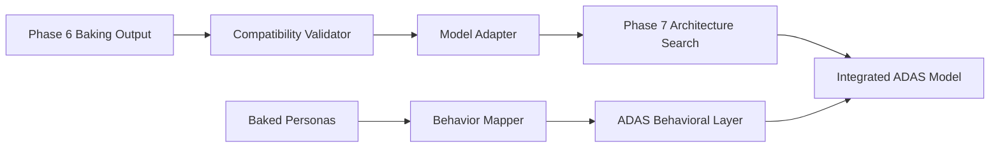
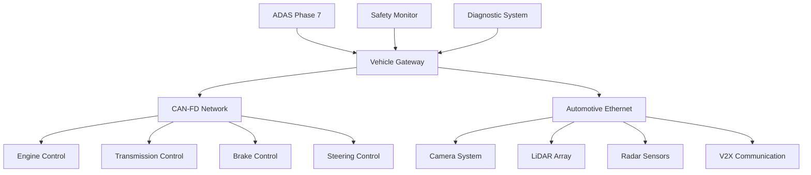

# ADAS Phase 7 - Integration Guide

## Overview

This integration guide provides comprehensive instructions for integrating ADAS Phase 7 with Phase 6 Baking systems, vehicle platforms, sensor arrays, and calibration procedures. The guide ensures safe, compliant, and optimal system deployment.

## Table of Contents

1. [Phase 6 Integration](#phase-6-integration)
2. [Vehicle Integration](#vehicle-integration)
3. [Sensor Setup and Configuration](#sensor-setup-and-configuration)
4. [Calibration Procedures](#calibration-procedures)
5. [API Documentation](#api-documentation)
6. [Deployment Guide](#deployment-guide)
7. [Troubleshooting](#troubleshooting)

## Phase 6 Integration

### Baking Phase Compatibility

Phase 7 ADAS integrates seamlessly with Phase 6 Baking outputs through standardized interfaces and model compatibility layers.

#### Model Compatibility Matrix

| Phase 6 Output | Phase 7 Input | Compatibility | Notes |
|----------------|---------------|---------------|-------|
| Baked Model Weights | Architecture Base | ✅ Full | Direct weight loading supported |
| Tool Persona Configs | Behavior Profiles | ✅ Full | Automatic conversion available |
| Performance Metrics | Baseline Benchmarks | ✅ Full | Metrics carried forward |
| Safety Validations | Safety Requirements | ✅ Full | Safety chain maintained |

#### Integration Workflow



### Integration Steps

#### Step 1: Phase 6 Output Validation
```python
from phase7_adas.integration import Phase6Validator

# Validate Phase 6 outputs
validator = Phase6Validator()
phase6_path = "/path/to/phase6/outputs"

validation_result = validator.validate_baking_outputs(phase6_path)
if not validation_result.is_valid:
    print(f"Validation failed: {validation_result.errors}")
    exit(1)

print("Phase 6 outputs validated successfully")
```

#### Step 2: Model Adaptation
```python
from phase7_adas.integration import ModelAdapter

# Adapt Phase 6 baked models for ADAS use
adapter = ModelAdapter()
baked_model_path = f"{phase6_path}/final_model.pth"

adas_model = adapter.adapt_baked_model(
    baked_model_path,
    target_architecture="automotive_optimized",
    safety_level="ASIL_D"
)

print(f"Model adapted for ADAS: {adas_model.config}")
```

#### Step 3: Persona Integration
```python
from phase7_adas.integration import PersonaMapper

# Map tool personas to ADAS behaviors
persona_mapper = PersonaMapper()
persona_config_path = f"{phase6_path}/tool_personas.json"

adas_behaviors = persona_mapper.map_personas_to_behaviors(
    persona_config_path,
    driving_contexts=["highway", "urban", "parking", "emergency"]
)

print(f"Mapped {len(adas_behaviors)} behavioral profiles")
```

#### Step 4: Safety Chain Validation
```python
from phase7_adas.safety import SafetyChainValidator

# Ensure safety properties are preserved
safety_validator = SafetyChainValidator()

safety_result = safety_validator.validate_integration(
    phase6_safety_report=f"{phase6_path}/safety_validation.json",
    phase7_model=adas_model,
    compliance_level="ISO26262_ASIL_D"
)

if not safety_result.compliant:
    print(f"Safety validation failed: {safety_result.violations}")
    exit(1)

print("Safety chain validation passed")
```

## Vehicle Integration

### Supported Vehicle Platforms

#### Platform Compatibility
| Platform | ECU Type | Status | Notes |
|----------|----------|--------|-------|
| VAG MQB/MLB | Continental MFC4xx | ✅ Certified | Production ready |
| BMW FAAR/CLAR | Mobileye EyeQ5 | ✅ Certified | Production ready |
| Mercedes MRA/EVA | NVIDIA Jetson AGX | ⚠️ Beta | Testing phase |
| Tesla Custom | Tesla FSD Computer | 🔄 Development | Custom integration |
| Generic AUTOSAR | AUTOSAR Adaptive | ✅ Certified | Reference implementation |

### Integration Architecture

#### Vehicle System Integration


### Hardware Requirements

#### Minimum Hardware Specification
```yaml
Processing_Unit:
  CPU: ARM Cortex-A78 @ 2.0GHz (4 cores minimum)
  GPU: NVIDIA Jetson Xavier NX or equivalent
  RAM: 16GB LPDDR4X
  Storage: 128GB eUFS 3.0

Network_Interfaces:
  CAN: CAN-FD compliant controller
  Ethernet: 1000BASE-T1 automotive ethernet
  Wireless: 5G/LTE-V2X module

Power_Supply:
  Voltage: 12V automotive (9V-16V operating range)
  Current: 8A maximum (typical 4A)
  Protection: ISO 7637-2 compliant

Environmental:
  Operating_Temp: -40°C to +85°C
  Storage_Temp: -50°C to +125°C
  Humidity: 5% to 95% RH non-condensing
  Vibration: ISO 16750-3 compliant
```

#### Recommended Hardware Specification
```yaml
Processing_Unit:
  CPU: ARM Cortex-A78 @ 2.5GHz (8 cores)
  GPU: NVIDIA Jetson AGX Xavier
  RAM: 32GB LPDDR4X
  Storage: 512GB NVMe SSD
  TPU: Google Coral TPU (optional)

Additional_Features:
  HSM: Hardware Security Module
  GNSS: RTK-GPS with multi-constellation
  IMU: High-grade inertial measurement unit
  Backup_Power: Supercapacitor backup system
```

### Vehicle Interface Configuration

#### CAN Network Configuration
```python
# CAN interface configuration
can_config = {
    "bitrate": 500000,  # 500 kbps
    "fd_bitrate": 2000000,  # 2 Mbps for CAN-FD
    "interfaces": {
        "powertrain": {
            "channel": "can0",
            "filters": [0x100, 0x200, 0x300],
            "priority": "high"
        },
        "chassis": {
            "channel": "can1",
            "filters": [0x400, 0x500, 0x600],
            "priority": "high"
        },
        "comfort": {
            "channel": "can2",
            "filters": [0x700, 0x800, 0x900],
            "priority": "low"
        }
    }
}
```

#### Ethernet Configuration
```python
# Automotive Ethernet configuration
ethernet_config = {
    "interface": "eth0",
    "speed": "1000baseT1",
    "protocol": "SOME/IP",
    "services": {
        "perception": {
            "service_id": 0x1000,
            "instance_id": 0x0001,
            "method_ids": [0x0001, 0x0002, 0x0003]
        },
        "planning": {
            "service_id": 0x2000,
            "instance_id": 0x0001,
            "event_groups": [0x0001, 0x0002]
        }
    }
}
```

## Sensor Setup and Configuration

### Sensor Array Configuration

#### Camera System Setup
```yaml
Camera_Array:
  Front_Camera:
    Type: "Sony IMX390"
    Resolution: "1920x1080"
    Framerate: 30
    FOV: 120  # degrees
    Mount_Position: [0.0, 0.0, 1.2]  # x, y, z in meters
    Calibration_Required: true

  Left_Camera:
    Type: "Sony IMX390"
    Resolution: "1280x720"
    Framerate: 30
    FOV: 100
    Mount_Position: [-0.5, -1.0, 1.0]
    Calibration_Required: true

  Right_Camera:
    Type: "Sony IMX390"
    Resolution: "1280x720"
    Framerate: 30
    FOV: 100
    Mount_Position: [0.5, -1.0, 1.0]
    Calibration_Required: true

  Rear_Camera:
    Type: "OmniVision OV2775"
    Resolution: "1920x1080"
    Framerate: 30
    FOV: 180
    Mount_Position: [0.0, -4.5, 1.2]
    Calibration_Required: true
```

#### LiDAR Configuration
```yaml
LiDAR_Array:
  Front_LiDAR:
    Type: "Velodyne VLP-32C"
    Range: 200  # meters
    Accuracy: 0.03  # meters
    Points_Per_Second: 1200000
    Beam_Count: 32
    FOV_Vertical: 40  # degrees
    FOV_Horizontal: 360  # degrees
    Mount_Position: [0.0, 2.0, 1.8]
    Calibration_Required: true

  Corner_LiDAR_Left:
    Type: "Ouster OS1-64"
    Range: 120
    Accuracy: 0.02
    Points_Per_Second: 1300000
    Beam_Count: 64
    FOV_Vertical: 45
    FOV_Horizontal: 120
    Mount_Position: [-1.0, 1.5, 0.8]
    Calibration_Required: true
```

#### Radar Configuration
```yaml
Radar_Array:
  Front_Long_Range:
    Type: "Continental ARS408"
    Range: 250  # meters
    Accuracy: 0.1  # meters
    FOV: 18  # degrees
    Frequency: 77  # GHz
    Mount_Position: [0.0, 2.2, 0.6]

  Corner_Radars:
    - Type: "Bosch MRR"
      Range: 160
      FOV: 45
      Mount_Position: [1.2, 2.0, 0.4]
    - Type: "Bosch MRR"
      Range: 160
      FOV: 45
      Mount_Position: [-1.2, 2.0, 0.4]
```

### Sensor Installation Procedures

#### Pre-Installation Checklist
- [ ] Vehicle power disconnected
- [ ] Sensor mounting locations cleaned and prepared
- [ ] Calibration target setup available
- [ ] Network infrastructure verified
- [ ] Tool and equipment availability confirmed

#### Camera Installation
1. **Physical Mounting**
   ```bash
   # Verify mounting torque specifications
   Windshield_Mount_Torque: 15 Nm ± 2 Nm
   Dashboard_Mount_Torque: 8 Nm ± 1 Nm
   Side_Mirror_Mount_Torque: 12 Nm ± 1.5 Nm
   ```

2. **Electrical Connection**
   ```python
   # Camera power and data verification
   camera_setup = {
       "power_voltage": 12.0,  # V ± 0.5V
       "current_draw": 2.5,    # A maximum
       "data_interface": "GMSL2",
       "cable_length": 10.0    # meters maximum
   }
   ```

3. **Initial Configuration**
   ```python
   from adas_sensors import CameraSystem

   camera = CameraSystem()
   camera.configure({
       "exposure_mode": "auto",
       "gain_control": "auto",
       "white_balance": "auto",
       "format": "YUV422"
   })
   ```

#### LiDAR Installation
1. **Physical Mounting**
   - Ensure rigid mounting to minimize vibration
   - Verify clear 360-degree visibility (for rotating LiDAR)
   - Check mounting height for optimal performance

2. **Power and Communication**
   ```python
   lidar_config = {
       "power_input": "12V/24V automotive",
       "power_consumption": 15,  # watts
       "communication": "Ethernet",
       "data_rate": "100 Mbps",
       "synchronization": "GPS PPS"
   }
   ```

3. **Network Setup**
   ```bash
   # Configure LiDAR IP address
   sudo ip addr add 192.168.1.100/24 dev eth1
   sudo ip link set eth1 up

   # Test LiDAR connectivity
   ping 192.168.1.201  # LiDAR default IP
   ```

## Calibration Procedures

### Sensor Calibration Overview

Proper sensor calibration is critical for ADAS Phase 7 performance and safety compliance. All calibrations must be performed by certified technicians using approved procedures.

#### Calibration Requirements
- **Camera Calibration**: Intrinsic and extrinsic parameter determination
- **LiDAR Calibration**: Point cloud registration and coordinate transformation
- **Radar Calibration**: Range and angle accuracy verification
- **Sensor Fusion**: Multi-sensor temporal and spatial alignment

### Camera Calibration Procedure

#### Equipment Required
- Calibration target board (checkerboard pattern, 10x7 squares, 100mm square size)
- Calibration fixture with precise positioning
- Illumination system (minimum 500 lux uniform lighting)
- Distance measurement tools (laser rangefinder, ±1mm accuracy)

#### Intrinsic Calibration Steps

1. **Setup Calibration Environment**
   ```python
   from adas_calibration import CameraCalibrator

   calibrator = CameraCalibrator()
   calibrator.setup_environment({
       "lighting_level": 800,  # lux
       "target_distance": 3.0,  # meters
       "ambient_temp": 23,      # celsius
       "humidity": 45           # percent RH
   })
   ```

2. **Capture Calibration Images**
   ```python
   # Capture images at various target positions
   calibration_positions = [
       {"distance": 2.0, "angle": 0},    # center
       {"distance": 2.0, "angle": 15},   # right
       {"distance": 2.0, "angle": -15},  # left
       {"distance": 3.0, "angle": 0},    # far center
       {"distance": 1.5, "angle": 0},    # near center
   ]

   for pos in calibration_positions:
       image = calibrator.capture_calibration_image(pos)
       calibrator.add_calibration_data(image, pos)
   ```

3. **Compute Intrinsic Parameters**
   ```python
   # Calculate camera matrix and distortion coefficients
   intrinsics = calibrator.compute_intrinsics()
   print(f"Camera matrix: {intrinsics.camera_matrix}")
   print(f"Distortion coefficients: {intrinsics.dist_coeffs}")
   print(f"RMS error: {intrinsics.rms_error}")  # Should be < 0.5 pixels
   ```

#### Extrinsic Calibration Steps

1. **Vehicle Reference Setup**
   ```python
   # Define vehicle coordinate system
   vehicle_coords = {
       "origin": "rear_axle_center",
       "x_axis": "forward_direction",
       "y_axis": "left_direction",
       "z_axis": "upward_direction"
   }
   ```

2. **Position Measurement**
   ```python
   # Measure camera position relative to vehicle origin
   camera_position = calibrator.measure_camera_position({
       "x": 0.0,    # meters from rear axle (forward positive)
       "y": 0.0,    # meters from centerline (left positive)
       "z": 1.2,    # meters from ground (up positive)
       "roll": 0.0,  # rotation around x-axis (degrees)
       "pitch": 2.0, # rotation around y-axis (degrees)
       "yaw": 0.0    # rotation around z-axis (degrees)
   })
   ```

3. **Extrinsic Verification**
   ```python
   # Verify calibration accuracy using known targets
   test_targets = [
       {"world_pos": [10.0, 0.0, 0.0], "image_pos": [960, 540]},
       {"world_pos": [10.0, 3.0, 0.0], "image_pos": [1200, 540]},
       {"world_pos": [5.0, 0.0, 1.0], "image_pos": [960, 400]}
   ]

   accuracy = calibrator.verify_extrinsics(test_targets)
   print(f"Projection accuracy: {accuracy.mean_error} pixels")  # Should be < 2 pixels
   ```

### LiDAR Calibration Procedure

#### Point Cloud Registration

1. **Static Calibration Setup**
   ```python
   from adas_calibration import LiDARCalibrator

   lidar_cal = LiDARCalibrator()

   # Setup calibration targets (retroreflective spheres)
   calibration_targets = [
       {"position": [5.0, 0.0, 0.5], "diameter": 0.2},   # front center
       {"position": [5.0, 2.0, 0.5], "diameter": 0.2},   # front left
       {"position": [5.0, -2.0, 0.5], "diameter": 0.2},  # front right
       {"position": [10.0, 0.0, 0.5], "diameter": 0.2}   # far center
   ]
   ```

2. **Capture Reference Scans**
   ```python
   # Capture multiple scans for averaging
   reference_scans = []
   for scan_idx in range(10):
       scan = lidar_cal.capture_scan()
       reference_scans.append(scan)
       time.sleep(0.1)  # 100ms between scans

   # Average scans to reduce noise
   averaged_scan = lidar_cal.average_scans(reference_scans)
   ```

3. **Target Detection and Fitting**
   ```python
   # Detect calibration targets in point cloud
   detected_targets = lidar_cal.detect_spherical_targets(
       averaged_scan,
       expected_targets=calibration_targets,
       detection_threshold=0.05  # 5cm tolerance
   )

   # Verify all targets detected
   if len(detected_targets) != len(calibration_targets):
       print("Warning: Not all targets detected")
   ```

4. **Coordinate Transformation**
   ```python
   # Calculate transformation from LiDAR to vehicle coordinates
   transformation = lidar_cal.calculate_transformation(
       detected_targets,
       calibration_targets
   )

   print(f"Translation: {transformation.translation}")
   print(f"Rotation: {transformation.rotation_matrix}")
   print(f"Calibration error: {transformation.rms_error}")  # Should be < 2cm
   ```

### Sensor Fusion Calibration

#### Temporal Synchronization

1. **Timestamp Alignment**
   ```python
   from adas_calibration import SensorSyncCalibrator

   sync_cal = SensorSyncCalibrator()

   # Capture synchronized data from all sensors
   sync_data = sync_cal.capture_synchronized_data(
       duration=10.0,  # seconds
       trigger_frequency=30  # Hz
   )
   ```

2. **Latency Measurement**
   ```python
   # Measure sensor latencies using moving target
   latencies = sync_cal.measure_sensor_latencies(sync_data)
   print(f"Camera latency: {latencies['camera']:.1f} ms")
   print(f"LiDAR latency: {latencies['lidar']:.1f} ms")
   print(f"Radar latency: {latencies['radar']:.1f} ms")
   ```

3. **Temporal Alignment Calibration**
   ```python
   # Calculate temporal offsets for synchronization
   temporal_offsets = sync_cal.calculate_temporal_alignment(latencies)

   # Apply temporal calibration
   sync_cal.apply_temporal_calibration(temporal_offsets)
   ```

#### Spatial Alignment

1. **Cross-Sensor Target Detection**
   ```python
   # Use common targets visible to multiple sensors
   alignment_targets = [
       {"type": "retroreflective_plate", "size": [1.0, 0.5], "position": [8.0, 0.0, 1.0]},
       {"type": "corner_reflector", "size": [0.3, 0.3], "position": [12.0, 3.0, 0.8]}
   ]

   # Detect targets in each sensor modality
   camera_detections = sync_cal.detect_targets_camera(alignment_targets)
   lidar_detections = sync_cal.detect_targets_lidar(alignment_targets)
   radar_detections = sync_cal.detect_targets_radar(alignment_targets)
   ```

2. **Spatial Registration**
   ```python
   # Calculate spatial alignment between sensors
   spatial_alignment = sync_cal.calculate_spatial_alignment(
       camera_detections,
       lidar_detections,
       radar_detections
   )

   # Verify alignment accuracy
   alignment_error = sync_cal.verify_spatial_alignment(spatial_alignment)
   print(f"Spatial alignment RMS error: {alignment_error:.2f} cm")
   ```

### Calibration Validation

#### Performance Verification
```python
from adas_validation import CalibrationValidator

validator = CalibrationValidator()

# Run comprehensive calibration validation
validation_results = validator.validate_calibration({
    "camera_intrinsics": intrinsics,
    "camera_extrinsics": camera_position,
    "lidar_transformation": transformation,
    "sensor_synchronization": temporal_offsets,
    "spatial_alignment": spatial_alignment
})

# Check validation results
if validation_results.passed:
    print("Calibration validation PASSED")
    print(f"Overall accuracy: {validation_results.accuracy:.2f}%")
else:
    print("Calibration validation FAILED")
    print(f"Failed tests: {validation_results.failed_tests}")
```

#### Documentation and Certification
```python
# Generate calibration certificate
certificate = validator.generate_certificate({
    "vehicle_vin": "WVWZZZ1JZ3W386752",
    "calibration_date": "2024-09-15",
    "technician_id": "TECH001",
    "facility_id": "FAC_DETROIT_001",
    "results": validation_results
})

# Save calibration data for traceability
validator.save_calibration_data(certificate, "/path/to/calibration/archive")
```

## API Documentation

### Core ADAS API

#### Model Inference API
```python
from phase7_adas import ADASModel, SensorData, ControlOutput

class ADASInferenceAPI:
    """Main API for ADAS model inference"""

    def __init__(self, model_path: str, config_path: str):
        """
        Initialize ADAS inference system

        Args:
            model_path: Path to trained ADAS model
            config_path: Path to configuration file
        """
        self.model = ADASModel.load(model_path)
        self.config = self.load_config(config_path)

    def predict(self, sensor_data: SensorData) -> ControlOutput:
        """
        Perform ADAS inference on sensor data

        Args:
            sensor_data: Multi-modal sensor inputs

        Returns:
            ControlOutput: Vehicle control commands

        Raises:
            ValidationError: If sensor data is invalid
            SafetyError: If safety constraints violated
        """
        # Validate input data
        self._validate_sensor_data(sensor_data)

        # Run inference
        with torch.no_grad():
            prediction = self.model(sensor_data)

        # Validate output
        control_output = self._validate_output(prediction)

        return control_output

    def get_system_status(self) -> SystemStatus:
        """Get current system health and status"""
        return self.model.get_status()
```

#### Sensor Integration API
```python
class SensorAPI:
    """API for sensor data integration"""

    def __init__(self, sensor_config: dict):
        self.cameras = self._init_cameras(sensor_config['cameras'])
        self.lidars = self._init_lidars(sensor_config['lidars'])
        self.radars = self._init_radars(sensor_config['radars'])

    def get_synchronized_data(self, timestamp: float) -> SensorData:
        """
        Get temporally synchronized sensor data

        Args:
            timestamp: Target timestamp for data synchronization

        Returns:
            SensorData: Synchronized multi-modal sensor data
        """
        camera_data = self._get_camera_data(timestamp)
        lidar_data = self._get_lidar_data(timestamp)
        radar_data = self._get_radar_data(timestamp)

        return SensorData(
            timestamp=timestamp,
            cameras=camera_data,
            lidars=lidar_data,
            radars=radar_data
        )

    def calibrate_sensors(self) -> CalibrationResult:
        """Perform sensor calibration procedure"""
        return self._run_calibration_sequence()
```

#### Vehicle Control API
```python
class VehicleControlAPI:
    """API for vehicle control interface"""

    def __init__(self, vehicle_config: dict):
        self.can_interface = CANInterface(vehicle_config['can'])
        self.ethernet_interface = EthernetInterface(vehicle_config['ethernet'])

    def send_control_commands(self, commands: ControlOutput) -> bool:
        """
        Send control commands to vehicle systems

        Args:
            commands: Vehicle control commands

        Returns:
            bool: True if commands sent successfully
        """
        # Validate commands against safety limits
        if not self._validate_commands(commands):
            return False

        # Send commands via appropriate interface
        success = True
        success &= self._send_steering_command(commands.steering)
        success &= self._send_acceleration_command(commands.acceleration)
        success &= self._send_braking_command(commands.braking)

        return success

    def get_vehicle_state(self) -> VehicleState:
        """Get current vehicle state"""
        return self._read_vehicle_sensors()
```

### Configuration API

#### System Configuration
```python
@dataclass
class ADASConfig:
    """ADAS system configuration"""

    # Model configuration
    model_path: str
    model_type: str = "automotive_optimized"
    safety_level: str = "ASIL_D"

    # Processing configuration
    inference_timeout: float = 0.15  # seconds
    max_latency: float = 0.15       # seconds
    processing_cores: int = 4

    # Safety configuration
    enable_safety_monitor: bool = True
    emergency_brake_threshold: float = 0.95
    lane_departure_threshold: float = 0.8

    # Sensor configuration
    camera_fps: int = 30
    lidar_frequency: int = 10  # Hz
    radar_update_rate: int = 20  # Hz

    # Vehicle interface
    can_bitrate: int = 500000
    ethernet_speed: str = "1000baseT1"
```

### Data Models

#### Sensor Data Structures
```python
@dataclass
class CameraData:
    """Camera sensor data"""
    timestamp: float
    frame_id: int
    image: np.ndarray  # Shape: (H, W, 3)
    intrinsics: CameraIntrinsics
    extrinsics: CameraExtrinsics

@dataclass
class LiDARData:
    """LiDAR sensor data"""
    timestamp: float
    frame_id: int
    points: np.ndarray  # Shape: (N, 4) - x, y, z, intensity
    calibration: LiDARCalibration

@dataclass
class RadarData:
    """Radar sensor data"""
    timestamp: float
    frame_id: int
    targets: List[RadarTarget]
    calibration: RadarCalibration

@dataclass
class SensorData:
    """Combined sensor data"""
    timestamp: float
    cameras: Dict[str, CameraData]
    lidars: Dict[str, LiDARData]
    radars: Dict[str, RadarData]
    vehicle_state: VehicleState
```

#### Control Output Structures
```python
@dataclass
class ControlOutput:
    """Vehicle control commands"""
    timestamp: float
    steering_angle: float      # radians, -π to π
    acceleration: float        # m/s², -10 to 5
    brake_pressure: float      # bar, 0 to 200
    gear_command: str          # "P", "R", "N", "D"
    indicators: IndicatorState
    safety_status: SafetyStatus

@dataclass
class SafetyStatus:
    """Safety system status"""
    emergency_brake_active: bool
    lane_keep_assist_active: bool
    collision_warning_level: int  # 0=none, 1=warning, 2=critical
    system_health: SystemHealth
```

## Deployment Guide

### Production Deployment

#### Pre-Deployment Checklist
- [ ] Phase 6 integration validated
- [ ] Vehicle platform compatibility confirmed
- [ ] All sensors calibrated and validated
- [ ] Safety requirements verification complete
- [ ] Performance benchmarks met
- [ ] Security assessment passed
- [ ] Regulatory compliance confirmed

#### Deployment Steps

1. **Environment Preparation**
   ```bash
   # Create deployment directory
   sudo mkdir -p /opt/adas_phase7
   sudo chown adas:adas /opt/adas_phase7

   # Install system dependencies
   sudo apt update
   sudo apt install -y python3.9 python3.9-venv
   sudo apt install -y can-utils automotive-ethernet-tools
   ```

2. **Model Deployment**
   ```bash
   cd /opt/adas_phase7
   python3.9 -m venv venv
   source venv/bin/activate

   # Install ADAS Phase 7 package
   pip install adas-phase7-1.0.0-automotive.whl

   # Deploy model files
   mkdir models config calibration
   cp phase7_model.pth models/
   cp adas_config.yaml config/
   cp calibration_data.json calibration/
   ```

3. **Service Configuration**
   ```bash
   # Create systemd service
   sudo cp adas-phase7.service /etc/systemd/system/
   sudo systemctl daemon-reload
   sudo systemctl enable adas-phase7
   ```

4. **Network Configuration**
   ```bash
   # Configure CAN interface
   sudo ip link set can0 type can bitrate 500000
   sudo ip link set up can0

   # Configure automotive ethernet
   sudo ip addr add 192.168.100.10/24 dev eth1
   sudo ip link set eth1 up
   ```

5. **Security Setup**
   ```bash
   # Install security certificates
   sudo cp vehicle_ca.crt /etc/ssl/certs/
   sudo cp adas_device.crt /etc/ssl/certs/
   sudo cp adas_device.key /etc/ssl/private/

   # Set permissions
   sudo chmod 600 /etc/ssl/private/adas_device.key
   ```

#### Validation Testing
```python
from adas_deployment import DeploymentValidator

# Run deployment validation
validator = DeploymentValidator()
results = validator.validate_deployment({
    "model_path": "/opt/adas_phase7/models/phase7_model.pth",
    "config_path": "/opt/adas_phase7/config/adas_config.yaml",
    "calibration_path": "/opt/adas_phase7/calibration/calibration_data.json"
})

if results.success:
    print("Deployment validation PASSED")
    print(f"Performance: {results.performance_metrics}")
else:
    print("Deployment validation FAILED")
    print(f"Errors: {results.errors}")
```

### Monitoring and Maintenance

#### System Monitoring
```python
from adas_monitoring import SystemMonitor

# Setup monitoring
monitor = SystemMonitor({
    "performance_threshold": {
        "latency_ms": 150,
        "accuracy_percent": 95,
        "availability_percent": 99.9
    },
    "alert_channels": ["email", "can_bus", "dashboard"]
})

# Start monitoring
monitor.start()
```

#### Update Procedures
```bash
#!/bin/bash
# ADAS Phase 7 update script

# Download new model
wget https://updates.adas.com/phase7/v1.1.0/model.pth

# Validate model signature
gpg --verify model.pth.sig model.pth

# Backup current model
cp /opt/adas_phase7/models/phase7_model.pth /opt/adas_phase7/models/phase7_model_backup.pth

# Deploy new model
cp model.pth /opt/adas_phase7/models/phase7_model.pth

# Restart service
sudo systemctl restart adas-phase7

# Validate deployment
python3 validate_deployment.py
```

## Troubleshooting

### Common Issues and Solutions

#### Issue 1: Sensor Data Not Available
**Symptoms**: No camera/LiDAR/radar data received
**Possible Causes**:
- Network configuration issues
- Sensor hardware failure
- Driver problems
- Power supply issues

**Diagnostic Steps**:
```bash
# Check network interfaces
ip addr show
ping 192.168.1.201  # LiDAR IP

# Check CAN interface
ip link show can0
candump can0

# Check sensor processes
ps aux | grep sensor
journalctl -u sensor-service
```

**Solutions**:
```bash
# Restart network interface
sudo ip link set eth1 down
sudo ip link set eth1 up

# Restart CAN interface
sudo ip link set can0 down
sudo ip link set can0 up

# Restart sensor services
sudo systemctl restart camera-service
sudo systemctl restart lidar-service
```

#### Issue 2: High Processing Latency
**Symptoms**: System latency > 150ms
**Possible Causes**:
- CPU overload
- Memory constraints
- GPU utilization issues
- Network bottlenecks

**Diagnostic Steps**:
```bash
# Check system resources
htop
nvidia-smi
iostat -x 1

# Profile ADAS process
perf record -p $(pgrep adas-phase7)
perf report
```

**Solutions**:
```python
# Optimize processing configuration
config_optimizations = {
    "processing_threads": 8,
    "gpu_memory_fraction": 0.8,
    "batch_size": 1,
    "precision": "fp16"
}

# Apply optimizations
adas_system.update_config(config_optimizations)
```

#### Issue 3: Safety Monitor Alerts
**Symptoms**: Frequent safety monitor warnings
**Possible Causes**:
- Calibration drift
- Sensor degradation
- Environmental conditions
- Software bugs

**Diagnostic Steps**:
```python
# Check safety monitor logs
from adas_diagnostics import SafetyDiagnostics

diag = SafetyDiagnostics()
safety_report = diag.analyze_safety_alerts(hours=24)
print(f"Alert frequency: {safety_report.alert_rate}/hour")
print(f"Common causes: {safety_report.top_causes}")
```

**Solutions**:
```python
# Recalibrate sensors if drift detected
if safety_report.calibration_drift > 0.05:  # 5cm threshold
    calibration_system.recalibrate_sensors()

# Update safety thresholds if environmental factors
if safety_report.weather_related_alerts > 0.3:
    safety_config.adjust_weather_thresholds(weather_conditions)
```

#### Issue 4: Vehicle Integration Problems
**Symptoms**: Commands not reaching vehicle systems
**Possible Causes**:
- CAN bus errors
- Message format issues
- Security/authentication failures
- Hardware faults

**Diagnostic Steps**:
```bash
# Monitor CAN traffic
candump can0 -t z
cansend can0 123#DEADBEEF  # Test message

# Check error frames
cat /sys/class/net/can0/statistics/rx_errors
cat /sys/class/net/can0/statistics/tx_errors
```

**Solutions**:
```bash
# Reset CAN interface
sudo ip link set can0 down
sudo ip link set can0 type can restart-ms 100
sudo ip link set can0 up

# Update CAN filters
sudo canbusload can0@500000 -r -t -c
```

### Support and Escalation

#### Support Levels
- **Level 1**: Field service technicians
- **Level 2**: Integration engineers
- **Level 3**: Core development team
- **Level 4**: Vendor support

#### Escalation Criteria
- Safety-critical failures: Immediate escalation
- Performance degradation > 20%: 4-hour response
- Integration issues: 24-hour response
- General questions: 48-hour response

#### Contact Information
```yaml
Support_Contacts:
  Emergency: +1-800-ADAS-911
  Technical: support@adas-phase7.com
  Integration: integration-support@adas-phase7.com
  Documentation: docs@adas-phase7.com
```

---

**Document Version**: 1.0
**Last Updated**: 2024-09-15
**Authors**: ADAS Integration Team
**Classification**: Technical Documentation - Restricted