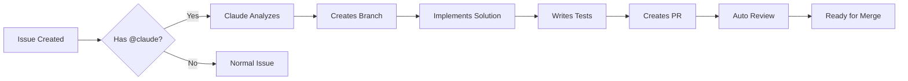

# 🤖 GitHub Claude Code Automation

> **Automate 90% of your GitHub workflow with Claude Code integration in just 20 minutes!**

## 🎯 What This Does

This automation system integrates Claude directly into your GitHub workflow, enabling:

- **Automatic PR Creation**: Turn issues into fully implemented PRs with a single `@claude` mention
- **Intelligent Code Reviews**: Get AI-powered code reviews on every PR
- **Content Generation**: Generate PRDs, documentation, and API specs on demand
- **Task Management**: Automatic project board updates and progress tracking
- **Cost Efficiency**: ~$0.01-0.03 per automated PR (using GitHub Actions free tier)

## 🚀 20-Minute Setup

### Quick Start (5 minutes)

```bash
# Run the automated setup
bash scripts/quick-setup.sh
```

### Manual Setup (15 minutes)

1. **Initialize Claude Code**
   ```bash
   npx claude-flow init --yes-all
   ```

2. **Install GitHub App**
   - Run in Claude Code: `/github install github app`
   - Authorize the app when browser opens
   - Merge the created PR

3. **Add API Key**
   - Get key from [Anthropic Console](https://console.anthropic.com/)
   - Add to GitHub: Settings → Secrets → Actions → New secret
   - Name: `CLAUDE_API_KEY`

4. **Test It**
   ```markdown
   # Create a new issue with:
   @claude create a REST API endpoint that returns the current server time
   ```

## 📊 Real-World Performance

Based on the video demonstration:

| Metric | Value |
|--------|-------|
| Setup Time | ~20 minutes |
| Automation Coverage | 90% |
| Speed Improvement | 2.8-4.4x |
| Token Reduction | 32.3% |
| Cost per PR | $0.01-0.03 |
| Response Time | <5 minutes |

## 🎮 How to Use

### Basic Commands

#### In Issues
```markdown
@claude implement user authentication with JWT tokens
```

#### In PR Comments
```markdown
@claude review this implementation and suggest improvements
```

#### Content Generation
```markdown
@claude generate prd for payment processing feature
```

### Advanced Features

#### 1. Automatic PR Creation from Issues
```markdown
Title: Add search functionality

@claude create pr implementing:
- Full-text search
- Filtering options
- Pagination
- Search history
```

#### 2. Intelligent Code Reviews
Claude automatically reviews PRs for:
- Code quality
- Best practices
- Security issues
- Performance optimizations
- Test coverage

#### 3. Content Generation Templates

**PRD Generation:**
```markdown
@claude generate prd for [feature name]
```

**XML Prompts:**
```markdown
@claude generate xml prompt for [use case]
```

**API Documentation:**
```markdown
@claude generate api docs for [endpoints]
```

## 🔧 Configuration

### Customize Rules
Edit `config/claude-rules.json`:
```json
{
  "github_integration": {
    "pr_automation": {
      "auto_review": true,
      "require_tests": true,
      "auto_merge_on_pass": false
    }
  }
}
```

### Workflow Triggers
Modify `.github/workflows/claude-code-integration.yml`:
```yaml
on:
  issues:
    types: [opened, edited]
  pull_request:
    types: [opened, synchronize]
```

## 💰 Cost Analysis

### GitHub Actions (Free Tier)
- **Included**: 2,000 minutes/month
- **Average PR**: 3 minutes
- **Monthly capacity**: ~666 PRs
- **Overage cost**: $0.008/minute

### Example Monthly Usage
- 10 developers
- 5 PRs/developer/week
- 200 PRs/month
- **Total cost**: $0 (within free tier)

## 🏆 Best Practices

### 1. Clear Instructions
```markdown
# Good ✅
@claude implement user profile API with:
- GET /users/:id - retrieve user
- PUT /users/:id - update user
- Include validation and tests

# Vague ❌
@claude make user stuff work
```

### 2. Batch Related Tasks
```markdown
@claude implement complete authentication flow:
- Login endpoint
- Logout endpoint
- Password reset
- Session management
```

### 3. Leverage Templates
Use predefined templates for consistency:
- PRD template
- API documentation template
- Test specification template

## 🔍 Monitoring & Debugging

### Check Automation Status
```bash
# View recent runs
gh run list

# Check specific run
gh run view [run-id]

# Monitor in real-time
node scripts/github-claude-automation.js monitor
```

### View Statistics
```bash
node scripts/github-claude-automation.js stats
```

Output:
```
📈 Automation Statistics:
- Token reduction: 32.3%
- Speed improvement: 2.8-4.4x
- Automation coverage: 90%
- GitHub Actions cost: ~$0.01 per PR
```

## 🛡️ Security Considerations

1. **Never commit API keys** - Use GitHub Secrets
2. **Review generated code** - AI suggestions need validation
3. **Set branch protection** - Require reviews for main branch
4. **Limit permissions** - Use least privilege principle
5. **Audit regularly** - Check automation logs

## 📚 File Structure

```
.github/
  workflows/
    claude-code-integration.yml  # Main automation workflow
config/
  claude-rules.json              # Automation rules and preferences
docs/
  templates/
    prd-template.md              # PRD generation template
    xml-prompt-template.xml      # XML prompt template
  GITHUB_CLAUDE_AUTOMATION_SETUP.md
scripts/
  github-claude-automation.js    # Core automation script
  quick-setup.sh                # One-click setup script
  package.json                  # Dependencies
```

## 🎯 Use Cases

### 1. Rapid Prototyping
```markdown
@claude create a proof-of-concept for real-time chat using WebSockets
```

### 2. Bug Fixes
```markdown
@claude debug and fix the memory leak in the data processing module
```

### 3. Documentation
```markdown
@claude generate comprehensive API documentation for all endpoints
```

### 4. Refactoring
```markdown
@claude refactor the user service to follow clean architecture principles
```

### 5. Testing
```markdown
@claude add comprehensive test coverage for the payment module
```

## 🚦 Workflow States



## 📈 Success Metrics

Track your automation success:

| Metric | Target | Measure |
|--------|--------|---------|
| Response Time | <5 min | Time to first Claude response |
| Implementation Rate | >80% | Issues successfully automated |
| Test Coverage | >80% | Coverage in generated code |
| Review Approval Rate | >90% | PRs approved without changes |
| Cost per PR | <$0.05 | GitHub Actions usage |

## 🤝 Integration with Other Tools

Compatible with:
- **Jira**: Sync issues bidirectionally
- **Slack**: Get notifications
- **Linear**: Update tickets automatically
- **Discord**: Bot integration
- **VS Code**: Direct integration via Claude Code

## 🆘 Troubleshooting

### Claude Not Responding
1. Check API key in secrets
2. Verify workflow is enabled
3. Check GitHub Actions logs

### PR Creation Fails
1. Check branch permissions
2. Resolve merge conflicts
3. Verify file permissions

### High Costs
1. Optimize trigger conditions
2. Use caching for dependencies
3. Batch similar requests

## 🎓 Learning Resources

- [Video Tutorial](https://www.youtube.com/watch?v=lwvzGJFWAio) - Original 20-minute setup
- [Claude API Docs](https://docs.anthropic.com/)
- [GitHub Actions Guide](https://docs.github.com/actions)
- [Claude Flow Docs](https://github.com/ruvnet/claude-flow)

## 🏁 Next Steps

1. **Test the Setup**: Create test issue with `@claude`
2. **Customize Rules**: Edit `config/claude-rules.json`
3. **Add Team Members**: Share setup guide
4. **Monitor Usage**: Track costs and performance
5. **Iterate**: Refine prompts based on results

## 📞 Support

- **Issues**: Create issue in this repo
- **Documentation**: Check `docs/` directory
- **Community**: Join Discord/Slack channels

---

**Remember**: This automation handles 90% of routine tasks, freeing you to focus on the 10% that requires human creativity and decision-making.

*Built with ❤️ using Claude Code and GitHub Actions*