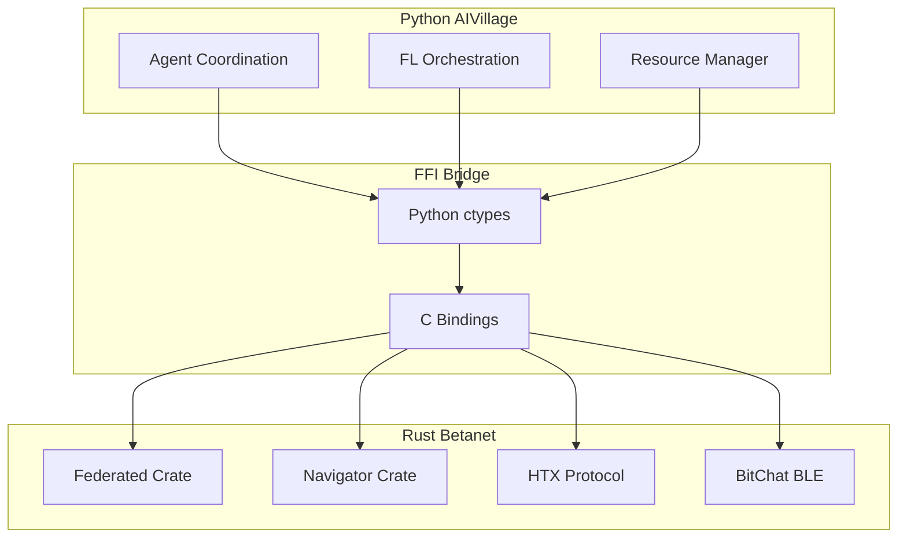

# AIVillage Secure Multi-Layer Network Implementation Guide

## Table of Contents
1. [Overview](#overview)
2. [Architecture Layers](#architecture-layers)
3. [Implementation Guide](#implementation-guide)
4. [Integration Points](#integration-points)
5. [Security Model](#security-model)
6. [Deployment Guide](#deployment-guide)
7. [Testing & Validation](#testing--validation)
8. [Troubleshooting](#troubleshooting)

## Overview

AIVillage implements a sophisticated **5-layer secure network architecture** that provides privacy-preserving federated learning, adaptive routing, and resilient communication across heterogeneous devices. This guide covers the complete implementation spanning **127+ components** across Rust and Python.

### Key Capabilities
- 🔒 **End-to-end encryption** with forward secrecy (Noise-XK + TLS 1.3)
- 🌐 **Multi-transport support** (BLE mesh, encrypted internet, DTN bundles)
- 🎯 **Adaptive routing** with mathematical optimization (semiring algebra)
- 🛡️ **Privacy preservation** (differential privacy, mixnode routing, traffic mimicry)
- 📱 **Mobile optimization** (battery/thermal awareness, chunk sizing)
- 🔄 **Automatic fallback** (online → offline seamless transition)

## Architecture Layers

### Layer 5: Application Layer
**Components**: Federated Learning, Agent Coordination, State Management

```
┌─────────────────────────────────────────────────────────────────────┐
│                         APPLICATION LAYER                           │
├─────────────────────────────────────────────────────────────────────┤
│ Federated Learning Framework                                        │
│ Location: betanet-bounty/crates/federated/                         │
│ Python Integration: src/production/agent_forge/                     │
│                                                                     │
│ Key Components:                                                    │
│ • RoundOrchestrator: Coordinates FL rounds via MLS groups          │
│ • SecureAggregation: DP-SGD + additive secret sharing             │
│ • GossipProtocol: Peer discovery via BitChat BLE                  │
│ • ProofOfParticipation: Energy/FLOPs receipt system               │
│                                                                     │
│ Agent Fabric Unified Messaging                                     │
│ Location: betanet-bounty/crates/agent-fabric/                      │
│ Python Integration: src/core/agents/                               │
│                                                                     │
│ Key APIs:                                                          │
│ • AgentFabric::send_message() - Multi-transport messaging         │
│ • MlsGroup::join_group() - Secure group communication            │
│ • Auto-fallback: RPC → DTN when offline                          │
│                                                                     │
│ Twin Vault CRDT State                                             │
│ Location: betanet-bounty/crates/twin-vault/                        │
│ Python Integration: src/token_economy/                             │
│                                                                     │
│ Key Features:                                                      │
│ • Merkle proofs for tamper-evident logging                        │
│ • Partition-tolerant state synchronization                        │
│ • Cryptographic receipt verification                              │
└─────────────────────────────────────────────────────────────────────┘
```

#### Implementation Example: Federated Learning Round

```rust
// Rust: betanet-bounty/crates/federated/src/orchestrator.rs
let orchestrator = RoundOrchestrator::new(agent_fabric, twin_manager, config).await?;
let session_id = orchestrator.create_session(training_config).await?;

// Add participants
for participant in participants {
    orchestrator.add_participant(&session_id, participant).await?;
}

// Start round with secure aggregation
let round_id = orchestrator.start_round(&session_id).await?;
```

```python
# Python: src/production/agent_forge/fl_coordinator.py
from betanet_bridge import integrate_federated_learning

async def coordinate_fl_round():
    fl_system = await integrate_federated_learning()

    # Configure privacy settings
    privacy_config = {
        "dp_epsilon": 1.0,
        "dp_delta": 1e-5,
        "clipping_norm": 1.0,
        "enable_secure_agg": True
    }

    # Start federated round
    round_id = await fl_system.start_round(
        participants=discovered_devices,
        privacy_config=privacy_config,
        compression="topk_sparsification"
    )
```

### Layer 4: Routing Layer
**Components**: Navigator, DTN Router, Mixnode Privacy

```
┌─────────────────────────────────────────────────────────────────────┐
│                          ROUTING LAYER                              │
├─────────────────────────────────────────────────────────────────────┤
│ Navigator Semiring Router                                           │
│ Location: betanet-bounty/crates/navigator/                          │
│ Python Integration: src/core/agents/navigator_agent.py              │
│                                                                     │
│ Mathematical Foundation:                                            │
│ • Cost = (latency_ms, energy_mAh, reliability⁻¹, privacy_ε)       │
│ • Semiring: (Cost, ⊕, ⊗, ∞, 0)                                   │
│ • Pareto frontier management with K=8 capacity                     │
│                                                                     │
│ DTN Bundle Router                                                   │
│ Location: betanet-bounty/crates/betanet-dtn/                       │
│ Python Integration: src/core/p2p/dtn_manager.py                    │
│                                                                     │
│ Key Algorithms:                                                     │
│ • Lyapunov drift-plus-penalty scheduling                          │
│ • Contact graph routing with opportunistic forwarding             │
│ • Store-and-forward with custody transfer                         │
│                                                                     │
│ Mixnode Privacy Circuit                                            │
│ Location: betanet-bounty/crates/betanet-mixnode/                   │
│ Python Integration: src/core/p2p/privacy_circuit.py                │
│                                                                     │
│ Privacy Features:                                                   │
│ • Sphinx packet processing (onion routing)                        │
│ • VRF-based delays for timing correlation prevention              │
│ • Cover traffic generation                                        │
└─────────────────────────────────────────────────────────────────────┘
```

#### Implementation Example: Adaptive Path Selection

```rust
// Rust: betanet-bounty/crates/navigator/src/api.rs
let navigator = Navigator::new(dtn_router, local_node);

// Define QoS requirements
let qos = QosRequirements {
    latency_weight: 0.7,  // Prioritize low latency
    energy_weight: 0.1,   // Less important
    reliability_weight: 0.15,
    privacy_weight: 0.05,
};

// Select optimal path
let selection = navigator.select_path(
    &destination,
    qos,
    Some(1000), // 1s deadline
    Some(0.5)   // Privacy budget
).await?;

println!("Selected: {} via {}", selection.next_hop, selection.cla_name);
```

```python
# Python: src/core/agents/navigator_agent.py
from navigator_bridge import NavigatorAgent

class AdaptiveRouter:
    async def route_message(self, dest, message, context):
        navigator = NavigatorAgent()

        # Determine QoS based on context
        if context.is_emergency:
            qos = "real_time"  # Minimize latency
        elif context.is_battery_critical:
            qos = "energy_efficient"  # Minimize battery drain
        elif context.is_sensitive:
            qos = "privacy_first"  # Maximum privacy
        else:
            qos = "balanced"

        # Get routing decision
        route = await navigator.select_path(
            destination=dest,
            qos_mode=qos,
            deadline_ms=context.deadline,
            privacy_epsilon=context.privacy_budget
        )

        # Use selected transport
        if route.transport == "bitchat":
            await self.send_via_ble_mesh(message, route)
        elif route.transport == "betanet":
            await self.send_via_encrypted_internet(message, route)
```

### Layer 3: Transport Layer
**Components**: HTX Protocol, DTN Bundles, uTLS Mimicry

```
┌─────────────────────────────────────────────────────────────────────┐
│                         TRANSPORT LAYER                             │
├─────────────────────────────────────────────────────────────────────┤
│ HTX Protocol (Hybrid Transport eXtension)                           │
│ Location: betanet-bounty/crates/betanet-htx/                       │
│ Python Integration: src/core/p2p/htx_transport.py                  │
│                                                                     │
│ Features:                                                           │
│ • TCP + QUIC dual-stack support                                   │
│ • Noise-XK handshake (forward secrecy)                           │
│ • Frame-based messaging with multiplexing                         │
│ • Automatic transport selection                                   │
│                                                                     │
│ DTN Bundle Protocol                                                │
│ Location: betanet-bounty/crates/betanet-dtn/                       │
│ Python Integration: src/core/p2p/bundle_manager.py                 │
│                                                                     │
│ Capabilities:                                                       │
│ • Store-and-forward for disconnected networks                     │
│ • Bundle fragmentation and reassembly                             │
│ • Custody transfer with acknowledgments                           │
│ • Priority-based scheduling                                       │
│                                                                     │
│ uTLS Fingerprint Mimicry                                          │
│ Location: betanet-bounty/crates/betanet-utls/                      │
│ Python Integration: src/core/p2p/traffic_mimicry.py                │
│                                                                     │
│ Evasion Techniques:                                                │
│ • Chrome N-2 fingerprint generation                               │
│ • JA3/JA4 fingerprint matching                                   │
│ • Dynamic ClientHello generation                                  │
│ • TLS extension mimicry                                          │
└─────────────────────────────────────────────────────────────────────┘
```

#### Implementation Example: Secure Transport Setup

```rust
// Rust: betanet-bounty/crates/betanet-htx/src/lib.rs
use betanet_htx::{HtxConfig, HtxClient, NoiseConfig};

let config = HtxConfig {
    transport: TransportMode::Auto, // TCP + QUIC
    noise: NoiseConfig {
        pattern: NoisePattern::XK,
        static_key: keypair.private,
    },
    frame_size: 16384,
    enable_compression: true,
};

let mut client = HtxClient::new(config);
client.connect("192.168.1.100:9000").await?;

// Send encrypted message
client.send_frame(b"Secure federated learning update").await?;
```

```python
# Python: src/core/p2p/secure_transport.py
from betanet_bridge import HTXTransport, uTLSMimicry

class SecureTransport:
    def __init__(self):
        self.htx = HTXTransport()
        self.mimicry = uTLSMimicry()

    async def establish_secure_channel(self, peer_addr):
        # Generate Chrome fingerprint for traffic mimicry
        fingerprint = self.mimicry.generate_chrome_fingerprint(
            version="chrome_119",
            extensions=["alpn", "sni", "status_request"]
        )

        # Connect with HTX + Noise-XK
        session = await self.htx.connect(
            address=peer_addr,
            transport="auto",  # TCP fallback to QUIC
            noise_pattern="XK",
            tls_fingerprint=fingerprint
        )

        return session
```

### Layer 2: Network Layer
**Components**: BitChat BLE, BetaNet Internet, CLAs

```
┌─────────────────────────────────────────────────────────────────────┐
│                         NETWORK LAYER                               │
├─────────────────────────────────────────────────────────────────────┤
│ BitChat BLE Mesh Network                                           │
│ Location: betanet-bounty/crates/bitchat-cla/                       │
│ Python Integration: src/core/p2p/bitchat_mesh.py                   │
│                                                                     │
│ Mesh Features:                                                      │
│ • BLE advertising + GATT services                                 │
│ • Forward error correction (Reed-Solomon)                         │
│ • Message fragmentation (255-byte chunks)                         │
│ • Friendship for low-power nodes                                  │
│ • Automatic rebroadcast with TTL                                  │
│                                                                     │
│ BetaNet Encrypted Internet                                         │
│ Location: betanet-bounty/crates/betanet-cla/                       │
│ Python Integration: src/core/p2p/betanet_transport_v2.py           │
│                                                                     │
│ Security Features:                                                  │
│ • Anti-replay protection                                          │
│ • Traffic obfuscation                                            │
│ • Connection pooling                                              │
│ • Geographic routing via SCION                                    │
│                                                                     │
│ Contact Layer Adaptations (CLAs)                                   │
│ • bitchat-cla: BLE mesh adaptation                               │
│ • betanet-cla: Internet transport adaptation                     │
│ • stream-cla: TCP reliable streams                               │
│ • datagram-cla: UDP unreliable datagrams                         │
└─────────────────────────────────────────────────────────────────────┘
```

#### Implementation Example: Dual-Path Communication

```rust
// Rust: betanet-bounty/crates/bitchat-cla/src/lib.rs
use bitchat_cla::{BitChatMesh, MeshConfig, FriendshipMode};

let config = MeshConfig {
    device_name: "AIVillage-Node-001",
    tx_power: -4, // Low power for battery saving
    friendship: FriendshipMode::LowPower,
    fec_enabled: true,
    rebroadcast_count: 3,
};

let mesh = BitChatMesh::new(config).await?;

// Broadcast to mesh network
mesh.broadcast(b"FL round starting", MessagePriority::High).await?;

// Forward error correction for reliability
let encoded = mesh.encode_with_fec(data)?;
mesh.send_fragmented(encoded, next_hop).await?;
```

```python
# Python: src/core/p2p/dual_path_transport.py
from bitchat_bridge import BitChatMesh
from betanet_bridge import BetaNetTransport

class DualPathTransport:
    def __init__(self):
        self.bitchat = BitChatMesh()
        self.betanet = BetaNetTransport()
        self.navigator = NavigatorAgent()

    async def send_adaptive(self, message, destination):
        # Get network conditions
        conditions = await self.get_network_conditions()

        if conditions.internet_available and not conditions.battery_critical:
            # Use BetaNet for high bandwidth
            await self.betanet.send_encrypted(
                message=message,
                destination=destination,
                anti_replay=True,
                obfuscate=True
            )
        else:
            # Fall back to BitChat BLE mesh
            await self.bitchat.broadcast_mesh(
                message=message,
                ttl=5,  # 5-hop maximum
                fec=True,  # Enable error correction
                friendship="low_power" if conditions.battery_critical else "normal"
            )
```

### Layer 1: Physical/Platform Layer
**Components**: Hardware Integration, FFI Bridge, Mobile Optimization

```
┌─────────────────────────────────────────────────────────────────────┐
│                      PHYSICAL/PLATFORM LAYER                        │
├─────────────────────────────────────────────────────────────────────┤
│ Rust Core Implementation                                            │
│ Location: betanet-bounty/crates/                                    │
│                                                                     │
│ Performance Characteristics:                                        │
│ • Zero-copy message passing                                       │
│ • Lock-free data structures                                       │
│ • SIMD optimizations                                             │
│ • Memory-safe implementation                                      │
│                                                                     │
│ C FFI Bridge                                                        │
│ Location: betanet-bounty/ffi/betanet-c/                            │
│ Python Bridge: ffi/betanet-c/python/betanet_bridge.py              │
│                                                                     │
│ Mobile Platform Support                                            │
│ • Android: src/platforms/android/                                 │
│ • iOS: src/platforms/ios/                                        │
│ • Battery optimization: src/core/monitoring/mobile/               │
│ • Thermal management: resource_management.py                      │
│                                                                     │
│ Hardware Capabilities                                              │
│ • BLE 5.0+ support                                               │
│ • WiFi Direct capability                                         │
│ • Cellular data awareness                                        │
│ • GPS/location services                                          │
└─────────────────────────────────────────────────────────────────────┘
```

#### Implementation Example: Platform Integration

```c
// C FFI: betanet-bounty/ffi/betanet-c/include/betanet.h
typedef struct BetanetConfig {
    const char* listen_addr;
    uint8_t enable_tcp;
    uint8_t enable_quic;
    uint8_t enable_noise_xk;
    uint8_t enable_ble_mesh;
    uint32_t max_connections;
} BetanetConfig;

// Initialize multi-layer transport
BetanetHandle* betanet_init(const BetanetConfig* config);

// Send with automatic layer selection
int betanet_send_adaptive(
    BetanetHandle* handle,
    const uint8_t* data,
    size_t data_len,
    const char* destination,
    QosRequirements qos
);
```

```python
# Python FFI Bridge: ffi/betanet-c/python/betanet_bridge.py
import ctypes
from typing import Optional

class BetanetBridge:
    def __init__(self):
        self.lib = ctypes.CDLL("./betanet.so")
        self._setup_functions()

    async def integrate_with_aivillage(self):
        """Complete AIVillage integration"""
        config = self.BetanetConfig(
            listen_addr=b"0.0.0.0:9000",
            enable_tcp=1,
            enable_quic=1,
            enable_noise_xk=1,
            enable_ble_mesh=1,
            max_connections=100
        )

        handle = self.lib.betanet_init(ctypes.byref(config))
        return BetanetTransport(handle)

# Mobile-specific optimization
class MobileOptimizedTransport(BetanetBridge):
    async def send_battery_aware(self, data, destination):
        battery_level = await self.get_battery_level()
        thermal_state = await self.get_thermal_state()

        if battery_level < 20 or thermal_state == "critical":
            # Use low-power BitChat BLE
            qos = QosRequirements(energy_weight=0.8)
        else:
            # Use high-performance BetaNet
            qos = QosRequirements(latency_weight=0.7)

        return await self.send_adaptive(data, destination, qos)
```

## Integration Points

### Python ↔ Rust Communication Flow



### Key Integration Files

```yaml
Python Components:
  - src/core/p2p/dual_path_transport.py
  - src/core/p2p/betanet_transport_v2.py
  - src/core/agents/navigator_agent.py
  - src/production/agent_forge/fl_coordinator.py
  - src/core/monitoring/mobile/resource_management.py

Rust Components:
  - betanet-bounty/crates/federated/
  - betanet-bounty/crates/navigator/
  - betanet-bounty/crates/agent-fabric/
  - betanet-bounty/crates/betanet-htx/
  - betanet-bounty/crates/bitchat-cla/

FFI Bridge:
  - betanet-bounty/ffi/betanet-c/src/lib.rs
  - betanet-bounty/ffi/betanet-c/python/betanet_bridge.py
```

## Security Model

### Multi-Layer Defense in Depth

```
Layer 5: Application Security
├─ Differential Privacy (ε=1.0, δ=1e-5)
├─ Secure Multi-Party Computation
├─ Additive Secret Sharing
└─ Cryptographic Receipts

Layer 4: Routing Security
├─ Onion Routing (Mixnode)
├─ Cover Traffic Generation
├─ Timing Correlation Prevention
└─ Geographic Path Diversity

Layer 3: Transport Security
├─ Noise-XK Forward Secrecy
├─ TLS 1.3 Encryption
├─ Anti-Replay Protection
└─ Traffic Fingerprint Mimicry

Layer 2: Network Security
├─ BLE Mesh Encryption
├─ Message Authentication
├─ Friendship Trust Model
└─ Forward Error Correction

Layer 1: Platform Security
├─ Memory-Safe Rust
├─ Secure Key Storage
├─ Hardware Security Module
└─ Trusted Execution Environment
```

### Privacy Budget Management

```python
class PrivacyBudgetManager:
    def __init__(self, total_epsilon=1.0, total_delta=1e-5):
        self.total_epsilon = total_epsilon
        self.total_delta = total_delta
        self.consumed_epsilon = 0.0
        self.consumed_delta = 0.0

    def allocate_for_round(self, num_participants, num_rounds):
        """Allocate privacy budget for FL round"""
        round_epsilon = self.total_epsilon / math.sqrt(num_rounds)
        round_delta = self.total_delta / num_rounds

        if self.consumed_epsilon + round_epsilon > self.total_epsilon:
            raise PrivacyBudgetExceeded()

        self.consumed_epsilon += round_epsilon
        self.consumed_delta += round_delta

        return PrivacyConfig(
            epsilon=round_epsilon,
            delta=round_delta,
            clipping_norm=1.0,
            noise_multiplier=self.compute_noise_multiplier(
                round_epsilon, round_delta, num_participants
            )
        )
```

## Deployment Guide

### 1. Prerequisites

```bash
# System requirements
- Rust 1.78+
- Python 3.11+
- C compiler (gcc/clang)
- cmake 3.20+

# Platform-specific
- Android: NDK r25+
- iOS: Xcode 14+
- Linux: libbluetooth-dev
- Windows: Visual Studio 2022
```

### 2. Build Process

```bash
# Clone repository
git clone https://github.com/your-org/aivillage.git
cd aivillage

# Build Rust components
cd betanet-bounty
make build-release

# Build FFI bridge
cd ffi/betanet-c
cargo build --release
./generate_bindings.sh

# Install Python package
cd ../../
pip install -e .
```

### 3. Configuration

```yaml
# config/network.yaml
network:
  layers:
    application:
      federated_learning:
        enable_dp: true
        epsilon: 1.0
        delta: 1e-5
        secure_aggregation: true
        compression: "topk"

    routing:
      navigator:
        frontier_capacity: 8
        qos_mode: "adaptive"
      mixnode:
        layers: 3
        delay_variance: 100ms

    transport:
      htx:
        enable_tcp: true
        enable_quic: true
        noise_pattern: "XK"
      bundles:
        custody_timeout: 3600
        max_bundle_size: 1MB

    network:
      bitchat:
        tx_power: -4
        friendship: "low_power"
        fec: true
      betanet:
        anti_replay: true
        obfuscate: true

    platform:
      mobile:
        battery_threshold: 20
        thermal_limit: 45
        chunk_size: 4096
```

### 4. Docker Deployment

```dockerfile
# Dockerfile
FROM rust:1.78 as builder

# Build Rust components
WORKDIR /build
COPY betanet-bounty/ ./betanet-bounty/
RUN cd betanet-bounty && cargo build --release

# Python runtime
FROM python:3.11-slim

# Install dependencies
RUN apt-get update && apt-get install -y \
    libbluetooth-dev \
    libssl-dev \
    && rm -rf /var/lib/apt/lists/*

# Copy built artifacts
COPY --from=builder /build/betanet-bounty/target/release/*.so /usr/local/lib/
COPY . /app
WORKDIR /app

# Install Python package
RUN pip install -e .

# Run AIVillage
CMD ["python", "-m", "aivillage.main"]
```

### 5. Kubernetes Deployment

```yaml
# k8s/deployment.yaml
apiVersion: apps/v1
kind: Deployment
metadata:
  name: aivillage-network
spec:
  replicas: 3
  selector:
    matchLabels:
      app: aivillage
  template:
    metadata:
      labels:
        app: aivillage
    spec:
      containers:
      - name: aivillage
        image: aivillage:latest
        resources:
          requests:
            memory: "256Mi"
            cpu: "500m"
          limits:
            memory: "512Mi"
            cpu: "1000m"
        env:
        - name: NETWORK_MODE
          value: "multi_layer"
        - name: ENABLE_MIXNODE
          value: "true"
        - name: ENABLE_BITCHAT
          value: "true"
        volumeMounts:
        - name: config
          mountPath: /app/config
      volumes:
      - name: config
        configMap:
          name: aivillage-config
```

## Testing & Validation

### Unit Tests

```bash
# Test Rust components
cd betanet-bounty
cargo test --all

# Test specific layer
cargo test -p federated
cargo test -p navigator
cargo test -p betanet-htx

# Test Python integration
cd ..
pytest tests/test_network_integration.py
```

### Integration Tests

```python
# tests/test_multi_layer_integration.py
import pytest
from aivillage.network import MultiLayerNetwork

@pytest.mark.asyncio
async def test_end_to_end_fl_round():
    """Test complete FL round across all layers"""
    network = MultiLayerNetwork()

    # Initialize all layers
    await network.initialize()

    # Create FL session
    session = await network.create_fl_session(
        participants=10,
        privacy_epsilon=1.0,
        transport="adaptive"
    )

    # Run round
    result = await session.run_round()

    # Validate results
    assert result.participants_completed >= 7  # 70% threshold
    assert result.privacy_consumed <= 1.0
    assert result.transport_used in ["htx", "bitchat", "both"]
```

### Performance Benchmarks

```bash
# Run performance benchmarks
cd betanet-bounty
./tools/bench/bench-all.sh

# Specific layer benchmarks
cargo bench -p navigator
cargo bench -p betanet-mixnode

# Load testing
python tools/load_test.py --participants 100 --rounds 10
```

### Security Validation

```bash
# Run security linter
betanet-linter lint --severity error

# Generate SBOM
betanet-linter sbom --format spdx --output sbom.json

# Fuzzing
cd betanet-bounty
cargo fuzz run htx_frame_parsing -- -max_total_time=300

# Security audit
cargo audit
```

## Troubleshooting

### Common Issues

#### 1. BLE Mesh Connection Issues
```bash
# Check BLE adapter
hciconfig hci0 up
hcitool lescan

# Reset BLE adapter
sudo systemctl restart bluetooth

# Enable debug logging
export RUST_LOG=bitchat_cla=debug
```

#### 2. HTX Transport Failures
```python
# Enable verbose logging
import logging
logging.getLogger("betanet.htx").setLevel(logging.DEBUG)

# Check Noise handshake
from betanet_bridge import test_noise_handshake
test_noise_handshake("192.168.1.100:9000")
```

#### 3. Privacy Budget Exceeded
```python
# Reset privacy accountant
network.privacy_manager.reset_budget()

# Increase budget allocation
config.privacy.total_epsilon = 2.0
config.privacy.total_delta = 1e-4
```

#### 4. Mobile Battery Drain
```python
# Force low-power mode
network.set_power_mode("low_power")

# Adjust chunk sizes
config.mobile.chunk_size = 2048
config.mobile.max_concurrent = 2
```

### Debug Tools

```bash
# Network layer debugging
tcpdump -i any -w capture.pcap 'port 9000'

# BLE debugging
sudo btmon

# DTN bundle inspection
dtnping dtn://node-1

# Mixnode circuit testing
mixnode-cli test-circuit --hops 3
```

### Performance Tuning

```yaml
# Optimize for latency
routing:
  navigator:
    qos_weights:
      latency: 0.8
      energy: 0.1
      reliability: 0.05
      privacy: 0.05

# Optimize for battery
routing:
  navigator:
    qos_weights:
      latency: 0.2
      energy: 0.7
      reliability: 0.05
      privacy: 0.05

# Optimize for privacy
routing:
  navigator:
    qos_weights:
      latency: 0.1
      energy: 0.2
      reliability: 0.1
      privacy: 0.6
```

## Conclusion

This comprehensive guide covers the complete implementation of AIVillage's secure multi-layer network architecture. The system provides:

- **End-to-end security** across all communication layers
- **Adaptive routing** with mathematical optimization
- **Privacy preservation** through multiple techniques
- **Resilient communication** via multi-transport fallback
- **Mobile optimization** for resource-constrained devices

For additional support:
- Documentation: `/docs/`
- Examples: `/examples/`
- Issues: GitHub Issues
- Community: Discord/Slack

---

*Last Updated: December 2024*
*Version: 1.0.0*
*Contributors: AIVillage Team*
