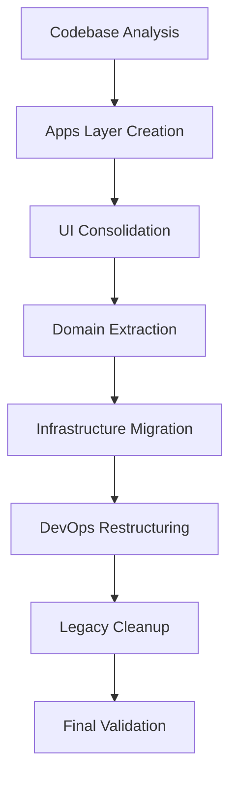

# AIVillage Reorganization - Task Dependency Mapping

## Dependency Graph Overview

This document maps all task dependencies for the AIVillage reorganization, ensuring proper execution order and identifying critical path items.

## Critical Path Analysis

### Primary Critical Path (6 weeks)


### Phase Dependencies

#### Phase 1: Apps Layer & UI (Week 1-2)
```yaml
phase_1_tasks:
  create_apps_structure:
    dependencies: []
    parallel_safe: true
    estimated_time: "4 hours"

  consolidate_ui_components:
    dependencies: [create_apps_structure]
    parallel_safe: false
    estimated_time: "16 hours"

  create_app_configuration:
    dependencies: [create_apps_structure]
    parallel_safe: true
    estimated_time: "8 hours"

  validate_ui_migration:
    dependencies: [consolidate_ui_components, create_app_configuration]
    parallel_safe: false
    estimated_time: "12 hours"
```

#### Phase 2: Domain Separation (Week 2-3)
```yaml
phase_2_tasks:
  design_domain_boundaries:
    dependencies: [phase_1_complete]
    parallel_safe: true
    estimated_time: "8 hours"

  extract_agent_domain:
    dependencies: [design_domain_boundaries]
    parallel_safe: true
    estimated_time: "20 hours"

  extract_rag_domain:
    dependencies: [design_domain_boundaries]
    parallel_safe: true
    estimated_time: "16 hours"

  extract_training_domain:
    dependencies: [design_domain_boundaries]
    parallel_safe: true
    estimated_time: "24 hours"

  implement_domain_interfaces:
    dependencies: [extract_agent_domain, extract_rag_domain, extract_training_domain]
    parallel_safe: false
    estimated_time: "16 hours"
```

#### Phase 3: Infrastructure (Week 3-4)
```yaml
phase_3_tasks:
  design_infrastructure_abstractions:
    dependencies: [phase_2_complete]
    parallel_safe: true
    estimated_time: "12 hours"

  migrate_persistence_layer:
    dependencies: [design_infrastructure_abstractions]
    parallel_safe: true
    estimated_time: "16 hours"

  migrate_security_services:
    dependencies: [design_infrastructure_abstractions]
    parallel_safe: true
    estimated_time: "20 hours"

  migrate_messaging_services:
    dependencies: [design_infrastructure_abstractions]
    parallel_safe: true
    estimated_time: "12 hours"

  implement_service_abstractions:
    dependencies: [migrate_persistence_layer, migrate_security_services, migrate_messaging_services]
    parallel_safe: false
    estimated_time: "12 hours"
```

## Parallel Execution Matrix

### Concurrent Task Groups

#### Group A: Independent Foundation Tasks
- **Apps structure creation**
- **Domain boundary design**
- **Infrastructure abstraction design**
- **DevOps automation planning**

#### Group B: Component Migrations (Per Domain)
- **Agent domain extraction**
- **RAG domain extraction**
- **Training domain extraction**
- **Tokenomics domain extraction**

#### Group C: Infrastructure Migrations (Per Service)
- **Database/persistence migration**
- **Security service migration**
- **Messaging service migration**
- **Monitoring service migration**

## Resource Allocation Matrix

### Agent Assignments by Phase

#### Phase 1: Apps & UI
```yaml
system_architect:
  tasks: [apps_structure_design, ui_component_analysis]
  time_allocation: "50%"

coder:
  tasks: [ui_consolidation, configuration_setup]
  time_allocation: "80%"

reviewer:
  tasks: [ui_migration_validation, component_testing]
  time_allocation: "60%"

tester:
  tasks: [ui_testing, integration_validation]
  time_allocation: "70%"
```

#### Phase 2: Domain Separation
```yaml
system_architect:
  tasks: [domain_design, interface_definition]
  time_allocation: "70%"

coder:
  tasks: [domain_extraction, business_logic_migration]
  time_allocation: "90%"

reviewer:
  tasks: [domain_boundary_validation, coupling_analysis]
  time_allocation: "80%"

tester:
  tasks: [domain_testing, service_validation]
  time_allocation: "85%"
```

## Critical Dependencies & Blockers

### External Dependencies
1. **Database Migration Tools**: Required for Phase 3
2. **CI/CD Pipeline Updates**: Required for Phase 4
3. **Security Audit Tools**: Required for Phase 5
4. **Performance Testing Environment**: Required throughout

### Internal Dependencies
1. **Interface Definitions**: Must complete before implementation
2. **Migration Scripts**: Required before moving data/code
3. **Feature Flags**: Needed for gradual rollout
4. **Rollback Procedures**: Must be ready before changes

## Risk Dependencies

### High-Risk Task Chains
1. **UI Migration → Component Testing → User Acceptance**
   - Risk: UI breakage affecting user experience
   - Mitigation: Parallel UI development and testing

2. **Domain Extraction → Interface Implementation → Integration Testing**
   - Risk: API contract changes breaking integrations
   - Mitigation: Contract-first development approach

3. **Infrastructure Migration → Service Abstraction → System Integration**
   - Risk: Service outages during migration
   - Mitigation: Blue-green deployment strategy

### Dependency Failure Scenarios

#### Scenario 1: UI Migration Failure
```yaml
impact:
  - Blocks Phase 1 completion
  - Delays subsequent phases by 1 week

mitigation:
  - Rollback to current UI structure
  - Implement incremental migration approach
  - Continue with backend phases independently
```

#### Scenario 2: Domain Interface Definition Delays
```yaml
impact:
  - Blocks all Phase 2 implementation tasks
  - Critical path delay of 2-3 days

mitigation:
  - Use existing interfaces temporarily
  - Implement facade patterns for gradual transition
  - Parallel development of interface definitions
```

## Optimization Opportunities

### Task Parallelization
1. **UI and Domain work can overlap by 50%**
2. **Infrastructure migrations can run in parallel**
3. **Testing can begin before full implementation**

### Resource Optimization
1. **Cross-training agents for flexibility**
2. **Shared review sessions for consistency**
3. **Automated testing to reduce manual effort**

### Timeline Compression
1. **Aggressive parallelization could reduce timeline by 1 week**
2. **Pre-built migration tools could save 2-3 days**
3. **Automated validation could save 1-2 days per phase**

## Validation Checkpoints

### Phase Gate Requirements

#### Phase 1 Gate
- [ ] Apps structure created and validated
- [ ] UI components successfully consolidated
- [ ] No broken UI functionality
- [ ] Performance benchmarks maintained

#### Phase 2 Gate
- [ ] Domain boundaries clearly defined
- [ ] Business logic successfully extracted
- [ ] Domain interfaces properly implemented
- [ ] Cross-domain coupling minimized

#### Phase 3 Gate
- [ ] Infrastructure services abstracted
- [ ] Service implementations migrated
- [ ] Integration tests passing
- [ ] Performance requirements met

#### Phase 4 Gate
- [ ] DevOps automation restructured
- [ ] CI/CD pipelines functional
- [ ] Deployment automation working
- [ ] Quality gates operational

#### Phase 5 Gate
- [ ] Legacy code cleaned up
- [ ] Full system validation complete
- [ ] Performance benchmarks achieved
- [ ] Documentation updated

## Monitoring & Tracking

### Progress Metrics
- **Tasks completed per phase**
- **Dependency resolution rate**
- **Blocker resolution time**
- **Quality gate pass rate**

### Risk Indicators
- **Task overrun frequency**
- **Dependency chain failures**
- **Integration test failure rate**
- **Performance regression incidents**

### Success Metrics
- **On-time phase completion**
- **Zero critical functionality loss**
- **Performance improvement or maintenance**
- **Code quality improvements**

---

## Execution Commands for Coordination

### Phase Initialization
```bash
# Initialize phase tracking
python scripts/phase_tracker.py --phase=1 --initialize
python scripts/dependency_checker.py --validate-phase=1
python scripts/resource_allocator.py --phase=1 --assign-agents
```

### Progress Monitoring
```bash
# Daily progress check
python scripts/progress_monitor.py --daily-report
python scripts/dependency_tracker.py --check-blockers
python scripts/quality_monitor.py --phase-validation
```

### Phase Completion
```bash
# Phase gate validation
python scripts/phase_validator.py --phase=1 --complete
python scripts/dependency_checker.py --unlock-next-phase
python scripts/progress_tracker.py --phase-summary
```

This dependency mapping ensures systematic execution while maximizing parallelization opportunities and minimizing project risk.
