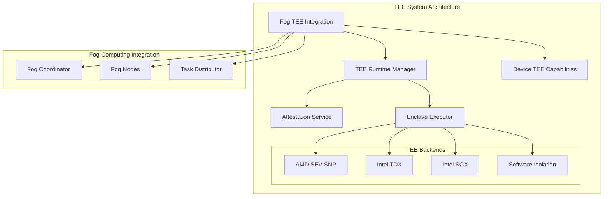

# TEE System Architecture Documentation

## Overview

The Trusted Execution Environment (TEE) system provides comprehensive confidential computing capabilities for the fog computing infrastructure. It enables secure, attestable execution of sensitive workloads across distributed edge devices with support for multiple TEE technologies.

## Architecture Components

### Core Components



### 1. TEE Runtime Manager (`tee_runtime_manager.py`)

**Purpose**: Central orchestrator for TEE lifecycle management

**Key Features**:
- Multi-TEE support (AMD SEV-SNP, Intel TDX, Intel SGX, Software Isolation)
- Automatic TEE capability detection
- Enclave lifecycle management (create, execute, terminate)
- Performance monitoring and metrics collection
- Session management with context managers

**Core Classes**:
- `TEERuntimeManager`: Main runtime orchestrator
- `TEECapabilityDetector`: Hardware TEE detection
- `TEERuntimeError`: Exception handling

**Usage Example**:
```python
from infrastructure.fog.tee import TEERuntimeManager, TEEConfiguration

config = TEEConfiguration(
    memory_mb=1024,
    cpu_cores=2,
    require_attestation=True
)

runtime = TEERuntimeManager(config)
await runtime.initialize()

# Create enclave
context = await runtime.create_enclave(enclave_spec)

# Execute code
result = await runtime.execute_in_enclave(enclave_id, code, input_data)

await runtime.shutdown()
```

### 2. Attestation Service (`attestation_service.py`)

**Purpose**: Remote attestation and measurement verification

**Key Features**:
- Hardware quote generation and verification
- Measurement database management
- Certificate chain validation
- Replay protection with nonces
- Multi-vendor TEE support

**Core Classes**:
- `AttestationService`: Main attestation coordinator
- `MeasurementDatabase`: Trusted measurement storage
- `CertificateManager`: Certificate validation
- `QuoteVerifier`: Hardware quote verification

**Security Features**:
- Cryptographic measurement validation
- Replay attack prevention
- Certificate chain verification
- Trust propagation

### 3. Enclave Executor (`enclave_executor.py`)

**Purpose**: Secure code execution within TEE environments

**Key Features**:
- Multi-backend execution (Docker, gVisor, Firecracker fallback)
- Resource isolation and monitoring
- Security policy enforcement
- Performance metrics collection

**Core Classes**:
- `EnclaveExecutor`: Main execution coordinator
- `SoftwareIsolationBackend`: Container-based isolation
- `ExecutionError`: Execution exception handling

**Isolation Technologies**:
- **Hardware TEEs**: AMD SEV-SNP, Intel TDX, Intel SGX
- **Software Isolation**: Docker containers, gVisor, Firecracker VMs
- **Process Isolation**: Basic process-level separation

### 4. Fog TEE Integration (`fog_tee_integration.py`)

**Purpose**: Integration layer between TEE system and fog computing

**Key Features**:
- TEE-aware task scheduling
- Confidentiality level management
- Resource matching and optimization
- Performance monitoring integration

**Core Classes**:
- `TEEFogCoordinator`: TEE-aware fog orchestration
- `TEEAwareFogTask`: Enhanced task with TEE requirements
- `TEEAwareComputeCapacity`: Enhanced capacity with TEE info

**Integration Points**:
- Task submission with confidentiality requirements
- Node registration with TEE capabilities
- Resource scheduling optimization
- Performance metrics collection

### 5. Device TEE Capabilities (`device_tee_capabilities.py`)

**Purpose**: Device capability detection and management

**Key Features**:
- Multi-platform TEE detection
- Dynamic capability monitoring
- Device classification and profiling
- Suitability assessment for fog computing

**Core Classes**:
- `DeviceTEEDetector`: Hardware capability detection
- `DeviceTEEProfile`: Device capability profile
- `DeviceTEERegistry`: Centralized device registry

## TEE Types and Capabilities

### Supported TEE Technologies

| TEE Type | Security Level | Memory Limit | Attestation | Migration | Use Cases |
|----------|----------------|--------------|-------------|-----------|-----------|
| Intel TDX | Hardware | 16GB+ | Yes | No | High-security servers |
| AMD SEV-SNP | Hardware | 8GB+ | Yes | Yes | Cloud/edge computing |
| Intel SGX | Hardware | 256MB | Yes | No | Legacy applications |
| ARM TrustZone | Hardware | Varies | Limited | No | Mobile/IoT devices |
| Software Isolation | Software | 8GB+ | Simulated | Yes | Development/testing |

### Security Levels

1. **Software**: Container/VM-based isolation
2. **Hardware**: CPU-based TEE with hardware enforcement
3. **Certified**: Hardware TEE with vendor certification
4. **Validated**: Formally verified TEE implementation

## Configuration and Deployment

### TEE Configuration

```python
from infrastructure.fog.tee.tee_types import TEEConfiguration

config = TEEConfiguration(
    # Resource limits
    memory_mb=1024,
    cpu_cores=2,

    # Security settings
    allow_debug=False,
    require_attestation=True,
    measurement_policy="strict",
    network_isolation=True,

    # Timeouts
    attestation_timeout_seconds=300
)
```

### Enclave Specification

```python
from infrastructure.fog.tee.tee_types import EnclaveSpec

spec = EnclaveSpec(
    name="confidential_ml_inference",
    description="ML inference with privacy protection",
    memory_mb=512,
    cpu_cores=1,
    code_hash="sha256:abcd1234...",
    config=tee_config,
    expected_measurements=[
        Measurement("mrenclave", 0, "expected_hash", "sha256")
    ]
)
```

### Fog Integration

```python
from infrastructure.fog.tee.fog_tee_integration import create_tee_fog_coordinator

# Create TEE-aware coordinator
coordinator = await create_tee_fog_coordinator("my_coordinator")

# Register TEE-capable nodes
capacity = create_tee_aware_capacity(
    cpu_cores=8,
    memory_mb=16384,
    tee_types=[TEEType.INTEL_TDX, TEEType.SOFTWARE_ISOLATION],
    tee_memory_mb=4096
)

await coordinator.register_node("tee_node_1", capacity)

# Submit confidential tasks
task_id = await coordinator.submit_confidential_task(
    TaskType.INFERENCE,
    code=b"confidential_ml_code",
    input_data=b"sensitive_data",
    confidentiality_level="confidential"
)
```

## Security Model

### Threat Model

**Protected Against**:
- Malicious host OS and hypervisor
- Physical memory attacks
- Side-channel attacks (partial)
- Privileged user access
- Network eavesdropping

**Not Protected Against**:
- Hardware trojans in TEE hardware
- Side-channel attacks on TEE implementation
- Denial of service attacks
- Malicious code within enclave

### Security Policies

**Confidentiality Levels**:
1. **Public**: No TEE required, standard fog computing
2. **Confidential**: TEE required, attestation recommended
3. **Secret**: Hardware TEE required, attestation mandatory

**Attestation Policies**:
- **Permissive**: Accept unknown measurements
- **Strict**: Only accept known trusted measurements

### Key Management

```python
# Measurements are managed through AttestationService
service = AttestationService()

# Add trusted measurement
service.add_trusted_measurement(
    "mrenclave", 0, "trusted_hash", "sha256",
    "Trusted ML model hash"
)

# Verify attestation
report = await service.generate_attestation_report(context)
verified = await service.verify_attestation(report)
```

## Performance Characteristics

### Benchmarks

Based on internal testing:

| Operation | Software TEE | Hardware TEE | Overhead |
|-----------|--------------|--------------|----------|
| Enclave Creation | 200ms | 1.5s | 7.5x |
| Code Execution | ~Native | +10-30% | Varies |
| Attestation | N/A | 500ms-2s | N/A |
| Memory Encryption | N/A | +5-15% | Varies |

### Optimization Strategies

1. **Enclave Reuse**: Keep enclaves alive for multiple tasks
2. **Batch Processing**: Group similar tasks in single enclave
3. **Memory Pre-allocation**: Reserve TEE memory in advance
4. **Attestation Caching**: Cache valid attestation reports
5. **Load Balancing**: Distribute tasks across TEE-capable nodes

## Monitoring and Metrics

### System Metrics

```python
# Get comprehensive system status
status = coordinator.get_system_status()

tee_stats = status["tee_status"]
print(f"Active enclaves: {tee_stats['active_enclaves']}")
print(f"TEE tasks completed: {tee_stats['tee_statistics']['tee_tasks_completed']}")
print(f"Attestations performed: {tee_stats['tee_statistics']['attestations_performed']}")
```

### Key Metrics

- **Enclave Lifecycle**: Creation time, execution time, termination time
- **Resource Utilization**: TEE memory usage, CPU utilization
- **Security Events**: Attestation failures, policy violations
- **Performance**: Task throughput, latency, success rates

### Logging and Auditing

All TEE operations are logged with:
- Timestamp and operation type
- Enclave ID and task ID
- Security context and measurements
- Performance metrics
- Error conditions and failures

## Error Handling

### Exception Hierarchy

```python
TEERuntimeError
├── SecurityViolationError
├── ResourceExhaustionError
├── AttestationError
└── ExecutionError
```

### Error Recovery

1. **Graceful Degradation**: Fall back to software isolation
2. **Retry Logic**: Automatic retry with exponential backoff
3. **Resource Cleanup**: Automatic enclave termination on failure
4. **State Recovery**: Persistent state for crash recovery

## Testing and Validation

### Test Suite

The comprehensive test suite (`tests/tee/test_tee_system.py`) covers:

1. **TEE Types**: Data structure validation
2. **Attestation Service**: Measurement and verification
3. **Enclave Executor**: Code execution and isolation
4. **Runtime Manager**: Lifecycle management
5. **Fog Integration**: Task scheduling and coordination
6. **Performance**: Benchmarking and metrics
7. **Security**: Isolation and policy enforcement

### Running Tests

```bash
cd tests/tee
python test_tee_system.py
```

### Example Usage

See `infrastructure/fog/tee/example_usage.py` for comprehensive examples including:
- Basic TEE fog computing
- Multi-node deployment
- Performance benchmarking
- Security validation

## Deployment Considerations

### Hardware Requirements

**Minimum**:
- x86_64 CPU with TEE support (or ARM with TrustZone)
- 4GB RAM (2GB available for TEE)
- Docker/container runtime
- Linux kernel 5.0+ (for hardware TEE support)

**Recommended**:
- Recent Intel/AMD CPU with TDX/SEV-SNP
- 16GB+ RAM (8GB+ for TEE)
- SSD storage for performance
- Hardware RNG support

### Software Dependencies

- Python 3.11+
- Docker CE 20.0+
- Optional: gVisor, Firecracker for enhanced isolation
- Optional: Hardware TEE drivers and libraries

### Security Hardening

1. **Secure Boot**: Enable UEFI Secure Boot
2. **TPM**: Enable and configure TPM 2.0
3. **Kernel Lockdown**: Enable kernel lockdown mode
4. **Network Security**: Implement network isolation
5. **Attestation**: Set up remote attestation infrastructure

## Future Enhancements

### Planned Features

1. **Confidential Kubernetes**: Integration with K8s for container orchestration
2. **Multi-Party Computation**: Support for MPC protocols
3. **Homomorphic Encryption**: Integration with HE libraries
4. **Zero-Knowledge Proofs**: ZK proof generation and verification
5. **Federated Learning**: TEE-based secure federated learning

### Research Areas

- Post-quantum cryptography for TEE
- Machine learning privacy techniques
- Cross-TEE interoperability standards
- Performance optimization for edge devices
- Formal verification of TEE implementations

## Conclusion

The TEE system provides enterprise-grade confidential computing capabilities for fog environments, enabling secure execution of sensitive workloads across distributed edge infrastructure. With comprehensive support for multiple TEE technologies, robust attestation mechanisms, and seamless fog computing integration, it represents a complete solution for privacy-preserving edge computing.

For additional information, examples, and support, see:
- API documentation in source code
- Example usage scripts
- Test suite for validation
- Performance benchmarking tools
