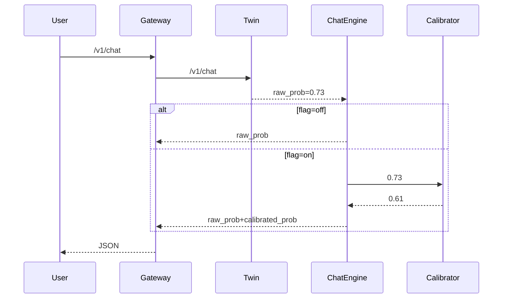

# ADR-S4-02 · Response Confidence Calibration

**Status:** Accepted · 2025-07-15  
**Deciders:** AI Village Core Eng  
**Context:** Users need calibrated uncertainty → trust & downstream heuristics.  
**Decision:** Integrate ConformalCalibrator (beta-binomial) behind flag `CALIBRATION_ENABLED`.  
**Consequences**
* ✅ Pluggable, safe rollout (shadow traffic → 10 % → 100 %).  
* ✅ Enables risk-aware meta-agents.  
* ❌ +1.1 ms mean latency, +4 MB RAM.

## Architecture

API Diff
// old
{
  "response": "...",
  "processing_time_ms": 123
}
// new (flag on)
{
  "response": "...",
  "processing_time_ms": 124,
  "calibrated_prob": 0.61
}
