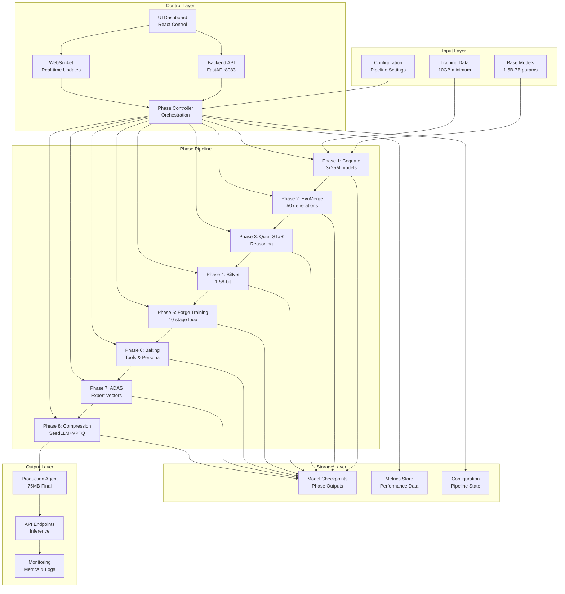

# Agent Forge Consolidated Architecture

## System Architecture Overview



## Component Architecture

### 1. Core Pipeline Components

#### Phase Controller
```python
class PhaseController:
    """Central orchestration for all pipeline phases."""

    def __init__(self):
        self.phases = {
            'cognate': CognatePhase(),
            'evomerge': EvoMergePhase(),
            'quietstar': QuietSTaRPhase(),
            'bitnet': BitNetPhase(),
            'training': ForgeTrainingPhase(),
            'baking': CapabilityBakingPhase(),
            'adas': ADASPhase(),
            'compression': FinalCompressionPhase()
        }
        self.current_phase = None
        self.pipeline_state = {}

    async def execute_pipeline(self, config):
        """Execute complete pipeline with state management."""
        for phase_name, phase in self.phases.items():
            self.current_phase = phase_name
            result = await phase.execute(
                input_model=self.pipeline_state.get('model'),
                config=config
            )
            self.pipeline_state['model'] = result.model
            self.pipeline_state[phase_name] = result.metrics
            await self.broadcast_progress(phase_name, result)
```

#### Phase Interface
```python
from abc import ABC, abstractmethod

class Phase(ABC):
    """Abstract base class for all pipeline phases."""

    @abstractmethod
    async def execute(self, input_model, config):
        """Execute phase transformation."""
        pass

    @abstractmethod
    def validate_input(self, input_model):
        """Validate phase input requirements."""
        pass

    @abstractmethod
    def get_metrics(self):
        """Return phase performance metrics."""
        pass
```

### 2. Backend Architecture

#### API Layer
```python
# FastAPI Application Structure
app = FastAPI(title="Agent Forge API")

# Routers
app.include_router(phases_router, prefix="/phases")
app.include_router(models_router, prefix="/models")
app.include_router(metrics_router, prefix="/metrics")
app.include_router(config_router, prefix="/config")

# Middleware
app.add_middleware(CORSMiddleware, allow_origins=["http://localhost:3000"])
app.add_middleware(RateLimitMiddleware, requests_per_minute=100)
app.add_middleware(LoggingMiddleware)

# Background Tasks
background_scheduler = BackgroundScheduler()
background_scheduler.add_job(cleanup_checkpoints, 'interval', hours=1)
background_scheduler.add_job(update_metrics, 'interval', minutes=5)
```

#### WebSocket Layer
```python
class WebSocketManager:
    """Manages WebSocket connections for real-time updates."""

    def __init__(self):
        self.connections = {}
        self.channels = {
            'phase_progress': set(),
            'metrics': set(),
            'logs': set(),
            'errors': set()
        }

    async def connect(self, websocket, client_id):
        await websocket.accept()
        self.connections[client_id] = websocket

    async def broadcast(self, message, channel='global'):
        for client_id in self.channels.get(channel, []):
            if client_id in self.connections:
                await self.connections[client_id].send_json(message)
```

### 3. Storage Architecture

#### Model Storage
```python
class ModelStorage:
    """Handles model checkpoint storage and retrieval."""

    def __init__(self, base_path="/models"):
        self.base_path = Path(base_path)
        self.metadata_db = {}

    def save_checkpoint(self, phase, model, metadata):
        """Save model checkpoint with metadata."""
        checkpoint_path = self.base_path / phase / f"{metadata['timestamp']}.pt"
        checkpoint_path.parent.mkdir(parents=True, exist_ok=True)

        torch.save({
            'model_state_dict': model.state_dict(),
            'metadata': metadata,
            'phase': phase
        }, checkpoint_path)

        self.metadata_db[str(checkpoint_path)] = metadata
        return checkpoint_path

    def load_checkpoint(self, checkpoint_path):
        """Load model checkpoint."""
        checkpoint = torch.load(checkpoint_path)
        return checkpoint
```

#### Metrics Storage
```python
class MetricsStore:
    """Centralized metrics storage and querying."""

    def __init__(self):
        self.metrics = defaultdict(list)
        self.aggregates = {}

    def record(self, phase, metric_name, value, timestamp=None):
        """Record a metric value."""
        timestamp = timestamp or datetime.now()
        self.metrics[f"{phase}.{metric_name}"].append({
            'value': value,
            'timestamp': timestamp
        })

    def get_metrics(self, phase=None, metric_name=None, time_range=None):
        """Query metrics with filters."""
        # Implementation here
        pass
```

### 4. Directory Structure

```
C:/Users/17175/Desktop/AIVillage/
├── core/
│   └── agent_forge/                    # Consolidated from agent-forge
│       ├── __init__.py
│       ├── unified_pipeline.py         # Main pipeline orchestrator
│       ├── phase_controller.py         # Phase management
│       └── phases/
│           ├── phase1_cognate/         # ✅ Implemented
│           │   ├── __init__.py
│           │   ├── model_factory.py
│           │   ├── cognate_creator.py
│           │   └── refiner_core.py
│           ├── phase2_evomerge/        # 🔧 To implement
│           │   ├── __init__.py
│           │   └── evomerge.py
│           ├── phase3_quietstar/       # 🔧 To implement
│           │   ├── __init__.py
│           │   └── quietstar.py
│           ├── phase4_bitnet/          # 🔧 To implement
│           │   ├── __init__.py
│           │   └── bitnet.py
│           ├── phase5_training/        # 🔧 To implement
│           │   ├── __init__.py
│           │   └── forge_trainer.py
│           ├── phase6_baking/          # 🔧 To implement
│           │   ├── __init__.py
│           │   └── capability_baker.py
│           ├── phase7_adas/            # 🔧 To implement
│           │   ├── __init__.py
│           │   └── adas_optimizer.py
│           └── phase8_compression/     # 🔧 To implement
│               ├── __init__.py
│               └── final_compressor.py
│
├── infrastructure/
│   └── gateway/
│       ├── api/
│       │   ├── __init__.py
│       │   ├── agent_forge_controller.py  # Main API controller
│       │   ├── websocket_manager.py       # WebSocket handling
│       │   └── routers/
│       │       ├── phases.py
│       │       ├── models.py
│       │       └── metrics.py
│       └── services/
│           ├── model_service.py
│           ├── metrics_service.py
│           └── storage_service.py
│
├── ui/
│   └── web/
│       └── src/
│           └── components/
│               └── admin/
│                   ├── AgentForgeControl.tsx    # Main control panel
│                   ├── PhaseMonitor.tsx         # Phase progress
│                   ├── MetricsDashboard.tsx     # Performance metrics
│                   └── ModelInspector.tsx       # Model details
│
├── tests/
│   └── agent_forge/                    # Consolidated tests
│       ├── unit/
│       │   ├── test_phase1_cognate.py
│       │   ├── test_phase2_evomerge.py
│       │   └── ...
│       ├── integration/
│       │   ├── test_pipeline.py
│       │   └── test_api.py
│       └── performance/
│           └── test_benchmarks.py
│
└── docs/
    └── agent-forge/
        ├── SPEC.md                     # ✅ Created
        ├── IMPLEMENTATION-PLAN.md       # ✅ Created
        ├── PRE-MORTEM-ANALYSIS.md       # ✅ Created
        └── CONSOLIDATED-ARCHITECTURE.md # This document
```

## Data Flow Architecture

### Phase Data Flow
```yaml
phase_1_cognate:
  input:
    - base_model: "Qwen-1.5B"
    - config: {hidden_size: 1024, layers: 24}
  output:
    - models: ["cognate_1.pt", "cognate_2.pt", "cognate_3.pt"]
    - metrics: {params: 25083528, loss: 2.1}

phase_2_evomerge:
  input:
    - models: [cognate_1, cognate_2, cognate_3]
    - config: {generations: 50, population: 8}
  output:
    - model: "evolved_model.pt"
    - metrics: {fitness: 0.92, generation: 50}

# ... continues for all phases
```

### API Data Flow
```javascript
// Client Request Flow
Client --> API Gateway --> Phase Controller --> Phase Implementation
                 |                |                     |
                 v                v                     v
            WebSocket        Metrics Store        Model Storage
                 |                |                     |
                 v                v                     v
            Client UI      Monitoring          Checkpoints
```

## Integration Architecture

### MCP Server Integration
```python
class MCPIntegration:
    """Integrates with MCP servers for enhanced capabilities."""

    def __init__(self):
        self.servers = {
            'memory': MemoryServer(),      # Cross-session persistence
            'filesystem': FileSystemServer(), # Secure file operations
            'github': GitHubServer(),       # Version control
            'eva': EvaServer()              # Performance benchmarking
        }

    async def persist_state(self, phase, state):
        """Persist phase state using MCP memory."""
        await self.servers['memory'].create_entity(
            name=f"agent_forge.{phase}",
            type="phase_state",
            observations=[json.dumps(state)]
        )
```

### External Service Integration
```python
class ExternalServices:
    """Manages integration with external services."""

    def __init__(self):
        self.redis = Redis(host='localhost', port=6379)  # Caching
        self.postgres = PostgreSQL(...)                   # Metrics DB
        self.s3 = S3Client(...)                          # Model storage
        self.wandb = wandb.init(project='agent_forge')   # Experiment tracking
```

## Deployment Architecture

### Container Architecture
```yaml
version: '3.8'

services:
  agent-forge-api:
    build: ./infrastructure/gateway
    ports:
      - "8083:8083"
    environment:
      - PHASE_CONTROLLER_URL=http://phase-controller:8084
      - REDIS_URL=redis://redis:6379
    depends_on:
      - redis
      - postgres

  phase-controller:
    build: ./core/agent_forge
    ports:
      - "8084:8084"
    volumes:
      - ./models:/models
      - ./checkpoints:/checkpoints
    deploy:
      resources:
        reservations:
          devices:
            - driver: nvidia
              count: 1
              capabilities: [gpu]

  ui:
    build: ./ui/web
    ports:
      - "3000:3000"
    environment:
      - REACT_APP_API_URL=http://localhost:8083

  redis:
    image: redis:7-alpine
    ports:
      - "6379:6379"

  postgres:
    image: postgres:15
    environment:
      - POSTGRES_DB=agent_forge
      - POSTGRES_USER=forge_user
      - POSTGRES_PASSWORD=secure_password
    volumes:
      - postgres_data:/var/lib/postgresql/data

volumes:
  postgres_data:
  model_storage:
  checkpoint_storage:
```

### Kubernetes Architecture
```yaml
apiVersion: apps/v1
kind: Deployment
metadata:
  name: agent-forge-api
spec:
  replicas: 3
  selector:
    matchLabels:
      app: agent-forge-api
  template:
    metadata:
      labels:
        app: agent-forge-api
    spec:
      containers:
      - name: api
        image: agent-forge-api:latest
        ports:
        - containerPort: 8083
        resources:
          requests:
            memory: "4Gi"
            cpu: "2"
          limits:
            memory: "8Gi"
            cpu: "4"
---
apiVersion: v1
kind: Service
metadata:
  name: agent-forge-api
spec:
  selector:
    app: agent-forge-api
  ports:
  - port: 8083
    targetPort: 8083
  type: LoadBalancer
```

## Security Architecture

### Authentication & Authorization
```python
class SecurityLayer:
    """Handles authentication and authorization."""

    def __init__(self):
        self.jwt_secret = os.environ['JWT_SECRET']
        self.api_keys = self.load_api_keys()

    async def authenticate(self, request):
        """Authenticate request using JWT or API key."""
        # Check JWT token
        if auth_header := request.headers.get('Authorization'):
            return self.verify_jwt(auth_header)

        # Check API key
        if api_key := request.headers.get('X-API-Key'):
            return self.verify_api_key(api_key)

        raise HTTPException(401, "Unauthorized")

    def authorize(self, user, resource, action):
        """Check user permissions."""
        # RBAC implementation
        pass
```

### Data Encryption
```python
class EncryptionService:
    """Handles data encryption for sensitive information."""

    def encrypt_model(self, model_path):
        """Encrypt model file at rest."""
        # AES-256 encryption
        pass

    def encrypt_transit(self, data):
        """Encrypt data in transit."""
        # TLS 1.3 encryption
        pass
```

## Monitoring Architecture

### Metrics Collection
```python
class MonitoringSystem:
    """Comprehensive monitoring for all components."""

    def __init__(self):
        self.prometheus = PrometheusClient()
        self.grafana = GrafanaClient()
        self.alerts = AlertManager()

    def track_phase_metrics(self, phase, metrics):
        """Track phase-specific metrics."""
        self.prometheus.gauge(f'agent_forge_{phase}_progress', metrics['progress'])
        self.prometheus.histogram(f'agent_forge_{phase}_latency', metrics['latency'])
        self.prometheus.counter(f'agent_forge_{phase}_errors', metrics['errors'])

    def setup_alerts(self):
        """Configure alerting rules."""
        self.alerts.add_rule(
            name='high_memory_usage',
            condition='memory_usage > 0.8',
            action='scale_resources'
        )
```

## Performance Optimization

### Caching Strategy
```python
class CacheManager:
    """Multi-layer caching for performance optimization."""

    def __init__(self):
        self.memory_cache = {}  # L1: In-memory
        self.redis_cache = Redis()  # L2: Redis
        self.disk_cache = DiskCache()  # L3: Disk

    async def get_or_compute(self, key, compute_fn):
        """Get from cache or compute if missing."""
        # Check L1
        if value := self.memory_cache.get(key):
            return value

        # Check L2
        if value := await self.redis_cache.get(key):
            self.memory_cache[key] = value
            return value

        # Check L3
        if value := self.disk_cache.get(key):
            await self.redis_cache.set(key, value)
            self.memory_cache[key] = value
            return value

        # Compute
        value = await compute_fn()
        await self.cache_all_layers(key, value)
        return value
```

### Resource Management
```python
class ResourceManager:
    """Manages computational resources efficiently."""

    def __init__(self):
        self.gpu_pool = GPUPool()
        self.cpu_pool = CPUPool()
        self.memory_manager = MemoryManager()

    async def allocate_for_phase(self, phase):
        """Allocate resources based on phase requirements."""
        if phase in ['cognate', 'evomerge', 'training']:
            return await self.gpu_pool.allocate()
        else:
            return await self.cpu_pool.allocate()
```

## Conclusion

This consolidated architecture provides a comprehensive blueprint for the Agent Forge system, covering all aspects from component design to deployment and monitoring. The architecture is designed to be:

- **Scalable**: Can handle multiple concurrent pipelines
- **Resilient**: Includes fallback and recovery mechanisms
- **Performant**: Optimized for speed and resource usage
- **Maintainable**: Clear separation of concerns
- **Secure**: Built-in security at all layers

The architecture supports the complete 8-phase pipeline while maintaining flexibility for future enhancements and modifications.

---
*Architecture Version: 1.0.0*
*Last Updated: 2025-01-15*
*Status: READY FOR IMPLEMENTATION*