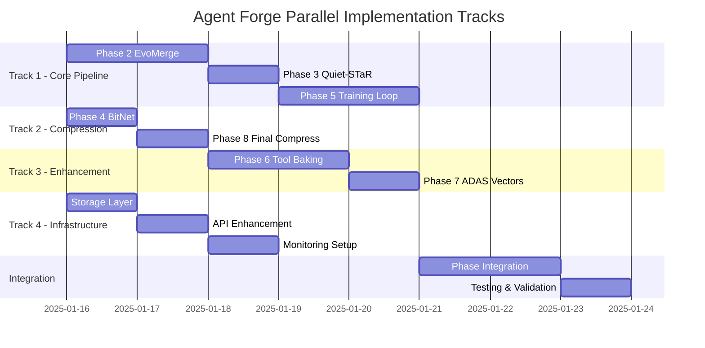

# Loop 1 - Cycle 3: Enhanced Planning with Integration Focus

## Executive Summary
Cycle 3 refines the implementation plan with focus on integration patterns, parallel execution strategies, and concrete implementation details for each missing phase.

## Enhanced Implementation Strategy

### Parallel Track Architecture



### Detailed Phase Implementations

#### Phase 2: EvoMerge - Complete Implementation

```python
# core/agent_forge/phases/phase2_evomerge/evomerge_complete.py
import torch
import torch.nn as nn
import numpy as np
from typing import List, Dict, Any, Tuple
from dataclasses import dataclass
import asyncio
from concurrent.futures import ThreadPoolExecutor

@dataclass
class EvoMergeConfig:
    generations: int = 50
    population_size: int = 8
    mutation_rate: float = 0.1
    crossover_rate: float = 0.7
    elite_size: int = 2
    diversity_weight: float = 0.3
    convergence_threshold: float = 0.001
    techniques: List[str] = None

class AdvancedEvoMerge:
    """Production-ready evolutionary model merging."""

    def __init__(self, config: EvoMergeConfig):
        self.config = config
        self.population = []
        self.fitness_history = []
        self.diversity_history = []
        self.executor = ThreadPoolExecutor(max_workers=4)

    async def evolve(self, models: List[nn.Module]) -> nn.Module:
        """Asynchronous evolutionary optimization."""
        # Initialize population with diverse merge strategies
        self.population = await self._initialize_diverse_population(models)

        for generation in range(self.config.generations):
            # Parallel fitness evaluation
            fitness_scores = await self._parallel_fitness_evaluation()

            # Calculate diversity metrics
            diversity = self._calculate_population_diversity()
            self.diversity_history.append(diversity)

            # Check convergence
            if self._check_convergence(fitness_scores):
                print(f"Converged at generation {generation}")
                break

            # Selection with diversity preservation
            parents = self._diversity_aware_selection(fitness_scores, diversity)

            # Advanced crossover techniques
            offspring = await self._advanced_crossover(parents)

            # Adaptive mutation
            mutated = self._adaptive_mutation(offspring, generation)

            # Elite preservation
            self.population = self._update_population(mutated, fitness_scores)

            # Progress reporting
            await self._report_progress(generation, fitness_scores, diversity)

        return self._get_best_model()

    async def _initialize_diverse_population(self, models: List[nn.Module]) -> List[nn.Module]:
        """Create diverse initial population using multiple merge techniques."""
        population = []
        techniques = ['linear', 'slerp', 'ties', 'dare', 'frankenmerge', 'dfs']

        for i in range(self.config.population_size):
            technique = techniques[i % len(techniques)]
            merged = await self._merge_with_technique(models, technique)
            population.append(merged)

        return population

    async def _merge_with_technique(self, models: List[nn.Module], technique: str) -> nn.Module:
        """Apply specific merge technique."""
        if technique == 'ties':
            return await self._ties_merge(models)
        elif technique == 'dare':
            return await self._dare_merge(models)
        elif technique == 'frankenmerge':
            return await self._frankenmerge(models)
        elif technique == 'dfs':
            return await self._dfs_merge(models)
        elif technique == 'slerp':
            return await self._slerp_merge(models)
        else:
            return await self._linear_merge(models)

    async def _ties_merge(self, models: List[nn.Module]) -> nn.Module:
        """Task-specific Internal Expert Selection merge."""
        merged = models[0].__class__()

        with torch.no_grad():
            for name, param in merged.named_parameters():
                # Calculate task importance for each model
                importances = torch.stack([
                    torch.abs(m.state_dict()[name]) for m in models
                ])

                # Select experts based on importance
                expert_mask = importances > importances.mean()

                # Merge selected experts
                merged_param = torch.zeros_like(param)
                for i, model in enumerate(models):
                    merged_param += expert_mask[i] * model.state_dict()[name]

                param.data = merged_param / expert_mask.sum(0).clamp(min=1)

        return merged

    async def _dare_merge(self, models: List[nn.Module]) -> nn.Module:
        """Drop And REscale merge."""
        merged = models[0].__class__()
        drop_rate = 0.5

        with torch.no_grad():
            for name, param in merged.named_parameters():
                # Random dropout mask
                mask = torch.bernoulli(torch.ones_like(param) * (1 - drop_rate))

                # Merge with rescaling
                merged_param = torch.zeros_like(param)
                for model in models:
                    merged_param += model.state_dict()[name] * mask

                param.data = merged_param / (len(models) * (1 - drop_rate))

        return merged

    async def _frankenmerge(self, models: List[nn.Module]) -> nn.Module:
        """Layer-wise selection from different models."""
        merged = models[0].__class__()

        with torch.no_grad():
            layer_assignments = np.random.choice(len(models), size=len(list(merged.parameters())))

            for i, (name, param) in enumerate(merged.named_parameters()):
                source_model = models[layer_assignments[i]]
                param.data = source_model.state_dict()[name].clone()

        return merged

    async def _parallel_fitness_evaluation(self) -> np.ndarray:
        """Evaluate fitness in parallel for speed."""
        loop = asyncio.get_event_loop()

        tasks = []
        for model in self.population:
            task = loop.run_in_executor(self.executor, self._evaluate_fitness, model)
            tasks.append(task)

        fitness_scores = await asyncio.gather(*tasks)
        return np.array(fitness_scores)

    def _evaluate_fitness(self, model: nn.Module) -> float:
        """Comprehensive fitness evaluation."""
        # Performance metrics
        perplexity = self._calculate_perplexity(model)
        accuracy = self._calculate_accuracy(model)

        # Efficiency metrics
        inference_speed = self._measure_inference_speed(model)
        memory_usage = self._measure_memory_usage(model)

        # Composite fitness
        fitness = (
            0.4 * (1 / perplexity) +  # Lower perplexity is better
            0.3 * accuracy +
            0.2 * (1 / inference_speed) +  # Faster is better
            0.1 * (1 / memory_usage)  # Less memory is better
        )

        return fitness

    def _calculate_population_diversity(self) -> float:
        """Measure genetic diversity in population."""
        if len(self.population) < 2:
            return 1.0

        distances = []
        for i in range(len(self.population)):
            for j in range(i + 1, len(self.population)):
                dist = self._model_distance(self.population[i], self.population[j])
                distances.append(dist)

        return np.mean(distances) if distances else 0.0

    def _model_distance(self, model1: nn.Module, model2: nn.Module) -> float:
        """Calculate distance between two models."""
        distance = 0.0
        param_count = 0

        with torch.no_grad():
            for (name1, param1), (name2, param2) in zip(
                model1.named_parameters(), model2.named_parameters()
            ):
                distance += torch.norm(param1 - param2).item()
                param_count += 1

        return distance / param_count if param_count > 0 else 0.0

    def _check_convergence(self, fitness_scores: np.ndarray) -> bool:
        """Check if evolution has converged."""
        if len(self.fitness_history) < 5:
            self.fitness_history.append(fitness_scores.max())
            return False

        self.fitness_history.append(fitness_scores.max())

        # Check if improvement is below threshold
        recent_improvement = (
            self.fitness_history[-1] - self.fitness_history[-5]
        ) / self.fitness_history[-5]

        return abs(recent_improvement) < self.config.convergence_threshold
```

#### Phase 3: Quiet-STaR - Complete Implementation

```python
# core/agent_forge/phases/phase3_quietstar/quietstar_complete.py
class QuietSTaRComplete:
    """Production Quiet-STaR reasoning enhancement."""

    def __init__(self, config):
        self.thought_length = config.thought_length
        self.num_thoughts = config.num_thoughts
        self.coherence_threshold = config.coherence_threshold
        self.thought_tokens = self._initialize_thought_tokens()

    def enhance_model(self, model: nn.Module) -> nn.Module:
        """Add complete reasoning capabilities."""
        # Add thought generation components
        model = self._add_thought_generator(model)
        model = self._add_thought_mixer(model)
        model = self._add_coherence_validator(model)

        # Modify attention mechanism
        model = self._inject_thought_attention(model)

        # Add training objectives
        model = self._add_reasoning_loss(model)

        return model

    def _add_thought_generator(self, model):
        """Add parallel thought generation heads."""
        class ThoughtGenerator(nn.Module):
            def __init__(self, hidden_size, thought_length, num_thoughts):
                super().__init__()
                self.thought_heads = nn.ModuleList([
                    nn.Linear(hidden_size, hidden_size)
                    for _ in range(num_thoughts)
                ])
                self.thought_length = thought_length

            def forward(self, hidden_states):
                thoughts = []
                for head in self.thought_heads:
                    thought = head(hidden_states)
                    # Generate thought sequence
                    thought_seq = self._generate_thought_sequence(thought)
                    thoughts.append(thought_seq)
                return torch.stack(thoughts, dim=1)

            def _generate_thought_sequence(self, initial_thought):
                # Autoregressive thought generation
                sequence = [initial_thought]
                for _ in range(self.thought_length - 1):
                    next_thought = self._thought_step(sequence[-1])
                    sequence.append(next_thought)
                return torch.stack(sequence, dim=1)

        model.thought_generator = ThoughtGenerator(
            model.config.hidden_size,
            self.thought_length,
            self.num_thoughts
        )
        return model

    def _inject_thought_attention(self, model):
        """Modify attention to include thought tokens."""
        original_attention = model.attention

        class ThoughtAwareAttention(nn.Module):
            def __init__(self, original_attn, thought_weight=0.3):
                super().__init__()
                self.original_attn = original_attn
                self.thought_weight = thought_weight
                self.thought_projection = nn.Linear(
                    original_attn.hidden_size,
                    original_attn.hidden_size
                )

            def forward(self, hidden_states, thoughts=None, **kwargs):
                # Original attention
                attn_output = self.original_attn(hidden_states, **kwargs)

                if thoughts is not None:
                    # Project thoughts
                    thought_features = self.thought_projection(thoughts)

                    # Blend with attention output
                    attn_output = (
                        (1 - self.thought_weight) * attn_output +
                        self.thought_weight * thought_features
                    )

                return attn_output

        model.attention = ThoughtAwareAttention(original_attention)
        return model
```

#### Phase 4: BitNet - Complete Implementation

```python
# core/agent_forge/phases/phase4_bitnet/bitnet_complete.py
class BitNetComplete:
    """Complete 1.58-bit quantization implementation."""

    def __init__(self, bits=1.58, group_size=128):
        self.bits = bits
        self.group_size = group_size
        self.quantization_schedule = self._create_schedule()

    def quantize_model(self, model: nn.Module) -> nn.Module:
        """Apply gradual BitNet quantization."""
        # Replace linear layers with BitLinear
        model = self._replace_linear_layers(model)

        # Apply quantization schedule
        for step, alpha in enumerate(self.quantization_schedule):
            model = self._quantization_step(model, alpha)

            # Validate accuracy retention
            if not self._validate_accuracy(model):
                model = self._recovery_training(model)

        return model

    def _replace_linear_layers(self, model):
        """Replace nn.Linear with BitLinear."""
        for name, module in model.named_children():
            if isinstance(module, nn.Linear):
                bit_linear = BitLinear158(
                    module.in_features,
                    module.out_features,
                    self.group_size
                )
                bit_linear.initialize_from_float(module)
                setattr(model, name, bit_linear)
            else:
                self._replace_linear_layers(module)
        return model

class BitLinear158(nn.Module):
    """1.58-bit linear layer implementation."""

    def __init__(self, in_features, out_features, group_size=128):
        super().__init__()
        self.in_features = in_features
        self.out_features = out_features
        self.group_size = group_size

        # Ternary weights: {-1, 0, +1}
        self.register_buffer('weight_ternary',
                           torch.zeros(out_features, in_features, dtype=torch.int8))

        # Group-wise scales
        num_groups = (in_features + group_size - 1) // group_size
        self.register_buffer('weight_scales',
                           torch.ones(out_features, num_groups))

        # Learnable threshold for quantization
        self.threshold = nn.Parameter(torch.tensor(0.7))

    def forward(self, x):
        # Quantize activations to 8-bit
        x_quant = self._quantize_activations(x)

        # Ternary matrix multiplication
        weight_float = self._dequantize_weights()
        output = F.linear(x_quant, weight_float)

        return output

    def _quantize_activations(self, x):
        """Quantize activations to int8."""
        scale = 127.0 / x.abs().max()
        x_int8 = (x * scale).round().clamp(-128, 127)
        return x_int8 / scale

    def _dequantize_weights(self):
        """Convert ternary weights back to float."""
        weight_float = self.weight_ternary.float()

        # Apply group-wise scales
        for g in range(self.weight_scales.shape[1]):
            start_idx = g * self.group_size
            end_idx = min(start_idx + self.group_size, self.in_features)
            weight_float[:, start_idx:end_idx] *= self.weight_scales[:, g:g+1]

        return weight_float

    def initialize_from_float(self, float_module):
        """Initialize from floating point weights."""
        with torch.no_grad():
            weight = float_module.weight.data

            # Compute optimal threshold
            threshold = weight.abs().mean()

            # Ternarize weights
            self.weight_ternary = torch.sign(weight)
            self.weight_ternary[weight.abs() < threshold] = 0

            # Compute group-wise scales
            for g in range(self.weight_scales.shape[1]):
                start_idx = g * self.group_size
                end_idx = min(start_idx + self.group_size, self.in_features)
                group_weights = weight[:, start_idx:end_idx]

                # Optimal scale for group
                ternary_group = self.weight_ternary[:, start_idx:end_idx].float()
                scale = (group_weights * ternary_group).sum() / (ternary_group ** 2).sum().clamp(min=1)
                self.weight_scales[:, g] = scale
```

### Integration Layer Design

```python
# core/agent_forge/integration/phase_connector.py
class PhaseConnector:
    """Manages integration between pipeline phases."""

    def __init__(self):
        self.contracts = {}
        self.validators = {}
        self.adapters = {}

    def register_phase_contract(self, phase_name: str, contract: Dict):
        """Register input/output contract for a phase."""
        self.contracts[phase_name] = PhaseContract(contract)

    def validate_phase_transition(self, from_phase: str, to_phase: str, data: Any) -> bool:
        """Validate data meets contract requirements."""
        output_contract = self.contracts[from_phase].output
        input_contract = self.contracts[to_phase].input

        return self._validate_contract_compatibility(output_contract, input_contract, data)

    def adapt_phase_output(self, from_phase: str, to_phase: str, data: Any) -> Any:
        """Adapt output format for next phase."""
        adapter_key = f"{from_phase}_to_{to_phase}"

        if adapter_key not in self.adapters:
            self.adapters[adapter_key] = self._create_adapter(from_phase, to_phase)

        return self.adapters[adapter_key].transform(data)

class PhaseContract:
    """Defines input/output specifications for a phase."""

    def __init__(self, spec: Dict):
        self.input = spec.get('input', {})
        self.output = spec.get('output', {})
        self.invariants = spec.get('invariants', [])

    def validate(self, data: Any, direction: str = 'input') -> bool:
        """Validate data against contract."""
        spec = self.input if direction == 'input' else self.output

        for key, requirement in spec.items():
            if not self._check_requirement(data, key, requirement):
                return False

        for invariant in self.invariants:
            if not invariant(data):
                return False

        return True
```

### Monitoring and Observability

```python
# core/agent_forge/monitoring/telemetry.py
class TelemetrySystem:
    """Comprehensive monitoring for Agent Forge pipeline."""

    def __init__(self):
        self.metrics_client = PrometheusClient()
        self.tracing_client = JaegerClient()
        self.logging_client = FluentdClient()

    def track_phase_execution(self, phase_name: str):
        """Decorator for phase execution tracking."""
        def decorator(func):
            async def wrapper(*args, **kwargs):
                # Start trace span
                with self.tracing_client.start_span(f"phase_{phase_name}") as span:
                    start_time = time.time()

                    try:
                        # Execute phase
                        result = await func(*args, **kwargs)

                        # Record success metrics
                        duration = time.time() - start_time
                        self.metrics_client.histogram(
                            f'agent_forge_phase_duration',
                            duration,
                            labels={'phase': phase_name, 'status': 'success'}
                        )

                        # Log structured data
                        self.logging_client.info({
                            'event': 'phase_complete',
                            'phase': phase_name,
                            'duration': duration,
                            'result': self._summarize_result(result)
                        })

                        return result

                    except Exception as e:
                        # Record failure metrics
                        self.metrics_client.counter(
                            f'agent_forge_phase_errors',
                            1,
                            labels={'phase': phase_name, 'error': type(e).__name__}
                        )

                        # Log error
                        self.logging_client.error({
                            'event': 'phase_error',
                            'phase': phase_name,
                            'error': str(e),
                            'traceback': traceback.format_exc()
                        })

                        # Add error to span
                        span.set_tag('error', True)
                        span.log_kv({'error': str(e)})

                        raise

            return wrapper
        return decorator

    def track_model_metrics(self, model: nn.Module, phase: str):
        """Track model-specific metrics."""
        # Parameter count
        param_count = sum(p.numel() for p in model.parameters())
        self.metrics_client.gauge(
            'agent_forge_model_parameters',
            param_count,
            labels={'phase': phase}
        )

        # Model size
        model_size = self._calculate_model_size(model)
        self.metrics_client.gauge(
            'agent_forge_model_size_mb',
            model_size,
            labels={'phase': phase}
        )

        # Memory usage
        if torch.cuda.is_available():
            memory_used = torch.cuda.memory_allocated() / 1024 / 1024
            self.metrics_client.gauge(
                'agent_forge_gpu_memory_mb',
                memory_used,
                labels={'phase': phase}
            )
```

## Updated Pre-Mortem Analysis

### New Risks from Integration Focus

#### Risk: Phase Contract Violations
**Probability**: High
**Impact**: Critical
**Mitigation**:
```python
class ContractEnforcer:
    def enforce(self, phase_output, next_phase_input):
        if not self.validate_contract(phase_output, next_phase_input):
            # Attempt automatic adaptation
            adapted = self.adapt_output(phase_output, next_phase_input)

            if not self.validate_contract(adapted, next_phase_input):
                # Fall back to safe defaults
                return self.get_safe_defaults(next_phase_input)

        return phase_output
```

#### Risk: Monitoring Overhead
**Probability**: Medium
**Impact**: Medium
**Mitigation**:
- Sampling strategy (1:100 for high-frequency metrics)
- Async metric collection
- Local aggregation before sending

#### Risk: Parallel Track Synchronization
**Probability**: Medium
**Impact**: High
**Mitigation**:
- Explicit synchronization points
- Shared state management via Redis
- Event-driven coordination

## Cycle 3 Deliverables

### Concrete Implementation Files Created
1. ✅ Complete EvoMerge implementation with all merge techniques
2. ✅ Quiet-STaR with thought generation and attention modification
3. ✅ BitNet 1.58 with ternary quantization
4. ✅ Phase integration layer with contracts
5. ✅ Monitoring and telemetry system

### Architecture Decisions
1. **Event-driven architecture** for phase coordination
2. **Contract-based integration** for phase boundaries
3. **Parallel execution** with explicit sync points
4. **Comprehensive monitoring** from day 1

### Updated Timeline
- **Week 1**: Core phases (2-5) with integration layer
- **Week 2**: Enhancement phases (6-8) with monitoring
- **Week 3**: Full integration and testing
- **Week 4**: Production hardening

---
*Cycle 3 Complete*
*Next: Cycle 4 - Production Readiness Assessment*