# Agent Forge Master Plan - Synthesis of All 5 Cycles

## Executive Summary

After 5 comprehensive cycles of research, planning, and analysis, this master plan synthesizes all findings into a definitive roadmap for the Agent Forge system implementation. The system will transform base models into specialized, compressed AI agents through an 8-phase pipeline, achieving 95% compression while maintaining quality.

## Current State vs Target State

### Current Reality (Cycle 1 & 2 Findings)
- **Completion**: 12.5% (Phase 1 Cognate only)
- **Production Readiness**: 35.75%
- **Technical Debt**: 89 duplicate test files
- **Infrastructure**: Minimal API, no security, basic monitoring
- **Risk Level**: High without mitigations

### Target State (Cycles 3-5 Optimizations)
- **Completion**: 100% (All 8 phases operational)
- **Production Readiness**: >90%
- **Performance**: 95% compression, <50ms inference
- **Infrastructure**: Full security, distributed scaling, comprehensive monitoring
- **Risk Level**: Low with all mitigations

## Integrated 8-Phase Pipeline Architecture

```mermaid
graph LR
    subgraph "Input"
        A[Base Models<br/>1.5B-7B]
    end

    subgraph "Transform Pipeline"
        B[Phase 1: Cognate<br/>✅ Complete]
        C[Phase 2: EvoMerge<br/>🔧 Priority 1]
        D[Phase 3: Quiet-STaR<br/>🔧 Priority 2]
        E[Phase 4: BitNet<br/>🔧 Priority 2]
        F[Phase 5: Training<br/>🔧 Priority 3]
        G[Phase 6: Baking<br/>🔧 Priority 3]
        H[Phase 7: ADAS<br/>🔧 Priority 4]
        I[Phase 8: Compress<br/>🔧 Priority 4]
    end

    subgraph "Output"
        J[Production Agent<br/>75MB, <50ms]
    end

    A --> B --> C --> D --> E --> F --> G --> H --> I --> J
```



## Consolidated Implementation Strategy

### Week 1: Foundation & Critical Phases
**Focus**: Security, Phase 2-3, Infrastructure

```yaml
week_1_deliverables:
  day_1-2:
    security:
      - JWT authentication implementation
      - Input validation framework
      - Secrets management setup

    infrastructure:
      - Storage layer (S3/MinIO)
      - Redis caching layer
      - Monitoring stack (Prometheus/Grafana)

  day_3-4:
    phase_2_evomerge:
      - Core evolution algorithm
      - 6 merge techniques (TIES, DARE, etc.)
      - Fitness evaluation system
      - Population management

  day_5:
    phase_3_quietstar:
      - Thought generation mechanism
      - Attention modification
      - Coherence validation
```

### Week 2: Core Implementation
**Focus**: Phases 4-5, API Enhancement

```yaml
week_2_deliverables:
  day_6-7:
    phase_4_bitnet:
      - 1.58-bit quantization
      - Group-wise scaling
      - Accuracy recovery

    phase_5_training:
      - 10-stage loop
      - Edge-of-chaos control
      - Dream cycles

  day_8-9:
    api_enhancement:
      - WebSocket real-time updates
      - Batch processing endpoints
      - Progress tracking
      - Error recovery

  day_10:
    integration_testing:
      - Phase 1-5 pipeline test
      - Performance benchmarks
      - Memory optimization
```

### Week 3: Enhancement & Optimization
**Focus**: Phases 6-8, Production Features

```yaml
week_3_deliverables:
  day_11-12:
    phase_6_baking:
      - Tool integration (RAG, code, search)
      - Persona embedding
      - Capability validation

    phase_7_adas:
      - Expert vector application
      - Architecture optimization

  day_13-14:
    phase_8_compression:
      - SeedLLM implementation
      - VPTQ quantization
      - Hypercompression

    optimization:
      - Mixed precision training
      - GPU memory management
      - Caching optimization
```

### Week 4: Production Hardening
**Focus**: Deployment, Validation, Documentation

```yaml
week_4_deliverables:
  day_15-16:
    kubernetes_deployment:
      - Container orchestration
      - Auto-scaling configuration
      - Load balancing

  day_17-18:
    validation_suite:
      - End-to-end testing
      - Performance validation
      - Security audit

  day_19-20:
    documentation:
      - API documentation
      - Deployment guide
      - Operations runbook
```

## Risk Mitigation Matrix (Synthesized from All Cycles)

| Risk | Probability | Impact | Mitigation Strategy | Implementation |
|------|------------|--------|-------------------|----------------|
| **Memory Overflow** | High | Critical | Gradient checkpointing, Model sharding, Disk caching | Week 1 |
| **Training Instability** | High | High | Chaos limits, Gradient clipping, Checkpoint recovery | Week 2 |
| **Security Breach** | High | Critical | JWT auth, Input validation, Secrets management | Week 1 |
| **Phase Integration** | Medium | High | Contract validation, Adapters, Fallbacks | Week 2 |
| **Performance Issues** | Medium | Medium | Mixed precision, Caching, Parallelization | Week 3 |
| **Scalability Limits** | Low | High | Kubernetes, Auto-scaling, Distributed training | Week 4 |

## Performance Optimization Strategy (Cycle 5 Refinements)

### Parallel Execution Tracks
```python
# Optimized parallel execution plan
async def execute_pipeline_optimized():
    # Track 1: Core Pipeline (Critical Path)
    track1 = asyncio.create_task(
        execute_sequential([
            phase2_evomerge,
            phase3_quietstar,
            phase5_training
        ])
    )

    # Track 2: Compression Pipeline (Parallel)
    track2 = asyncio.create_task(
        execute_sequential([
            phase4_bitnet,
            phase8_compression
        ])
    )

    # Track 3: Enhancement Pipeline (Parallel)
    track3 = asyncio.create_task(
        execute_sequential([
            phase6_baking,
            phase7_adas
        ])
    )

    # Synchronization points
    evolved = await track1
    compressed = await track2
    enhanced = await track3

    # Final integration
    return integrate_results(evolved, compressed, enhanced)
```

### Resource Optimization
- **GPU Memory**: Gradient checkpointing, mixed precision
- **CPU Utilization**: Process pools, async I/O
- **Network**: Batch requests, compression
- **Storage**: Incremental checkpoints, deduplication

## Quality Gates (Consolidated from All Cycles)

### Phase Transition Criteria
```yaml
phase_gates:
  phase_1_to_2:
    - Model parameters: 25M ± 1%
    - Specialization scores: >0.8
    - Checkpoint valid: true

  phase_2_to_3:
    - Convergence achieved: <50 generations
    - Fitness improvement: >20%
    - Population diversity: >0.3

  phase_3_to_4:
    - Reasoning improvement: >15%
    - Thought coherence: >0.7

  phase_4_to_5:
    - Quantization accuracy: >95%
    - Compression ratio: >10:1

  phase_5_to_6:
    - Training convergence: true
    - Loss reduction: >50%

  phase_6_to_7:
    - Tool integration: >90% success
    - Persona consistency: validated

  phase_7_to_8:
    - Architecture stability: <5% change
    - Performance positive: true

  final_validation:
    - Model size: <100MB
    - Inference latency: <50ms
    - Quality retention: >95%
```

## Production Deployment Blueprint

### Infrastructure Requirements
```yaml
production_infrastructure:
  compute:
    - Kubernetes cluster: 5+ nodes
    - GPU nodes: 2x NVIDIA A100
    - CPU nodes: 3x 32-core
    - Memory: 256GB total

  storage:
    - Model storage: 1TB SSD
    - Checkpoint storage: 500GB
    - Database: PostgreSQL 100GB

  networking:
    - Load balancer: NGINX
    - CDN: CloudFlare
    - SSL: Let's Encrypt

  monitoring:
    - Metrics: Prometheus
    - Visualization: Grafana
    - Logging: ELK Stack
    - Tracing: Jaeger
```

### Deployment Steps
1. **Pre-deployment validation** (2 hours)
2. **Database migration** (30 minutes)
3. **Core services deployment** (1 hour)
4. **Agent Forge deployment** (2 hours)
5. **Monitoring activation** (30 minutes)
6. **Smoke testing** (1 hour)
7. **Load testing** (2 hours)
8. **Go-live** (30 minutes)

## Success Metrics Dashboard

### KPI Targets
```yaml
business_kpis:
  adoption_rate: 100 users/month
  model_creation: 1000 models/month
  compression_achieved: 95%
  cost_per_model: <$10

technical_kpis:
  availability: 99.9%
  latency_p99: <200ms
  throughput: 1000 req/s
  error_rate: <0.1%

quality_kpis:
  model_accuracy: >95%
  test_coverage: >85%
  defect_rate: <5/month
  documentation: 100%
```

## Action Items and Ownership

### Immediate Actions (Next 48 Hours)
1. **Set up development environment** with all dependencies
2. **Create git repository structure** following architecture
3. **Initialize CI/CD pipeline** with automated testing
4. **Deploy monitoring stack** to track progress

### Development Assignments
```yaml
track_assignments:
  core_pipeline:
    owner: Senior Developer
    phases: [2, 3, 5]
    timeline: Week 1-2

  compression_track:
    owner: ML Engineer
    phases: [4, 8]
    timeline: Week 2-3

  enhancement_track:
    owner: Full-Stack Developer
    phases: [6, 7]
    timeline: Week 2-3

  infrastructure:
    owner: DevOps Engineer
    tasks: [Security, Monitoring, Deployment]
    timeline: Week 1, 4
```

## Final Go/No-Go Decision Framework

### MVP Criteria (Week 2 Checkpoint)
- ✅ Phases 1-4 operational
- ✅ Security implemented
- ✅ Basic monitoring active
- ✅ Integration tests passing
- **Decision**: Proceed to enhancement phases

### Production Criteria (Week 4 Checkpoint)
- ✅ All 8 phases operational
- ✅ Performance targets met
- ✅ Security audit passed
- ✅ Load testing successful
- **Decision**: Deploy to production

## Conclusion

This master plan represents the synthesis of 5 comprehensive analysis cycles, providing a clear, actionable roadmap from the current 12.5% completion to a fully operational Agent Forge system. The plan balances aggressive timeline targets with risk mitigation, quality assurance, and production readiness.

### Key Success Factors
1. **Parallel development** across 3 tracks
2. **Early security and monitoring** implementation
3. **Continuous validation** at each phase
4. **Performance optimization** throughout
5. **Production-first mindset** from day 1

### Expected Outcomes
- **Timeline**: 4 weeks to production
- **Quality**: >95% accuracy retention
- **Performance**: 95% compression, <50ms inference
- **Reliability**: 99.9% availability
- **Cost**: <$1000/month operational

### Next Step
**Begin Loop 2: Implementation Phase** using dev swarm methodology for each phase, starting with Phase 2 (EvoMerge).

---
*Master Plan Complete*
*5 Cycles Synthesized*
*Ready for Implementation*