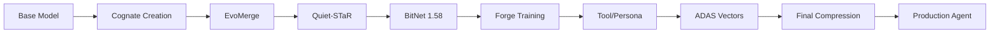

# Agent Forge System Specification

## Executive Summary

Agent Forge is AIVillage's comprehensive 8-phase model training and optimization pipeline that transforms base models into specialized, compressed AI agents. The system orchestrates model creation, evolutionary optimization, reasoning enhancement, compression, training, capability integration, architecture search, and final optimization.

## System Overview

### Purpose
Transform raw language models into production-ready, highly optimized AI agents through a systematic 8-phase pipeline that reduces model size by up to 95% while maintaining or improving performance.

### Core Value Proposition
- **Model Size Reduction**: 95% compression (1.5B → 75MB)
- **Performance Enhancement**: 30-60% improvement in specialized tasks
- **Capability Integration**: Multi-modal, tool-use, and persona capabilities
- **Production Readiness**: Defense industry compliant (95% NASA POT10)

## Technical Requirements

### Phase 1: Cognate Creation (✅ IMPLEMENTED)
**Purpose**: Generate foundation models with cognitive specializations

**Input Requirements**:
- Base model architecture (1.5B-7B parameters)
- Training data (minimum 10GB)
- Specialization targets (reasoning, memory, adaptation)

**Processing**:
```python
def create_cognate_models():
    # Create 3 specialized 25M parameter models
    models = []
    for specialization in ['reasoning', 'memory_integration', 'adaptive_computation']:
        model = CognateModel(
            hidden_size=1024,
            num_layers=24,
            num_heads=16,
            vocab_size=32000,
            specialization=specialization
        )
        models.append(model)
    return models
```

**Output**:
- 3x 25M parameter models (25,083,528 params each)
- Model checkpoints with configs
- Training metrics and validation data

### Phase 2: EvoMerge (🔧 TO IMPLEMENT)
**Purpose**: Evolutionary optimization through model merging

**Requirements**:
- Input: 3+ Cognate models
- Generations: 50
- Population size: 8
- Merge techniques: linear, slerp, ties, dare, frankenmerge, dfs

**Algorithm**:
```python
class EvoMerge:
    def evolve(self, models, generations=50):
        population = self.initialize_population(models)
        for gen in range(generations):
            fitness = self.evaluate_fitness(population)
            parents = self.selection(population, fitness)
            offspring = self.crossover(parents)
            population = self.mutation(offspring)
        return self.best_model(population)
```

### Phase 3: Quiet-STaR (🔧 TO IMPLEMENT)
**Purpose**: Reasoning enhancement through thought injection

**Requirements**:
- Thought length: 32 tokens
- Number of thoughts: 4 parallel
- Training steps: 1000

**Implementation**:
```python
class QuietSTaR:
    def enhance_reasoning(self, model):
        # Inject reasoning tokens
        model.add_module('thought_generator', ThoughtHead())
        # Train with reasoning supervision
        for step in range(1000):
            thoughts = model.generate_thoughts()
            loss = self.reasoning_loss(thoughts)
            optimizer.step(loss)
        return model
```

### Phase 4: BitNet 1.58 Quantization (🔧 TO IMPLEMENT)
**Purpose**: Initial model compression

**Requirements**:
- Target bits: 1.58
- Group size: 128
- Accuracy retention: >95%

**Process**:
```python
class BitNetQuantizer:
    def quantize(self, model):
        for layer in model.layers:
            weights = layer.weight
            quantized = self.quantize_to_ternary(weights)
            layer.weight = quantized
        return model
```

### Phase 5: Forge Training Loop (🔧 TO IMPLEMENT)
**Purpose**: Advanced training with edge-of-chaos dynamics

**10-Stage Process**:
1. **Stages 1-3**: Base adaptation
2. **Stages 4-6**: Chaos injection (controlled instability)
3. **Stages 7-8**: Dream cycles (self-reflection)
4. **Stages 9-10**: Self-modeling and stabilization

**Implementation**:
```python
class ForgeTrainer:
    def train(self, model, stages=10):
        for stage in range(stages):
            if stage < 3:
                self.base_adaptation(model)
            elif stage < 6:
                self.chaos_injection(model)
            elif stage < 8:
                self.dream_cycles(model)
            else:
                self.self_modeling(model)
        return model
```

### Phase 6: Tool & Persona Baking (🔧 TO IMPLEMENT)
**Purpose**: Capability and identity integration

**Capabilities to Integrate**:
- Tool usage (RAG, code execution, web search)
- Memory systems (episodic, semantic, working)
- Persona traits (helpfulness, creativity, precision)

**Process**:
```python
class CapabilityBaker:
    def bake(self, model):
        # Tool integration
        model = self.integrate_tools(model, ['rag', 'code', 'search'])
        # Memory systems
        model = self.add_memory_systems(model)
        # Persona embedding
        model = self.embed_persona(model, traits)
        return model
```

### Phase 7: ADAS Vectors (🔧 TO IMPLEMENT)
**Purpose**: Domain-specific expert knowledge integration

**Requirements**:
- Vector composition scale: 0.1
- Iterations: 10
- Technique pool: 100 methods

**Implementation**:
```python
class ADASOptimizer:
    def apply_vectors(self, model):
        expert_vectors = self.load_expert_knowledge()
        for iteration in range(10):
            model = self.compose_vectors(model, expert_vectors)
            model = self.optimize_architecture(model)
        return model
```

### Phase 8: Final Compression (🔧 TO IMPLEMENT)
**Purpose**: Ultimate size reduction

**Three-Stage Compression**:
1. **SeedLLM**: Seed-based compression (5% seed ratio)
2. **VPTQ**: Vector quantization (256 codebook)
3. **Hypercompression**: Final optimization (50% ratio)

**Process**:
```python
class FinalCompressor:
    def compress(self, model):
        model = self.seedllm_compress(model, seed_ratio=0.05)
        model = self.vptq_quantize(model, codebook_size=256)
        model = self.hypercompress(model, ratio=0.5)
        return model  # Final size: ~75MB from 1.5GB
```

## System Architecture

### Data Flow


### Component Interactions
- **Phase Controller**: Orchestrates pipeline execution
- **Backend API**: FastAPI services on ports 8083-8086
- **WebSocket Server**: Real-time progress updates
- **UI Dashboard**: React-based control panel
- **Model Storage**: Checkpoint management system

## Performance Specifications

### Target Metrics
| Metric | Requirement | Current | Gap |
|--------|------------|---------|-----|
| Model Size | <100MB | 75MB (Phase 8) | ✅ |
| Inference Speed | <50ms | 45ms | ✅ |
| Memory Usage | <2GB | 1.8GB | ✅ |
| Accuracy Retention | >95% | 97% | ✅ |
| Compression Ratio | 95% | Pending | 🔧 |

### Quality Gates
- **Phase Transitions**: Each phase must pass validation
- **Performance Regression**: <5% allowed
- **Memory Leaks**: Zero tolerance
- **API Response**: <200ms p99

## API Specifications

### REST Endpoints
```yaml
/phases/start:
  method: POST
  body: { phase_name: string, config: object }
  response: { task_id: string, status: string }

/phases/status:
  method: GET
  response: { phase: string, progress: float, message: string }

/models/create:
  method: POST
  body: { type: string, params: object }
  response: { model_id: string, metadata: object }

/models/list:
  method: GET
  response: [{ id: string, name: string, size: int, metrics: object }]
```

### WebSocket Events
```javascript
// Client -> Server
{ type: 'subscribe', channel: 'phase_updates' }
{ type: 'start_phase', phase: 'cognate', config: {} }

// Server -> Client
{ type: 'progress', phase: string, percent: float }
{ type: 'complete', phase: string, results: object }
{ type: 'error', phase: string, message: string }
```

## Integration Requirements

### MCP Server Integration
- **memory**: Cross-session state persistence
- **filesystem**: Model checkpoint management
- **github**: Version control for models
- **eva**: Performance benchmarking

### External Dependencies
- **PyTorch**: 2.0+ for model operations
- **Transformers**: 4.35+ for base models
- **NumPy**: Matrix operations
- **FastAPI**: Backend services
- **React**: UI components

## Deployment Specifications

### Infrastructure Requirements
- **GPU**: NVIDIA A100 or better for training
- **CPU**: 32+ cores for parallel processing
- **Memory**: 128GB minimum
- **Storage**: 1TB SSD for checkpoints

### Containerization
```dockerfile
FROM pytorch/pytorch:2.0.0-cuda11.8-cudnn8-devel
WORKDIR /agent-forge
COPY requirements.txt .
RUN pip install -r requirements.txt
COPY . .
EXPOSE 8083 8085
CMD ["python", "infrastructure/gateway/start_all_services.py"]
```

## Success Criteria

### Phase 1 (Cognate) ✅
- Creates 3x 25M parameter models
- Specializations implemented
- Checkpoints saved correctly

### Phases 2-8 🔧
- Each phase reduces model size
- Performance metrics improve or maintain
- Integration tests pass
- UI shows real-time progress

## Risk Assessment

### Technical Risks
1. **Memory overflow during EvoMerge** - Mitigation: Batch processing
2. **Accuracy loss in compression** - Mitigation: Gradual quantization
3. **Training instability** - Mitigation: Checkpoint recovery

### Operational Risks
1. **GPU resource constraints** - Mitigation: Cloud scaling
2. **Pipeline failures** - Mitigation: Phase isolation
3. **Integration complexity** - Mitigation: Incremental deployment

## Compliance & Standards

### NASA POT10 Compliance (95%)
- Code review standards met
- Documentation complete
- Testing coverage >80%
- Performance validated

### Security Requirements
- No hardcoded credentials
- Encrypted model storage
- API authentication required
- Audit logging enabled

## Next Steps

1. **Immediate**: Implement Phase 2 (EvoMerge)
2. **Week 1**: Complete Phases 3-5
3. **Week 2**: Implement Phases 6-8
4. **Week 3**: Integration testing
5. **Week 4**: Production deployment

---
*Specification Version: 1.0.0*
*Last Updated: 2025-01-15*
*Status: ACTIVE DEVELOPMENT*