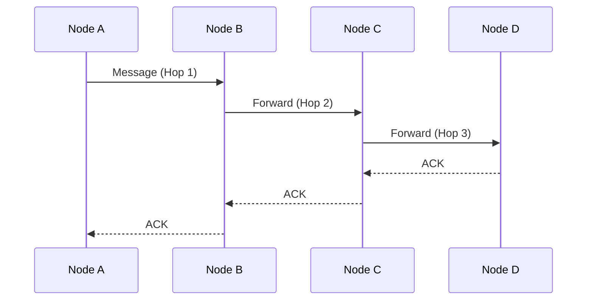
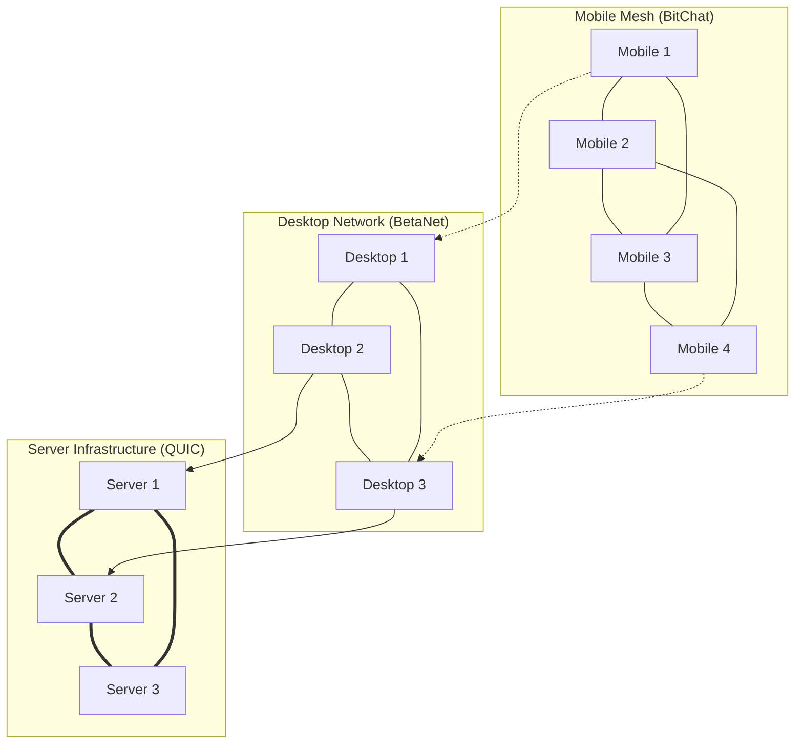

# P2P Networking Architecture

## Overview

AIVillage implements a sophisticated peer-to-peer networking layer that supports multiple transport protocols, mobile-first design, and intelligent routing. The P2P system enables distributed communication across the agent network, fog computing nodes, and federated training infrastructure.

## Architecture Overview

```mermaid
graph TB
    subgraph "P2P Transport Layer"
        TM[Transport Manager]
        MR[Message Router]
        PR[Protocol Registry]
    end
    
    subgraph "Transport Protocols"
        BC[BitChat (BLE)]
        BN[BetaNet (HTX)]
        QU[QUIC]
        WS[WebSocket]
    end
    
    subgraph "Device Types"
        MOB[Mobile Devices]
        DESK[Desktop Nodes]
        SERV[Server Nodes]
        FOG[Fog Nodes]
    end
    
    TM --> BC
    TM --> BN
    TM --> QU
    TM --> WS
    
    BC --> MOB
    BN --> DESK
    QU --> SERV
    WS --> FOG
```

## Core Components

### 1. Transport Manager

**Location**: `infrastructure/p2p/core/transport_manager.py`

The Transport Manager is the central coordination system that handles:
- Protocol selection and routing
- Message fragmentation and reassembly
- Transport failover and recovery
- Resource-aware routing decisions

```python
class TransportManager:
    def __init__(self):
        self.transports = {}  # Registered transport protocols
        self.routing_table = {}  # Active connections and routes
        self.message_router = MessageRouter()
        self.resource_monitor = ResourceMonitor()
    
    async def send_message(self, recipient: str, message: bytes, priority: Priority = Priority.NORMAL):
        """Send message using optimal transport protocol."""
        transport = self._select_optimal_transport(recipient, len(message), priority)
        return await transport.send(recipient, message)
    
    def _select_optimal_transport(self, recipient: str, message_size: int, priority: Priority):
        """Select best transport based on recipient type, message size, and priority."""
        # Mobile devices prefer BitChat for battery efficiency
        # Large messages prefer QUIC for throughput
        # Emergency messages prefer fastest available transport
```

### 2. BitChat Transport (BLE Mesh)

**Location**: `infrastructure/p2p/bitchat/ble_transport.py`

BitChat provides Bluetooth Low Energy mesh networking optimized for mobile devices.

**Key Features**:
- **7-hop mesh networking**: Multi-hop message routing
- **Battery optimization**: Adaptive duty cycling
- **Offline resilience**: Store-and-forward messaging
- **Privacy protection**: Onion routing support



**Protocol Specifications**:
- **MTU**: 244 bytes per BLE packet
- **Frequency**: 2.4 GHz ISM band
- **Range**: 10-100 meters (depending on conditions)
- **Topology**: Self-organizing mesh
- **Addressing**: 128-bit node identifiers

### 3. BetaNet Transport (HTX)

**Location**: `infrastructure/p2p/betanet/htx_transport.py`

BetaNet implements the HTX v1.1 frame protocol for high-throughput communication.

**HTX Frame Structure**:
```
+--------+--------+--------+--------+
| Magic  | Ver/Fl | Length | Type   |
+--------+--------+--------+--------+
| Sequence Number (4 bytes)         |
+--------+--------+--------+--------+
| Timestamp (8 bytes)               |
+--------+--------+--------+--------+
| Payload (variable length)         |
+--------+--------+--------+--------+
| CRC32 Checksum (4 bytes)          |
+--------+--------+--------+--------+
```

**Key Features**:
- **Frame-based protocol**: Structured message format
- **Error detection**: CRC32 checksums
- **Flow control**: Sliding window protocol
- **Compression**: LZ4 payload compression
- **Encryption**: AES-256-GCM encryption

### 4. QUIC Transport

**Location**: `infrastructure/p2p/quic/quic_transport.py`

QUIC provides high-performance transport for server-to-server communication.

**Advantages**:
- **Low latency**: 0-RTT connection establishment
- **Multiplexing**: Multiple streams per connection
- **Loss recovery**: Advanced congestion control
- **Migration**: Connection migration support

## Protocol Selection Algorithm

The transport manager uses a sophisticated algorithm to select the optimal protocol:

```python
def select_transport(self, recipient_type: str, message_size: int, 
                    battery_level: float, network_quality: float) -> Transport:
    """
    Transport selection based on multiple factors:
    
    1. Device Type Priority:
       - Mobile: BitChat > WebSocket > BetaNet > QUIC
       - Desktop: BetaNet > QUIC > WebSocket > BitChat
       - Server: QUIC > BetaNet > WebSocket > BitChat
    
    2. Message Size Considerations:
       - Small (<1KB): BitChat preferred for efficiency
       - Medium (1KB-10KB): BetaNet optimal balance
       - Large (>10KB): QUIC for throughput
    
    3. Battery Awareness:
       - Low battery (<20%): BitChat only
       - Medium battery (20-50%): BitChat > BetaNet
       - High battery (>50%): All protocols available
    
    4. Network Quality:
       - Poor: BitChat mesh resilience
       - Good: BetaNet/QUIC performance
       - Excellent: QUIC maximum throughput
    """
```

## Message Routing

### Routing Table Structure

```python
class RoutingTable:
    def __init__(self):
        self.direct_routes = {}     # Direct peer connections
        self.mesh_routes = {}       # Multi-hop mesh routes
        self.server_routes = {}     # Server infrastructure routes
        self.cached_routes = {}     # Performance-optimized cache
    
    def find_route(self, destination: str) -> Route:
        """Find optimal route to destination."""
        # 1. Check direct connection
        if destination in self.direct_routes:
            return self.direct_routes[destination]
        
        # 2. Check mesh network routes
        if mesh_route := self._find_mesh_route(destination):
            return mesh_route
        
        # 3. Fall back to server infrastructure
        return self._find_server_route(destination)
```

### Message Fragmentation

Large messages are automatically fragmented for transport:

```python
class MessageFragmenter:
    def fragment_message(self, message: bytes, transport: Transport) -> List[Fragment]:
        """Fragment message based on transport MTU."""
        mtu = transport.get_mtu()
        fragments = []
        
        for i in range(0, len(message), mtu):
            fragment = Fragment(
                id=uuid.uuid4(),
                sequence=i // mtu,
                total_fragments=math.ceil(len(message) / mtu),
                data=message[i:i+mtu],
                checksum=crc32(message[i:i+mtu])
            )
            fragments.append(fragment)
        
        return fragments
```

## Security Architecture

### Encryption Layers

1. **Transport Layer Encryption**: Each transport protocol implements its own encryption
2. **Message Layer Encryption**: End-to-end encryption for sensitive messages
3. **Onion Routing**: Multi-layer encryption for privacy-critical communications

```python
class SecurityManager:
    def __init__(self):
        self.node_keys = self._generate_node_keypair()  # Ed25519
        self.session_keys = {}  # Per-peer session keys
        self.onion_keys = {}   # Onion routing keys
    
    def encrypt_message(self, message: bytes, recipient: str, 
                       privacy_level: PrivacyLevel) -> bytes:
        """Encrypt message based on privacy requirements."""
        if privacy_level == PrivacyLevel.STANDARD:
            return self._encrypt_standard(message, recipient)
        elif privacy_level == PrivacyLevel.PRIVATE:
            return self._encrypt_private(message, recipient)
        elif privacy_level == PrivacyLevel.ANONYMOUS:
            return self._encrypt_onion(message, recipient)
```

### Authentication

- **Node Authentication**: Ed25519 digital signatures
- **Message Authentication**: HMAC-SHA256
- **Replay Protection**: Timestamp + nonce validation
- **Forward Secrecy**: Ephemeral key exchange

## Mobile Optimization

### Battery-Aware Policies

```python
class BatteryAwarePolicy:
    def __init__(self):
        self.battery_thresholds = {
            'critical': 0.10,   # <10% battery
            'low': 0.20,        # 10-20% battery
            'medium': 0.50,     # 20-50% battery
            'high': 0.80        # 50-80% battery
        }
    
    def get_transport_policy(self, battery_level: float) -> TransportPolicy:
        """Get transport policy based on battery level."""
        if battery_level < self.battery_thresholds['critical']:
            return TransportPolicy(
                allowed_transports=['bitchat'],
                max_concurrent_connections=1,
                heartbeat_interval=300,  # 5 minutes
                discovery_enabled=False
            )
        # ... other battery level policies
```

### Thermal Management

```python
class ThermalManager:
    def __init__(self):
        self.thermal_thresholds = {
            'normal': 35.0,      # <35°C
            'warm': 40.0,        # 35-40°C
            'hot': 45.0,         # 40-45°C
            'critical': 50.0     # >45°C
        }
    
    def adjust_performance(self, temperature: float):
        """Adjust P2P performance based on device temperature."""
        if temperature > self.thermal_thresholds['critical']:
            self._enable_thermal_throttling()
            self._reduce_transmission_power()
            self._increase_sleep_intervals()
```

## Network Topology

### Mesh Network Structure



### Network Discovery

1. **Local Discovery**: mDNS/Bonjour for local network
2. **Bluetooth Discovery**: BLE advertisement scanning
3. **DHT Discovery**: Distributed hash table for global routing
4. **Bootstrap Nodes**: Well-known entry points

```python
class NetworkDiscovery:
    async def discover_peers(self) -> List[Peer]:
        """Discover available peers using multiple methods."""
        peers = []
        
        # Local network discovery
        peers.extend(await self._mdns_discovery())
        
        # Bluetooth discovery
        peers.extend(await self._bluetooth_discovery())
        
        # DHT discovery
        peers.extend(await self._dht_discovery())
        
        return self._deduplicate_peers(peers)
```

## Performance Optimization

### Connection Pooling

```python
class ConnectionPool:
    def __init__(self, max_connections: int = 100):
        self.active_connections = {}
        self.idle_connections = {}
        self.max_connections = max_connections
    
    async def get_connection(self, peer: str, transport: str) -> Connection:
        """Get or create connection to peer."""
        connection_key = f"{peer}:{transport}"
        
        # Check for active connection
        if connection_key in self.active_connections:
            return self.active_connections[connection_key]
        
        # Check for idle connection
        if connection_key in self.idle_connections:
            conn = self.idle_connections.pop(connection_key)
            self.active_connections[connection_key] = conn
            return conn
        
        # Create new connection
        conn = await self._create_connection(peer, transport)
        self.active_connections[connection_key] = conn
        return conn
```

### Message Compression

Automatic message compression based on content type:

```python
class MessageCompressor:
    def __init__(self):
        self.compressors = {
            'text': self._compress_text,
            'json': self._compress_json,
            'binary': self._compress_binary
        }
    
    def compress(self, data: bytes, content_type: str) -> bytes:
        """Compress message data based on content type."""
        if len(data) < 1024:  # Don't compress small messages
            return data
        
        compressor = self.compressors.get(content_type, self._compress_binary)
        return compressor(data)
```

## Integration Points

### Agent Communication

```python
class AgentCommunicationBridge:
    """Bridge between agent system and P2P network."""
    
    async def send_agent_message(self, sender_id: str, recipient_id: str, 
                                message: dict, channel: str = 'default'):
        """Send message between agents via P2P network."""
        # Serialize agent message
        serialized = self._serialize_agent_message(message)
        
        # Add routing metadata
        p2p_message = P2PMessage(
            type='agent_communication',
            sender=sender_id,
            recipient=recipient_id,
            channel=channel,
            payload=serialized,
            timestamp=time.time()
        )
        
        # Send via transport manager
        await self.transport_manager.send_message(
            recipient_id, p2p_message.serialize()
        )
```

### Fog Compute Integration

```python
class FogComputeBridge:
    """Bridge between fog computing and P2P network."""
    
    async def distribute_computation(self, task: ComputeTask, 
                                   target_nodes: List[str]) -> List[Result]:
        """Distribute computation across fog nodes."""
        # Fragment task for parallel processing
        fragments = self._fragment_task(task, len(target_nodes))
        
        # Send fragments to target nodes
        futures = []
        for i, node in enumerate(target_nodes):
            future = self._send_compute_task(node, fragments[i])
            futures.append(future)
        
        # Collect results
        results = await asyncio.gather(*futures)
        return self._merge_results(results)
```

## Monitoring and Metrics

### Network Health Monitoring

```python
class NetworkHealthMonitor:
    def __init__(self):
        self.metrics = {
            'message_throughput': Counter('p2p_messages_sent_total'),
            'connection_count': Gauge('p2p_active_connections'),
            'latency': Histogram('p2p_message_latency_seconds'),
            'error_rate': Counter('p2p_errors_total')
        }
    
    def record_message_sent(self, transport: str, size: int, latency: float):
        """Record message transmission metrics."""
        self.metrics['message_throughput'].labels(transport=transport).inc()
        self.metrics['latency'].labels(transport=transport).observe(latency)
```

### Quality of Service (QoS)

```python
class QoSManager:
    def __init__(self):
        self.priority_queues = {
            Priority.EMERGENCY: asyncio.Queue(maxsize=10),
            Priority.HIGH: asyncio.Queue(maxsize=50),
            Priority.NORMAL: asyncio.Queue(maxsize=200),
            Priority.LOW: asyncio.Queue(maxsize=500)
        }
    
    async def queue_message(self, message: Message, priority: Priority):
        """Queue message with priority-based handling."""
        queue = self.priority_queues[priority]
        
        if queue.full() and priority == Priority.EMERGENCY:
            # Drop low priority message to make room
            await self._drop_low_priority_message()
        
        await queue.put(message)
```

## Configuration

### Transport Configuration

```yaml
# p2p_config.yaml
transport:
  bitchat:
    enabled: true
    scan_interval: 5.0
    advertisement_interval: 10.0
    max_hops: 7
    battery_threshold: 0.20
  
  betanet:
    enabled: true
    port: 8888
    compression: lz4
    encryption: aes-256-gcm
    max_frame_size: 65536
  
  quic:
    enabled: true
    port: 443
    max_streams: 100
    idle_timeout: 60
    keep_alive: 30

routing:
  discovery_interval: 30.0
  route_timeout: 300.0
  max_route_hops: 10
  load_balance: true

security:
  encryption_required: true
  authentication_required: true
  replay_protection: true
  forward_secrecy: true
```

## Testing and Validation

### Network Simulation

```python
class P2PNetworkSimulator:
    """Simulate P2P network for testing."""
    
    def __init__(self, num_nodes: int = 10):
        self.nodes = [MockNode(f"node_{i}") for i in range(num_nodes)]
        self.network_conditions = NetworkConditions()
    
    async def simulate_message_propagation(self, source: int, message: bytes) -> float:
        """Simulate message propagation through network."""
        start_time = time.time()
        
        # Simulate network delays and losses
        await self._simulate_network_delay()
        
        # Track message path
        path = await self._find_shortest_path(source, len(self.nodes) - 1)
        
        return time.time() - start_time
```

## Troubleshooting

### Common Issues

1. **Connection Timeouts**
   - Check network connectivity
   - Verify firewall settings
   - Increase timeout values

2. **High Battery Drain**
   - Review battery-aware policies
   - Reduce scan/advertisement intervals
   - Enable aggressive power saving

3. **Message Loss**
   - Check network quality
   - Enable message acknowledgments
   - Increase retry attempts

4. **Discovery Failures**
   - Verify mDNS/Bonjour settings
   - Check Bluetooth permissions
   - Review bootstrap node configuration

### Debug Commands

```bash
# Check P2P network status
curl http://localhost:8000/v1/p2p/status

# View active connections
curl http://localhost:8000/v1/p2p/connections

# Monitor message flow
curl http://localhost:8000/v1/p2p/messages/stream

# Check routing table
curl http://localhost:8000/v1/p2p/routes
```

---

*Last Updated: January 2025*
*Version: 3.0.0*
*Status: Production Ready*