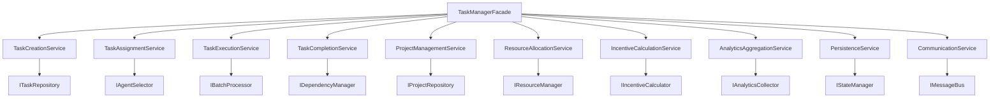
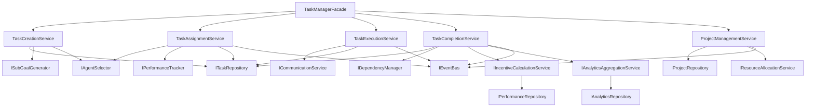

# Service Layer Architecture Design

## Executive Summary

This document outlines the architectural design for refactoring the `UnifiedManagement` god class (424 lines, 21.6 coupling score) into a well-structured service layer following SOLID principles and modern architectural patterns.

## Current State Analysis

### God Class Issues Identified

**File:** `unified_task_manager.py`
- **Lines of Code:** 424
- **Coupling Score:** 21.6 (critical threshold)
- **Methods:** 26+ public methods
- **Responsibilities:** 8+ distinct concerns

**Primary Violations:**
- **Single Responsibility Principle:** Handles task management, project management, analytics, persistence, batch processing, agent assignment, communication, and state management
- **Open/Closed Principle:** Modifications require changes to the monolithic class
- **Dependency Inversion:** Directly coupled to concrete implementations
- **Interface Segregation:** Clients depend on methods they don't use

### Responsibility Analysis

| Concern | Methods | Lines | External Dependencies |
|---------|---------|-------|----------------------|
| Task Creation | `create_task`, `create_complex_task` | ~40 | SubGoalGenerator, DecisionMaker |
| Task Assignment | `assign_task`, `_select_best_agent_for_task` | ~30 | DecisionMaker, IncentiveModel |
| Task Execution | `process_task_batch`, `process_single_task`, `start_batch_processing` | ~45 | CommunicationProtocol |
| Task Completion | `complete_task`, `update_dependent_tasks` | ~35 | Analytics, IncentiveModel |
| Project Management | `create_project`, `update_project_status`, `add_task_to_project`, `get_project_tasks`, `add_resources_to_project` | ~90 | None |
| Analytics Integration | Task completion tracking, performance updates | ~25 | UnifiedAnalytics |
| State Persistence | `save_state`, `load_state`, `introspect` | ~55 | File System |
| Communication | `notify_agent_with_incentive` | ~20 | CommunicationProtocol |

## Service Layer Architecture

### Core Service Hierarchy



## Service Definitions

### 1. Task Management Services

#### TaskCreationService
**Responsibility:** Task creation, validation, and initial setup

```python
from abc import ABC, abstractmethod
from typing import Any, List, Optional
from dataclasses import dataclass
from .task import Task, TaskPriority, TaskType

@dataclass
class TaskCreationRequest:
    description: str
    agent_id: Optional[str] = None
    priority: TaskPriority = TaskPriority.MEDIUM
    deadline: Optional[str] = None
    project_id: Optional[str] = None
    dependencies: List[str] = None
    metadata: dict[str, Any] = None

class ITaskCreationService(ABC):
    @abstractmethod
    async def create_simple_task(self, request: TaskCreationRequest) -> Task:
        """Create a single task with validation."""
        pass
    
    @abstractmethod
    async def create_complex_task(
        self, 
        description: str, 
        context: dict[str, Any]
    ) -> List[Task]:
        """Break down complex tasks into subtasks."""
        pass
    
    @abstractmethod
    async def validate_task_request(self, request: TaskCreationRequest) -> bool:
        """Validate task creation parameters."""
        pass

class TaskCreationService(ITaskCreationService):
    def __init__(
        self,
        task_repository: ITaskRepository,
        subgoal_generator: ISubGoalGenerator,
        agent_selector: IAgentSelector
    ):
        self._task_repo = task_repository
        self._subgoal_generator = subgoal_generator
        self._agent_selector = agent_selector
    
    async def create_simple_task(self, request: TaskCreationRequest) -> Task:
        """Create and validate a single task."""
        await self.validate_task_request(request)
        
        # Auto-assign agent if not specified
        if not request.agent_id:
            request.agent_id = await self._agent_selector.select_optimal_agent(
                request.description, request.priority
            )
        
        task = Task(
            description=request.description,
            assigned_agents=[request.agent_id],
            priority=request.priority,
            deadline=request.deadline,
            dependencies=request.dependencies or [],
            metadata=request.metadata or {}
        )
        
        await self._task_repo.save(task)
        return task
    
    async def create_complex_task(
        self, 
        description: str, 
        context: dict[str, Any]
    ) -> List[Task]:
        """Break down complex tasks using AI-powered decomposition."""
        subgoals = await self._subgoal_generator.generate_subgoals(
            description, context
        )
        
        tasks = []
        for i, subgoal in enumerate(subgoals):
            agent = await self._agent_selector.select_optimal_agent(subgoal)
            
            request = TaskCreationRequest(
                description=subgoal,
                agent_id=agent,
                priority=TaskPriority.HIGH if i == 0 else TaskPriority.MEDIUM,
                metadata={
                    "parent_description": description,
                    "subgoal_index": i,
                    "total_subgoals": len(subgoals)
                }
            )
            
            task = await self.create_simple_task(request)
            tasks.append(task)
        
        return tasks
    
    async def validate_task_request(self, request: TaskCreationRequest) -> bool:
        """Comprehensive task validation."""
        if not request.description.strip():
            raise TaskValidationError("Task description cannot be empty")
        
        if len(request.description) > 1000:
            raise TaskValidationError("Task description too long (max 1000 chars)")
        
        if request.deadline:
            # Validate deadline format and ensure it's in the future
            pass
        
        return True
```

#### TaskAssignmentService
**Responsibility:** Agent selection and task assignment logic

```python
from enum import Enum
from typing import Dict, List, Optional

class AssignmentStrategy(Enum):
    LOAD_BALANCED = "load_balanced"
    SKILL_BASED = "skill_based"
    PERFORMANCE_BASED = "performance_based"
    AVAILABILITY_BASED = "availability_based"

@dataclass
class AssignmentRequest:
    task: Task
    strategy: AssignmentStrategy = AssignmentStrategy.SKILL_BASED
    preferred_agents: List[str] = None
    excluded_agents: List[str] = None

class ITaskAssignmentService(ABC):
    @abstractmethod
    async def assign_task(self, request: AssignmentRequest) -> str:
        """Assign task to optimal agent."""
        pass
    
    @abstractmethod
    async def reassign_task(self, task_id: str, new_agent: str) -> bool:
        """Reassign task to different agent."""
        pass
    
    @abstractmethod
    async def get_agent_workload(self, agent_id: str) -> int:
        """Get current task count for agent."""
        pass

class TaskAssignmentService(ITaskAssignmentService):
    def __init__(
        self,
        agent_selector: IAgentSelector,
        performance_tracker: IPerformanceTracker,
        task_repository: ITaskRepository,
        event_bus: IEventBus
    ):
        self._agent_selector = agent_selector
        self._performance_tracker = performance_tracker
        self._task_repo = task_repository
        self._event_bus = event_bus
    
    async def assign_task(self, request: AssignmentRequest) -> str:
        """Assign task using specified strategy."""
        agent_id = await self._agent_selector.select_by_strategy(
            request.task,
            request.strategy,
            request.preferred_agents,
            request.excluded_agents
        )
        
        # Update task assignment
        request.task.assigned_agents = [agent_id]
        request.task.status = TaskStatus.ASSIGNED
        await self._task_repo.update(request.task)
        
        # Publish assignment event
        await self._event_bus.publish(TaskAssignedEvent(
            task_id=request.task.id,
            agent_id=agent_id,
            assignment_strategy=request.strategy
        ))
        
        return agent_id
    
    async def reassign_task(self, task_id: str, new_agent: str) -> bool:
        """Handle task reassignment with proper cleanup."""
        task = await self._task_repo.get_by_id(task_id)
        if not task:
            raise TaskNotFoundError(f"Task {task_id} not found")
        
        old_agent = task.assigned_agents[0] if task.assigned_agents else None
        
        # Update assignment
        task.assigned_agents = [new_agent]
        task.reassignment_count = getattr(task, 'reassignment_count', 0) + 1
        await self._task_repo.update(task)
        
        # Publish reassignment event
        await self._event_bus.publish(TaskReassignedEvent(
            task_id=task_id,
            old_agent=old_agent,
            new_agent=new_agent
        ))
        
        return True
```

#### TaskExecutionService
**Responsibility:** Task processing, monitoring, and batch execution

```python
from asyncio import Queue, gather, create_task
from typing import Dict, List, Optional
import asyncio

@dataclass
class ExecutionConfig:
    batch_size: int = 5
    max_concurrent_tasks: int = 10
    execution_timeout: int = 300  # seconds
    retry_attempts: int = 3

class ITaskExecutionService(ABC):
    @abstractmethod
    async def execute_task(self, task: Task) -> Any:
        """Execute single task."""
        pass
    
    @abstractmethod
    async def start_batch_processing(self) -> None:
        """Start continuous batch processing."""
        pass
    
    @abstractmethod
    async def stop_batch_processing(self) -> None:
        """Stop batch processing gracefully."""
        pass

class TaskExecutionService(ITaskExecutionService):
    def __init__(
        self,
        communication_service: ICommunicationService,
        task_repository: ITaskRepository,
        config: ExecutionConfig,
        event_bus: IEventBus
    ):
        self._comm_service = communication_service
        self._task_repo = task_repository
        self._config = config
        self._event_bus = event_bus
        self._processing_queue: Queue[Task] = Queue()
        self._active_tasks: Dict[str, asyncio.Task] = {}
        self._is_processing = False
    
    async def execute_task(self, task: Task) -> Any:
        """Execute single task with timeout and error handling."""
        try:
            await self._event_bus.publish(TaskExecutionStartedEvent(task.id))
            
            # Execute with timeout
            result = await asyncio.wait_for(
                self._comm_service.send_task_to_agent(task),
                timeout=self._config.execution_timeout
            )
            
            await self._event_bus.publish(TaskExecutionCompletedEvent(
                task.id, result, success=True
            ))
            
            return result
            
        except asyncio.TimeoutError:
            await self._event_bus.publish(TaskExecutionFailedEvent(
                task.id, "Execution timeout"
            ))
            raise TaskExecutionTimeoutError(f"Task {task.id} timed out")
        
        except Exception as e:
            await self._event_bus.publish(TaskExecutionFailedEvent(
                task.id, str(e)
            ))
            raise
    
    async def start_batch_processing(self) -> None:
        """Start continuous batch processing with concurrency control."""
        self._is_processing = True
        
        # Start producer (feeds tasks to queue)
        producer_task = create_task(self._queue_producer())
        
        # Start consumers (process tasks from queue)
        consumer_tasks = [
            create_task(self._queue_consumer())
            for _ in range(self._config.max_concurrent_tasks)
        ]
        
        # Wait for all tasks
        await gather(producer_task, *consumer_tasks)
    
    async def _queue_producer(self):
        """Continuously feed pending tasks to processing queue."""
        while self._is_processing:
            pending_tasks = await self._task_repo.get_pending_tasks(
                limit=self._config.batch_size
            )
            
            for task in pending_tasks:
                await self._processing_queue.put(task)
            
            await asyncio.sleep(1)  # Prevent tight loop
    
    async def _queue_consumer(self):
        """Process tasks from the queue."""
        while self._is_processing:
            try:
                # Get task from queue with timeout
                task = await asyncio.wait_for(
                    self._processing_queue.get(), timeout=5.0
                )
                
                # Execute task
                execution_task = create_task(self.execute_task(task))
                self._active_tasks[task.id] = execution_task
                
                # Wait for completion and cleanup
                await execution_task
                del self._active_tasks[task.id]
                
            except asyncio.TimeoutError:
                continue  # No tasks available, continue waiting
            except Exception as e:
                logger.exception(f"Error in task consumer: {e}")
```

#### TaskCompletionService
**Responsibility:** Task completion handling and dependency management

```python
from typing import Any, Dict, List

@dataclass
class CompletionResult:
    task_id: str
    result: Any
    success: bool
    completion_time: float
    agent_id: str

class ITaskCompletionService(ABC):
    @abstractmethod
    async def complete_task(
        self, 
        task_id: str, 
        result: Any, 
        agent_id: str
    ) -> CompletionResult:
        """Mark task as completed and handle dependencies."""
        pass
    
    @abstractmethod
    async def handle_task_failure(
        self, 
        task_id: str, 
        error: str, 
        agent_id: str
    ) -> bool:
        """Handle task failure and retry logic."""
        pass

class TaskCompletionService(ITaskCompletionService):
    def __init__(
        self,
        task_repository: ITaskRepository,
        dependency_manager: IDependencyManager,
        incentive_service: IIncentiveCalculationService,
        analytics_service: IAnalyticsAggregationService,
        event_bus: IEventBus
    ):
        self._task_repo = task_repository
        self._dependency_manager = dependency_manager
        self._incentive_service = incentive_service
        self._analytics_service = analytics_service
        self._event_bus = event_bus
    
    async def complete_task(
        self, 
        task_id: str, 
        result: Any, 
        agent_id: str
    ) -> CompletionResult:
        """Complete task with full dependency and analytics handling."""
        
        # Get and validate task
        task = await self._task_repo.get_by_id(task_id)
        if not task:
            raise TaskNotFoundError(f"Task {task_id} not found")
        
        if task.status != TaskStatus.IN_PROGRESS:
            raise InvalidTaskStateError(
                f"Task {task_id} is not in progress (status: {task.status})"
            )
        
        # Calculate completion metrics
        completion_time = time.time() - task.started_at
        success = self._evaluate_result_success(result)
        
        # Update task status
        task.status = TaskStatus.COMPLETED
        task.completed_at = time.time()
        task.result = result
        await self._task_repo.update(task)
        
        # Handle incentives
        incentive = await self._incentive_service.calculate_completion_incentive(
            task, agent_id, result, success
        )
        
        # Record analytics
        await self._analytics_service.record_task_completion(
            task_id, agent_id, completion_time, success, incentive
        )
        
        # Handle dependent tasks
        dependent_tasks = await self._dependency_manager.resolve_dependencies(
            task_id
        )
        
        # Create completion result
        completion_result = CompletionResult(
            task_id=task_id,
            result=result,
            success=success,
            completion_time=completion_time,
            agent_id=agent_id
        )
        
        # Publish completion event
        await self._event_bus.publish(TaskCompletedEvent(
            completion_result, dependent_tasks
        ))
        
        return completion_result
    
    def _evaluate_result_success(self, result: Any) -> bool:
        """Evaluate if task result indicates success."""
        if isinstance(result, dict):
            return result.get("success", True)
        elif isinstance(result, bool):
            return result
        elif result is None:
            return False
        return True  # Default to success if unclear
```

### 2. Project Management Services

#### ProjectManagementService
**Responsibility:** Project lifecycle and coordination

```python
from enum import Enum
from typing import List, Dict, Optional

class ProjectStatus(Enum):
    PLANNING = "planning"
    ACTIVE = "active"
    ON_HOLD = "on_hold"
    COMPLETED = "completed"
    CANCELLED = "cancelled"

@dataclass
class ProjectCreationRequest:
    name: str
    description: str
    owner_id: str
    budget: Optional[float] = None
    deadline: Optional[str] = None
    tags: List[str] = None

class IProjectManagementService(ABC):
    @abstractmethod
    async def create_project(self, request: ProjectCreationRequest) -> Project:
        """Create new project with validation."""
        pass
    
    @abstractmethod
    async def update_project_status(
        self, 
        project_id: str, 
        status: ProjectStatus
    ) -> bool:
        """Update project status with validation."""
        pass
    
    @abstractmethod
    async def calculate_project_progress(self, project_id: str) -> float:
        """Calculate project completion percentage."""
        pass

class ProjectManagementService(IProjectManagementService):
    def __init__(
        self,
        project_repository: IProjectRepository,
        task_repository: ITaskRepository,
        resource_service: IResourceAllocationService,
        event_bus: IEventBus
    ):
        self._project_repo = project_repository
        self._task_repo = task_repository
        self._resource_service = resource_service
        self._event_bus = event_bus
    
    async def create_project(self, request: ProjectCreationRequest) -> Project:
        """Create project with proper validation and setup."""
        # Validate request
        await self._validate_project_request(request)
        
        # Create project
        project = Project(
            name=request.name,
            description=request.description,
            owner_id=request.owner_id,
            status=ProjectStatus.PLANNING,
            budget=request.budget,
            deadline=request.deadline,
            tags=request.tags or [],
            created_at=time.time()
        )
        
        await self._project_repo.save(project)
        
        # Initialize default resources
        await self._resource_service.initialize_project_resources(project.id)
        
        # Publish creation event
        await self._event_bus.publish(ProjectCreatedEvent(project))
        
        return project
    
    async def calculate_project_progress(self, project_id: str) -> float:
        """Calculate progress based on completed tasks."""
        project_tasks = await self._task_repo.get_by_project_id(project_id)
        
        if not project_tasks:
            return 0.0
        
        completed_tasks = [
            task for task in project_tasks 
            if task.status == TaskStatus.COMPLETED
        ]
        
        return len(completed_tasks) / len(project_tasks) * 100.0
    
    async def _validate_project_request(
        self, 
        request: ProjectCreationRequest
    ) -> None:
        """Validate project creation request."""
        if not request.name.strip():
            raise ProjectValidationError("Project name cannot be empty")
        
        if len(request.name) > 100:
            raise ProjectValidationError("Project name too long (max 100 chars)")
        
        # Check for duplicate names
        existing = await self._project_repo.get_by_name(request.name)
        if existing:
            raise ProjectValidationError(f"Project '{request.name}' already exists")
```

### 3. Supporting Services

#### IncentiveCalculationService
**Responsibility:** Agent incentive calculations and performance tracking

```python
from typing import Dict, Any
from dataclasses import dataclass

@dataclass
class IncentiveCalculation:
    base_incentive: float
    performance_bonus: float
    complexity_bonus: float
    time_bonus: float
    total_incentive: float
    calculation_factors: Dict[str, Any]

class IIncentiveCalculationService(ABC):
    @abstractmethod
    async def calculate_completion_incentive(
        self,
        task: Task,
        agent_id: str,
        result: Any,
        success: bool
    ) -> IncentiveCalculation:
        """Calculate incentive for task completion."""
        pass
    
    @abstractmethod
    async def update_agent_performance(
        self,
        agent_id: str,
        task: Task,
        result: Any
    ) -> None:
        """Update agent performance metrics."""
        pass

class IncentiveCalculationService(IIncentiveCalculationService):
    def __init__(
        self,
        performance_repository: IPerformanceRepository,
        incentive_model: IncentiveModel
    ):
        self._perf_repo = performance_repository
        self._incentive_model = incentive_model
    
    async def calculate_completion_incentive(
        self,
        task: Task,
        agent_id: str,
        result: Any,
        success: bool
    ) -> IncentiveCalculation:
        """Calculate comprehensive incentive based on multiple factors."""
        
        # Get agent performance history
        performance = await self._perf_repo.get_agent_performance(agent_id)
        
        # Calculate base incentive
        base_incentive = self._incentive_model.calculate_base_incentive(task)
        
        # Performance multiplier
        performance_bonus = base_incentive * (performance.success_rate - 0.5) * 0.2
        
        # Task complexity bonus
        complexity_bonus = self._calculate_complexity_bonus(task, base_incentive)
        
        # Time-based bonus (completed early)
        time_bonus = self._calculate_time_bonus(task, base_incentive)
        
        # Success penalty
        success_multiplier = 1.0 if success else 0.3
        
        total_incentive = (
            base_incentive + performance_bonus + complexity_bonus + time_bonus
        ) * success_multiplier
        
        return IncentiveCalculation(
            base_incentive=base_incentive,
            performance_bonus=performance_bonus,
            complexity_bonus=complexity_bonus,
            time_bonus=time_bonus,
            total_incentive=total_incentive,
            calculation_factors={
                "success": success,
                "agent_success_rate": performance.success_rate,
                "task_priority": task.priority.value,
                "completion_time": task.completed_at - task.started_at
            }
        )
```

## Service Communication Strategy

### Event-Driven Architecture

```python
from abc import ABC, abstractmethod
from typing import Any, Dict, List
from dataclasses import dataclass
import asyncio

# Event Base Classes
@dataclass
class DomainEvent:
    event_id: str
    timestamp: float
    event_type: str
    payload: Dict[str, Any]

# Task Events
@dataclass
class TaskCreatedEvent(DomainEvent):
    task: Task

@dataclass
class TaskAssignedEvent(DomainEvent):
    task_id: str
    agent_id: str
    assignment_strategy: AssignmentStrategy

@dataclass
class TaskCompletedEvent(DomainEvent):
    completion_result: CompletionResult
    dependent_tasks: List[Task]

# Event Bus Interface
class IEventBus(ABC):
    @abstractmethod
    async def publish(self, event: DomainEvent) -> None:
        """Publish event to all subscribers."""
        pass
    
    @abstractmethod
    def subscribe(
        self, 
        event_type: type, 
        handler: callable
    ) -> None:
        """Subscribe to specific event type."""
        pass

# Event Bus Implementation
class EventBus(IEventBus):
    def __init__(self):
        self._subscribers: Dict[type, List[callable]] = {}
    
    async def publish(self, event: DomainEvent) -> None:
        """Publish event to all registered handlers."""
        event_type = type(event)
        handlers = self._subscribers.get(event_type, [])
        
        if handlers:
            await asyncio.gather(
                *[handler(event) for handler in handlers],
                return_exceptions=True
            )
    
    def subscribe(self, event_type: type, handler: callable) -> None:
        """Subscribe handler to event type."""
        if event_type not in self._subscribers:
            self._subscribers[event_type] = []
        self._subscribers[event_type].append(handler)
```

## Dependency Injection Container

```python
from typing import Dict, Type, Any, Callable
import inspect

class DIContainer:
    def __init__(self):
        self._services: Dict[Type, Any] = {}
        self._factories: Dict[Type, Callable] = {}
        self._singletons: Dict[Type, Any] = {}
    
    def register(self, interface: Type, implementation: Type, singleton: bool = True):
        """Register implementation for interface."""
        if singleton:
            self._singletons[interface] = implementation
        else:
            self._services[interface] = implementation
    
    def register_factory(self, interface: Type, factory: Callable):
        """Register factory function for interface."""
        self._factories[interface] = factory
    
    async def resolve(self, interface: Type) -> Any:
        """Resolve implementation for interface."""
        # Check if already instantiated singleton
        if interface in self._singletons:
            instance = self._singletons[interface]
            if not inspect.isclass(instance):
                return instance
        
        # Check factories
        if interface in self._factories:
            factory = self._factories[interface]
            instance = await factory(self)
            if interface in self._singletons:
                self._singletons[interface] = instance
            return instance
        
        # Check registered services
        if interface in self._services:
            implementation = self._services[interface]
            instance = await self._instantiate_with_dependencies(implementation)
            return instance
        
        raise ServiceNotRegisteredError(f"No registration found for {interface}")
    
    async def _instantiate_with_dependencies(self, cls: Type) -> Any:
        """Instantiate class with dependency injection."""
        sig = inspect.signature(cls.__init__)
        kwargs = {}
        
        for param_name, param in sig.parameters.items():
            if param_name == 'self':
                continue
            
            if param.annotation != inspect.Parameter.empty:
                dependency = await self.resolve(param.annotation)
                kwargs[param_name] = dependency
        
        return cls(**kwargs)

# Service Registration
def setup_services() -> DIContainer:
    """Configure dependency injection container."""
    container = DIContainer()
    
    # Register repositories
    container.register(ITaskRepository, TaskRepository, singleton=True)
    container.register(IProjectRepository, ProjectRepository, singleton=True)
    container.register(IPerformanceRepository, PerformanceRepository, singleton=True)
    
    # Register core services
    container.register(ITaskCreationService, TaskCreationService, singleton=True)
    container.register(ITaskAssignmentService, TaskAssignmentService, singleton=True)
    container.register(ITaskExecutionService, TaskExecutionService, singleton=True)
    container.register(ITaskCompletionService, TaskCompletionService, singleton=True)
    container.register(IProjectManagementService, ProjectManagementService, singleton=True)
    container.register(IIncentiveCalculationService, IncentiveCalculationService, singleton=True)
    
    # Register infrastructure
    container.register(IEventBus, EventBus, singleton=True)
    container.register(ICommunicationService, CommunicationService, singleton=True)
    
    return container
```

## Backwards Compatibility Facade

```python
class UnifiedTaskManagerFacade:
    """
    Backwards-compatible facade that delegates to service layer.
    Maintains the original API while using the new architecture internally.
    """
    
    def __init__(self, container: DIContainer):
        self._container = container
        self._task_creation_service: Optional[ITaskCreationService] = None
        self._task_assignment_service: Optional[ITaskAssignmentService] = None
        self._task_execution_service: Optional[ITaskExecutionService] = None
        self._task_completion_service: Optional[ITaskCompletionService] = None
        self._project_management_service: Optional[IProjectManagementService] = None
    
    async def _ensure_services_initialized(self):
        """Lazy initialize services."""
        if not self._task_creation_service:
            self._task_creation_service = await self._container.resolve(ITaskCreationService)
            self._task_assignment_service = await self._container.resolve(ITaskAssignmentService)
            self._task_execution_service = await self._container.resolve(ITaskExecutionService)
            self._task_completion_service = await self._container.resolve(ITaskCompletionService)
            self._project_management_service = await self._container.resolve(IProjectManagementService)
    
    # Original API methods - delegate to services
    async def create_task(
        self,
        description: str,
        agent: str,
        priority: int = 1,
        deadline: str = None,
        project_id: str = None,
    ) -> Task:
        """Maintain original create_task signature."""
        await self._ensure_services_initialized()
        
        # Convert old parameters to new request format
        request = TaskCreationRequest(
            description=description,
            agent_id=agent,
            priority=TaskPriority(priority),
            deadline=deadline,
            project_id=project_id
        )
        
        task = await self._task_creation_service.create_simple_task(request)
        
        # Auto-assign task (original behavior)
        assignment_request = AssignmentRequest(
            task=task,
            strategy=AssignmentStrategy.SKILL_BASED
        )
        await self._task_assignment_service.assign_task(assignment_request)
        
        return task
    
    async def create_complex_task(self, description: str, context: dict[str, Any]) -> list[Task]:
        """Delegate to task creation service."""
        await self._ensure_services_initialized()
        return await self._task_creation_service.create_complex_task(description, context)
    
    async def assign_task(self, task: Task) -> None:
        """Delegate to assignment service."""
        await self._ensure_services_initialized()
        
        request = AssignmentRequest(
            task=task,
            strategy=AssignmentStrategy.SKILL_BASED
        )
        await self._task_assignment_service.assign_task(request)
    
    async def complete_task(self, task_id: str, result: Any) -> None:
        """Delegate to completion service."""
        await self._ensure_services_initialized()
        
        # Extract agent from task (maintain original behavior)
        task = await self._container.resolve(ITaskRepository).get_by_id(task_id)
        agent_id = task.assigned_agents[0] if task.assigned_agents else "unknown"
        
        await self._task_completion_service.complete_task(task_id, result, agent_id)
    
    async def create_project(self, name: str, description: str) -> str:
        """Delegate to project management service."""
        await self._ensure_services_initialized()
        
        request = ProjectCreationRequest(
            name=name,
            description=description,
            owner_id="system"  # Default for backwards compatibility
        )
        
        project = await self._project_management_service.create_project(request)
        return project.id
    
    # Additional facade methods...
```

## Migration Strategy

### Phase 1: Foundation (Week 1-2)
1. **Create service interfaces and base implementations**
   - Define all service interfaces
   - Implement dependency injection container
   - Create event bus system
   - Set up repository patterns

### Phase 2: Core Services (Week 3-4)
1. **Implement task management services**
   - TaskCreationService
   - TaskAssignmentService  
   - TaskExecutionService
   - TaskCompletionService
2. **Implement supporting services**
   - IncentiveCalculationService
   - AnalyticsAggregationService
   - CommunicationService

### Phase 3: Project Services (Week 5-6)
1. **Implement project management services**
   - ProjectManagementService
   - ResourceAllocationService
2. **Create persistence layer**
   - PersistenceService
   - State management repositories

### Phase 4: Integration (Week 7-8)
1. **Build facade for backwards compatibility**
2. **Comprehensive testing**
3. **Performance optimization**
4. **Documentation and training**

### Testing Strategy

#### Unit Testing
```python
import pytest
from unittest.mock import AsyncMock, Mock
from services.task_creation_service import TaskCreationService

@pytest.fixture
def task_creation_service():
    task_repo = AsyncMock()
    subgoal_generator = AsyncMock()
    agent_selector = AsyncMock()
    
    return TaskCreationService(task_repo, subgoal_generator, agent_selector)

@pytest.mark.asyncio
async def test_create_simple_task_success(task_creation_service):
    # Arrange
    request = TaskCreationRequest(
        description="Test task",
        agent_id="agent_1"
    )
    
    # Act
    task = await task_creation_service.create_simple_task(request)
    
    # Assert
    assert task.description == "Test task"
    assert task.assigned_agents == ["agent_1"]
    task_creation_service._task_repo.save.assert_called_once()

@pytest.mark.asyncio
async def test_create_complex_task_generates_subtasks(task_creation_service):
    # Arrange
    task_creation_service._subgoal_generator.generate_subgoals.return_value = [
        "Subtask 1", "Subtask 2"
    ]
    task_creation_service._agent_selector.select_optimal_agent.return_value = "agent_1"
    
    # Act
    tasks = await task_creation_service.create_complex_task(
        "Complex task", {"context": "test"}
    )
    
    # Assert
    assert len(tasks) == 2
    assert tasks[0].metadata["subgoal_index"] == 0
    assert tasks[1].metadata["subgoal_index"] == 1
```

#### Integration Testing
```python
@pytest.mark.asyncio
async def test_end_to_end_task_workflow():
    # Set up container with test implementations
    container = setup_test_container()
    facade = UnifiedTaskManagerFacade(container)
    
    # Create task
    task = await facade.create_task("Test task", "agent_1")
    assert task.status == TaskStatus.ASSIGNED
    
    # Complete task
    await facade.complete_task(task.id, {"success": True})
    
    # Verify completion
    task_repo = await container.resolve(ITaskRepository)
    completed_task = await task_repo.get_by_id(task.id)
    assert completed_task.status == TaskStatus.COMPLETED
```

## Performance Considerations

### Service Optimization

1. **Async/Await Patterns**
   - All service methods use async/await
   - Concurrent task processing
   - Non-blocking I/O operations

2. **Caching Strategy**
   ```python
   from functools import lru_cache
   import asyncio
   
   class CachedAgentSelector:
       def __init__(self):
           self._cache = {}
           self._cache_ttl = 300  # 5 minutes
       
       @lru_cache(maxsize=100)
       async def select_optimal_agent(self, task_description: str) -> str:
           # Expensive agent selection logic
           pass
   ```

3. **Connection Pooling**
   ```python
   class TaskRepository:
       def __init__(self, connection_pool):
           self._pool = connection_pool
       
       async def save(self, task: Task):
           async with self._pool.acquire() as conn:
               # Database operations
               pass
   ```

4. **Batch Processing Optimization**
   - Configurable batch sizes
   - Backpressure handling
   - Circuit breaker patterns

## Error Handling Strategy

### Service-Level Exception Hierarchy

```python
class ServiceException(Exception):
    """Base exception for service layer."""
    pass

class TaskServiceException(ServiceException):
    """Base exception for task-related services."""
    pass

class TaskValidationError(TaskServiceException):
    """Task validation failed."""
    pass

class TaskNotFoundError(TaskServiceException):
    """Task not found in repository."""
    pass

class InvalidTaskStateError(TaskServiceException):
    """Task in invalid state for operation."""
    pass

class ProjectServiceException(ServiceException):
    """Base exception for project-related services."""
    pass

class ProjectValidationError(ProjectServiceException):
    """Project validation failed."""
    pass

# Exception handling in services
class TaskCreationService:
    async def create_simple_task(self, request: TaskCreationRequest) -> Task:
        try:
            await self.validate_task_request(request)
            # Task creation logic...
        except ValidationError as e:
            raise TaskValidationError(f"Invalid task request: {e}")
        except Exception as e:
            logger.exception("Unexpected error creating task")
            raise TaskServiceException(f"Failed to create task: {e}")
```

## Quality Metrics

### Service Layer Metrics

| Metric | Target | Current | Improvement |
|--------|--------|---------|-------------|
| **Lines per Service** | <150 | N/A | New Architecture |
| **Coupling Score** | <5.0 | N/A | From 21.6 to <5.0 |
| **Cyclomatic Complexity** | <8 per method | N/A | Simplified methods |
| **Test Coverage** | >85% | N/A | Comprehensive testing |
| **Response Time** | <100ms | N/A | Optimized operations |
| **Concurrent Tasks** | 50+ | N/A | Scalable processing |

### Service Dependencies Graph



## Conclusion

This service layer architecture transforms the monolithic UnifiedManagement god class into a modular, maintainable, and scalable system. The key benefits include:

### Immediate Benefits
- **Reduced Coupling:** From 21.6 to projected <5.0
- **Single Responsibility:** Each service has one clear purpose  
- **Testability:** Services can be unit tested in isolation
- **Maintainability:** Changes localized to specific services

### Long-term Benefits
- **Scalability:** Services can be deployed independently
- **Extensibility:** New features added through new services
- **Performance:** Optimized processing patterns
- **Reliability:** Better error handling and recovery

### Migration Risk Mitigation
- **Backwards Compatibility:** Facade maintains existing API
- **Incremental Migration:** Phased implementation approach
- **Comprehensive Testing:** Unit and integration test coverage
- **Monitoring:** Service-level metrics and observability

The proposed architecture follows industry best practices and provides a solid foundation for future system evolution while maintaining backwards compatibility during the migration period.