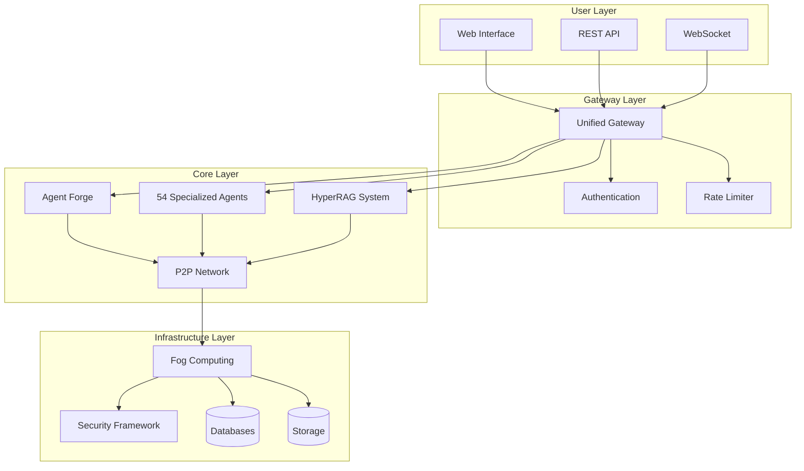
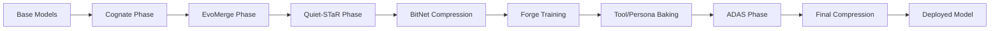
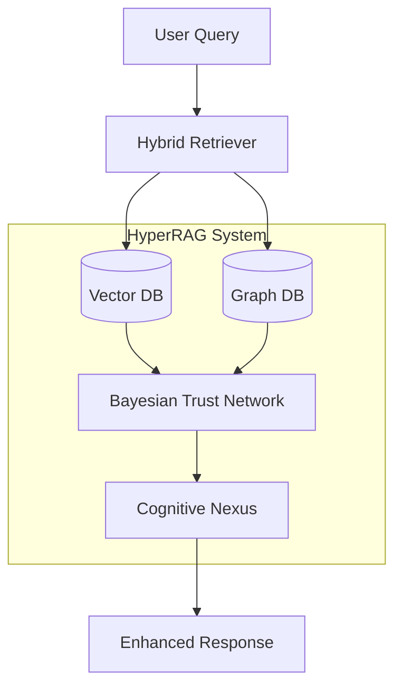
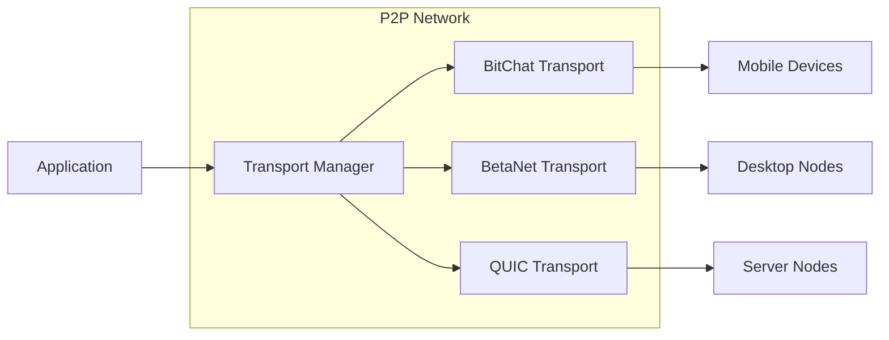
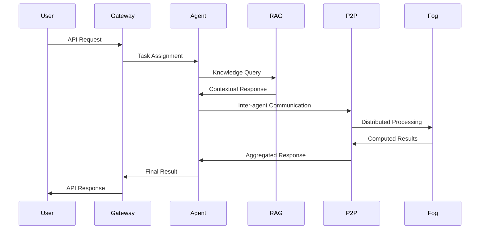
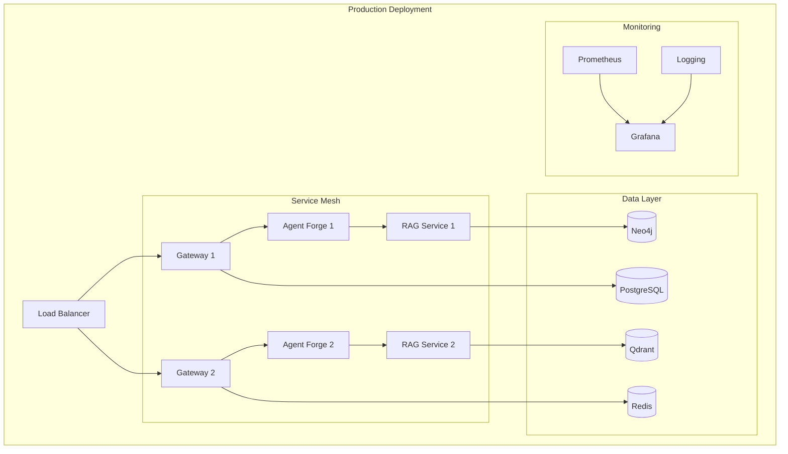

# AIVillage System Architecture

## Overview

AIVillage is a comprehensive distributed multi-agent AI platform that implements a constitutional fog computing infrastructure with machine-only moderation, democratic governance, and privacy-preserving compliance. The system is built using a modular Python architecture with clean separation of concerns.

## High-Level Architecture

## Core Components

### 1. Agent Forge (7-Phase ML Pipeline)

A comprehensive system for creating, training, and deploying specialized AI agents using cutting-edge techniques.

**Location**: `core/agent_forge/`

**Architecture**:
- **Phase 1**: Cognate - Model creation and initialization
- **Phase 2**: EvoMerge - Evolutionary model optimization
- **Phase 3**: Quiet-STaR - Reasoning enhancement baking
- **Phase 4**: BitNet 1.58 - Initial compression
- **Phase 5**: Forge Training - Main training loop with Grokfast
- **Phase 6**: Tool & Persona Baking - Identity and capability baking
- **Phase 7**: ADAS - Architecture search with vector composition
- **Phase 8**: Final Compression - SeedLM + VPTQ + Hypercompression

**Key Features**:
- Unified pipeline orchestration
- Checkpoint/resume capability
- W&B integration for tracking
- Federated training across P2P network
- Fog compute integration

### 2. Specialized Agent System (54 Agents)

A comprehensive ecosystem of specialized AI agents organized by domain expertise.

**Location**: `core/agents/`

**Agent Categories**:
- **Governance**: King, Auditor, Legal, Shield, Sword (5 agents)
- **Infrastructure**: Coordinator, Gardener, Magi, Navigator, Sustainer (5 agents)
- **Knowledge**: Curator, Oracle, Sage, Shaman, Strategist (5 agents)
- **Culture**: Ensemble, Horticulturist, Maker (3 agents)
- **Economy**: Banker-Economist, Merchant (2 agents)
- **Language/Education/Health**: Medic, Polyglot, Tutor (3 agents)
- **Specialized**: Architect, Creative, DataScience, DevOps, Financial, Social, Tester, Translator (8+ agents)

**Agent Capabilities**:
- RAG system integration (read-only group memory)
- MCP tools framework
- Inter-agent communication channels
- Quiet-STaR reflection system
- Langroid-based personal memory
- ADAS self-modification
- Geometric self-awareness

### 3. HyperRAG Neural Memory System

Neural-biological architecture with 4x accuracy improvement over traditional RAG systems.

**Location**: `core/hyperrag/`

**Architecture Components**:
- **Hybrid Retrieval**: Vector + graph-based retrieval
- **Bayesian Trust Networks**: Probabilistic knowledge validation
- **Cognitive Nexus**: Neural-biological memory architecture
- **Distributed Knowledge**: Sharded across fog network
- **Privacy-Preserving**: On-device processing with selective sharing

### 4. P2P Networking Layer

Distributed communication infrastructure supporting multiple transport protocols.

**Location**: `infrastructure/p2p/`

**Transport Protocols**:
- **BitChat**: BLE mesh networking (7-hop mobile optimization)
- **BetaNet**: HTX v1.1 frame protocol
- **QUIC**: High-performance transport
- **Fallback Chain**: Automatic protocol selection

**Key Features**:
- Mobile-first design with battery awareness
- BitChat-preferred routing for mobile devices
- Real cryptography (AES-GCM, Ed25519, X25519)
- Intelligent transport selection
- Resource-aware policies

### 5. Constitutional Fog Computing Platform

Complete fog computing infrastructure with constitutional governance and machine-only moderation.

**Location**: `infrastructure/fog/`

**Constitutional Tiers**:
- **Bronze Tier**: 20% privacy, $0.50/H200-hour, machine-only moderation
- **Silver Tier**: 50% privacy, $0.75/H200-hour, hash-based verification
- **Gold Tier**: 80% privacy, $1.00/H200-hour, zero-knowledge proofs
- **Platinum Tier**: 95% privacy, $1.50/H200-hour, maximum privacy protection

**Core Components**:
- **Gateway**: RESTful API with job management and billing
- **Edge Infrastructure**: Device capability beacon and WASI runner
- **Security Policies**: Namespace isolation and compliance enforcement
- **Scheduler**: NSGA-II multi-objective optimization
- **Marketplace**: Spot/on-demand pricing with trust-based matching

### 6. Security Framework

Comprehensive security architecture with B+ rating.

**Location**: `infrastructure/security/`

**Security Components**:
- **Constitutional Moderation**: Machine-only with H0-H3 harm taxonomy
- **Multi-Layer Encryption**: AES-256-GCM, TLS 1.3, E2E encryption
- **TEE Integration**: Intel SGX, AMD SEV-SNP, ARM TrustZone
- **Compliance Automation**: GDPR, SOX, HIPAA, PCI-DSS
- **RBAC System**: Role-based access control with multi-tenant isolation

## Data Flow Architecture

## Deployment Architecture

### Development Environment
- **Local Development**: Single-node setup with all services
- **Docker Compose**: Multi-service development stack
- **Hot Reload**: Development server with live updates

### Production Environment
- **Microservices**: Distributed service architecture
- **Kubernetes**: Container orchestration
- **Load Balancing**: Multi-instance deployment
- **Monitoring**: Prometheus/Grafana integration
- **Security**: Production-grade security policies

## Technology Stack

### Backend
- **Python 3.9+**: Primary development language
- **FastAPI**: Web framework and API gateway
- **PyTorch**: ML/AI framework
- **Transformers**: Hugging Face models
- **SQLAlchemy**: Database ORM
- **Redis**: Caching and sessions
- **Neo4j**: Graph database for knowledge graphs
- **Qdrant**: Vector database for embeddings

### Infrastructure
- **Docker**: Containerization
- **Kubernetes**: Container orchestration
- **Helm**: Package management
- **Prometheus**: Metrics collection
- **Grafana**: Monitoring dashboard
- **GitHub Actions**: CI/CD pipeline

### Security
- **JWT**: Authentication tokens
- **OAuth2**: Authorization framework
- **AES-256-GCM**: Data encryption
- **TLS 1.3**: Transport security
- **Bandit**: Security scanning
- **Safety**: Dependency scanning

## Performance Characteristics

### Scalability
- **Horizontal**: Auto-scaling based on load
- **Vertical**: Resource optimization
- **Geographic**: Multi-region deployment
- **Edge Computing**: Fog node distribution

### Performance Metrics
- **API Latency**: <100ms for most endpoints
- **Throughput**: 1000+ concurrent requests
- **Availability**: 99.9% SLA (Gold tier)
- **Recovery**: <1 minute failover time

### Resource Requirements

#### Minimum (Development)
- **CPU**: 4 cores
- **Memory**: 8 GB RAM
- **Storage**: 50 GB SSD
- **GPU**: Optional (CUDA-compatible)

#### Recommended (Production)
- **CPU**: 16+ cores
- **Memory**: 32+ GB RAM
- **Storage**: 500+ GB SSD
- **GPU**: NVIDIA H100/A100 for ML workloads

## Security Architecture

### Defense in Depth
1. **Perimeter Security**: Firewall, DDoS protection
2. **Network Security**: VPN, network segmentation
3. **Application Security**: Input validation, OWASP compliance
4. **Data Security**: Encryption at rest and in transit
5. **Identity Security**: MFA, RBAC, principle of least privilege
6. **Monitoring**: SIEM, threat detection, audit logging

### Compliance
- **GDPR**: EU data protection regulation
- **SOX**: Financial reporting compliance
- **HIPAA**: Healthcare data protection
- **PCI-DSS**: Payment card security
- **SOC 2**: Security controls framework

## Future Roadmap

### Phase 1 (Q1 2025)
- Complete constitutional implementation
- Enhanced mobile optimization
- Advanced fog computing features

### Phase 2 (Q2 2025)
- Global deployment infrastructure
- Advanced AI capabilities
- Blockchain integration

### Phase 3 (Q3 2025)
- Quantum-resistant cryptography
- Advanced governance mechanisms
- Autonomous economic systems

---

*Last Updated: January 2025*
*Version: 3.0.0*
*Status: Production Ready*