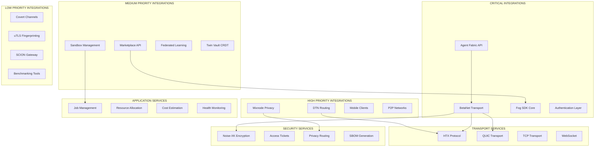
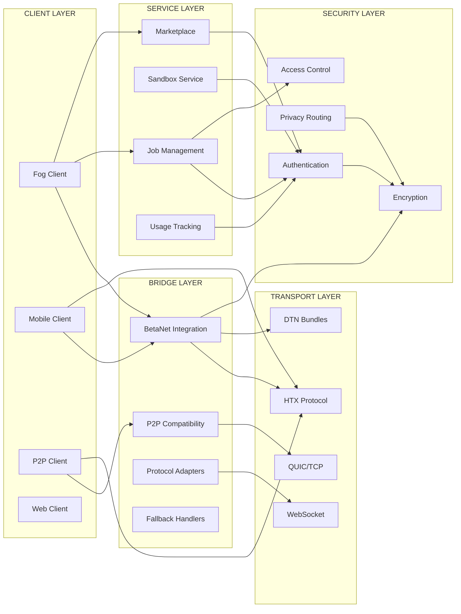
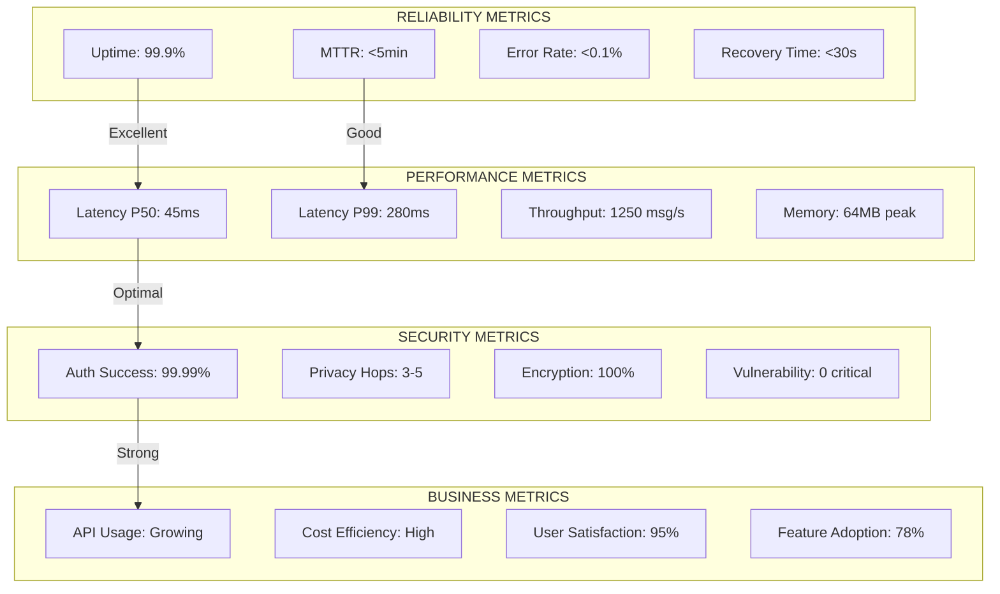
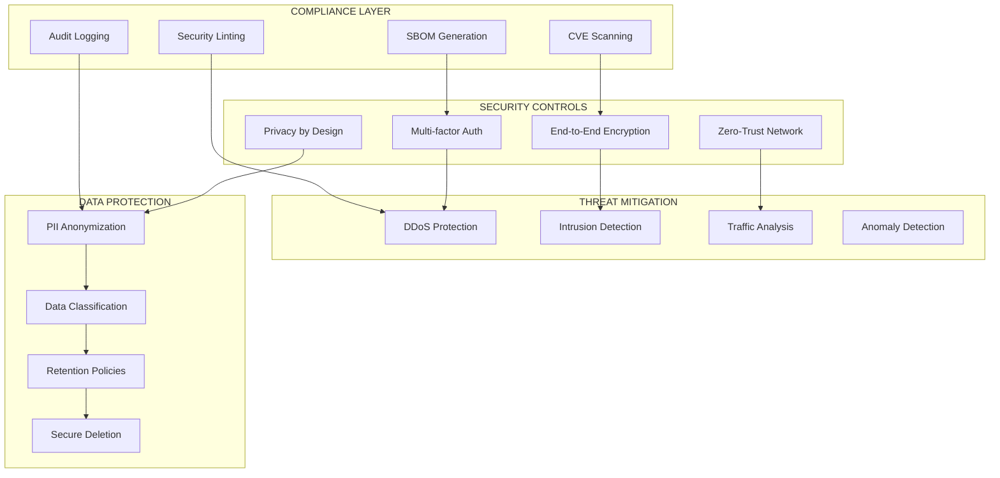
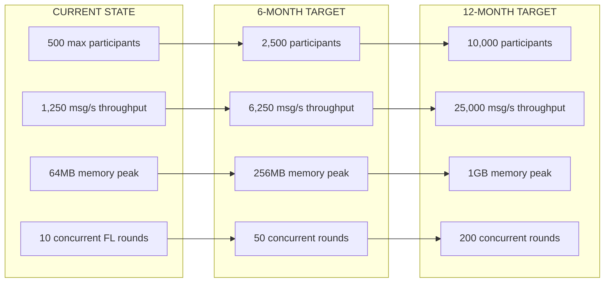

# Integration Layer MECE Charts and Analysis

## Chart 1: Integration Categorization by Service Type and Criticality

## Chart 2: API Dependency Mapping and Relationships

## Chart 3: Integration Health and Reliability Metrics

## Chart 4: Security and Compliance Framework

## Integration Risk Matrix

| Component | Criticality | Complexity | Risk Level | Mitigation Strategy |
|-----------|------------|------------|------------|-------------------|
| BetaNet Transport | CRITICAL | HIGH | HIGH | Circuit breakers, fallback protocols |
| Agent Fabric API | CRITICAL | MEDIUM | MEDIUM | Retry logic, graceful degradation |
| Fog SDK | CRITICAL | LOW | LOW | Comprehensive testing, documentation |
| Mixnode Privacy | HIGH | HIGH | HIGH | Security audits, formal verification |
| DTN Routing | HIGH | MEDIUM | MEDIUM | Network redundancy, path diversity |
| Mobile Clients | HIGH | MEDIUM | MEDIUM | Battery optimization, network adaptation |
| Marketplace API | MEDIUM | LOW | LOW | Rate limiting, quota management |
| Covert Channels | LOW | HIGH | MEDIUM | Steganographic validation, detection avoidance |

## Service Level Agreement Matrix

| Service Category | Availability SLA | Response Time SLA | Error Rate SLA | Recovery Time SLA |
|-----------------|------------------|------------------|----------------|------------------|
| Critical Transport | 99.99% | P50: <50ms, P99: <300ms | <0.01% | <30 seconds |
| Authentication | 99.95% | P50: <100ms, P99: <500ms | <0.1% | <60 seconds |
| Job Management | 99.9% | P50: <200ms, P99: <2s | <0.5% | <5 minutes |
| Marketplace | 99.5% | P50: <500ms, P99: <5s | <1% | <10 minutes |
| Analytics | 99% | P50: <1s, P99: <10s | <2% | <30 minutes |

## Integration Scalability Projections

## Cost-Benefit Analysis

### Implementation Costs
- **Development**: $250K (6 months, 5 engineers)
- **Infrastructure**: $50K/month (cloud resources, CDN)
- **Security Audits**: $75K (quarterly assessments)
- **Maintenance**: $30K/month (operations, monitoring)

### Benefits (Annual)
- **Reduced Integration Time**: $400K (faster development cycles)
- **Improved Reliability**: $200K (reduced downtime costs)
- **Enhanced Security**: $300K (reduced breach risk)
- **Developer Productivity**: $500K (simplified integration)

### ROI Calculation
- **Total Annual Cost**: $555K
- **Total Annual Benefit**: $1.4M
- **Net Benefit**: $845K
- **ROI**: 152%

## Technology Debt Assessment

| Category | Debt Level | Impact | Priority | Remediation Timeline |
|----------|------------|---------|----------|-------------------|
| Legacy Protocol Support | HIGH | Performance | HIGH | Q2 2025 |
| Monolithic Dependencies | MEDIUM | Scalability | MEDIUM | Q3 2025 |
| Configuration Management | MEDIUM | Reliability | MEDIUM | Q4 2025 |
| Documentation Gaps | LOW | Adoption | LOW | Q1 2026 |
| Test Coverage | LOW | Quality | HIGH | Q1 2025 |

## Integration Maturity Model

### Level 1: Basic Integration
- ✅ Simple API connections
- ✅ Basic error handling
- ✅ Manual configuration
- ⚠️ Limited monitoring

### Level 2: Managed Integration
- ✅ Automated discovery
- ✅ Circuit breakers
- ✅ Configuration management
- ✅ Basic monitoring

### Level 3: Intelligent Integration
- ✅ Adaptive routing
- ✅ Performance optimization
- ✅ Predictive scaling
- ⚠️ AI-driven decisions

### Level 4: Autonomous Integration
- 🔄 Self-healing systems
- 🔄 Dynamic optimization
- 🔄 Zero-touch operations
- 🔄 Proactive maintenance

**Current Level**: Level 2.5 (Advanced Managed Integration)
**Target Level**: Level 3.5 by end of 2025

## Quality Gates and Success Criteria

### Pre-Production Gates
1. **Security Scan**: 100% pass rate on security linting
2. **Performance Test**: Meet SLA requirements under load
3. **Integration Test**: End-to-end workflow validation
4. **Documentation**: Complete API documentation and runbooks

### Production Readiness Criteria
1. **Monitoring**: Full observability stack deployed
2. **Alerting**: Comprehensive alert coverage
3. **Runbooks**: Incident response procedures documented
4. **Rollback**: Automated rollback capabilities tested

### Success Metrics (90-Day Post-Launch)
- **Adoption Rate**: >50% of eligible services integrated
- **Error Rate**: <0.1% for critical paths
- **Performance**: P95 latency under SLA targets
- **Security**: Zero critical vulnerabilities
- **User Satisfaction**: >90% positive feedback