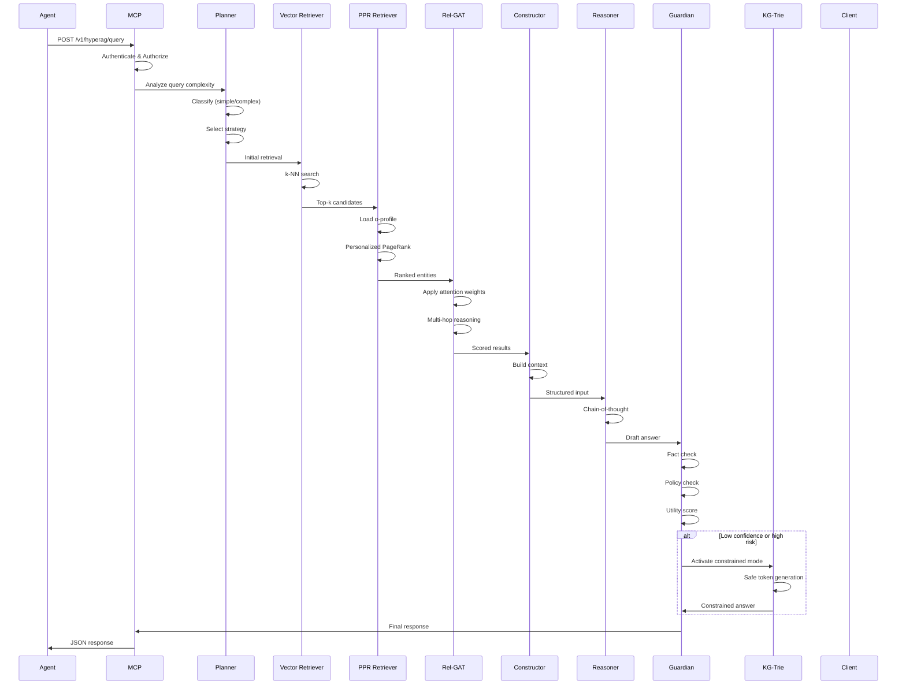
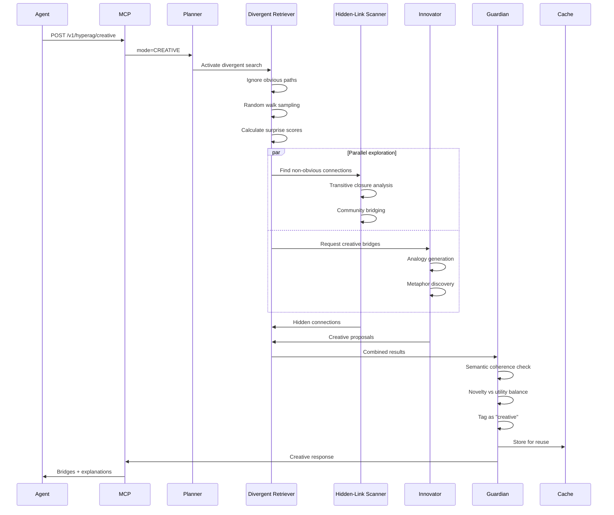
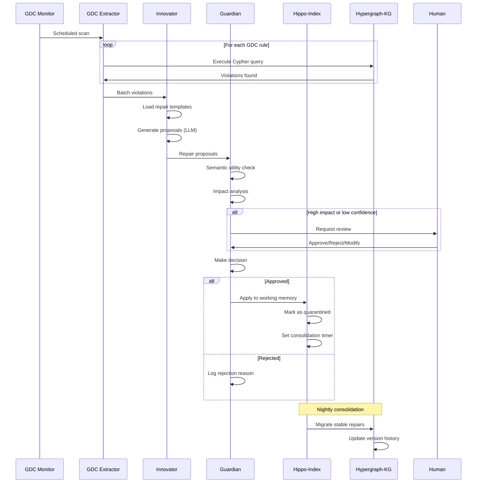
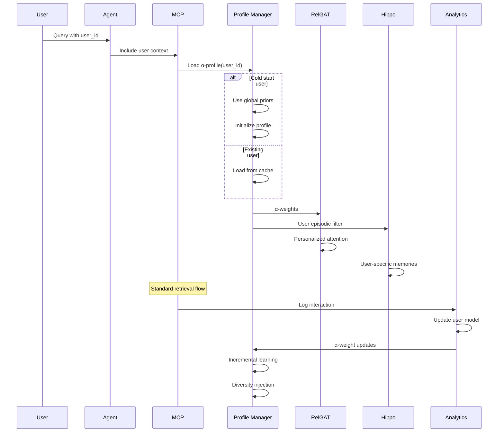
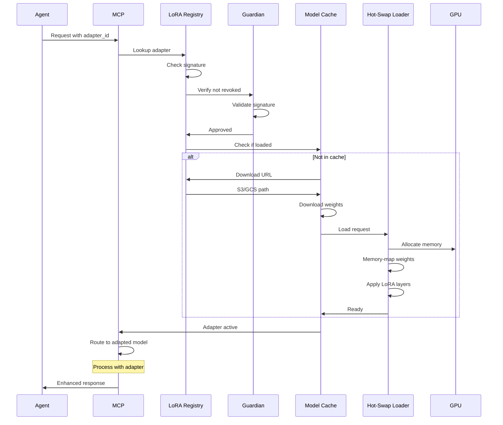
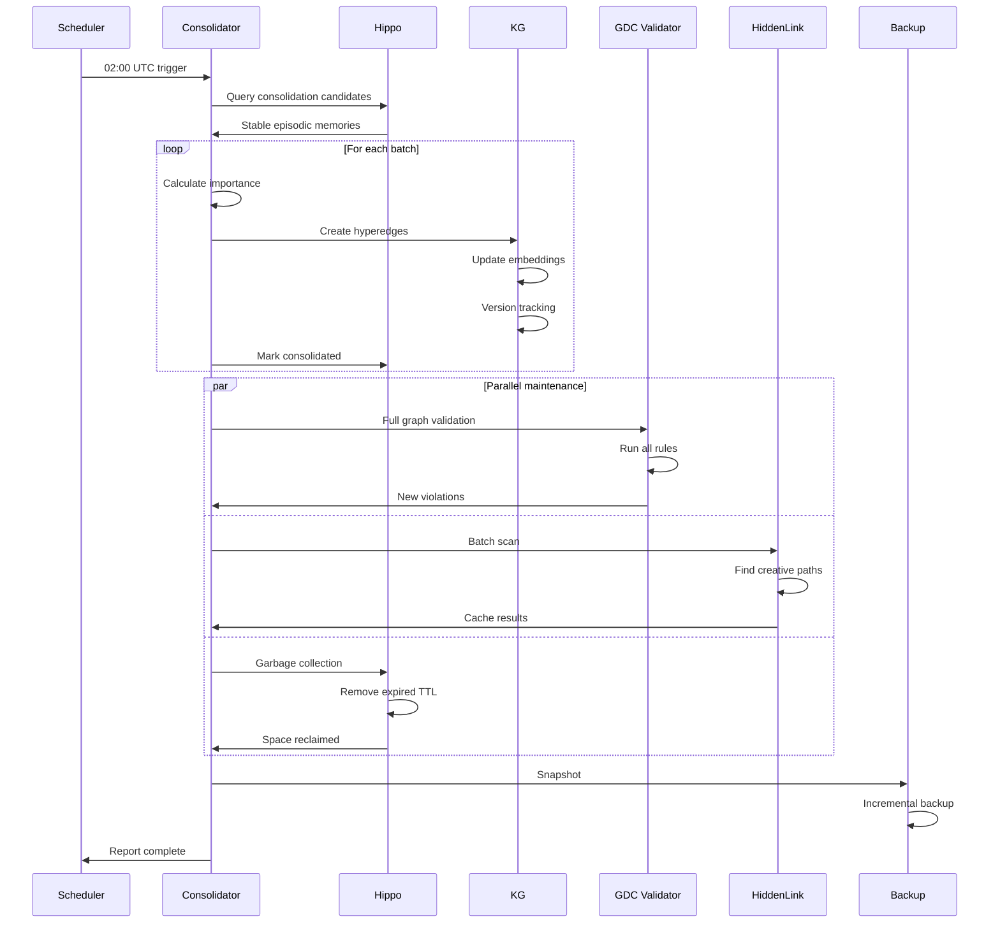

# HypeRAG Integration Flows

## 5. Integration Flow Specifications

### 5.1 Standard Query Flow

The standard query flow represents the typical path for non-creative queries.



### 5.2 Creativity Mode Flow

Creative queries follow a divergent path with additional validation.



### 5.3 Repair Cycle Flow

Automated graph repair workflow with human-in-the-loop option.



### 5.4 Personalization Flow

Digital Twin integration with α-profile management.



### 5.5 Adapter Loading Flow

Hot-swapping domain and user adapters.



### 5.6 Nightly Consolidation Flow

Batch process for memory consolidation and maintenance.



## Integration Patterns

### Event-Driven Architecture

```yaml
Events:
  QueryReceived:
    - Log to audit trail
    - Update metrics
    - Start trace

  RetrievalComplete:
    - Cache results
    - Update user profile
    - Trigger reasoning

  GuardianDecision:
    - Log decision
    - Update policy stats
    - Notify watchers

  RepairApplied:
    - Version graph
    - Notify agents
    - Schedule validation

  AdapterLoaded:
    - Warm cache
    - Update routing
    - Log usage
```

### Circuit Breaker Pattern

```yaml
CircuitBreakers:
  DivergentRetriever:
    failure_threshold: 5
    timeout: 5s
    half_open_tests: 3

  ExternalFactChecker:
    failure_threshold: 3
    timeout: 3s
    fallback: use_cached

  GuardianGate:
    failure_threshold: 10
    timeout: 10s
    fallback: conservative_mode
```

### Saga Pattern for Multi-Step Operations

```yaml
RepairSaga:
  steps:
    - name: DetectViolation
      compensate: LogSkipped

    - name: GenerateProposal
      compensate: DiscardProposal

    - name: ValidateProposal
      compensate: RejectProposal

    - name: ApplyToHippo
      compensate: RollbackHippo

    - name: ScheduleConsolidation
      compensate: CancelSchedule
```

## Performance Optimizations

### Caching Strategy

```yaml
CacheLayers:
  L1_Redis:
    - Query results (TTL: 1h)
    - User profiles (TTL: 24h)
    - Adapter metadata (TTL: 7d)

  L2_DuckDB:
    - Materialized PPR scores
    - Precomputed embeddings
    - Aggregate statistics

  L3_CDN:
    - Static adapters
    - Common responses
    - Documentation
```

### Batch Processing

```yaml
BatchQueues:
  RepairQueue:
    max_batch_size: 100
    max_wait_time: 5s
    processing_interval: 1m

  EmbeddingQueue:
    max_batch_size: 512
    max_wait_time: 100ms
    gpu_optimized: true

  ConsolidationQueue:
    max_batch_size: 10000
    processing_time: "02:00-04:00 UTC"
```

### Connection Pooling

```yaml
ConnectionPools:
  Neo4j:
    min_connections: 10
    max_connections: 100
    acquisition_timeout: 5s

  Redis:
    min_connections: 20
    max_connections: 200

  DuckDB:
    connection_mode: multi-threaded
    memory_limit: "8GB"
```

## Monitoring and Observability

### Key Metrics

```yaml
Metrics:
  Latency:
    - query_total_ms
    - retrieval_depth_avg
    - guardian_decision_ms

  Throughput:
    - queries_per_second
    - repairs_per_hour
    - consolidations_per_day

  Quality:
    - confidence_avg
    - guardian_override_rate
    - creative_success_rate

  Resources:
    - memory_usage_gb
    - gpu_utilization_pct
    - cache_hit_rate
```

### Distributed Tracing

```yaml
TracePoints:
  - Request received
  - Auth completed
  - Planning finished
  - Each retrieval stage
  - Guardian decision
  - Response sent

TraceContext:
  - request_id
  - user_id
  - agent_id
  - mode
  - confidence
```

### Health Checks

```yaml
HealthEndpoints:
  /health/live:
    - Basic connectivity

  /health/ready:
    - All components initialized
    - Minimum cache warm

  /health/startup:
    - Detailed component status
    - Resource availability
    - Dependency checks
```
