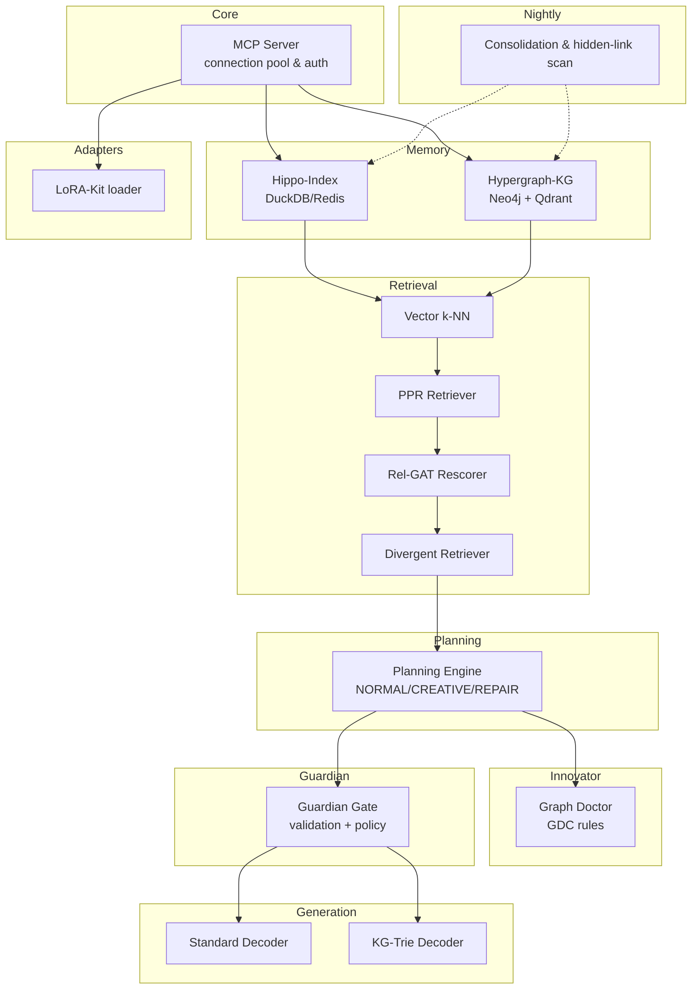

# HypeRAG MCP Server Architecture

The HypeRAG MCP server provides a shared retrieval and planning service for all agents. It wraps the dual-memory system and exposes a single entry point through the existing Model Context Protocol (MCP). The design emphasises creativity, repair, personalisation and safety.

## Overview Diagram


```

## Components

### MCP Core
- Connection handling with YAML-driven permissions (`READ`, `WRITE`)
- Registry for model injection so agents can supply their reasoning models

### Memory Layer
- **Hippo-Index:** fast DuckDB storage backed by optional Redis TTL cache
- **Hypergraph-KG:** Bayesian property graph in Neo4j with Qdrant embeddings

### Retrieval Stack
1. `VectorRetriever` performs k-NN search
2. `PPRRetriever` ranks results via Personalised PageRank
3. `Rel-GAT Rescorer` applies α-weights from user profiles
4. `DivergentRetriever` explores surprising links for creativity or repair

### Planning Engine
- Complexity classifier selects strategy
- Supports `plan.mode` of `NORMAL`, `CREATIVE`, or `REPAIR`
- Re-plans when confidence falls below threshold

### Innovator Agent (Graph Doctor)
- Encodes graph templates and proposes repairs for GDC violations
- Adds divergent bridges when repair mode is active

### Guardian Gate
- Validates all updates against policies and external fact hooks
- Performs semantic-utility scoring and decides to apply, quarantine, or reject
- Signs LoRA adapters; triggers KG-Trie decoding when risk is high

### Generation Layer
- Standard decoder for normal answers
- KG-Trie constrained decoder as a safety fallback

### LoRA-Kit
- Handles adapter training pipeline and maintains a signed registry
- Loads domain and user adapters per agent request

## Interaction Flow
1. Agent submits a query with an optional `plan.mode`
2. Planner coordinates retrieval through the stack (Vector → PPR → Rel-GAT → Divergent)
3. Reasoner composes an answer; Guardian validates
4. If risk detected, KG-Trie decoder constrains output
5. Nightly jobs consolidate new edges and run hidden-link scans

## Nightly Consolidation & Hidden-Link Scan
- Batch process merges quarantined updates into the live graph when approved
- Hidden links are scanned and flagged for Guardian review
