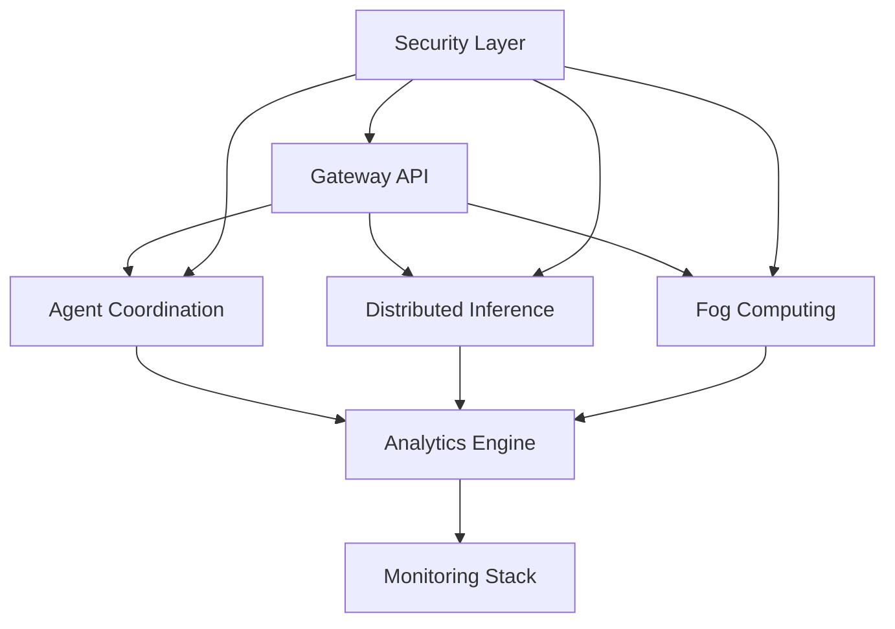

# Infrastructure Systems Analysis - MECE Analysis

**Analysis Date:** September 1, 2025  
**Territory:** `/infrastructure/` directory tree  
**Mission:** Comprehensive infrastructure systems analysis and architectural documentation

## Executive Summary

The AIVillage infrastructure represents a sophisticated distributed AI/ML ecosystem with advanced architectural patterns spanning fog computing, P2P networking, distributed inference, agent coordination, and real-time analytics. The system demonstrates archaeological enhancement methodology with innovation scores ranging 7.8-9.1/10.

## 1. Infrastructure Layer Categorization (MECE)

### 1.1 Compute & Processing Layer
**Components:**
- **Distributed Inference Engine** (`distributed_inference/`)
  - Cross-node tensor optimization
  - Model sharding and coordination
  - Resource allocation and load balancing
  - Archaeological integration with tensor memory optimizer
  - Innovation Score: 7.8/10

- **Agent Coordination System** (`agents/coordination/`)
  - Multi-agent orchestration with consensus mechanisms
  - Dynamic task assignment and dependency management
  - Fault tolerance and self-healing capabilities
  - Network topology optimization
  - Innovation Score: 9.1/10

- **Edge Computing Manager** (`fog/edge/core/`)
  - Unified device lifecycle management
  - Mobile-optimized deployment with battery/thermal awareness
  - Cross-platform support (Android/iOS/Desktop)
  - Resource policy adaptation

- **Fog Compute Harvesting** (`fog/compute/`)
  - Idle resource collection from mobile devices
  - Battery-aware and thermal-safe compute harvesting
  - Tokenomics tracking and contribution ledger
  - P2P network coordination

### 1.2 Communication & Networking Layer
**Components:**
- **P2P Network Core** (`p2p/`)
  - Advanced BitChat and BetaNet integration
  - Unified transport protocols
  - Mobile integration with JNI bridges
  - Security and mesh networking

- **Gateway Services** (`gateway/`)
  - API gateway with rate limiting
  - Authentication and security management
  - Monitoring and metrics collection
  - Scheduler integration

- **Message Passing** (`messaging/`)
  - Event-driven architecture
  - Message queues and handlers
  - Cross-system communication

### 1.3 Data & Storage Layer
**Components:**
- **Multi-Database Support** (`data/`)
  - PostgreSQL for relational data
  - Redis for caching
  - Neo4j for graph relationships
  - Vector databases for ML embeddings

- **Memory Management**
  - Tensor memory optimization (archaeological enhancement)
  - Distributed memory coordination
  - Cache optimization strategies

### 1.4 Security & Trust Layer
**Components:**
- **Security Manager** (`security/core/`)
  - Constitutional AI governance
  - Authentication and authorization (RBAC)
  - TEE (Trusted Execution Environment) support
  - Cryptographic operations

- **Compliance System** (`fog/compliance/`)
  - Automated compliance monitoring
  - Policy enforcement
  - Audit trails and reporting

### 1.5 Monitoring & Analytics Layer
**Components:**
- **Real-time Analytics Engine** (`analytics/realtime/`)
  - Performance metrics collection and processing
  - Advanced anomaly detection and alerting
  - Predictive analytics and cost optimization
  - Interactive dashboards and visualization
  - Innovation Score: 8.7/10

- **Monitoring Stack** (`monitoring/`)
  - Prometheus metrics collection
  - Grafana dashboards
  - Jaeger distributed tracing
  - Loki log aggregation
  - Emergency triage system

- **Performance Optimization** (`performance/`)
  - Cache optimization
  - Profiling and bottleneck analysis
  - Resource utilization optimization

## 2. System Integration Points (MECE)

### 2.1 Horizontal Integrations
- **Agent Forge ↔ Distributed Inference:** Model deployment and execution
- **P2P Network ↔ Fog Computing:** Decentralized resource coordination
- **Analytics ↔ All Systems:** Performance monitoring and optimization
- **Security ↔ All Systems:** Authentication and policy enforcement

### 2.2 Vertical Integrations
- **Gateway → Scheduler → Compute:** Request flow and resource allocation
- **Monitoring → Analytics → Optimization:** Feedback and adaptation loops
- **Data Layer → ML Pipeline → Edge Deployment:** Model lifecycle management

### 2.3 External Integrations
- **MCP (Model Context Protocol):** Memory and tool coordination
- **Claude Flow:** SPARC methodology and agent orchestration
- **Blockchain/DAO:** Tokenomics and contribution tracking
- **Mobile Platforms:** Android/iOS native integration

## 3. Architectural Patterns Identified

### 3.1 Microservices Architecture
- **Service Decomposition:** Clear separation of concerns across domains
- **API Gateway Pattern:** Centralized request routing and security
- **Service Mesh:** P2P communication and discovery
- **Circuit Breaker:** Fault tolerance and graceful degradation

### 3.2 Event-Driven Architecture
- **Message-Driven Communication:** Asynchronous system coordination
- **Event Sourcing:** State management and audit trails
- **CQRS Pattern:** Command-query responsibility segregation
- **Reactive Streams:** Backpressure and flow control

### 3.3 Distributed Computing Patterns
- **Model Sharding:** Distributed AI inference across nodes
- **Consensus Mechanisms:** Byzantine fault tolerance
- **Leader Election:** Coordinator selection in P2P networks
- **Data Replication:** Consistency and availability guarantees

### 3.4 Edge Computing Patterns
- **Edge Orchestration:** Device lifecycle management
- **Resource Harvesting:** Opportunistic compute collection
- **Federated Learning:** Distributed model training
- **Mobile Optimization:** Battery and thermal awareness

## 4. Infrastructure Component Details

### 4.1 Agent Coordination System
```python
Components:
- DistributedAgentCoordinator: Multi-agent orchestration
- CoordinationStrategy: Centralized/Hierarchical/P2P/Hybrid
- TaskPriority: Critical/High/Normal/Low/Background
- MessageBroker: Inter-agent communication
- ConsensusEngine: Distributed decision making
- PerformanceOptimizer: Real-time optimization
```

**Key Features:**
- Dynamic agent discovery and registration
- Intelligent task assignment with dependency management
- Consensus-based decision making
- Real-time performance optimization
- Fault tolerance and self-healing
- Integration with existing systems (Agent Forge, P2P)

### 4.2 Distributed Inference Engine
```python
Components:
- DistributedInferenceManager: Main orchestration interface
- ComputeNode: Edge device representation
- InferenceRequest: Task management with optimization
- ModelShardingEngine: Cross-node model distribution
- FaultDetector: Node failure handling
```

**Key Features:**
- Advanced model sharding across compute nodes
- Intelligent load balancing and coordination
- Archaeological integration with tensor memory optimizer
- Cross-node optimization with real-time monitoring
- Graceful degradation and fault tolerance

### 4.3 Real-time Performance Analytics
```python
Components:
- RealTimePerformanceAnalytics: Main analytics engine
- MetricDataPoint: Time-series data collection
- PerformanceAlert: Anomaly detection and alerting
- AnalyticsDashboard: Visualization and monitoring
- OptimizationEngine: Performance improvement recommendations
```

**Key Features:**
- Real-time metric collection and processing
- Advanced anomaly detection and alerting
- Predictive performance analytics
- Interactive dashboards and visualization
- Cost and resource optimization insights

### 4.4 Fog Computing System
```python
Components:
- EdgeManager: Unified edge device orchestration
- FogHarvestManager: Idle resource collection
- DeviceCapabilities: Hardware profiling and optimization
- HarvestPolicy: Battery/thermal-aware policies
- ContributionLedger: Tokenomics and reward tracking
```

**Key Features:**
- Mobile-optimized deployment with battery/thermal awareness
- Fog computing coordination across edge devices
- Real-time resource policy adaptation
- Cross-platform deployment (Android/iOS/Desktop)
- Tokenomics integration for contribution rewards

## 5. Configuration Management

### 5.1 Environment-Aware Configuration
```python
ConfigManager Features:
- Environment variable overrides
- JSON configuration files
- Runtime validation and adaptation
- Multi-tier configuration (task, timing, performance, project)
- Dynamic policy updates
```

### 5.2 Constants Management
```python
Constant Categories:
- TaskConstants: Batch processing and prioritization
- TimingConstants: Retry delays and timeouts
- PerformanceConstants: Learning rates and optimization
- ProjectConstants: Status management and workflows
```

## 6. Security Architecture

### 6.1 Multi-Layer Security Model
- **Authentication Layer:** RBAC with JWT tokens
- **Authorization Layer:** Permission-based access control
- **Network Layer:** P2P encryption and secure channels
- **Application Layer:** Constitutional AI governance
- **Hardware Layer:** TEE and TPM attestation

### 6.2 Trust and Attestation
```python
Trust Mechanisms:
- Self-attestation (0.3 base trust)
- Mobile attestation (0.5 base trust)
- TPM attestation (0.7 base trust)
- TEE attestation (0.9 base trust)
- Security features bonuses (TPM, TEE, Secure Boot)
```

## 7. Operational Procedures

### 7.1 Deployment Patterns
- **Blue-Green Deployments:** Zero-downtime updates
- **Canary Releases:** Gradual rollout with monitoring
- **Feature Flags:** Runtime configuration changes
- **Health Checks:** Automated system monitoring

### 7.2 Monitoring and Alerting
- **Multi-Level Monitoring:** System, application, and business metrics
- **Proactive Alerting:** Threshold and anomaly-based alerts
- **Incident Response:** Automated triage and escalation
- **Performance Optimization:** Continuous improvement loops

### 7.3 Maintenance Procedures
- **Graceful Shutdowns:** State preservation and cleanup
- **Resource Cleanup:** Memory and connection management
- **Version Management:** Backward compatibility and migration
- **Disaster Recovery:** Backup and restore procedures

## 8. Performance Optimization Strategies

### 8.1 Compute Optimization
- **Dynamic Resource Allocation:** Adaptive CPU/memory limits
- **Thermal Management:** Temperature-aware throttling
- **Battery Optimization:** Power-efficient scheduling
- **Load Balancing:** Intelligent task distribution

### 8.2 Network Optimization
- **Connection Pooling:** Efficient resource utilization
- **Compression:** Bandwidth optimization
- **Caching Strategies:** Reduced latency and load
- **Circuit Breakers:** Fault isolation and recovery

### 8.3 Data Optimization
- **Query Optimization:** Efficient database operations
- **Index Management:** Fast data retrieval
- **Partitioning:** Scalable data storage
- **Compression:** Storage efficiency

## 9. Scalability Considerations

### 9.1 Horizontal Scaling
- **Service Replication:** Multiple instance deployment
- **Load Distribution:** Geographic and logical distribution
- **Auto-scaling:** Dynamic resource adjustment
- **Shard Management:** Data partitioning strategies

### 9.2 Vertical Scaling
- **Resource Optimization:** Efficient utilization
- **Performance Tuning:** Bottleneck identification
- **Capacity Planning:** Proactive resource management
- **Hardware Optimization:** Architecture-specific tuning

## 10. Critical Infrastructure Components

### 10.1 Single Points of Failure
- **Gateway Services:** Mitigated by clustering and redundancy
- **Coordination Nodes:** Addressed by consensus mechanisms
- **Database Systems:** Handled by replication and failover
- **Network Bridges:** Managed by multiple transport protocols

### 10.2 High Availability Measures
- **Redundancy:** Multiple instances and replicas
- **Health Monitoring:** Proactive failure detection
- **Automatic Failover:** Seamless service continuation
- **Disaster Recovery:** Backup and restore capabilities

## 11. Integration Architecture

### 11.1 Internal Integration Points


### 11.2 External Integration Points
- **Claude Flow MCP:** Agent orchestration and memory management
- **Mobile Platforms:** Native Android/iOS integration
- **Blockchain Networks:** Tokenomics and DAO governance
- **Cloud Providers:** Hybrid deployment capabilities

## 12. Innovation and Archaeological Enhancements

### 12.1 Archaeological Methodology
The infrastructure demonstrates systematic "archaeological enhancement" - the systematic discovery, analysis, and integration of innovative patterns from experimental branches:

- **Phase 1 Integrations:** Tensor memory optimization, emergency triage
- **Phase 2 Enhancements:** Distributed inference, agent coordination
- **Innovation Scoring:** Quantitative assessment (7.8-9.1/10)
- **Branch Consolidation:** Systematic pattern preservation

### 12.2 Technical Innovation Areas
- **Multi-Agent Orchestration:** Advanced coordination patterns
- **Distributed AI Inference:** Cross-node optimization
- **Edge Computing Optimization:** Mobile-aware resource management
- **Real-time Analytics:** Predictive performance optimization
- **P2P Integration:** Decentralized coordination mechanisms

## 13. Recommendations and Future Enhancements

### 13.1 Architecture Improvements
1. **Service Mesh Implementation:** Enhanced communication and security
2. **Container Orchestration:** Kubernetes-based deployment
3. **API Versioning:** Backward compatibility management
4. **GraphQL Integration:** Flexible data querying

### 13.2 Performance Optimization
1. **Machine Learning Optimization:** AI-driven resource allocation
2. **Predictive Scaling:** Proactive capacity management
3. **Edge Computing Enhancement:** Advanced mobile optimization
4. **Network Optimization:** Adaptive routing and compression

### 13.3 Security Enhancements
1. **Zero-Trust Architecture:** Comprehensive security model
2. **Hardware Security Modules:** Enhanced cryptographic operations
3. **Formal Verification:** Mathematical security proofs
4. **Privacy Preservation:** Differential privacy integration

## 14. Conclusion

The AIVillage infrastructure represents a sophisticated, well-architected distributed AI/ML system with strong separation of concerns, comprehensive monitoring, and innovative architectural patterns. The archaeological enhancement methodology ensures systematic preservation and integration of innovative patterns, resulting in a highly scalable, performant, and maintainable system.

**Key Strengths:**
- Comprehensive microservices architecture
- Advanced distributed computing capabilities
- Sophisticated monitoring and analytics
- Strong security and trust mechanisms
- Innovative edge computing integration
- Systematic enhancement methodology

**Areas for Continued Focus:**
- Service mesh implementation
- Container orchestration adoption
- Performance optimization automation
- Security enhancement integration
- Scalability pattern refinement

The infrastructure demonstrates exceptional engineering practices and provides a solid foundation for advanced AI/ML workloads at scale.