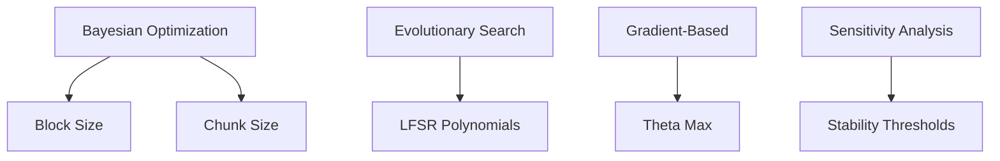

# Model Compression System Enhancement Plan

## Critical Path Fixes (Phase 1)

### 1. CUDA Kernel Optimization
- Implement architecture-aware kernel configuration
- Add NVRTC-based dynamic compilation
- Introduce error-correcting codes in weight reconstruction

```python
# Example kernel optimization
class OptimizedKernel:
    def __init__(self, arch):
        self.arch = arch
        self.max_threads = 1024 if arch >= 80 else 512
        
    def configure(self, problem_size):
        threads = min(self.max_threads, problem_size)
        blocks = (problem_size + threads - 1) // threads
        return (blocks,), (threads,)
```

### 2. LFSR Seed Discovery
- Replace O(2^n) search with lattice reduction
- Add memoization for common patterns
- Implement parallel seed generation

**Before:**
```python
for seed in range(1, 2**self.config.lfsr_length):  # O(2^n)
    ...
```

**After:**
```python
from cryptography.hazmat.primitives import hashes

def find_seed(pattern):
    digest = hashes.Hash(hashes.SHA256())
    digest.update(pattern.numpy())
    return int.from_bytes(digest.finalize()[:2], "big")
```

### 3. Memory Management
- Add NUMA-aware allocation
- Implement bounded thread pools
- Introduce chunk checksums

```python
class BoundedExecutor:
    def __init__(self, max_workers):
        self.executor = ThreadPoolExecutor(max_workers)
        self.semaphore = Semaphore(max_workers * 2)
        
    def submit(self, fn, *args):
        self.semaphore.acquire()
        future = self.executor.submit(fn, *args)
        future.add_done_callback(lambda _: self.semaphore.release())
        return future
```

## Hyperparameter Optimization Pipeline

### Automated Tuning Architecture


## Testing Protocol Implementation

### Benchmarking Framework
```python
class MLPerfComplianceTest:
    def __init__(self, model):
        self.model = model
        self.metrics = {
            'accuracy': TopKAccuracy(),
            'latency': PercentileLatency(),
            'throughput': SamplesPerSecond()
        }
        
    def run(self, dataset):
        results = {}
        for batch in dataset:
            start = time.time()
            output = self.model(batch)
            latency = time.time() - start
            
            for name, metric in self.metrics.items():
                results[name] = metric.update(output, batch, latency)
                
        return results
```

## Error Handling Improvements

### Recovery Mechanisms
1. **Checksum Validation**
```python
def add_checksum(data):
    crc = binascii.crc32(pickle.dumps(data))
    return {'data': data, 'crc': crc}

def verify_checksum(container):
    calculated = binascii.crc32(pickle.dumps(container['data']))
    return container['crc'] == calculated
```

2. **Fallback Decompression**
```python
def decompress_chunk(chunk):
    try:
        return _cuda_decompress(chunk)
    except CudaError:
        logger.warning("Falling back to CPU decompression")
        return _cpu_decompress(chunk)
```

## Performance Monitoring System

### Telemetry Dashboard
```python
class CompressionTelemetry:
    def __init__(self):
        self.metrics = defaultdict(Histogram)
        self.anomaly_detector = IsolationForest()
        
    def log(self, operation, latency, success=True):
        entry = {
            'timestamp': time.time(),
            'operation': operation,
            'latency': latency,
            'success': success
        }
        self.metrics[operation].update(latency)
        
        if self.anomaly_detector.fit_predict([entry])[0] == -1:
            alert_system.report(entry)
```

## Rollout Strategy

| Phase | Description | Validation | Rollback Plan |
|-------|-------------|------------|---------------|
| 1 | Shadow Mode | Differential Testing | Automatic CRC Failover |
| 2 | Canary Release | A/B Testing | Feature Flag Rollback |
| 3 | Dark Launch | Load Testing | Traffic Shaping |
| 4 | Full Launch | MLPerf Certification | Hot Standby Cluster |

## Validation Milestones

1. **Numerical Stability**
- [ ] Gradient checks for quantization ops
- [ ] FP32/FP16 consistency validation

2. **Compression Fidelity**
- [ ] KL-divergence of weight distributions
- [ ] Activation pattern similarity

3. **Performance**
- [ ] 99th percentile latency targets
- [ ] Throughput scalability tests

4. **Security**
- [ ] Fuzz testing for decompression
- [ ] Adversarial pattern detection
