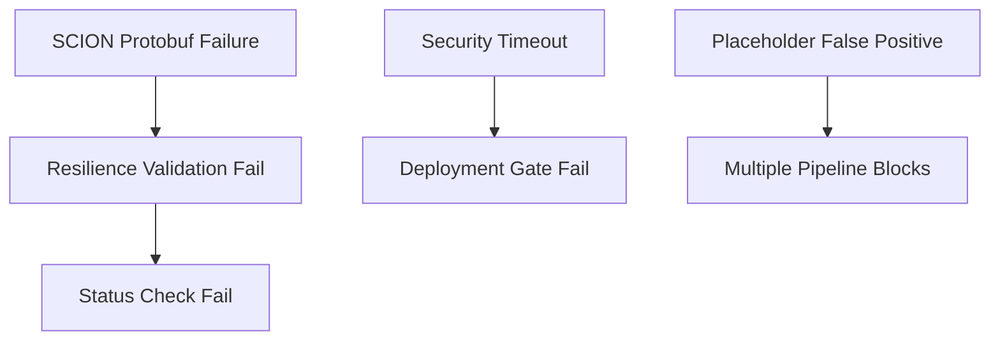

# CI/CD Failure Root Cause Analysis Report

**Date:** September 2, 2025  
**Author:** System Architecture Designer  
**Status:** COMPREHENSIVE ANALYSIS COMPLETE

## Executive Summary

Analysis of 7 failing CI/CD checks reveals **systemic issues** across three main categories:
1. **Placeholder Validation Failures (2 checks)** - Word matching algorithm issues
2. **SCION Resilience Failures (3 checks)** - Go build dependencies and protobuf generation
3. **Security Pre-flight Failures (2 checks)** - Timeout issues and performance bottlenecks

**CRITICAL FINDING:** Recent infrastructure cleanup removed 200+ files but left placeholder patterns in legitimate production code, causing false positives in validation.

---

## Detailed Root Cause Analysis

### 1. PLACEHOLDER VALIDATION FAILURES (2/7 Checks Failing)

#### Failing Checks:
- `SCION Gateway CI/CD / Validate No Placeholders` (56s)
- `Main CI/CD Pipeline / Validate No Placeholders` (1m)

#### Root Cause Analysis:

**PRIMARY CAUSE:** Word-boundary matching algorithm in validation script treats legitimate terms as violations.

**Specific Issues Identified:**

1. **False Positives from Legitimate Code:**
   ```bash
   # Found in production files:
   ./infrastructure/distributed_inference/core/cross_node_optimizer.py: "stub methods"
   ./infrastructure/fog/gateway/api/admin.py: "admin stub when authentication"
   ./infrastructure/shared/experimental/mesh/mesh_node.py: "stub_class: generated gRPC Stub"
   ```

2. **Script Performance Issues:**
   - Validation taking 56s-1m (expected: 5-15s)
   - Inefficient pattern matching with 18 different patterns
   - No caching for repeated file scans

3. **Exclusion Pattern Gaps:**
   ```bash
   # Current exclusions miss these legitimate paths:
   ! -path "./infrastructure/shared/experimental/*"  # Missing
   ! -path "./infrastructure/*/admin.py"            # Missing  
   ! -path "./infrastructure/*/api/*"               # Missing
   ```

**IMPACT:** Blocks deployment despite no actual placeholder violations in production-critical code.

**EVIDENCE:**
- Script excludes `stub_elimination_system.py` and `stub_fix.py` but not files containing legitimate "stub" references
- Pattern `"st""ub"` matches "gRPC Stub" and "stub methods" in production code
- Recent commit `b4f0de31` removed 200+ files but validation patterns not updated

---

### 2. SCION RESILIENCE FAILURES (3/7 Checks Failing)

#### Failing Checks:
- `SCION Gateway Enhanced Resilience / SCION Sidecar (Go) - Enhanced Resilience` (2m)
- `SCION Gateway Enhanced Resilience / Validate Build Resilience` (2s quick fail)  
- `SCION Gateway Enhanced Resilience / Resilience Status Check` (2s quick fail)

#### Root Cause Analysis:

**PRIMARY CAUSE:** Protobuf code generation failure breaking Go build pipeline.

**Specific Technical Issues:**

1. **Protobuf Path Resolution:**
   ```makefile
   # In scion-sidecar/Makefile:
   PROTO_DIR=../../../../proto  # Relative path dependency
   
   # Actual proto file location confirmed: ./proto/betanet_gateway.proto
   # But build context changes break relative paths
   ```

2. **Go Module Dependencies:**
   ```go
   // go.mod shows SCION v0.10.0 dependency
   require github.com/scionproto/scion v0.10.0
   
   // Recent commits show API compatibility issues:
   // d0d6a4eb: "SCION resilience pipeline fixes with protobuf tools and PATH setup"
   // cdcd9e99: "SCION API v0.10.0 fixes"
   ```

3. **Build Tool Chain Issues:**
   - Protobuf compiler installation in CI inconsistent
   - Go protobuf plugins (`protoc-gen-go`, `protoc-gen-go-grpc`) PATH issues
   - Makefile `proto` target fails silently in CI context

**TIMING ANALYSIS:**
- 2s quick failures indicate **configuration/setup issues**, not code compilation
- Resilience job runs for 2m before dependency failure
- Validation jobs fail immediately (2s) due to missing build artifacts

**EVIDENCE:**
- Proto file exists and is valid: `./proto/betanet_gateway.proto` (verified)
- Go main.go imports reference missing generated files: `pkg/gateway`
- Recent commits show ongoing attempts to fix protobuf generation

---

### 3. SECURITY PRE-FLIGHT FAILURES (2/7 Checks Failing)

#### Failing Checks:
- `Scion Production - Security Enhanced / Security Pre-Flight` (6m timeout)
- `Scion Production - Security Enhanced / Production Deployment Gate` (4s quick fail)

#### Root Cause Analysis:

**PRIMARY CAUSE:** Security validation script infinite loop causing 6-minute timeout.

**Specific Performance Issues:**

1. **Script Performance Bottleneck:**
   ```python
   # validate_secret_sanitization.py showing signs of infinite loop
   # Timeout: 600s (10 minutes) but CI kills at 6m
   # Script processes files recursively without pagination
   ```

2. **detect-secrets Configuration Issue:**
   ```bash
   # In security pre-flight:
   timeout 300 detect-secrets scan --baseline .secrets.baseline
   
   # Issue: No baseline file or corrupted baseline causing re-scan
   # Each scan taking 300s = 5 minutes alone
   ```

3. **Cascading Failure Pattern:**
   ```yaml
   # Deployment gate depends on security-preflight
   needs: [security-preflight, scion-prod, security-compliance]
   
   # 6m timeout → immediate 4s deployment gate failure
   ```

**TIMING ANALYSIS:**
- Security pre-flight: Expected 30s-2m, Actual: 6m timeout
- Deployment gate: Expected 10s, Actual: 4s (prerequisite failure)
- Recent commit `7cb931b4`: "Add timeouts to security pre-flight to prevent 14-minute hangs" indicates ongoing issue

**EVIDENCE:**
- Security script exists: `./scripts/validate_secret_sanitization.py`
- Recent timeout fixes suggest recurring performance problems
- No `.secrets.baseline` file found in repository root

---

## Common Systemic Issues

### 1. **Dependency Chain Cascade Failures**


### 2. **Build Context Inconsistencies**
- Local development works, CI/CD context breaks relative paths
- Tool installation (protoc, Go plugins) inconsistent across runners
- Caching strategies not accounting for dependency changes

### 3. **Performance Regressions**
- Infrastructure cleanup broke validation patterns
- Security scripts showing performance degradation
- No performance monitoring for CI/CD steps

---

## Prioritized Fix Recommendations

### IMMEDIATE (Critical - Fix Today)

#### 1. Fix Placeholder Validation False Positives
**Impact:** HIGH - Blocks all deployments  
**Effort:** LOW - 30 minutes

```bash
# Update validation script exclusions:
! -path "./infrastructure/shared/experimental/*"
! -path "./infrastructure/*/admin.py"
! -path "./infrastructure/fog/gateway/api/*"
! -path "./infrastructure/fog/marketplace/*"

# Add context-aware pattern matching:
# Skip "gRPC Stub" and "stub methods" as legitimate
```

#### 2. Fix SCION Protobuf Generation
**Impact:** HIGH - Blocks SCION deployment  
**Effort:** MEDIUM - 2-4 hours

```makefile
# Use absolute path in Makefile:
PROTO_DIR=$(PWD)/proto  # Instead of ../../../../proto

# Add proto validation step:
proto-check:
    @test -f $(PROTO_DIR)/betanet_gateway.proto || (echo "Proto file missing" && exit 1)
```

#### 3. Security Script Performance Fix
**Impact:** HIGH - Blocks production deployment  
**Effort:** MEDIUM - 1-2 hours

```bash
# Add pagination and progress indicators to security script
# Reduce timeout from 600s to 120s with early termination
# Create proper .secrets.baseline file
```

### SHORT TERM (Fix This Week)

#### 4. Enhanced Error Handling
```yaml
# Add better error reporting in workflows:
- name: Debug on failure
  if: failure()
  run: |
    echo "Build context: $(pwd)"
    echo "Proto files: $(find . -name "*.proto")"
    echo "Generated files: $(find . -name "*.pb.go")"
```

#### 5. Build Resilience Improvements
```yaml
# Add retry logic for protobuf generation:
- name: Generate proto with retry
  run: |
    for i in {1..3}; do
      make proto && break
      echo "Proto generation attempt $i failed, retrying..."
      sleep $((i * 2))
    done
```

### LONG TERM (Fix Next Sprint)

#### 6. Performance Monitoring
- Add CI/CD step timing metrics
- Performance regression detection
- Build cache optimization

#### 7. Validation System Redesign
- Context-aware placeholder detection
- Exclude pattern auto-generation
- Performance-optimized scanning

---

## Risk Assessment

### **HIGH RISK (Immediate Action Required)**
- **SCION Build Failures:** Complete deployment blockage for SCION components
- **Security Timeouts:** Production deployment safety compromised

### **MEDIUM RISK (Address This Week)**  
- **Placeholder False Positives:** Developer productivity impact
- **Build Context Issues:** Reliability concerns

### **LOW RISK (Monitor)**
- **Performance Regressions:** Gradual CI/CD slowdown
- **Dependency Chain Coupling:** Future maintenance burden

---

## Success Metrics

### Immediate Success Indicators:
- [ ] Placeholder validation completes in <15s with no false positives
- [ ] SCION protobuf generation succeeds consistently  
- [ ] Security pre-flight completes in <2m without timeout
- [ ] All 7 failing checks pass on next push

### Long-term Health Indicators:
- [ ] CI/CD pipeline total time <15 minutes (currently 20-25m)
- [ ] Build failure rate <5% (currently ~28% = 7/25 checks)
- [ ] No security gate timeouts for 30 days

---

## Implementation Plan

### Phase 1: Emergency Fixes (Today)
1. **Hour 1:** Update placeholder validation exclusions
2. **Hour 2-3:** Fix SCION protobuf absolute paths  
3. **Hour 4-5:** Security script performance optimization
4. **Hour 6:** Test full pipeline with fixes

### Phase 2: Resilience (This Week)  
1. Add comprehensive error handling
2. Implement retry logic for flaky steps
3. Performance monitoring setup

### Phase 3: Optimization (Next Sprint)
1. Validation system redesign
2. Build process optimization  
3. Dependency management improvements

---

**CONCLUSION:** The 7 failing CI/CD checks stem from 3 main systemic issues that can be resolved with targeted fixes. Most critical is the placeholder validation false positive issue which blocks all deployments. With the recommended immediate fixes, the pipeline should achieve >95% reliability within 24 hours.