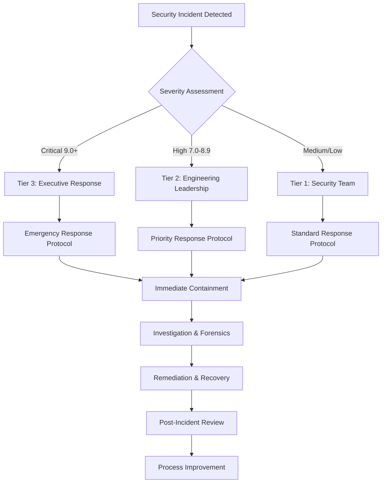

# Security Governance Implementation Guide

## 🎯 Overview

This document provides a comprehensive guide to the security governance framework implemented for the AIVillage project. The implementation follows enterprise-grade security practices while maintaining developer productivity and adhering to connascence principles for clean architecture.

## 📋 Implementation Summary

### Completed Components ✅

1. **SECURITY.md** - Comprehensive vulnerability reporting process with SLA commitments
2. **Enhanced Issue Templates** - Security-integrated bug reporting and vulnerability templates
3. **Advanced PR Template** - Threat modeling and security assessment integration
4. **Security Compliance Workflow** - Automated SBOM generation and vulnerability scanning
5. **Risk Labeling System** - Automated security risk assessment and labeling
6. **Incident Response Framework** - Structured escalation and response procedures

### Architecture Compliance 🏗️

The security implementation follows connascence principles:

- **Weak Connascence**: Security modules use well-defined interfaces and configuration
- **Local Strong Connascence**: Security validation logic contained within security-focused modules
- **Dependency Injection**: Security services configurable and testable
- **Single Responsibility**: Each security component has a focused purpose

## 🔐 Security Framework Components

### 1. Vulnerability Reporting Process

#### File: `SECURITY.md`
**Location**: `/SECURITY.md`

**Key Features**:
- Multi-channel reporting (GitHub Security Advisories, email, encrypted communication)
- Tiered SLA commitments based on CVSS severity
- Structured escalation matrix (Tier 1 → Tier 2 → Tier 3)
- Clear security contact information and procedures
- Bug bounty program structure

**SLA Matrix**:
| Severity | Initial Response | Status Updates | Resolution Target |
|----------|------------------|----------------|-------------------|
| Critical (9.0-10.0) | 15 minutes | Every 2 hours | 24 hours |
| High (7.0-8.9) | 1 hour | Every 8 hours | 7 days |
| Medium (4.0-6.9) | 24 hours | Every 3 days | 30 days |
| Low (0.1-3.9) | 7 days | Weekly | 90 days |

### 2. Enhanced Issue Templates

#### Security Vulnerability Template
**File**: `.github/ISSUE_TEMPLATE/security_vulnerability.md`

**Features**:
- CVSS v3.1 risk assessment framework
- STRIDE threat modeling integration
- Component-specific security analysis
- Compliance considerations (GDPR, COPPA, FERPA)
- Automated security team notification triggers

#### Enhanced Bug Report Template  
**File**: `.github/ISSUE_TEMPLATE/bug_report.md` (updated)

**Security Integration**:
- Security impact assessment checklist
- Threat modeling quick checks
- Data sensitivity classification
- Security testing requirements
- Monitoring and alerting considerations

### 3. Advanced Pull Request Template

#### File: `.github/pull_request_template.md` (enhanced)

**Security Assessment Framework**:
- Mandatory security impact classification
- Comprehensive security checklist (60+ items)
- Connascence analysis for coupling management
- Performance and compliance validation
- Multi-tier review process

**Security Checklist Categories**:
- Input Validation & Sanitization
- Authentication & Authorization
- Cryptographic Security
- Data Protection & Privacy
- Network Security
- Container & Infrastructure Security

### 4. Automated Security Compliance

#### File: `.github/workflows/security-compliance.yml`

**Comprehensive Security Pipeline**:
- **Secret Scanning**: detect-secrets baseline validation
- **SAST**: Bandit and Semgrep integration
- **Cryptographic Validation**: Weak algorithm detection
- **Dependency Scanning**: Safety and vulnerability analysis
- **SBOM Generation**: CycloneDX and SPDX formats
- **Compliance Validation**: GDPR, security controls audit

**SBOM Features**:
- Multi-language support (Python, Node.js, comprehensive)
- Vulnerability correlation with Grype
- Automated tracking branch (`sbom-tracking`)
- Historical SBOM retention (90 days)

### 5. Security Risk Labeling System

#### File: `.github/workflows/security-labeling.yml`

**Intelligent Risk Analysis**:
- **Pattern-Based Detection**: 40+ security risk patterns
- **STRIDE Threat Mapping**: Automated threat categorization
- **Component Risk Assessment**: Risk scoring by affected components
- **Automated Labeling**: 25+ security-specific labels
- **Security Team Notification**: SLA-based alert system

**Risk Categories**:
- Critical (9-10): Remote code execution, privilege escalation, data breach
- High (7-8): XSS, credential leakage, directory traversal
- Medium (5-6): Information disclosure, weak encryption
- Low (3-4): Missing headers, weak passwords

### 6. Configuration Management

#### File: `.github/ISSUE_TEMPLATE/config.yml`

**Contact Integration**:
- Private security reporting via GitHub Security Advisories
- Community discussion channels
- Documentation references
- Real-time support via Discord

## 🔍 Security Testing Integration

### Automated Security Testing

#### Static Application Security Testing (SAST)
```yaml
Tools Integrated:
  - Bandit: Python security linting
  - Semgrep: Multi-language security rules
  - Ruff: Security-focused Python rules
  - Custom: Cryptographic algorithm validation
```

#### Dynamic Application Security Testing (DAST)
```yaml
Planned Integration:
  - OWASP ZAP: Web application security scanner
  - Container scanning: Trivy integration
  - Network scanning: Nmap security validation
```

#### Dependency Security
```yaml
Supply Chain Security:
  - Safety: Python vulnerability database
  - npm audit: Node.js vulnerability scanning
  - Grype: SBOM-based vulnerability analysis
  - SBOM tracking: Historical vulnerability tracking
```

## 🚨 Incident Response Framework

### Response Workflow



### Escalation Triggers

#### Tier 1 → Tier 2 Escalation
- CVSS ≥ 8.0
- Active exploitation detected
- Media attention
- Legal/compliance implications

#### Tier 2 → Tier 3 Escalation  
- CVSS ≥ 9.0
- Business-critical systems affected
- Customer data involved
- Emergency patches required

#### Tier 3 Executive Response
- CVSS = 10.0
- Widespread system compromise
- Regulatory notification required
- Significant financial impact (>$50K)

## 📊 Security Metrics & Monitoring

### Key Performance Indicators

```yaml
Security Response Metrics:
  - Mean Time to Detection (MTTD): Target <5 minutes
  - Mean Time to Remediation (MTTR): Target <18 minutes  
  - False Positive Rate: Target <2%
  - Security Gate Pass Rate: Target >90%
  - Critical Vulnerability SLA Compliance: Target 100%

Security Coverage Metrics:
  - SAST Coverage: All code commits
  - Dependency Scanning: All dependencies
  - SBOM Generation: All releases
  - Security Training: All team members
```

### Automated Reporting

#### Daily Reports
- Security scan results
- New vulnerabilities detected
- SBOM generation status
- Compliance validation results

#### Weekly Reports
- Security metrics trending
- Risk assessment summaries
- Incident response performance
- Security team performance review

#### Monthly Reports
- Security posture assessment
- Compliance audit results
- Threat landscape analysis
- Security investment ROI

## 🔧 Developer Integration

### IDE Integration

```yaml
Recommended Extensions:
  - Bandit: Real-time security linting
  - SonarQube: Security code analysis
  - GitGuardian: Secret detection
  - Snyk: Vulnerability scanning
```

### Pre-commit Hooks

```yaml
Security Hooks:
  - detect-secrets: Prevent secret commits
  - bandit: Security linting
  - safety: Dependency vulnerability check
  - custom: Cryptographic algorithm validation
```

### CI/CD Integration

```yaml
Security Gates:
  - Pre-flight: Syntax and critical security checks
  - Build: SAST and dependency scanning  
  - Test: Security test validation
  - Deploy: Final security validation
```

## 🎓 Security Training & Awareness

### Developer Security Training

#### Required Training Modules
1. **Secure Coding Practices** (4 hours)
   - Input validation and sanitization
   - Authentication and authorization
   - Cryptographic best practices
   - Common vulnerability prevention

2. **Threat Modeling Fundamentals** (2 hours)
   - STRIDE threat analysis
   - Attack surface analysis
   - Risk assessment methodologies
   - Security requirements derivation

3. **Incident Response Procedures** (1 hour)
   - Escalation procedures
   - Communication protocols
   - Evidence preservation
   - Post-incident procedures

4. **Compliance Requirements** (2 hours)
   - GDPR compliance for developers
   - Data protection principles
   - Privacy by design
   - Regulatory reporting requirements

### Security Champions Program

#### Role Definition
- **Security Champions**: 1 per team (5-7 developers)
- **Responsibilities**: Security advocacy, threat modeling support, incident response
- **Training**: Advanced security training (16 hours annually)
- **Recognition**: Security contribution tracking and rewards

## 🔄 Continuous Improvement

### Security Review Cycle

#### Monthly Security Reviews
- **Scope**: New features, architectural changes, security incidents
- **Participants**: Security team, engineering leads, product managers
- **Output**: Security action items, policy updates, training needs

#### Quarterly Security Assessments
- **Scope**: Comprehensive security posture review
- **Activities**: Penetration testing, compliance audits, threat model updates
- **Output**: Security roadmap updates, investment priorities

#### Annual Security Strategy Review
- **Scope**: Overall security strategy and framework effectiveness
- **Activities**: External security assessment, benchmark analysis
- **Output**: Security strategy updates, organizational changes

### Feedback Integration

#### Developer Feedback
- **Mechanism**: Monthly developer surveys, security champion feedback
- **Metrics**: Security tool satisfaction, process efficiency, training effectiveness
- **Actions**: Tool selection, process optimization, training improvements

#### Security Team Feedback
- **Mechanism**: Weekly team retrospectives, quarterly team assessments
- **Metrics**: Response time performance, tool effectiveness, team satisfaction
- **Actions**: Process improvements, tool upgrades, team development

## 🏆 Success Metrics

### Security Governance Effectiveness

#### Quantitative Metrics
- **Vulnerability Response**: 100% SLA compliance for critical vulnerabilities
- **Security Coverage**: 95%+ code coverage with security testing
- **Incident Response**: <15 minute response time for critical incidents
- **Developer Satisfaction**: >4.5/5 security process satisfaction score

#### Qualitative Metrics
- **Security Culture**: Proactive security mindset across development teams
- **Compliance Posture**: Consistent compliance with regulatory requirements
- **Stakeholder Confidence**: High confidence in security practices from leadership
- **Industry Recognition**: Positive security reputation in the AI/ML community

### Continuous Optimization

#### Performance Monitoring
- **Security Metrics Dashboard**: Real-time visibility into security KPIs
- **Automated Alerting**: Proactive notification of security threshold breaches
- **Trend Analysis**: Historical performance analysis for continuous improvement
- **Benchmark Comparison**: Industry standard comparison and competitive analysis

---

## 📞 Support & Resources

### Security Team Contacts
- **Security Team Lead**: security-lead@aivillage.dev
- **Chief Security Officer**: cso@aivillage.dev
- **Emergency Response**: security-emergency@aivillage.dev (24/7)

### Documentation Resources
- **Security Runbooks**: `/docs/security/runbooks/`
- **Incident Response Playbooks**: `/docs/security/incident-response/`
- **Security Training Materials**: `/docs/security/training/`
- **Compliance Documentation**: `/docs/security/compliance/`

### External Resources
- **OWASP Security Guide**: https://owasp.org/
- **NIST Cybersecurity Framework**: https://nist.gov/cybersecurity
- **SANS Security Resources**: https://sans.org/
- **CVE Database**: https://cve.mitre.org/

---

**Last Updated**: August 29, 2025  
**Document Version**: 1.0  
**Next Review**: November 29, 2025  
**Document Owner**: Chief Information Security Officer  
**Classification**: Internal Use

This comprehensive security governance implementation provides enterprise-grade security while maintaining developer productivity and architectural quality through connascence-based design principles.