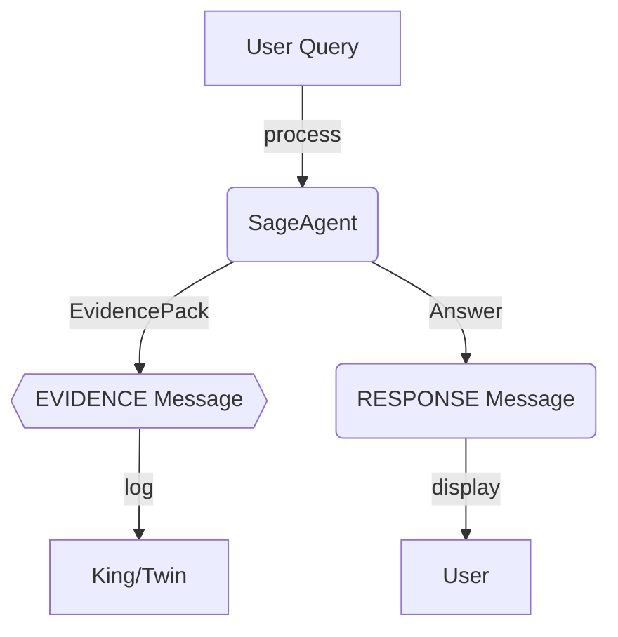

# EvidencePack v1

`EvidencePack` is a canonical payload used by agents to attach retrieval evidence to messages.

| Field | Type | Required | Notes |
| ----- | ---- | -------- | ----- |
| `id` | UUID | yes | Unique identifier |
| `created_at` | datetime (UTC ISO) | yes | Timestamp when the pack was created |
| `query` | string | yes | Original user query |
| `chunks` | list[Chunk] | yes | Evidence chunks: `{id, text, score, source_uri}` |
| `proto_confidence` | float | optional | Placeholder confidence between 0 and 1 |
| `meta` | dict | optional | Additional metadata |

Example:

```json
{
  "id": "42fa37b9-ae8e-4d4f-9e80-6907a5d84303",
  "created_at": "2025-06-13T14:05:12Z",
  "query": "How does WAL work in SQLite?",
  "chunks": [
    {
      "id": "doc_123#p7",
      "text": "SQLite's Write-Ahead Logging mode ...",
      "score": 0.92,
      "source_uri": "https://sqlite.org/wal.html"
    }
  ],
  "proto_confidence": null,
  "meta": {}
}
```

## Flow v1


