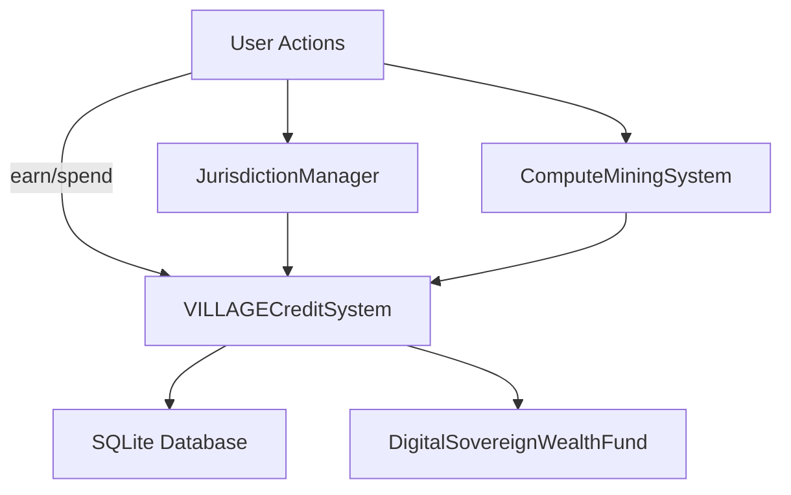

# Token Economy System

This module provides an off-chain credit system, jurisdiction-aware controls, a digital sovereign wealth fund, and compute mining rewards.

## Architecture



## Usage

```python
from token_economy.credit_system import VILLAGECreditSystem, EarningRule
from token_economy.compute_mining import ComputeMiningSystem, ComputeSession

credit = VILLAGECreditSystem(':memory:')
credit.add_earning_rule(EarningRule('COMPUTE_CONTRIBUTION', 10, {}, {}))
miner = ComputeMiningSystem(credit)
session = ComputeSession('user1', 1000, 60, 'modelA', 'proof', True, 'Sub-Saharan Africa')
miner.track_compute_contribution('device1', session)
print(credit.get_balance('user1'))
```

## Deployment

Solidity contracts reside in `contracts/` and can be compiled and deployed using Hardhat or Truffle.
