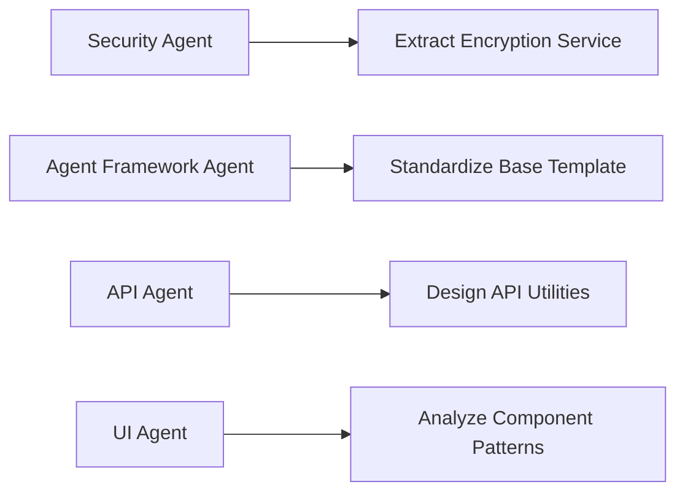
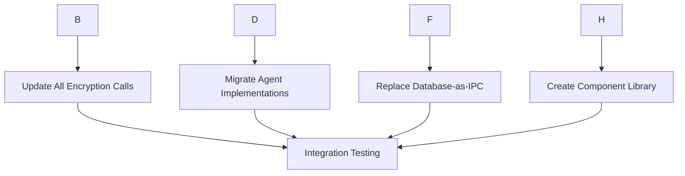
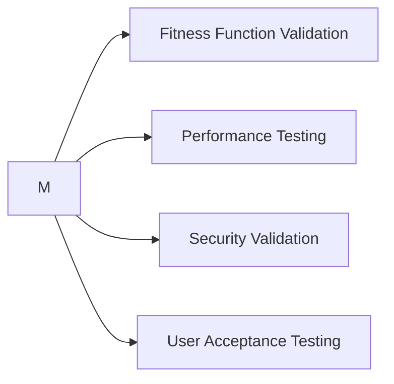

# Agent Coordination Instructions for Code Consolidation

## SPARC Coordination Protocol

This document provides specific instructions for the specialized agents working on the systematic code consolidation following SPARC methodology and connascence management principles.

## Current Status

**Baseline Metrics (Before Consolidation):**
- Total coupling violations: 2,102 (35 critical + 2,067 warning)
- Fitness score: 0.00 (target: >0.80)
- Encryption methods found: 33 (target: 4)
- Average coupling score: 15.79 (target: <8.0)

**Goals:**
- Reduce critical violations by 90% (35 → 3)
- Improve fitness score to >0.80
- Consolidate 33 encryption methods to 4 unified methods
- Achieve <8.0 average coupling score

## Agent Specialization Matrix

### 1. Security Consolidation Agent (`system-architect` + `coder`)

**Objective:** Eliminate 29 duplicate encryption implementations

**Tasks:**
- Extract DigitalTwinEncryption as unified service
- Apply dependency injection pattern
- Create adapter pattern for legacy methods
- Update all 33 encryption call sites

**Files to Refactor:**
```
Priority 1 (High Usage):
- packages/core/security/digital_twin_encryption.py ✅ STARTED
- packages/core/legacy/security/digital_twin_encryption.py
- packages/edge/legacy_src/digital_twin/security/encryption_manager.py
- packages/p2p/communications/a2a_protocol.py

Priority 2 (Medium Usage):
- packages/p2p/betanet/noise_protocol.py
- packages/p2p/betanet-bounty/python/noise_protocol.py
- packages/rag/mcp_servers/hyperag/secure_database.py
```

**Success Criteria:**
- 33 → 4 encryption methods
- Zero CoA (Connascence of Algorithm) violations
- All tests pass with behavioral equivalence

### 2. Agent Framework Consolidation Agent (`sparc-coder` + `reviewer`)

**Objective:** Standardize agent patterns across 77 agent classes

**Tasks:**
- Extract common patterns from BaseAgentTemplate
- Create AgentCapability enum (single source of truth)
- Apply dependency injection for agent services
- Eliminate position parameter violations (413 → <100)

**Files to Refactor:**
```
Core Framework:
- packages/agents/core/base_agent_template.py ✅ ANALYZED
- packages/agents/core/agent_interface.py
- packages/agents/core/coordination_system.py

Specialized Agents (sample):
- packages/agents/specialized/governance/king_agent.py
- packages/agents/specialized/infrastructure/magi_agent.py
- packages/agents/specialized/knowledge/sage_agent.py
```

**Success Criteria:**
- Standardized capability definitions
- <3 positional parameters per method
- 50% reduction in agent code duplication

### 3. API Services Consolidation Agent (`backend-dev` + `tester`)

**Objective:** Consolidate API utilities and eliminate database-as-IPC

**Tasks:**
- Extract shared API utilities to common module
- Replace database-as-IPC with proper message queues
- Apply RESTful patterns consistently
- Implement behavioral tests for API contracts

**Files to Refactor:**
```
API Layer:
- packages/api/start_api_servers.py
- packages/core/security/rbac_api_server.py
- packages/core/security/aivillage_rbac_integration.py

Database Layer:
- packages/tokenomics/governance/storage.py
- packages/core/legacy/database/database_manager.py
```

**Success Criteria:**
- Zero database-as-IPC violations
- Consistent error handling patterns
- 100% API backward compatibility

### 4. UI Component Consolidation Agent (`creative-agent` + `reviewer`)

**Objective:** Extract shared UI patterns and styling

**Tasks:**
- Identify common component patterns
- Extract shared styling to design system
- Create reusable component library
- Eliminate duplicate UI logic

**Files to Refactor:**
```
UI Components:
- packages/ui/node_modules/flatted/python/flatted.py
- packages/monitoring/dashboard.py
- packages/agents/governance/mcp_governance_dashboard.py
```

**Success Criteria:**
- Shared component library created
- 60% reduction in UI code duplication
- Consistent design system applied

## Parallel Execution Strategy

### Phase 1: Foundation (Parallel - Week 1)


### Phase 2: Implementation (Sequential Dependencies - Week 2)


### Phase 3: Validation (Parallel - Week 3)


## Communication Protocol

### Daily Standups (10 min)
```
Format:
- Agent: [Name]
- Yesterday: [Completed tasks]
- Today: [Planned tasks]
- Blockers: [Dependencies/issues]
- Metrics: [Coupling score progress]
```

### Progress Tracking
```bash
# Run fitness functions daily
python scripts/architectural_fitness_functions.py --output daily_fitness.json

# Check coupling metrics
python scripts/coupling_metrics.py packages --format=json

# Verify no regressions
python scripts/check_connascence.py packages --severity=critical
```

## Risk Mitigation

### Branch Strategy
```
main
├── feature/security-consolidation
├── feature/agent-framework-refactor
├── feature/api-utilities-extraction
└── feature/ui-component-library
```

### Rollback Triggers
- Critical violations increase by >10%
- Any test failures in existing functionality
- Performance degradation >20%
- Build time increase >50%

### Validation Gates
```
Gate 1: Unit Tests (100% pass)
Gate 2: Integration Tests (100% pass)
Gate 3: Fitness Functions (Critical violations ≤ 3)
Gate 4: Performance Benchmarks (≤ 10% degradation)
Gate 5: Security Validation (No new vulnerabilities)
```

## Agent-Specific Guidelines

### For All Agents:
1. **Follow Connascence Hierarchy**: Weak → Strong only within modules
2. **Apply SOLID Principles**: Single responsibility, dependency inversion
3. **Use Dependency Injection**: Constructor injection for services
4. **Maintain Backward Compatibility**: Adapter pattern for legacy code
5. **Write Behavioral Tests**: Assert contracts, not implementations
6. **Document Decisions**: ADR for each major refactoring

### Security Agent Specific:
- Use `EncryptionService` protocol for all crypto operations
- Implement adapter pattern for legacy encryption calls
- Validate crypto equivalence with existing implementations
- Maintain audit logging for compliance

### Agent Framework Specific:
- Extract to `AgentCapability` enum for all capability definitions
- Use keyword-only parameters for functions with >3 args
- Apply template method pattern for common agent behaviors
- Preserve all existing agent functionality

### API Agent Specific:
- Replace direct database calls with repository pattern
- Use event-driven architecture for inter-service communication
- Implement circuit breaker pattern for external dependencies
- Maintain OpenAPI specification compliance

### UI Agent Specific:
- Create atomic design system components
- Use CSS-in-JS for consistent styling
- Implement responsive design patterns
- Ensure accessibility compliance (WCAG 2.1)

## Success Metrics

### Technical Metrics
- Critical violations: 35 → ≤3 (91% reduction)
- Warning violations: 2,067 → ≤500 (76% reduction)
- Fitness score: 0.00 → ≥0.80 (major improvement)
- Coupling score: 15.79 → ≤8.0 (49% reduction)

### Quality Metrics
- Test coverage: Maintain ≥85%
- Build time: ≤10% increase acceptable
- Performance: ≤10% degradation acceptable
- Security: Zero new vulnerabilities

### Process Metrics
- Daily fitness function runs: 100%
- Code review coverage: 100% of changes
- Documentation updates: 100% of architectural decisions
- Agent coordination meetings: 100% attendance

## Next Steps

1. **Initialize Agent Swarm**: Spawn 4 specialized agents with instructions
2. **Begin Phase 1**: Parallel foundation work on core modules
3. **Daily Monitoring**: Track coupling metrics and fitness functions
4. **Weekly Review**: Assess progress against success criteria
5. **Iterative Refinement**: Adjust strategy based on metrics

Remember: **Strong connascence is acceptable within a class/function; dangerous across modules. Always refactor toward weaker forms.**
