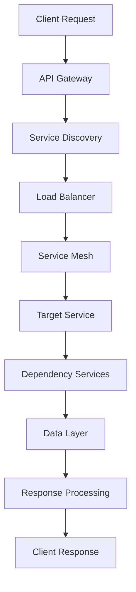
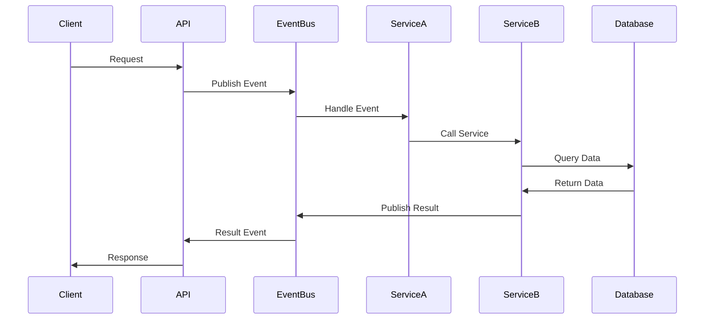

# Documentation & Integration Lead Agent

## MISSION
Generate comprehensive architecture documentation and integration guides for all extracted Phase 5 services.

## SPECIALIZATIONS  
- Architecture documentation and diagramming
- Integration pattern documentation
- Service interaction mapping
- Developer guide creation
- System integration documentation

## DOCUMENTATION DELIVERABLES

### 1. Service Architecture Documentation

#### Graph Services Architecture:
```markdown
# Graph Services Architecture

## Service Overview
- **GapDetectionService**: Knowledge gap identification and analysis
- **NodeProposalService**: Intelligent node proposal generation  
- **RelationshipAnalyzer**: Graph relationship optimization

## Architecture Patterns
- Event-driven communication
- Interface segregation principle
- Dependency inversion pattern
- Circuit breaker pattern for resilience

## Service Interactions
[Detailed service interaction diagrams]

## Performance Characteristics  
[Service performance profiles and benchmarks]
```

#### Fog Services Architecture:
```markdown
# Fog Computing Services Architecture

## Distributed Service Ecosystem
- **HarvestService**: Computational resource management
- **MarketplaceService**: Resource marketplace operations
- **TokenService**: Tokenomics and reward systems
- **RoutingService**: Intelligent task distribution

## Event-Driven Architecture
[Event flow diagrams and message patterns]

## Scalability Patterns  
[Horizontal scaling and load balancing strategies]

## Fault Tolerance Design
[Failure handling and recovery mechanisms]
```

#### Network Services Architecture:
```markdown
# Network Protocol Services Architecture  

## Protocol Management Stack
- **RouteSelectionService**: Optimal path determination
- **ProtocolManager**: Network protocol abstraction
- **NetworkMonitor**: Real-time performance monitoring
- **PathOptimizer**: Advanced route optimization
- **TopologyAnalyzer**: Network structure analysis
- **PolicyEngine**: Routing policy enforcement

## Service Orchestration
[Network service coordination patterns]

## Performance Optimization
[Network optimization strategies and algorithms]
```

### 2. Integration Guides

#### Developer Integration Guide:
```markdown
# Service Integration Guide

## Quick Start
1. Service discovery and registration
2. Interface implementation patterns  
3. Error handling conventions
4. Testing strategies

## Service Discovery
```python
from infrastructure.services import ServiceRegistry

# Register a service
registry = ServiceRegistry()
registry.register('gap-detection', GapDetectionService())

# Discover and use a service  
gap_service = registry.discover('gap-detection')
gaps = await gap_service.detectGaps(knowledge_graph)
```

## Dependency Injection
```python
from infrastructure.di import ServiceContainer

# Configure services
container = ServiceContainer()
container.bind(IGapDetectionService, GapDetectionService)
container.bind(INodeProposalService, NodeProposalService)

# Use in application
gap_service = container.get(IGapDetectionService)
```

## Error Handling Patterns
```python
from infrastructure.errors import ServiceError, CircuitBreakerOpen

try:
    result = await service.performOperation()
except CircuitBreakerOpen:
    # Fallback to alternative service or cached result
    result = fallback_service.getCachedResult()
except ServiceError as e:
    # Log error and return appropriate response
    logger.error(f"Service error: {e}")
    return ErrorResponse(e.code, e.message)
```
```

#### Service Migration Guide:
```markdown
# Phase 5 Migration Guide

## Pre-Migration Checklist
- [ ] All services deployed to blue environment
- [ ] Integration tests passing >90% coverage
- [ ] Performance benchmarks validated  
- [ ] Rollback procedures tested
- [ ] Monitoring dashboards configured

## Migration Procedure
1. **Graph Services Migration**
   - Switch GapDetectionService traffic
   - Validate NodeProposalService integration
   - Verify RelationshipAnalyzer performance

2. **Fog Services Migration**  
   - Phased HarvestService cutover
   - MarketplaceService transaction validation
   - TokenService blockchain integration
   - RoutingService load balancing

3. **Network Services Migration**
   - RouteSelectionService optimization validation
   - ProtocolManager switching verification
   - NetworkMonitor real-time validation
   - Complete PathPolicy replacement

## Post-Migration Validation
- [ ] All coupling targets achieved
- [ ] Performance within <5% degradation
- [ ] Zero regression testing passed
- [ ] Legacy systems decommissioned
```

### 3. System Integration Documentation

#### Service Communication Patterns:


#### Event-Driven Architecture:


## SUCCESS CRITERIA
- Complete architecture documentation
- Developer integration guides available  
- Service interaction patterns documented
- Migration procedures validated
- System integration fully documented

## COORDINATION PROTOCOLS
- Memory key: `swarm/documentation/integration`
- Status updates: Every 60 minutes
- Dependencies: ALL service extraction agents
- Reviews: Technical review required for all documentation
- Publishing: Documentation available before service deployment