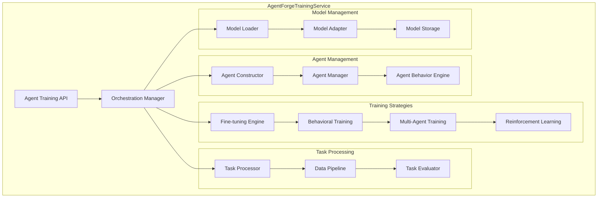

# AgentForgeTrainingService - Detailed Architecture

## Service Overview

The **AgentForgeTrainingService** is a general-purpose training service designed for agent behavior training, task-specific fine-tuning, and multi-agent system development. This service is completely separate from Cognate pretraining and focuses on diverse agent architectures and training paradigms.

## Core Responsibilities

### Primary Functions
1. **Agent Behavior Training**: Train agents for specific tasks and behaviors
2. **Model Fine-tuning**: Fine-tune pretrained models (including Cognate) for specific applications
3. **Multi-Agent Training**: Coordinate training across multiple agent instances
4. **Architecture Flexibility**: Support various neural architectures beyond Cognate
5. **Task Adaptation**: Adapt models for domain-specific tasks
6. **Behavioral Optimization**: Optimize agent decision-making and interaction patterns

### Architectural Components



## Service Interface

### Core API Definitions

```python
from typing import Dict, List, Optional, Union, AsyncIterator, Any
from dataclasses import dataclass
from enum import Enum
import asyncio

class AgentArchitecture(Enum):
    COGNATE_BASED = "cognate_based"
    TRANSFORMER = "transformer"
    LSTM = "lstm"
    GRU = "gru"
    CUSTOM = "custom"
    MULTI_MODAL = "multi_modal"
    REINFORCEMENT = "reinforcement"

class TrainingStrategy(Enum):
    FINE_TUNING = "fine_tuning"
    BEHAVIORAL_TRAINING = "behavioral_training"
    REINFORCEMENT_LEARNING = "reinforcement_learning"
    MULTI_AGENT_COORDINATION = "multi_agent_coordination"
    TRANSFER_LEARNING = "transfer_learning"
    CONTINUAL_LEARNING = "continual_learning"

class AgentTrainingStatus(Enum):
    INITIALIZING = "initializing"
    LOADING_BASE_MODEL = "loading_base_model"
    PREPARING_TASK_DATA = "preparing_task_data"
    TRAINING = "training"
    EVALUATING = "evaluating"
    VALIDATING = "validating"
    COMPLETED = "completed"
    FAILED = "failed"

@dataclass
class AgentTrainingConfig:
    """Configuration for agent training jobs."""
    
    # Agent Configuration
    agent_name: str
    agent_architecture: AgentArchitecture
    training_strategy: TrainingStrategy
    
    # Base Model Configuration
    base_model_path: Optional[str] = None  # Can be Cognate or other
    base_model_type: str = "cognate"  # cognate, gpt, bert, etc.
    freeze_base_layers: bool = False
    adaptation_layers: List[str] = None
    
    # Task Configuration
    task_type: str  # e.g., "dialogue", "reasoning", "planning"
    task_description: str
    success_metrics: List[str]
    
    # Training Parameters
    learning_rate: float = 1e-5
    batch_size: int = 16
    num_epochs: int = 5
    max_steps: Optional[int] = None
    gradient_accumulation_steps: int = 1
    
    # Optimization
    optimizer_type: str = "adamw"
    weight_decay: float = 0.01
    warmup_steps: int = 500
    lr_schedule: str = "cosine"
    
    # Data Configuration
    training_data_path: Optional[str] = None
    validation_data_path: Optional[str] = None
    data_preprocessing: Dict[str, Any] = None
    max_sequence_length: int = 512
    
    # Behavioral Training Specific
    reward_function: Optional[str] = None
    exploration_strategy: str = "epsilon_greedy"
    behavioral_constraints: List[str] = None
    
    # Multi-Agent Specific
    num_agents: int = 1
    coordination_strategy: str = "independent"
    communication_protocol: Optional[str] = None
    
    # Evaluation Configuration
    evaluation_interval: int = 500
    validation_metrics: List[str] = None
    early_stopping_patience: int = 3
    
    # Output Configuration
    output_dir: str = "./trained_agents"
    save_strategy: str = "best"  # best, all, epoch
    checkpoint_interval: int = 1000

@dataclass
class AgentTrainingProgress:
    """Progress tracking for agent training."""
    job_id: str
    agent_name: str
    status: AgentTrainingStatus
    progress_percent: float
    current_step: int
    total_steps: int
    current_epoch: int
    total_epochs: int
    
    # Training Metrics
    training_loss: Optional[float] = None
    validation_loss: Optional[float] = None
    learning_rate: Optional[float] = None
    
    # Task-Specific Metrics
    task_performance: Dict[str, float] = None
    behavioral_metrics: Dict[str, float] = None
    
    # Resource Usage
    gpu_utilization: Optional[float] = None
    memory_usage_gb: Optional[float] = None
    training_time_elapsed: Optional[float] = None
    
    # Agent-Specific Information
    agent_architecture: AgentArchitecture = None
    training_strategy: TrainingStrategy = None
    base_model_info: Dict[str, Any] = None
    
    # Quality Metrics
    convergence_status: Optional[str] = None
    stability_score: Optional[float] = None
    generalization_score: Optional[float] = None

@dataclass
class TrainedAgent:
    """Represents a completed trained agent."""
    agent_id: str
    agent_name: str
    agent_type: str
    creation_timestamp: str
    
    # Training Information
    base_model_used: str
    training_strategy: TrainingStrategy
    task_specialization: str
    
    # Performance Metrics
    training_loss: float
    validation_loss: float
    task_performance_scores: Dict[str, float]
    behavioral_metrics: Dict[str, float]
    
    # Model Information
    parameter_count: int
    model_size_mb: float
    architecture_details: Dict[str, Any]
    
    # Capabilities
    supported_tasks: List[str]
    behavioral_patterns: List[str]
    interaction_protocols: List[str]
    
    # File Paths
    model_checkpoint_path: str
    config_path: str
    evaluation_results_path: str
    deployment_package_path: str
    
    # Deployment Information
    deployment_ready: bool
    deployment_requirements: Dict[str, Any]
    performance_benchmarks: Dict[str, float]

class IAgentForgeTrainingService:
    """Interface for the Agent Forge Training Service."""
    
    async def start_agent_training(
        self,
        config: AgentTrainingConfig,
        priority: str = "normal"
    ) -> str:
        """
        Start a new agent training job.
        
        Args:
            config: Training configuration
            priority: Job priority (low, normal, high)
            
        Returns:
            job_id: Unique identifier for the training job
        """
        pass
    
    async def get_training_progress(
        self,
        job_id: str
    ) -> AgentTrainingProgress:
        """Get current progress of a training job."""
        pass
    
    async def stream_training_progress(
        self,
        job_id: str
    ) -> AsyncIterator[AgentTrainingProgress]:
        """Stream real-time progress updates."""
        pass
    
    async def pause_training(self, job_id: str) -> bool:
        """Pause a running training job."""
        pass
    
    async def resume_training(self, job_id: str) -> bool:
        """Resume a paused training job."""
        pass
    
    async def cancel_training(self, job_id: str) -> bool:
        """Cancel a training job."""
        pass
    
    async def get_trained_agent(
        self,
        job_id: str
    ) -> TrainedAgent:
        """Retrieve the completed trained agent."""
        pass
    
    async def list_training_jobs(
        self,
        status: Optional[AgentTrainingStatus] = None,
        agent_type: Optional[str] = None
    ) -> List[AgentTrainingProgress]:
        """List training jobs with optional filters."""
        pass
    
    async def evaluate_agent(
        self,
        agent_id: str,
        evaluation_tasks: List[str]
    ) -> Dict[str, float]:
        """Evaluate a trained agent on specific tasks."""
        pass
    
    async def fine_tune_agent(
        self,
        base_agent_id: str,
        fine_tuning_config: AgentTrainingConfig
    ) -> str:
        """Fine-tune an existing agent for new tasks."""
        pass
    
    async def create_multi_agent_system(
        self,
        agents_config: List[AgentTrainingConfig],
        coordination_config: Dict[str, Any]
    ) -> str:
        """Create and train a multi-agent system."""
        pass
```

## Agent Architecture Management

### Flexible Agent Construction

```python
class AgentArchitectureFactory:
    """Factory for creating different agent architectures."""
    
    def __init__(self):
        self.architecture_builders = {
            AgentArchitecture.COGNATE_BASED: self.build_cognate_agent,
            AgentArchitecture.TRANSFORMER: self.build_transformer_agent,
            AgentArchitecture.LSTM: self.build_lstm_agent,
            AgentArchitecture.REINFORCEMENT: self.build_rl_agent,
            AgentArchitecture.MULTI_MODAL: self.build_multimodal_agent,
        }
    
    def create_agent(
        self,
        config: AgentTrainingConfig
    ) -> nn.Module:
        """Create agent based on architecture specification."""
        
        builder = self.architecture_builders.get(config.agent_architecture)
        if not builder:
            raise ValueError(f"Unsupported architecture: {config.agent_architecture}")
        
        return builder(config)
    
    def build_cognate_agent(self, config: AgentTrainingConfig) -> nn.Module:
        """Build agent based on Cognate foundation model."""
        
        # Load Cognate foundation model
        base_model = self.load_foundation_model(config.base_model_path)
        
        # Add task-specific heads
        agent = CognateBasedAgent(
            foundation_model=base_model,
            task_type=config.task_type,
            adaptation_config=self.create_adaptation_config(config)
        )
        
        # Freeze base layers if requested
        if config.freeze_base_layers:
            self.freeze_model_layers(agent.foundation_model, config.adaptation_layers)
        
        return agent
    
    def build_transformer_agent(self, config: AgentTrainingConfig) -> nn.Module:
        """Build general transformer-based agent."""
        
        agent = TransformerAgent(
            d_model=config.get('d_model', 512),
            n_layers=config.get('n_layers', 6),
            n_heads=config.get('n_heads', 8),
            vocab_size=config.get('vocab_size', 32000),
            task_type=config.task_type
        )
        
        return agent
    
    def build_rl_agent(self, config: AgentTrainingConfig) -> nn.Module:
        """Build reinforcement learning agent."""
        
        agent = RLAgent(
            state_dim=config.get('state_dim', 512),
            action_dim=config.get('action_dim', 256),
            hidden_dim=config.get('hidden_dim', 1024),
            reward_function=config.reward_function,
            exploration_strategy=config.exploration_strategy
        )
        
        return agent

class CognateBasedAgent(nn.Module):
    """Agent built on top of Cognate foundation model."""
    
    def __init__(
        self,
        foundation_model: nn.Module,
        task_type: str,
        adaptation_config: Dict[str, Any]
    ):
        super().__init__()
        self.foundation_model = foundation_model
        self.task_type = task_type
        
        # Add task-specific components
        self.task_adapter = self.create_task_adapter(task_type, adaptation_config)
        self.behavioral_controller = self.create_behavioral_controller(task_type)
        
        # Initialize agent-specific parameters
        self.initialize_agent_parameters()
    
    def create_task_adapter(
        self,
        task_type: str,
        config: Dict[str, Any]
    ) -> nn.Module:
        """Create task-specific adaptation layers."""
        
        if task_type == "dialogue":
            return DialogueAdapter(
                input_dim=self.foundation_model.d_model,
                output_dim=config.get('dialogue_vocab_size', 32000)
            )
        elif task_type == "reasoning":
            return ReasoningAdapter(
                input_dim=self.foundation_model.d_model,
                reasoning_steps=config.get('max_reasoning_steps', 10)
            )
        elif task_type == "planning":
            return PlanningAdapter(
                input_dim=self.foundation_model.d_model,
                action_space=config.get('action_space_size', 256)
            )
        else:
            return GeneralAdapter(
                input_dim=self.foundation_model.d_model,
                output_dim=config.get('output_dim', 512)
            )
    
    def forward(self, inputs: torch.Tensor, **kwargs) -> Dict[str, torch.Tensor]:
        """Forward pass through the agent."""
        
        # Get foundation model representations
        foundation_outputs = self.foundation_model(inputs, **kwargs)
        
        # Apply task-specific adaptation
        adapted_outputs = self.task_adapter(foundation_outputs)
        
        # Apply behavioral control
        controlled_outputs = self.behavioral_controller(adapted_outputs)
        
        return {
            'foundation_outputs': foundation_outputs,
            'adapted_outputs': adapted_outputs,
            'controlled_outputs': controlled_outputs,
            'final_outputs': controlled_outputs
        }
```

## Training Strategy Implementation

### Fine-Tuning Engine

```python
class FineTuningEngine:
    """Handles fine-tuning of pretrained models for specific tasks."""
    
    def __init__(self):
        self.optimization_strategies = {
            'full_fine_tuning': self.full_fine_tuning,
            'layer_wise_fine_tuning': self.layer_wise_fine_tuning,
            'adapter_fine_tuning': self.adapter_fine_tuning,
            'lora_fine_tuning': self.lora_fine_tuning
        }
    
    async def fine_tune_model(
        self,
        model: nn.Module,
        config: AgentTrainingConfig,
        train_loader: DataLoader,
        val_loader: DataLoader,
        progress_callback: Callable
    ) -> Dict[str, Any]:
        """Fine-tune model with specified strategy."""
        
        strategy = config.get('fine_tuning_strategy', 'full_fine_tuning')
        fine_tuning_fn = self.optimization_strategies[strategy]
        
        return await fine_tuning_fn(model, config, train_loader, val_loader, progress_callback)
    
    async def full_fine_tuning(
        self,
        model: nn.Module,
        config: AgentTrainingConfig,
        train_loader: DataLoader,
        val_loader: DataLoader,
        progress_callback: Callable
    ) -> Dict[str, Any]:
        """Full model fine-tuning."""
        
        # Setup optimizer
        optimizer = self.create_optimizer(model.parameters(), config)
        scheduler = self.create_lr_scheduler(optimizer, config)
        
        # Training loop
        training_stats = {
            'training_losses': [],
            'validation_losses': [],
            'learning_rates': []
        }
        
        for epoch in range(config.num_epochs):
            # Training phase
            train_loss = await self.train_epoch(
                model, train_loader, optimizer, config, progress_callback
            )
            
            # Validation phase
            val_loss = await self.validate_epoch(
                model, val_loader, config
            )
            
            # Update scheduler
            scheduler.step(val_loss)
            
            # Track statistics
            training_stats['training_losses'].append(train_loss)
            training_stats['validation_losses'].append(val_loss)
            training_stats['learning_rates'].append(optimizer.param_groups[0]['lr'])
            
            # Progress callback
            await progress_callback(
                epoch + 1, config.num_epochs, train_loss, val_loss
            )
            
            # Early stopping check
            if self.should_early_stop(training_stats, config):
                break
        
        return training_stats
    
    async def adapter_fine_tuning(
        self,
        model: nn.Module,
        config: AgentTrainingConfig,
        train_loader: DataLoader,
        val_loader: DataLoader,
        progress_callback: Callable
    ) -> Dict[str, Any]:
        """Fine-tuning using adapter layers."""
        
        # Freeze base model
        for param in model.foundation_model.parameters():
            param.requires_grad = False
        
        # Only train adapter layers
        adapter_params = [
            p for n, p in model.named_parameters() 
            if 'adapter' in n or 'task_' in n
        ]
        
        optimizer = self.create_optimizer(adapter_params, config)
        
        # Training loop (similar to full fine-tuning but with frozen base)
        return await self.full_fine_tuning(
            model, config, train_loader, val_loader, progress_callback
        )

class BehavioralTrainingEngine:
    """Handles behavioral training and reinforcement learning."""
    
    def __init__(self):
        self.behavioral_strategies = {
            'imitation_learning': self.imitation_learning,
            'reinforcement_learning': self.reinforcement_learning,
            'curriculum_learning': self.curriculum_learning,
            'meta_learning': self.meta_learning
        }
    
    async def train_agent_behavior(
        self,
        agent: nn.Module,
        config: AgentTrainingConfig,
        environment: Any,
        progress_callback: Callable
    ) -> Dict[str, Any]:
        """Train agent behavior using specified strategy."""
        
        strategy = config.get('behavioral_strategy', 'imitation_learning')
        training_fn = self.behavioral_strategies[strategy]
        
        return await training_fn(agent, config, environment, progress_callback)
    
    async def reinforcement_learning(
        self,
        agent: nn.Module,
        config: AgentTrainingConfig,
        environment: Any,
        progress_callback: Callable
    ) -> Dict[str, Any]:
        """Train agent using reinforcement learning."""
        
        # Setup RL components
        replay_buffer = ReplayBuffer(config.get('buffer_size', 10000))
        target_network = copy.deepcopy(agent)
        optimizer = self.create_optimizer(agent.parameters(), config)
        
        episode_rewards = []
        episode_lengths = []
        
        for episode in range(config.get('num_episodes', 1000)):
            state = environment.reset()
            episode_reward = 0
            episode_length = 0
            
            while not environment.is_done():
                # Get action from agent
                action = agent.get_action(state, exploration=True)
                
                # Take step in environment
                next_state, reward, done, info = environment.step(action)
                
                # Store experience
                replay_buffer.add(state, action, reward, next_state, done)
                
                # Train agent if enough experiences
                if len(replay_buffer) > config.get('min_buffer_size', 1000):
                    batch = replay_buffer.sample(config.batch_size)
                    loss = self.compute_rl_loss(agent, target_network, batch)
                    
                    optimizer.zero_grad()
                    loss.backward()
                    optimizer.step()
                
                state = next_state
                episode_reward += reward
                episode_length += 1
            
            episode_rewards.append(episode_reward)
            episode_lengths.append(episode_length)
            
            # Update target network
            if episode % config.get('target_update_interval', 100) == 0:
                target_network.load_state_dict(agent.state_dict())
            
            # Progress callback
            if episode % 10 == 0:
                avg_reward = np.mean(episode_rewards[-100:])
                await progress_callback(episode, config.get('num_episodes'), avg_reward)
        
        return {
            'episode_rewards': episode_rewards,
            'episode_lengths': episode_lengths,
            'final_avg_reward': np.mean(episode_rewards[-100:])
        }

class MultiAgentTrainingEngine:
    """Handles training of multiple coordinated agents."""
    
    def __init__(self):
        self.coordination_strategies = {
            'independent': self.independent_training,
            'centralized': self.centralized_training,
            'decentralized': self.decentralized_training,
            'hierarchical': self.hierarchical_training
        }
    
    async def train_multi_agent_system(
        self,
        agents: List[nn.Module],
        config: AgentTrainingConfig,
        environment: Any,
        progress_callback: Callable
    ) -> Dict[str, Any]:
        """Train multiple agents with coordination."""
        
        strategy = config.coordination_strategy
        training_fn = self.coordination_strategies[strategy]
        
        return await training_fn(agents, config, environment, progress_callback)
    
    async def centralized_training(
        self,
        agents: List[nn.Module],
        config: AgentTrainingConfig,
        environment: Any,
        progress_callback: Callable
    ) -> Dict[str, Any]:
        """Centralized training with shared learning."""
        
        # Create centralized coordinator
        coordinator = CentralizedCoordinator(agents, config)
        
        # Training loop
        for episode in range(config.get('num_episodes', 1000)):
            # Reset environment and agents
            states = environment.reset()
            
            episode_rewards = [0] * len(agents)
            
            while not environment.is_done():
                # Get coordinated actions
                actions = coordinator.get_coordinated_actions(states)
                
                # Execute actions in environment
                next_states, rewards, dones, infos = environment.step(actions)
                
                # Update coordinator with experience
                coordinator.update(states, actions, rewards, next_states, dones)
                
                # Update episode rewards
                for i, reward in enumerate(rewards):
                    episode_rewards[i] += reward
                
                states = next_states
            
            # Progress callback
            if episode % 10 == 0:
                avg_total_reward = sum(episode_rewards)
                await progress_callback(episode, config.get('num_episodes'), avg_total_reward)
        
        return {
            'trained_agents': agents,
            'coordinator': coordinator,
            'training_metrics': coordinator.get_training_metrics()
        }
```

## Task Processing and Data Management

### Flexible Data Pipeline

```python
class AgentDataProcessor:
    """Processes diverse data types for agent training."""
    
    def __init__(self):
        self.processors = {
            'dialogue': self.process_dialogue_data,
            'reasoning': self.process_reasoning_data,
            'planning': self.process_planning_data,
            'multimodal': self.process_multimodal_data,
            'behavioral': self.process_behavioral_data
        }
    
    async def process_training_data(
        self,
        data_path: str,
        task_type: str,
        config: AgentTrainingConfig
    ) -> DataLoader:
        """Process training data based on task type."""
        
        processor = self.processors.get(task_type)
        if not processor:
            raise ValueError(f"Unsupported task type: {task_type}")
        
        processed_data = await processor(data_path, config)
        
        return DataLoader(
            processed_data,
            batch_size=config.batch_size,
            shuffle=True,
            collate_fn=self.create_collate_fn(task_type)
        )
    
    async def process_dialogue_data(
        self,
        data_path: str,
        config: AgentTrainingConfig
    ) -> Dataset:
        """Process dialogue training data."""
        
        # Load dialogue data
        with open(data_path, 'r') as f:
            dialogues = json.load(f)
        
        processed_examples = []
        for dialogue in dialogues:
            # Convert to training format
            for turn in dialogue['turns']:
                example = {
                    'context': self.format_dialogue_context(dialogue['turns'][:turn['id']]),
                    'response': turn['text'],
                    'speaker': turn['speaker'],
                    'metadata': turn.get('metadata', {})
                }
                processed_examples.append(example)
        
        return DialogueDataset(processed_examples, config)
    
    async def process_reasoning_data(
        self,
        data_path: str,
        config: AgentTrainingConfig
    ) -> Dataset:
        """Process reasoning task data."""
        
        with open(data_path, 'r') as f:
            reasoning_tasks = json.load(f)
        
        processed_examples = []
        for task in reasoning_tasks:
            example = {
                'problem': task['problem'],
                'reasoning_steps': task['reasoning_steps'],
                'answer': task['answer'],
                'task_type': task.get('type', 'general')
            }
            processed_examples.append(example)
        
        return ReasoningDataset(processed_examples, config)
    
    async def process_behavioral_data(
        self,
        data_path: str,
        config: AgentTrainingConfig
    ) -> Dataset:
        """Process behavioral training data."""
        
        # Load demonstration data
        with open(data_path, 'r') as f:
            demonstrations = json.load(f)
        
        processed_examples = []
        for demo in demonstrations:
            example = {
                'state_sequence': demo['states'],
                'action_sequence': demo['actions'],
                'reward_sequence': demo['rewards'],
                'task_info': demo.get('task_info', {})
            }
            processed_examples.append(example)
        
        return BehavioralDataset(processed_examples, config)

class TaskEvaluator:
    """Evaluates agent performance on various tasks."""
    
    def __init__(self):
        self.evaluators = {
            'dialogue': DialogueEvaluator(),
            'reasoning': ReasoningEvaluator(),
            'planning': PlanningEvaluator(),
            'behavioral': BehavioralEvaluator()
        }
    
    async def evaluate_agent_performance(
        self,
        agent: nn.Module,
        task_type: str,
        evaluation_data: DataLoader,
        metrics: List[str]
    ) -> Dict[str, float]:
        """Evaluate agent on specific task."""
        
        evaluator = self.evaluators.get(task_type)
        if not evaluator:
            raise ValueError(f"No evaluator for task type: {task_type}")
        
        return await evaluator.evaluate(agent, evaluation_data, metrics)
    
    async def run_benchmark_evaluation(
        self,
        agent: nn.Module,
        benchmark_suite: str
    ) -> Dict[str, float]:
        """Run standardized benchmark evaluation."""
        
        benchmarks = {
            'dialogue_bench': self.run_dialogue_benchmarks,
            'reasoning_bench': self.run_reasoning_benchmarks,
            'planning_bench': self.run_planning_benchmarks,
            'general_bench': self.run_general_benchmarks
        }
        
        benchmark_fn = benchmarks.get(benchmark_suite)
        if not benchmark_fn:
            raise ValueError(f"Unknown benchmark suite: {benchmark_suite}")
        
        return await benchmark_fn(agent)

class DialogueEvaluator:
    """Evaluates dialogue agent performance."""
    
    async def evaluate(
        self,
        agent: nn.Module,
        evaluation_data: DataLoader,
        metrics: List[str]
    ) -> Dict[str, float]:
        """Evaluate dialogue agent."""
        
        results = {}
        
        if 'fluency' in metrics:
            results['fluency'] = await self.evaluate_fluency(agent, evaluation_data)
        
        if 'relevance' in metrics:
            results['relevance'] = await self.evaluate_relevance(agent, evaluation_data)
        
        if 'coherence' in metrics:
            results['coherence'] = await self.evaluate_coherence(agent, evaluation_data)
        
        if 'engagement' in metrics:
            results['engagement'] = await self.evaluate_engagement(agent, evaluation_data)
        
        return results
    
    async def evaluate_fluency(
        self,
        agent: nn.Module,
        evaluation_data: DataLoader
    ) -> float:
        """Evaluate response fluency."""
        # Implement fluency evaluation
        pass
    
    async def evaluate_relevance(
        self,
        agent: nn.Module,
        evaluation_data: DataLoader
    ) -> float:
        """Evaluate response relevance."""
        # Implement relevance evaluation
        pass
```

## Error Handling and Recovery

### Robust Training Management

```python
class AgentTrainingRecovery:
    """Handles errors and recovery in agent training."""
    
    def __init__(self):
        self.checkpoint_manager = AgentCheckpointManager()
        self.error_handlers = {
            'convergence_failure': self.handle_convergence_failure,
            'data_corruption': self.handle_data_corruption,
            'resource_exhaustion': self.handle_resource_exhaustion,
            'model_instability': self.handle_model_instability,
            'evaluation_failure': self.handle_evaluation_failure
        }
    
    async def handle_training_error(
        self,
        error: Exception,
        training_job: 'AgentTrainingJob',
        recovery_strategy: str = 'auto'
    ) -> bool:
        """Handle training errors with recovery strategies."""
        
        error_type = self.classify_error(error, training_job)
        
        if error_type in self.error_handlers:
            return await self.error_handlers[error_type](error, training_job)
        else:
            return await self.handle_generic_error(error, training_job)
    
    async def handle_convergence_failure(
        self,
        error: Exception,
        job: 'AgentTrainingJob'
    ) -> bool:
        """Handle training convergence failures."""
        
        # Try recovery strategies
        strategies = [
            self.reduce_learning_rate,
            self.adjust_batch_size,
            self.change_optimizer,
            self.restart_from_checkpoint
        ]
        
        for strategy in strategies:
            try:
                success = await strategy(job)
                if success:
                    return True
            except Exception as e:
                continue
        
        return False
    
    async def handle_model_instability(
        self,
        error: Exception,
        job: 'AgentTrainingJob'
    ) -> bool:
        """Handle model training instability."""
        
        # Apply gradient clipping
        job.config.gradient_clipping = min(
            job.config.get('gradient_clipping', 1.0) * 0.5, 0.1
        )
        
        # Reduce learning rate
        job.config.learning_rate *= 0.5
        
        # Add weight decay if not present
        if job.config.weight_decay == 0:
            job.config.weight_decay = 0.01
        
        # Restart training from last stable checkpoint
        return await self.restart_from_checkpoint(job)

class AgentCheckpointManager:
    """Manages checkpoints for agent training."""
    
    def __init__(self, storage_path: str = "./agent_checkpoints"):
        self.storage_path = Path(storage_path)
        self.storage_path.mkdir(exist_ok=True)
    
    async def save_checkpoint(
        self,
        job: 'AgentTrainingJob',
        step: int,
        metrics: Dict[str, float]
    ) -> str:
        """Save training checkpoint."""
        
        checkpoint_dir = self.storage_path / job.job_id / f"checkpoint_{step}"
        checkpoint_dir.mkdir(parents=True, exist_ok=True)
        
        # Save model state
        model_path = checkpoint_dir / "model.pt"
        torch.save(job.agent.state_dict(), model_path)
        
        # Save optimizer state
        optimizer_path = checkpoint_dir / "optimizer.pt"
        torch.save(job.optimizer.state_dict(), optimizer_path)
        
        # Save training metadata
        metadata = {
            'step': step,
            'epoch': job.current_epoch,
            'metrics': metrics,
            'config': job.config.__dict__,
            'timestamp': datetime.now().isoformat()
        }
        
        metadata_path = checkpoint_dir / "metadata.json"
        with open(metadata_path, 'w') as f:
            json.dump(metadata, f, indent=2)
        
        return str(checkpoint_dir)
    
    async def load_checkpoint(
        self,
        checkpoint_path: str,
        job: 'AgentTrainingJob'
    ) -> bool:
        """Load training checkpoint."""
        
        try:
            checkpoint_dir = Path(checkpoint_path)
            
            # Load model state
            model_path = checkpoint_dir / "model.pt"
            if model_path.exists():
                job.agent.load_state_dict(torch.load(model_path))
            
            # Load optimizer state
            optimizer_path = checkpoint_dir / "optimizer.pt"
            if optimizer_path.exists():
                job.optimizer.load_state_dict(torch.load(optimizer_path))
            
            # Load metadata
            metadata_path = checkpoint_dir / "metadata.json"
            if metadata_path.exists():
                with open(metadata_path, 'r') as f:
                    metadata = json.load(f)
                
                job.current_step = metadata['step']
                job.current_epoch = metadata['epoch']
                job.last_metrics = metadata['metrics']
            
            return True
            
        except Exception as e:
            logging.error(f"Failed to load checkpoint: {e}")
            return False
```

## Service Implementation

### Main Service Class

```python
class AgentForgeTrainingService:
    """Main implementation of the Agent Forge Training Service."""
    
    def __init__(
        self,
        architecture_factory: AgentArchitectureFactory,
        fine_tuning_engine: FineTuningEngine,
        behavioral_engine: BehavioralTrainingEngine,
        multi_agent_engine: MultiAgentTrainingEngine,
        data_processor: AgentDataProcessor,
        task_evaluator: TaskEvaluator,
        checkpoint_manager: AgentCheckpointManager,
        recovery_manager: AgentTrainingRecovery
    ):
        self.architecture_factory = architecture_factory
        self.fine_tuning_engine = fine_tuning_engine
        self.behavioral_engine = behavioral_engine
        self.multi_agent_engine = multi_agent_engine
        self.data_processor = data_processor
        self.task_evaluator = task_evaluator
        self.checkpoint_manager = checkpoint_manager
        self.recovery_manager = recovery_manager
        
        self.active_jobs: Dict[str, AgentTrainingJob] = {}
        self.trained_agents: Dict[str, TrainedAgent] = {}
    
    async def start_agent_training(
        self,
        config: AgentTrainingConfig,
        priority: str = "normal"
    ) -> str:
        """Start a new agent training job."""
        
        job_id = f"agent_train_{uuid.uuid4().hex[:12]}"
        
        # Create training job
        job = AgentTrainingJob(
            job_id=job_id,
            config=config,
            status=AgentTrainingStatus.INITIALIZING,
            priority=priority,
            created_at=datetime.now()
        )
        
        self.active_jobs[job_id] = job
        
        # Start training pipeline
        asyncio.create_task(self._execute_training_pipeline(job))
        
        return job_id
    
    async def _execute_training_pipeline(
        self,
        job: AgentTrainingJob
    ) -> None:
        """Execute the complete agent training pipeline."""
        
        try:
            # Phase 1: Load base model
            job.status = AgentTrainingStatus.LOADING_BASE_MODEL
            agent = await self._create_agent(job)
            job.agent = agent
            
            # Phase 2: Prepare task data
            job.status = AgentTrainingStatus.PREPARING_TASK_DATA
            train_loader, val_loader = await self._prepare_training_data(job)
            
            # Phase 3: Execute training
            job.status = AgentTrainingStatus.TRAINING
            training_results = await self._execute_training_strategy(
                job, train_loader, val_loader
            )
            
            # Phase 4: Evaluate agent
            job.status = AgentTrainingStatus.EVALUATING
            evaluation_results = await self._evaluate_trained_agent(job, val_loader)
            
            # Phase 5: Validation and completion
            job.status = AgentTrainingStatus.VALIDATING
            if self._validate_training_results(training_results, evaluation_results):
                job.status = AgentTrainingStatus.COMPLETED
                
                # Create trained agent artifact
                trained_agent = self._create_trained_agent_artifact(
                    job, training_results, evaluation_results
                )
                
                self.trained_agents[trained_agent.agent_id] = trained_agent
                job.trained_agent = trained_agent
            else:
                job.status = AgentTrainingStatus.FAILED
                job.error = "Training validation failed"
                
        except Exception as e:
            job.status = AgentTrainingStatus.FAILED
            job.error = str(e)
            
            # Attempt recovery
            recovery_success = await self.recovery_manager.handle_training_error(
                e, job
            )
            
            if recovery_success:
                # Retry training
                asyncio.create_task(self._execute_training_pipeline(job))
    
    async def _create_agent(self, job: AgentTrainingJob) -> nn.Module:
        """Create agent architecture based on configuration."""
        
        agent = self.architecture_factory.create_agent(job.config)
        
        # Load base model if specified
        if job.config.base_model_path:
            base_model_state = torch.load(job.config.base_model_path)
            
            if hasattr(agent, 'foundation_model'):
                agent.foundation_model.load_state_dict(base_model_state)
            else:
                # For non-Cognate agents, load compatible parts
                self._load_compatible_weights(agent, base_model_state)
        
        return agent
    
    async def _execute_training_strategy(
        self,
        job: AgentTrainingJob,
        train_loader: DataLoader,
        val_loader: DataLoader
    ) -> Dict[str, Any]:
        """Execute training based on specified strategy."""
        
        progress_callback = self._create_progress_callback(job)
        
        if job.config.training_strategy == TrainingStrategy.FINE_TUNING:
            return await self.fine_tuning_engine.fine_tune_model(
                job.agent, job.config, train_loader, val_loader, progress_callback
            )
        
        elif job.config.training_strategy == TrainingStrategy.BEHAVIORAL_TRAINING:
            environment = self._create_task_environment(job.config)
            return await self.behavioral_engine.train_agent_behavior(
                job.agent, job.config, environment, progress_callback
            )
        
        elif job.config.training_strategy == TrainingStrategy.MULTI_AGENT_COORDINATION:
            agents = [job.agent]  # Can be extended for multiple agents
            environment = self._create_multi_agent_environment(job.config)
            return await self.multi_agent_engine.train_multi_agent_system(
                agents, job.config, environment, progress_callback
            )
        
        else:
            raise ValueError(f"Unsupported training strategy: {job.config.training_strategy}")
    
    def _create_progress_callback(
        self,
        job: AgentTrainingJob
    ) -> Callable:
        """Create progress callback for training updates."""
        
        async def progress_callback(current, total, loss, *args):
            progress = AgentTrainingProgress(
                job_id=job.job_id,
                agent_name=job.config.agent_name,
                status=job.status,
                progress_percent=(current / total) * 100,
                current_step=current,
                total_steps=total,
                training_loss=loss,
                agent_architecture=job.config.agent_architecture,
                training_strategy=job.config.training_strategy
            )
            
            job.progress = progress
            
            # Save checkpoint periodically
            if current % job.config.checkpoint_interval == 0:
                await self.checkpoint_manager.save_checkpoint(
                    job, current, {'loss': loss}
                )
        
        return progress_callback
    
    async def get_trained_agent(self, job_id: str) -> TrainedAgent:
        """Retrieve completed trained agent."""
        
        job = self.active_jobs.get(job_id)
        if not job:
            raise ValueError(f"Job {job_id} not found")
        
        if job.status != AgentTrainingStatus.COMPLETED:
            raise ValueError(f"Job {job_id} not completed (status: {job.status})")
        
        return job.trained_agent
    
    async def evaluate_agent(
        self,
        agent_id: str,
        evaluation_tasks: List[str]
    ) -> Dict[str, float]:
        """Evaluate trained agent on specific tasks."""
        
        agent_artifact = self.trained_agents.get(agent_id)
        if not agent_artifact:
            raise ValueError(f"Agent {agent_id} not found")
        
        # Load agent model
        agent = self._load_agent_from_artifact(agent_artifact)
        
        # Run evaluations
        results = {}
        for task in evaluation_tasks:
            task_results = await self.task_evaluator.evaluate_agent_performance(
                agent, task, None, ['accuracy', 'efficiency', 'robustness']
            )
            results[task] = task_results
        
        return results
```

This comprehensive AgentForgeTrainingService architecture provides:

1. **Complete Separation**: Entirely independent from Cognate pretraining
2. **Architectural Flexibility**: Support for multiple agent architectures
3. **Training Diversity**: Multiple training strategies (fine-tuning, behavioral, RL)
4. **Task Adaptability**: Handles various task types and data formats
5. **Quality Assurance**: Comprehensive evaluation and validation
6. **Robust Operations**: Error handling, recovery, and checkpoint management
7. **Scalability**: Multi-agent training and resource management

The service is designed to handle the full spectrum of agent training needs while maintaining clean separation from foundation model pretraining concerns.