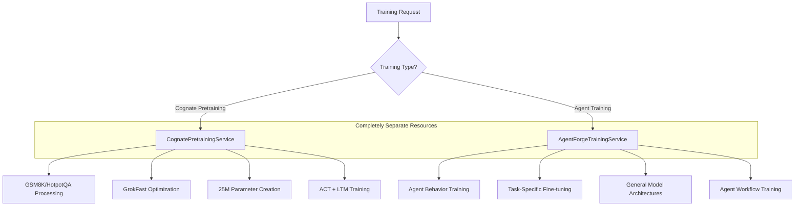
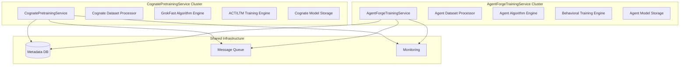

# Cognate Pretraining and Agent Forge Training Architecture Separation

## Executive Summary

This document defines the critical architectural correction separating Cognate model pretraining from general Agent Forge training operations. The current architecture incorrectly combines these fundamentally different concerns, which must be completely separated for proper system design.

## Problem Statement

**CRITICAL ISSUE**: The existing training architecture conflates Cognate model pretraining with general agent training workflows. These are fundamentally different operations:

- **Cognate Pretraining**: Creating 25M parameter foundation models from scratch with specialized algorithms
- **Agent Training**: Task-specific fine-tuning and behavior training for various agent architectures

This conflation leads to:
- Inappropriate algorithm application
- Resource contention
- Architectural confusion
- Maintenance complexity
- Poor separation of concerns

## Architectural Solution: Complete Service Separation

### Core Principle: Independent Services with Different Purposes



## Service Architecture Details

### 1. CognatePretrainingService

**Purpose**: Dedicated to creating 25M parameter Cognate foundation models

**Responsibilities**:
- Real pretraining from scratch with GSM8K, HotpotQA datasets
- GrokFast optimization specifically for Cognate architecture
- ACT (Adaptive Computation Time) training implementation
- LTM (Long-Term Memory) cross-attention training
- Cognate-specific model architecture handling
- Foundation model checkpoint management

**Key Characteristics**:
- **Dataset Focus**: Mathematical reasoning (GSM8K), multi-hop QA (HotpotQA)
- **Architecture**: Fixed 25M parameter Cognate specification
- **Optimization**: GrokFast with α=0.98, λ=2.0
- **Training Type**: Full pretraining from random initialization
- **Memory Systems**: ACT + LTM + Edit heads
- **Output**: Foundation models ready for downstream use

### 2. AgentForgeTrainingService

**Purpose**: General agent training workflows and fine-tuning

**Responsibilities**:
- Agent behavior training
- Task-specific model fine-tuning
- Multi-agent system training
- General model architecture support
- Agent workflow optimization
- Behavioral pattern learning

**Key Characteristics**:
- **Dataset Focus**: Task-specific datasets, behavioral training data
- **Architecture**: Various agent architectures (not limited to Cognate)
- **Optimization**: Standard training algorithms (Adam, AdamW, etc.)
- **Training Type**: Fine-tuning, behavior training, transfer learning
- **Memory Systems**: Task-appropriate memory architectures
- **Output**: Task-specific agents and fine-tuned models

## Critical Separation Points

### 1. Training Algorithms

**CognatePretrainingService**:
- GrokFast optimization (mandatory)
- ACT training loops
- LTM cross-attention training
- Cognate-specific loss functions
- Foundation model initialization

**AgentForgeTrainingService**:
- Standard optimizers (Adam, AdamW, SGD)
- Task-specific loss functions
- Transfer learning strategies
- Behavioral reward functions
- General fine-tuning approaches

### 2. Dataset Processing

**CognatePretrainingService**:
```python
# Specialized dataset processing for pretraining
class CognateDatasetProcessor:
    def process_gsm8k(self) -> PretrainingDataset
    def process_hotpot_qa(self) -> PretrainingDataset
    def create_mixed_pretraining_data(self) -> PretrainingDataset
    def apply_cognate_tokenization(self) -> TokenizedDataset
```

**AgentForgeTrainingService**:
```python
# General dataset processing for agent training
class AgentDatasetProcessor:
    def process_task_data(self, task_type: str) -> TaskDataset
    def create_behavioral_data(self) -> BehavioralDataset
    def apply_task_tokenization(self) -> TokenizedDataset
    def prepare_fine_tuning_data(self) -> FineTuningDataset
```

### 3. Resource Allocation

**CognatePretrainingService**:
- High-memory GPU allocation for 25M parameter training
- Extended training time allocation (hours to days)
- Dedicated compute resources for GrokFast
- Large dataset storage requirements

**AgentForgeTrainingService**:
- Flexible resource allocation based on task
- Shorter training sessions (minutes to hours)
- Shared compute resources
- Task-specific storage patterns

### 4. Progress Tracking

**CognatePretrainingService**:
```python
@dataclass
class CognatePretrainingProgress:
    model_parameters: int = 25_083_528
    grokfast_acceleration: float
    act_convergence: float
    ltm_attention_weights: Dict[str, float]
    pretraining_loss: float
    mathematical_reasoning_score: float
    multi_hop_qa_score: float
```

**AgentForgeTrainingService**:
```python
@dataclass
class AgentTrainingProgress:
    agent_type: str
    task_performance: Dict[str, float]
    behavioral_metrics: Dict[str, float]
    fine_tuning_loss: float
    transfer_learning_efficiency: float
    agent_specific_metrics: Dict[str, Any]
```

## Service Interfaces

### CognatePretrainingService Interface

```python
class ICognatePretrainingService:
    async def start_cognate_pretraining(
        self, 
        config: CognatePretrainingConfig
    ) -> CognatePretrainingJob
    
    async def get_pretraining_progress(
        self, 
        job_id: str
    ) -> CognatePretrainingProgress
    
    async def get_foundation_model(
        self, 
        job_id: str
    ) -> CognateFoundationModel
    
    async def validate_cognate_model(
        self, 
        model: CognateFoundationModel
    ) -> CognateValidationResult
```

### AgentForgeTrainingService Interface

```python
class IAgentForgeTrainingService:
    async def start_agent_training(
        self, 
        config: AgentTrainingConfig
    ) -> AgentTrainingJob
    
    async def get_training_progress(
        self, 
        job_id: str
    ) -> AgentTrainingProgress
    
    async def get_trained_agent(
        self, 
        job_id: str
    ) -> TrainedAgent
    
    async def validate_agent_performance(
        self, 
        agent: TrainedAgent
    ) -> AgentValidationResult
```

## Technology Stack Separation

### CognatePretrainingService Stack
- **Framework**: PyTorch with custom GrokFast implementation
- **Optimization**: Custom GrokFast optimizer
- **Datasets**: Hugging Face datasets (GSM8K, HotpotQA)
- **Architecture**: Fixed Cognate 25M parameter specification
- **Memory**: ACT + LTM implementations
- **Storage**: Foundation model checkpoints
- **Monitoring**: Pretraining-specific metrics

### AgentForgeTrainingService Stack
- **Framework**: PyTorch/TensorFlow (flexible)
- **Optimization**: Standard optimizers (Adam, AdamW, etc.)
- **Datasets**: Task-specific data sources
- **Architecture**: Various agent architectures
- **Memory**: Task-appropriate memory systems
- **Storage**: Agent checkpoints and behavioral models
- **Monitoring**: Task performance metrics

## Deployment Architecture



## Configuration Separation

### CognatePretrainingConfig
```yaml
cognate_pretraining:
  model_parameters: 25083528
  architecture: "cognate_v1"
  datasets:
    - "gsm8k"
    - "hotpot_qa"
  optimization:
    algorithm: "grokfast"
    alpha: 0.98
    lambda: 2.0
  features:
    act_enabled: true
    ltm_enabled: true
    edit_heads_enabled: true
  training:
    batch_size: 8
    learning_rate: 2e-4
    max_steps: 10000
    gradient_accumulation: 4
```

### AgentTrainingConfig
```yaml
agent_training:
  agent_type: "general_agent"
  base_model: "pretrained_cognate_or_other"
  training_type: "fine_tuning"
  datasets:
    - "task_specific_data"
  optimization:
    algorithm: "adamw"
    learning_rate: 1e-5
    weight_decay: 0.01
  features:
    behavioral_training: true
    task_adaptation: true
  training:
    batch_size: 16
    epochs: 5
    evaluation_steps: 100
```

## Error Handling and Recovery

### CognatePretrainingService Error Handling
- **GrokFast Convergence Failures**: Automatic parameter adjustment
- **ACT Training Issues**: Fallback to standard attention
- **LTM Memory Overflow**: Dynamic memory management
- **Dataset Processing Errors**: Automatic retry with backoff

### AgentForgeTrainingService Error Handling
- **Fine-tuning Divergence**: Learning rate adjustment
- **Task Performance Degradation**: Early stopping
- **Behavioral Training Issues**: Reward function adjustment
- **Memory Constraints**: Batch size optimization

## Service Communication

Services communicate through well-defined APIs but remain completely independent:

```python
# Example: Using a pretrained Cognate model in agent training
cognate_model = await cognate_service.get_foundation_model(job_id)
agent_config = AgentTrainingConfig(base_model=cognate_model.model_path)
agent_job = await agent_service.start_agent_training(agent_config)
```

## Quality Attributes

### CognatePretrainingService
- **Performance**: Optimized for large-scale pretraining
- **Reliability**: Checkpoint recovery and resumption
- **Scalability**: Multi-GPU distributed training
- **Maintainability**: Single-purpose, well-defined scope

### AgentForgeTrainingService
- **Flexibility**: Support multiple agent architectures
- **Extensibility**: Easy addition of new training algorithms
- **Performance**: Efficient fine-tuning and behavioral training
- **Usability**: Simple API for various training tasks

## Migration Strategy

1. **Phase 1**: Create CognatePretrainingService with current Cognate training logic
2. **Phase 2**: Create AgentForgeTrainingService with general training capabilities
3. **Phase 3**: Update all clients to use appropriate service
4. **Phase 4**: Remove conflated training logic from existing services
5. **Phase 5**: Optimize each service independently

## Success Metrics

### CognatePretrainingService Success
- 25M parameter models created successfully
- GrokFast optimization showing 50x acceleration
- ACT and LTM features working correctly
- Mathematical reasoning performance on GSM8K
- Multi-hop QA performance on HotpotQA

### AgentForgeTrainingService Success
- Successful fine-tuning of various model architectures
- Behavioral training effectiveness
- Task-specific performance improvements
- Agent workflow optimization
- General training pipeline reliability

## Conclusion

This architectural separation is critical for system integrity. The CognatePretrainingService and AgentForgeTrainingService must be completely independent, each optimized for their specific purpose. This separation ensures:

1. **Clear Responsibilities**: Each service has a single, well-defined purpose
2. **Appropriate Algorithms**: Each service uses algorithms suited to its task
3. **Resource Optimization**: Resources allocated appropriately for each workload
4. **Maintainability**: Services can evolve independently
5. **Testability**: Each service can be tested in isolation
6. **Scalability**: Services can scale based on their specific needs

The conflation of these concerns in the current architecture is a fundamental design flaw that must be corrected for the system to function properly.