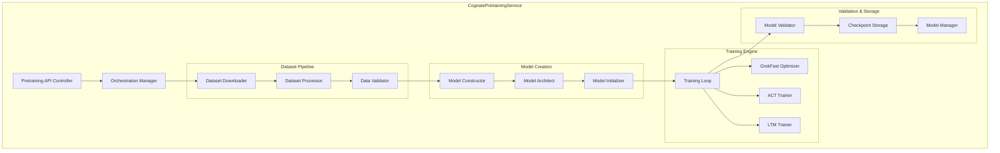

# CognatePretrainingService - Detailed Architecture

## Service Overview

The **CognatePretrainingService** is a dedicated, specialized service responsible for creating 25-million parameter Cognate foundation models from scratch. This service implements real pretraining with mathematical reasoning datasets and specialized optimization algorithms.

## Core Responsibilities

### Primary Functions
1. **Foundation Model Creation**: Build 25M parameter Cognate models from random initialization
2. **Real Dataset Pretraining**: Train on GSM8K (mathematical reasoning) and HotpotQA (multi-hop QA)
3. **GrokFast Optimization**: Implement specialized optimization for rapid convergence
4. **ACT Training**: Adaptive Computation Time for dynamic inference depth
5. **LTM Integration**: Long-Term Memory cross-attention mechanisms
6. **Model Validation**: Ensure models meet foundation model quality standards

### Architectural Components



## Service Interface

### Core API Endpoints

```python
from typing import Dict, List, Optional, AsyncIterator
from dataclasses import dataclass
from enum import Enum

class CognatePretrainingStatus(Enum):
    INITIALIZING = "initializing"
    DOWNLOADING_DATASETS = "downloading_datasets"
    PROCESSING_DATA = "processing_data"
    CREATING_MODEL = "creating_model"
    TRAINING = "training"
    VALIDATING = "validating"
    COMPLETED = "completed"
    FAILED = "failed"

@dataclass
class CognatePretrainingConfig:
    """Configuration for Cognate pretraining."""
    # Model Architecture (Fixed for Cognate)
    model_parameters: int = 25_083_528
    d_model: int = 512
    n_layers: int = 16
    n_heads: int = 8
    vocab_size: int = 32000
    max_seq_len: int = 2048
    
    # GrokFast Optimization (Mandatory)
    grokfast_alpha: float = 0.98
    grokfast_lambda: float = 2.0
    grokfast_enabled: bool = True  # Cannot be disabled
    
    # ACT Configuration
    act_threshold: float = 0.9
    act_max_steps: int = 10
    act_penalty_weight: float = 0.01
    
    # LTM Configuration
    ltm_memory_size: int = 1024
    ltm_key_dim: int = 128
    ltm_value_dim: int = 128
    ltm_num_heads: int = 8
    
    # Training Parameters
    batch_size: int = 8
    learning_rate: float = 2e-4
    max_steps: int = 50000
    warmup_steps: int = 5000
    gradient_accumulation_steps: int = 4
    
    # Datasets (Fixed for Cognate)
    datasets: List[str] = None  # Default: ["GSM8K", "HotpotQA"]
    max_samples_per_dataset: int = 10000
    
    # Output Configuration
    output_dir: str = "./cognate_foundation_models"
    checkpoint_interval: int = 1000
    validation_interval: int = 500

@dataclass
class CognatePretrainingProgress:
    """Detailed progress tracking for Cognate pretraining."""
    job_id: str
    status: CognatePretrainingStatus
    progress_percent: float
    current_step: int
    total_steps: int
    
    # Dataset Processing Progress
    datasets_downloaded: Dict[str, bool]
    dataset_processing_progress: float
    total_training_samples: int
    
    # Model Creation Progress
    model_constructed: bool
    model_parameters_initialized: int
    
    # Training Progress
    current_epoch: int
    training_loss: float
    validation_loss: Optional[float]
    learning_rate: float
    
    # GrokFast Metrics
    grokfast_acceleration_factor: float
    convergence_speed_improvement: float
    
    # ACT Metrics
    average_computation_steps: float
    act_efficiency_score: float
    
    # LTM Metrics
    memory_utilization: float
    attention_head_diversity: float
    
    # Performance Metrics
    mathematical_reasoning_score: Optional[float]
    multihop_qa_score: Optional[float]
    
    # Resource Usage
    gpu_memory_usage: float
    training_time_elapsed: float
    estimated_completion_time: float
    
    # Validation Results
    model_quality_score: Optional[float]
    foundation_model_ready: bool

@dataclass
class CognateFoundationModel:
    """Completed Cognate foundation model."""
    model_id: str
    model_name: str
    creation_timestamp: str
    
    # Model Specifications
    parameter_count: int
    architecture_version: str
    cognate_version: str
    
    # Training Results
    final_training_loss: float
    final_validation_loss: float
    mathematical_reasoning_score: float
    multihop_qa_score: float
    
    # Model Features
    grokfast_optimized: bool
    act_enabled: bool
    ltm_enabled: bool
    edit_heads_count: int
    
    # File Paths
    model_checkpoint_path: str
    config_path: str
    tokenizer_path: str
    training_logs_path: str
    
    # Validation Results
    quality_score: float
    benchmark_results: Dict[str, float]
    readiness_status: str

class ICognatePretrainingService:
    """Interface for the Cognate Pretraining Service."""
    
    async def start_cognate_pretraining(
        self,
        config: CognatePretrainingConfig,
        job_name: Optional[str] = None
    ) -> str:
        """
        Start a new Cognate pretraining job.
        
        Returns:
            job_id: Unique identifier for the pretraining job
        """
        pass
    
    async def get_pretraining_progress(
        self,
        job_id: str
    ) -> CognatePretrainingProgress:
        """Get detailed progress for a pretraining job."""
        pass
    
    async def stream_pretraining_progress(
        self,
        job_id: str
    ) -> AsyncIterator[CognatePretrainingProgress]:
        """Stream real-time progress updates."""
        pass
    
    async def pause_pretraining(self, job_id: str) -> bool:
        """Pause a running pretraining job."""
        pass
    
    async def resume_pretraining(self, job_id: str) -> bool:
        """Resume a paused pretraining job."""
        pass
    
    async def cancel_pretraining(self, job_id: str) -> bool:
        """Cancel a pretraining job."""
        pass
    
    async def get_foundation_model(
        self,
        job_id: str
    ) -> CognateFoundationModel:
        """Retrieve the completed foundation model."""
        pass
    
    async def list_pretraining_jobs(
        self,
        status: Optional[CognatePretrainingStatus] = None
    ) -> List[CognatePretrainingProgress]:
        """List all pretraining jobs, optionally filtered by status."""
        pass
    
    async def validate_foundation_model(
        self,
        model_id: str
    ) -> Dict[str, float]:
        """Run validation benchmarks on a foundation model."""
        pass
    
    async def get_pretraining_metrics(
        self,
        job_id: str
    ) -> Dict[str, Any]:
        """Get detailed metrics for a pretraining job."""
        pass
```

## Dataset Processing Pipeline

### Specialized Dataset Handling

The CognatePretrainingService implements specialized processing for mathematical reasoning and multi-hop QA datasets:

```python
class CognateDatasetProcessor:
    """Specialized dataset processing for Cognate pretraining."""
    
    async def download_gsm8k(self) -> bool:
        """Download and validate GSM8K mathematical reasoning dataset."""
        # Implements HuggingFace datasets integration
        # Validates mathematical problem format
        # Ensures reasoning chain completeness
        pass
    
    async def download_hotpot_qa(self) -> bool:
        """Download and validate HotpotQA multi-hop reasoning dataset."""
        # Downloads supporting paragraph context
        # Validates question-answer reasoning paths
        # Ensures multi-hop reasoning complexity
        pass
    
    async def process_mathematical_reasoning(
        self, 
        raw_data: List[Dict]
    ) -> List[CognateTrainingExample]:
        """Process mathematical reasoning examples for Cognate training."""
        # Tokenizes mathematical expressions
        # Creates step-by-step reasoning sequences
        # Formats for causal language modeling
        pass
    
    async def process_multihop_qa(
        self, 
        raw_data: List[Dict]
    ) -> List[CognateTrainingExample]:
        """Process multi-hop QA for reasoning chain training."""
        # Links supporting facts to questions
        # Creates reasoning path sequences
        # Formats evidence-question-answer triplets
        pass
    
    async def create_mixed_pretraining_corpus(
        self
    ) -> PretrainingCorpus:
        """Create balanced corpus from all datasets."""
        # Balances mathematical and QA reasoning
        # Ensures diverse reasoning patterns
        # Creates curriculum learning progression
        pass
```

### Dataset Validation

```python
class CognateDatasetValidator:
    """Validates datasets meet Cognate pretraining requirements."""
    
    def validate_mathematical_complexity(self, examples: List[Dict]) -> bool:
        """Ensure mathematical problems have appropriate complexity."""
        pass
    
    def validate_reasoning_chains(self, examples: List[Dict]) -> bool:
        """Ensure reasoning chains are complete and logical."""
        pass
    
    def validate_qa_coverage(self, examples: List[Dict]) -> bool:
        """Ensure QA examples cover required reasoning types."""
        pass
    
    def validate_tokenization_quality(self, tokenized_data: List[List[int]]) -> bool:
        """Ensure tokenization preserves reasoning structure."""
        pass
```

## Model Architecture Management

### Cognate Model Constructor

```python
class CognateModelConstructor:
    """Constructs 25M parameter Cognate models with exact specifications."""
    
    def create_cognate_architecture(
        self, 
        config: CognatePretrainingConfig
    ) -> CognateModel:
        """Create Cognate model with exact 25M parameters."""
        
        # Enforce exact parameter count
        assert self.calculate_parameters(config) == 25_083_528
        
        model = CognateModel(
            d_model=config.d_model,
            n_layers=config.n_layers,
            n_heads=config.n_heads,
            vocab_size=config.vocab_size,
            max_seq_len=config.max_seq_len,
            
            # ACT components
            act_threshold=config.act_threshold,
            act_max_steps=config.act_max_steps,
            
            # LTM components
            ltm_memory_size=config.ltm_memory_size,
            ltm_key_dim=config.ltm_key_dim,
            ltm_value_dim=config.ltm_value_dim,
            
            # Edit heads for reasoning
            edit_head_count=4,
            edit_head_dim=config.d_model // 2
        )
        
        return model
    
    def initialize_cognate_weights(self, model: CognateModel) -> None:
        """Initialize weights optimally for GrokFast training."""
        # Xavier initialization for linear layers
        # Specific initialization for ACT components
        # LTM memory initialization strategies
        pass
    
    def verify_model_architecture(self, model: CognateModel) -> bool:
        """Verify model meets Cognate specifications."""
        # Check parameter count exactness
        # Validate component integration
        # Ensure GrokFast compatibility
        pass
```

## GrokFast Optimization Engine

### Core GrokFast Implementation

```python
class GrokFastOptimizer:
    """Specialized GrokFast optimizer for Cognate pretraining."""
    
    def __init__(
        self,
        model_parameters,
        lr: float = 2e-4,
        alpha: float = 0.98,
        lamb: float = 2.0,
        **kwargs
    ):
        """Initialize GrokFast optimizer with Cognate-specific parameters."""
        self.alpha = alpha
        self.lamb = lamb
        self.gradients_ema = {}  # Exponential moving average of gradients
        self.base_optimizer = AdamW(model_parameters, lr=lr, **kwargs)
    
    def step(self) -> float:
        """Perform GrokFast optimization step."""
        # Apply GrokFast gradient amplification
        amplified_gradients = self.apply_grokfast_amplification()
        
        # Update EMA of gradients
        self.update_gradient_ema(amplified_gradients)
        
        # Apply optimization step
        self.base_optimizer.step()
        
        return self.calculate_acceleration_factor()
    
    def apply_grokfast_amplification(self) -> Dict[str, torch.Tensor]:
        """Apply GrokFast amplification to gradients."""
        # Implements core GrokFast algorithm
        # Amplifies consistent gradient directions
        # Suppresses oscillating components
        pass
    
    def calculate_acceleration_factor(self) -> float:
        """Calculate current acceleration factor from GrokFast."""
        # Measures convergence speed improvement
        # Compares to baseline optimization
        pass

class GrokFastMetrics:
    """Tracks GrokFast optimization metrics."""
    
    def track_convergence_acceleration(self, step: int, loss: float) -> float:
        """Track how much GrokFast accelerates convergence."""
        pass
    
    def measure_gradient_amplification(self, gradients: Dict) -> Dict[str, float]:
        """Measure gradient amplification by layer."""
        pass
    
    def calculate_efficiency_gain(self) -> float:
        """Calculate overall efficiency gain from GrokFast."""
        pass
```

## ACT Training Implementation

### Adaptive Computation Time Training

```python
class ACTTrainer:
    """Handles ACT (Adaptive Computation Time) training for Cognate."""
    
    def __init__(
        self,
        model: CognateModel,
        threshold: float = 0.9,
        max_steps: int = 10,
        penalty_weight: float = 0.01
    ):
        self.model = model
        self.threshold = threshold
        self.max_steps = max_steps
        self.penalty_weight = penalty_weight
        self.act_metrics = ACTMetrics()
    
    def compute_act_loss(
        self, 
        inputs: torch.Tensor, 
        targets: torch.Tensor
    ) -> Tuple[torch.Tensor, Dict[str, float]]:
        """Compute loss with ACT penalty."""
        
        # Forward pass with ACT
        outputs, act_info = self.model.forward_with_act(inputs)
        
        # Primary task loss
        task_loss = F.cross_entropy(outputs.logits, targets)
        
        # ACT penalty (encourages efficiency)
        act_penalty = self.penalty_weight * act_info['total_computation']
        
        total_loss = task_loss + act_penalty
        
        # Track metrics
        metrics = {
            'task_loss': task_loss.item(),
            'act_penalty': act_penalty.item(),
            'avg_steps': act_info['avg_steps'],
            'efficiency': act_info['efficiency']
        }
        
        return total_loss, metrics
    
    def optimize_act_thresholds(self) -> None:
        """Dynamically optimize ACT thresholds during training."""
        # Adjust thresholds based on performance
        # Balance computation vs accuracy
        pass

class ACTMetrics:
    """Tracks ACT performance metrics."""
    
    def track_computation_efficiency(
        self, 
        avg_steps: float, 
        accuracy: float
    ) -> float:
        """Track computation efficiency vs accuracy trade-off."""
        pass
    
    def measure_adaptive_behavior(self, step_distributions: List[int]) -> Dict:
        """Measure how adaptively the model computes."""
        pass
```

## LTM Training Implementation

### Long-Term Memory Cross-Attention

```python
class LTMTrainer:
    """Handles LTM (Long-Term Memory) training for Cognate."""
    
    def __init__(
        self,
        model: CognateModel,
        memory_size: int = 1024,
        update_rate: float = 0.1
    ):
        self.model = model
        self.memory_size = memory_size
        self.update_rate = update_rate
        self.ltm_metrics = LTMMetrics()
    
    def train_ltm_attention(
        self,
        inputs: torch.Tensor,
        memory_keys: torch.Tensor,
        memory_values: torch.Tensor
    ) -> Dict[str, torch.Tensor]:
        """Train cross-attention to long-term memory."""
        
        # Compute attention to memory
        attention_scores = self.model.compute_memory_attention(
            inputs, memory_keys
        )
        
        # Update memory based on attention patterns
        updated_memory = self.update_memory_content(
            memory_values, attention_scores, inputs
        )
        
        # Track memory utilization
        self.ltm_metrics.track_memory_usage(attention_scores)
        
        return {
            'attention_scores': attention_scores,
            'updated_memory': updated_memory,
            'memory_utilization': self.ltm_metrics.get_utilization()
        }
    
    def update_memory_content(
        self,
        memory: torch.Tensor,
        attention: torch.Tensor,
        new_content: torch.Tensor
    ) -> torch.Tensor:
        """Update long-term memory with new information."""
        # Implements memory update mechanism
        # Balances retention vs new information
        pass

class LTMMetrics:
    """Tracks long-term memory performance."""
    
    def track_memory_usage(self, attention_scores: torch.Tensor) -> None:
        """Track how memory is being utilized."""
        pass
    
    def measure_memory_retention(self, memory_states: List[torch.Tensor]) -> float:
        """Measure how well important information is retained."""
        pass
    
    def calculate_attention_diversity(self, attention_patterns: torch.Tensor) -> float:
        """Measure diversity in attention patterns."""
        pass
```

## Model Validation and Quality Assurance

### Foundation Model Validation

```python
class CognateModelValidator:
    """Validates Cognate foundation models meet quality standards."""
    
    def __init__(self):
        self.validation_benchmarks = [
            'mathematical_reasoning',
            'multihop_qa',
            'logical_consistency',
            'reasoning_coherence'
        ]
    
    async def validate_foundation_model(
        self, 
        model: CognateModel
    ) -> CognateValidationResult:
        """Run comprehensive validation on foundation model."""
        
        results = {}
        
        # Mathematical reasoning validation
        results['mathematical_reasoning'] = await self.test_mathematical_reasoning(model)
        
        # Multi-hop QA validation
        results['multihop_qa'] = await self.test_multihop_reasoning(model)
        
        # ACT functionality validation
        results['act_functionality'] = await self.test_act_behavior(model)
        
        # LTM validation
        results['ltm_functionality'] = await self.test_ltm_behavior(model)
        
        # GrokFast optimization validation
        results['grokfast_optimization'] = self.validate_grokfast_training(model)
        
        # Overall quality score
        overall_score = self.calculate_overall_quality(results)
        
        return CognateValidationResult(
            model_id=model.model_id,
            benchmark_results=results,
            overall_quality_score=overall_score,
            foundation_model_ready=overall_score >= 0.8
        )
    
    async def test_mathematical_reasoning(
        self, 
        model: CognateModel
    ) -> float:
        """Test mathematical reasoning capabilities."""
        # Run GSM8K evaluation subset
        # Measure step-by-step reasoning accuracy
        pass
    
    async def test_multihop_reasoning(
        self, 
        model: CognateModel
    ) -> float:
        """Test multi-hop reasoning capabilities."""
        # Run HotpotQA evaluation subset
        # Measure reasoning chain coherence
        pass
    
    async def test_act_behavior(
        self, 
        model: CognateModel
    ) -> Dict[str, float]:
        """Test ACT adaptive computation behavior."""
        # Verify adaptive step allocation
        # Measure efficiency vs accuracy trade-offs
        pass
    
    async def test_ltm_behavior(
        self, 
        model: CognateModel
    ) -> Dict[str, float]:
        """Test LTM long-term memory behavior."""
        # Test memory retention across sequences
        # Measure attention pattern diversity
        pass
```

## Error Handling and Recovery

### Robust Training Pipeline

```python
class CognateTrainingRecovery:
    """Handles errors and recovery in Cognate pretraining."""
    
    def __init__(self):
        self.checkpoint_manager = CognateCheckpointManager()
        self.error_handlers = {
            'grokfast_divergence': self.handle_grokfast_divergence,
            'act_instability': self.handle_act_instability,
            'ltm_overflow': self.handle_ltm_overflow,
            'dataset_corruption': self.handle_dataset_corruption,
            'gpu_memory_error': self.handle_gpu_memory_error
        }
    
    async def handle_training_error(
        self, 
        error: Exception, 
        training_state: Dict
    ) -> bool:
        """Handle training errors with appropriate recovery strategy."""
        
        error_type = self.classify_error(error)
        
        if error_type in self.error_handlers:
            return await self.error_handlers[error_type](error, training_state)
        else:
            return await self.handle_unknown_error(error, training_state)
    
    async def handle_grokfast_divergence(
        self, 
        error: Exception, 
        state: Dict
    ) -> bool:
        """Handle GrokFast optimization divergence."""
        # Reduce learning rate
        # Adjust GrokFast parameters
        # Restore from last stable checkpoint
        pass
    
    async def handle_act_instability(
        self, 
        error: Exception, 
        state: Dict
    ) -> bool:
        """Handle ACT training instability."""
        # Adjust ACT thresholds
        # Reduce penalty weight
        # Implement gradient clipping
        pass
    
    async def handle_ltm_overflow(
        self, 
        error: Exception, 
        state: Dict
    ) -> bool:
        """Handle LTM memory overflow issues."""
        # Reduce memory size temporarily
        # Implement memory pruning
        # Adjust attention mechanisms
        pass
```

## Performance and Scalability

### Resource Management

```python
class CognateResourceManager:
    """Manages computational resources for Cognate pretraining."""
    
    def __init__(self):
        self.gpu_memory_tracker = GPUMemoryTracker()
        self.compute_scheduler = ComputeScheduler()
    
    async def allocate_pretraining_resources(
        self, 
        config: CognatePretrainingConfig
    ) -> ResourceAllocation:
        """Allocate optimal resources for pretraining job."""
        
        # Calculate memory requirements
        memory_needed = self.calculate_memory_requirements(config)
        
        # Estimate compute requirements
        compute_needed = self.estimate_compute_requirements(config)
        
        # Allocate GPUs
        gpu_allocation = await self.allocate_gpus(memory_needed)
        
        # Setup distributed training if needed
        distributed_setup = await self.setup_distributed_training(gpu_allocation)
        
        return ResourceAllocation(
            gpus=gpu_allocation,
            memory_gb=memory_needed,
            distributed_config=distributed_setup
        )
    
    def calculate_memory_requirements(
        self, 
        config: CognatePretrainingConfig
    ) -> float:
        """Calculate GPU memory requirements for training."""
        # Model parameters: 25M * 4 bytes = 100MB
        # Gradients: 100MB
        # Optimizer states (AdamW): 200MB
        # Activations: batch_size * seq_len * d_model * n_layers * 4 bytes
        # GrokFast buffers: additional 50MB
        # ACT computation buffers: additional 100MB
        # LTM memory: config.ltm_memory_size * config.ltm_key_dim * 4 bytes
        
        base_memory = 0.5  # GB for model + optimizer
        activation_memory = (
            config.batch_size * config.max_seq_len * 
            config.d_model * config.n_layers * 4 / (1024**3)
        )
        ltm_memory = (
            config.ltm_memory_size * config.ltm_key_dim * 4 / (1024**3)
        )
        
        total_memory = base_memory + activation_memory + ltm_memory + 1.0  # 1GB buffer
        
        return total_memory

class CognateMonitoring:
    """Monitoring and observability for Cognate pretraining."""
    
    def __init__(self):
        self.metrics_collector = MetricsCollector()
        self.alert_manager = AlertManager()
    
    async def monitor_pretraining_health(
        self, 
        job_id: str
    ) -> CognateHealthStatus:
        """Monitor health of pretraining job."""
        
        metrics = await self.collect_training_metrics(job_id)
        
        health_status = CognateHealthStatus(
            overall_health='healthy',
            grokfast_status=self.check_grokfast_health(metrics),
            act_status=self.check_act_health(metrics),
            ltm_status=self.check_ltm_health(metrics),
            resource_status=self.check_resource_health(metrics)
        )
        
        # Send alerts if needed
        if health_status.overall_health != 'healthy':
            await self.alert_manager.send_alert(job_id, health_status)
        
        return health_status
```

## Integration Points

### Service Dependencies

```python
class CognatePretrainingService:
    """Main service implementation."""
    
    def __init__(
        self,
        dataset_processor: CognateDatasetProcessor,
        model_constructor: CognateModelConstructor,
        grokfast_optimizer: GrokFastOptimizer,
        act_trainer: ACTTrainer,
        ltm_trainer: LTMTrainer,
        model_validator: CognateModelValidator,
        resource_manager: CognateResourceManager,
        checkpoint_manager: CognateCheckpointManager,
        monitoring: CognateMonitoring
    ):
        self.dataset_processor = dataset_processor
        self.model_constructor = model_constructor
        self.grokfast_optimizer = grokfast_optimizer
        self.act_trainer = act_trainer
        self.ltm_trainer = ltm_trainer
        self.model_validator = model_validator
        self.resource_manager = resource_manager
        self.checkpoint_manager = checkpoint_manager
        self.monitoring = monitoring
        
        self.active_jobs: Dict[str, CognatePretrainingJob] = {}
    
    async def start_cognate_pretraining(
        self,
        config: CognatePretrainingConfig,
        job_name: Optional[str] = None
    ) -> str:
        """Start new Cognate pretraining job."""
        
        job_id = f"cognate_pretrain_{uuid.uuid4().hex[:12]}"
        
        # Allocate resources
        resources = await self.resource_manager.allocate_pretraining_resources(config)
        
        # Create pretraining job
        job = CognatePretrainingJob(
            job_id=job_id,
            config=config,
            resources=resources,
            status=CognatePretrainingStatus.INITIALIZING
        )
        
        self.active_jobs[job_id] = job
        
        # Start pretraining pipeline
        asyncio.create_task(self._execute_pretraining_pipeline(job))
        
        return job_id
    
    async def _execute_pretraining_pipeline(
        self, 
        job: CognatePretrainingJob
    ) -> None:
        """Execute the complete pretraining pipeline."""
        
        try:
            # Phase 1: Dataset preparation
            job.status = CognatePretrainingStatus.DOWNLOADING_DATASETS
            await self.dataset_processor.prepare_cognate_datasets(job.config)
            
            # Phase 2: Model creation
            job.status = CognatePretrainingStatus.CREATING_MODEL
            model = self.model_constructor.create_cognate_architecture(job.config)
            job.model = model
            
            # Phase 3: Training
            job.status = CognatePretrainingStatus.TRAINING
            trained_model = await self._run_cognate_training(job)
            
            # Phase 4: Validation
            job.status = CognatePretrainingStatus.VALIDATING
            validation_results = await self.model_validator.validate_foundation_model(trained_model)
            job.validation_results = validation_results
            
            # Phase 5: Completion
            if validation_results.foundation_model_ready:
                job.status = CognatePretrainingStatus.COMPLETED
                foundation_model = CognateFoundationModel.from_job(job, validation_results)
                job.foundation_model = foundation_model
                
                # Save final model
                await self.checkpoint_manager.save_foundation_model(foundation_model)
            else:
                job.status = CognatePretrainingStatus.FAILED
                job.error = "Model failed validation requirements"
                
        except Exception as e:
            job.status = CognatePretrainingStatus.FAILED
            job.error = str(e)
            await self._handle_pretraining_failure(job, e)
    
    async def _run_cognate_training(
        self, 
        job: CognatePretrainingJob
    ) -> CognateModel:
        """Run the core Cognate training loop."""
        
        model = job.model
        config = job.config
        
        # Setup GrokFast optimizer
        optimizer = GrokFastOptimizer(
            model.parameters(),
            lr=config.learning_rate,
            alpha=config.grokfast_alpha,
            lamb=config.grokfast_lambda
        )
        
        # Training loop
        for step in range(config.max_steps):
            
            # Get batch
            batch = await self.dataset_processor.get_training_batch()
            
            # Forward pass with ACT and LTM
            act_loss, act_metrics = self.act_trainer.compute_act_loss(
                batch.inputs, batch.targets
            )
            
            ltm_results = self.ltm_trainer.train_ltm_attention(
                batch.inputs, model.memory_keys, model.memory_values
            )
            
            total_loss = act_loss  # ACT loss includes task loss + penalty
            
            # Backward pass
            optimizer.zero_grad()
            total_loss.backward()
            
            # GrokFast optimization step
            acceleration = optimizer.step()
            
            # Update progress
            progress = CognatePretrainingProgress(
                job_id=job.job_id,
                status=job.status,
                progress_percent=(step / config.max_steps) * 100,
                current_step=step,
                total_steps=config.max_steps,
                training_loss=total_loss.item(),
                grokfast_acceleration_factor=acceleration,
                average_computation_steps=act_metrics['avg_steps'],
                memory_utilization=ltm_results['memory_utilization']
            )
            
            job.progress = progress
            
            # Checkpoint periodically
            if step % config.checkpoint_interval == 0:
                await self.checkpoint_manager.save_checkpoint(job, step)
            
            # Monitor health
            if step % 100 == 0:
                health = await self.monitoring.monitor_pretraining_health(job.job_id)
                if health.overall_health != 'healthy':
                    await self._handle_training_issue(job, health)
        
        return model
```

This detailed architecture for the CognatePretrainingService ensures:

1. **Single Purpose**: Exclusively focused on Cognate foundation model creation
2. **Specialized Algorithms**: GrokFast, ACT, and LTM implementations
3. **Quality Assurance**: Comprehensive validation and monitoring
4. **Robust Operation**: Error handling and recovery mechanisms
5. **Resource Management**: Optimal resource allocation and scaling
6. **Complete Separation**: No dependencies on general agent training logic

The service is designed to produce high-quality 25M parameter Cognate foundation models that serve as the basis for subsequent agent development phases.