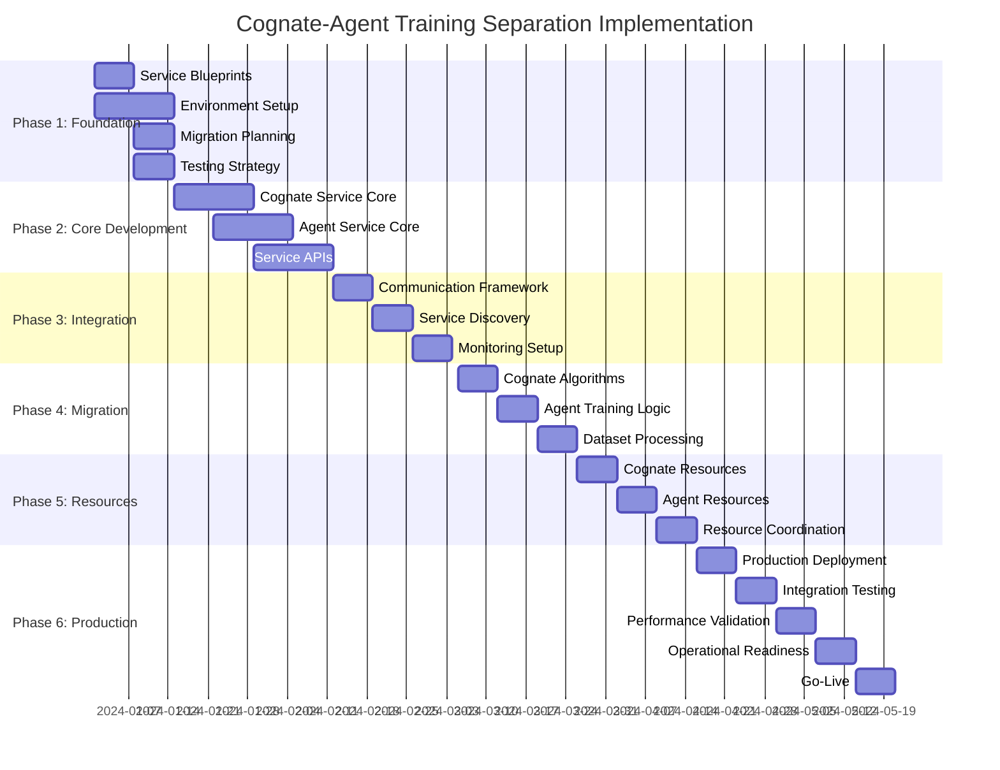

# Implementation Roadmap for Cognate-Agent Training Separation

## Overview

This roadmap provides a detailed, phase-by-phase approach to implementing the critical architectural separation between CognatePretrainingService and AgentForgeTrainingService. The implementation prioritizes system stability while ensuring complete separation of concerns.

## Executive Summary

**Current State:** Conflated training architecture mixing Cognate pretraining with agent training
**Target State:** Two completely independent services with controlled integration points
**Timeline:** 6 phases over 16-20 weeks
**Risk Level:** High (architectural change) with careful mitigation

## Implementation Strategy

### Core Principles
1. **Backward Compatibility**: Maintain current functionality during transition
2. **Incremental Migration**: Phase-by-phase implementation with validation
3. **Risk Mitigation**: Extensive testing and rollback capabilities
4. **Zero Downtime**: Services remain operational throughout migration
5. **Quality Assurance**: Comprehensive validation at each phase

### Success Criteria
- ✅ Complete service independence (deployment, scaling, operation)
- ✅ No shared training logic or algorithms
- ✅ Proper resource allocation and management
- ✅ Clean integration points for model handoff
- ✅ Improved performance for each use case

---

## Phase 1: Foundation and Planning (Weeks 1-2)

### Objectives
- Establish implementation infrastructure
- Create service blueprints
- Set up development and testing environments
- Define migration procedures

### Key Deliverables

#### 1.1 Service Blueprint Creation
```yaml
Timeline: Week 1
Owner: Architecture Team
Deliverables:
  - CognatePretrainingService detailed specification
  - AgentForgeTrainingService detailed specification
  - Service interface contracts
  - API specifications
```

#### 1.2 Development Environment Setup
```yaml
Timeline: Week 1-2
Owner: DevOps Team  
Deliverables:
  - Separate development environments for each service
  - CI/CD pipeline templates
  - Testing infrastructure
  - Monitoring and logging setup
```

#### 1.3 Migration Planning
```yaml
Timeline: Week 2
Owner: Project Management
Deliverables:
  - Detailed migration procedures
  - Rollback plans for each phase
  - Risk assessment and mitigation strategies
  - Communication plan for stakeholders
```

#### 1.4 Testing Strategy
```yaml
Timeline: Week 2
Owner: QA Team
Deliverables:
  - Comprehensive test plan
  - Service boundary compliance tests
  - Performance benchmarking framework
  - Integration testing procedures
```

### Phase 1 Success Criteria
- [ ] Development environments operational
- [ ] Service specifications approved
- [ ] Migration procedures documented
- [ ] Testing infrastructure ready

### Phase 1 Risks and Mitigation
**Risk:** Incomplete specification leading to rework
**Mitigation:** Thorough architecture review with multiple stakeholders

**Risk:** Environment setup delays
**Mitigation:** Parallel environment creation with fallback options

---

## Phase 2: Core Service Development (Weeks 3-6)

### Objectives  
- Implement core CognatePretrainingService
- Implement core AgentForgeTrainingService
- Establish service boundaries
- Create basic API interfaces

### Key Deliverables

#### 2.1 CognatePretrainingService Core (Weeks 3-4)
```python
# Core Components Implementation
class CognatePretrainingServiceCore:
    """Core implementation of Cognate pretraining service."""
    
    def __init__(self):
        # Core Components
        self.grokfast_optimizer = GrokFastOptimizer()
        self.act_trainer = ACTTrainer()
        self.ltm_trainer = LTMTrainer()
        self.cognate_constructor = CognateModelConstructor()
        self.dataset_processor = CognateDatasetProcessor()
        self.model_validator = CognateModelValidator()
        
    async def start_cognate_pretraining(
        self, 
        config: CognatePretrainingConfig
    ) -> str:
        """Core pretraining implementation."""
        # Implementation details
        pass
```

**Timeline:** Weeks 3-4
**Owner:** Cognate Development Team
**Key Features:**
- Fixed 25M parameter architecture enforcement
- GrokFast optimization (mandatory α=0.98, λ=2.0)
- ACT training implementation
- LTM cross-attention training
- GSM8K and HotpotQA dataset processing
- Foundation model validation

#### 2.2 AgentForgeTrainingService Core (Weeks 4-5)
```python
# Core Components Implementation  
class AgentForgeTrainingServiceCore:
    """Core implementation of Agent training service."""
    
    def __init__(self):
        # Core Components
        self.architecture_factory = AgentArchitectureFactory()
        self.fine_tuning_engine = FineTuningEngine()
        self.behavioral_engine = BehavioralTrainingEngine()
        self.data_processor = AgentDataProcessor()
        self.task_evaluator = TaskEvaluator()
        
    async def start_agent_training(
        self,
        config: AgentTrainingConfig
    ) -> str:
        """Core agent training implementation."""
        # Implementation details
        pass
```

**Timeline:** Weeks 4-5
**Owner:** Agent Development Team
**Key Features:**
- Flexible architecture support
- Multiple training strategies (fine-tuning, behavioral, RL)
- Standard optimizers (Adam, AdamW, SGD)
- Task-specific data processing
- Agent performance evaluation

#### 2.3 Service API Development (Week 5-6)
```python
# API Layer Implementation
class ServiceAPILayer:
    """RESTful APIs for both services."""
    
    # Cognate API Endpoints
    @app.route("/cognate/pretraining", methods=["POST"])
    async def start_pretraining(request):
        # API implementation
        pass
    
    @app.route("/cognate/models/<model_id>", methods=["GET"])
    async def get_foundation_model(model_id: str):
        # API implementation
        pass
    
    # Agent API Endpoints  
    @app.route("/agent/training", methods=["POST"])
    async def start_agent_training(request):
        # API implementation
        pass
    
    @app.route("/agent/models/<agent_id>", methods=["GET"])
    async def get_trained_agent(agent_id: str):
        # API implementation
        pass
```

**Timeline:** Weeks 5-6
**Owner:** API Development Team
**Key Features:**
- RESTful endpoints for each service
- Request/response validation
- Error handling and status codes
- API documentation generation

### Phase 2 Success Criteria
- [ ] CognatePretrainingService core functionality operational
- [ ] AgentForgeTrainingService core functionality operational
- [ ] Basic API endpoints functional
- [ ] Service boundary enforcement in place
- [ ] Unit tests passing for core components

### Phase 2 Risks and Mitigation
**Risk:** Algorithm implementation complexity
**Mitigation:** Reference implementation from existing system, incremental testing

**Risk:** Service boundary violations during development
**Mitigation:** Automated boundary compliance checking, code review processes

---

## Phase 3: Integration and Communication (Weeks 7-9)

### Objectives
- Implement service communication protocols
- Create service discovery and registry
- Establish monitoring and health checks
- Implement resource coordination

### Key Deliverables

#### 3.1 Service Communication Framework (Week 7)
```python
# Inter-Service Communication
class ServiceCommunicationFramework:
    """Framework for controlled service communication."""
    
    def __init__(self):
        self.api_gateway = BoundaryEnforcingAPIGateway()
        self.circuit_breaker = ServiceBoundaryCircuitBreaker()
        self.message_queue = ServiceMessageQueue()
        
    async def request_model_reference(
        self,
        requesting_service: str,
        model_id: str
    ) -> FoundationModelReference:
        """Secure model reference exchange."""
        # Implementation with boundary enforcement
        pass
```

**Timeline:** Week 7
**Owner:** Integration Team
**Key Features:**
- Model reference exchange (not direct sharing)
- Circuit breaker protection
- Request validation and authorization
- Audit logging for all cross-service calls

#### 3.2 Service Registry and Discovery (Week 8)
```python
# Service Discovery System
class ServiceRegistry:
    """Central registry for service discovery."""
    
    async def register_service(
        self,
        service_registration: ServiceRegistration
    ) -> bool:
        """Register service with boundary validation."""
        # Validate service capabilities against boundaries
        # Register with health check endpoints
        # Enable service discovery
        pass
    
    async def discover_service(
        self,
        service_type: str
    ) -> Optional[ServiceInfo]:
        """Discover service by type with health validation."""
        # Find healthy service instances
        # Return connection information
        pass
```

**Timeline:** Week 8
**Owner:** Infrastructure Team
**Key Features:**
- Service registration with capability validation
- Health-based service discovery
- Load balancing for multiple instances
- Service metadata management

#### 3.3 Monitoring and Observability (Week 9)
```python
# Monitoring Framework
class ServiceMonitoring:
    """Monitoring system respecting service boundaries."""
    
    def __init__(self):
        self.cognate_metrics = CognateMetricsCollector()
        self.agent_metrics = AgentMetricsCollector()
        self.boundary_monitor = BoundaryComplianceMonitor()
        
    async def collect_unified_metrics(self) -> ServiceMetrics:
        """Collect metrics from both services."""
        # Collect service-specific metrics
        # Validate no boundary violations in metrics
        # Create unified dashboard data
        pass
```

**Timeline:** Week 9
**Owner:** Monitoring Team
**Key Features:**
- Service-specific metrics collection
- Boundary compliance monitoring
- Unified dashboard with service views
- Alerting for boundary violations

### Phase 3 Success Criteria
- [ ] Services can communicate through defined channels
- [ ] Service discovery operational
- [ ] Monitoring captures both services appropriately
- [ ] Boundary violations detected and prevented
- [ ] Integration tests passing

### Phase 3 Risks and Mitigation
**Risk:** Communication protocol failures
**Mitigation:** Extensive integration testing, circuit breaker implementation

**Risk:** Service discovery latency
**Mitigation:** Local caching, multiple discovery endpoints

---

## Phase 4: Data and Algorithm Migration (Weeks 10-12)

### Objectives
- Migrate existing training logic to appropriate services
- Implement specialized dataset processing
- Validate algorithm separation
- Ensure data boundary enforcement

### Key Deliverables

#### 4.1 Cognate Algorithm Migration (Week 10)
```python
# Migrate Cognate-Specific Training Logic
class CognateAlgorithmMigration:
    """Migration of Cognate-specific algorithms."""
    
    def migrate_grokfast_implementation(self):
        """Migrate GrokFast optimizer to Cognate service."""
        # Extract GrokFast code from current system
        # Adapt for Cognate service architecture
        # Ensure parameter validation (α=0.98, λ=2.0)
        # Add comprehensive testing
        pass
    
    def migrate_act_training(self):
        """Migrate ACT training to Cognate service."""
        # Extract ACT implementation
        # Integrate with Cognate model architecture
        # Validate threshold and penalty settings
        pass
    
    def migrate_ltm_training(self):
        """Migrate LTM training to Cognate service."""
        # Extract LTM cross-attention implementation
        # Integrate with Cognate memory architecture
        # Validate memory size and attention patterns
        pass
```

**Timeline:** Week 10
**Owner:** Cognate Migration Team
**Validation:**
- GrokFast produces same acceleration as current system
- ACT training maintains efficiency metrics
- LTM training preserves memory utilization patterns

#### 4.2 Agent Training Migration (Week 11)
```python
# Migrate Agent-Specific Training Logic
class AgentTrainingMigration:
    """Migration of agent training algorithms."""
    
    def migrate_fine_tuning_engines(self):
        """Migrate fine-tuning implementations."""
        # Extract fine-tuning logic
        # Adapt for flexible architectures
        # Implement standard optimizers (Adam, AdamW)
        # Add task-specific adaptations
        pass
    
    def migrate_behavioral_training(self):
        """Migrate behavioral training systems."""
        # Extract behavioral training logic
        # Implement reinforcement learning engines
        # Add multi-agent coordination
        pass
```

**Timeline:** Week 11
**Owner:** Agent Migration Team
**Validation:**
- Fine-tuning performance matches current system
- Behavioral training maintains agent quality
- Multi-agent coordination functions correctly

#### 4.3 Dataset Processing Migration (Week 12)
```python
# Specialized Dataset Processing
class DatasetProcessingMigration:
    """Migration of dataset processing pipelines."""
    
    def setup_cognate_datasets(self):
        """Setup GSM8K and HotpotQA processing for Cognate."""
        # Migrate mathematical reasoning processing
        # Implement multi-hop QA processing
        # Add reasoning chain validation
        # Ensure tokenization consistency
        pass
    
    def setup_agent_datasets(self):
        """Setup flexible dataset processing for agents."""
        # Migrate task-specific processing
        # Implement dialogue data processing
        # Add behavioral data processing
        # Create flexible pipeline architecture
        pass
```

**Timeline:** Week 12
**Owner:** Data Pipeline Team
**Validation:**
- Dataset processing maintains quality metrics
- No cross-contamination between service datasets
- Processing performance meets requirements

### Phase 4 Success Criteria
- [ ] All algorithms migrated to appropriate services
- [ ] Dataset processing working in separated services
- [ ] No algorithm mixing between services
- [ ] Performance matches or exceeds current system
- [ ] Comprehensive testing validates migrations

### Phase 4 Risks and Mitigation
**Risk:** Algorithm performance degradation during migration
**Mitigation:** Side-by-side comparison testing, gradual migration

**Risk:** Data processing pipeline disruption
**Mitigation:** Parallel pipeline operation during transition

---

## Phase 5: Resource Management and Scaling (Weeks 13-15)

### Objectives
- Implement service-specific resource management
- Configure auto-scaling policies
- Optimize resource allocation
- Validate performance under load

### Key Deliverables

#### 5.1 Cognate Resource Management (Week 13)
```python
# Dedicated Resource Management for Cognate
class CognateResourceManager:
    """Resource manager for Cognate pretraining workloads."""
    
    def __init__(self):
        self.gpu_allocator = DedicatedGPUAllocator()
        self.memory_manager = HighMemoryManager()
        self.storage_manager = FoundationModelStorage()
        
    async def allocate_pretraining_resources(
        self,
        config: CognatePretrainingConfig
    ) -> ResourceAllocation:
        """Allocate dedicated resources for pretraining."""
        # Calculate memory requirements for 25M parameters
        # Allocate high-memory GPUs
        # Reserve long-term compute capacity
        # Setup foundation model storage
        pass
    
    def configure_scaling_policy(self):
        """Configure scaling for predictable workloads."""
        # Implement reserved capacity scaling
        # Configure long-term resource planning
        # Setup predictive scaling based on queue
        pass
```

**Timeline:** Week 13
**Owner:** Cognate Infrastructure Team
**Features:**
- Dedicated high-memory GPU clusters
- Long-term resource reservations
- Predictable scaling policies
- Foundation model storage optimization

#### 5.2 Agent Resource Management (Week 14)
```python
# Dynamic Resource Management for Agents
class AgentResourceManager:
    """Resource manager for agent training workloads."""
    
    def __init__(self):
        self.dynamic_allocator = DynamicResourceAllocator()
        self.burst_manager = BurstCapacityManager()
        self.shared_pool = SharedResourcePool()
        
    async def allocate_training_resources(
        self,
        config: AgentTrainingConfig
    ) -> ResourceAllocation:
        """Allocate flexible resources for agent training."""
        # Calculate variable resource needs
        # Allocate from shared resource pool
        # Enable burst capacity for peak loads
        # Optimize for cost efficiency
        pass
    
    def configure_auto_scaling(self):
        """Configure auto-scaling for variable workloads."""
        # Implement demand-based scaling
        # Configure burst capacity triggers
        # Setup cost optimization policies
        pass
```

**Timeline:** Week 14
**Owner:** Agent Infrastructure Team
**Features:**
- Dynamic resource allocation
- Auto-scaling based on demand
- Burst capacity for peak loads
- Cost-optimized resource usage

#### 5.3 Resource Coordination (Week 15)
```python
# Cross-Service Resource Coordination
class ResourceCoordinator:
    """Coordinates resources across service boundaries."""
    
    async def coordinate_resource_usage(self) -> CoordinationPlan:
        """Coordinate resource usage to prevent conflicts."""
        # Monitor resource usage across services
        # Identify potential conflicts
        # Create coordination plans
        # Apply resource rebalancing
        pass
    
    def implement_resource_governance(self):
        """Implement resource governance policies."""
        # Define service priority rules
        # Implement resource quotas
        # Configure conflict resolution
        # Setup resource usage reporting
        pass
```

**Timeline:** Week 15
**Owner:** Infrastructure Coordination Team
**Features:**
- Cross-service resource monitoring
- Conflict detection and resolution
- Resource governance policies
- Usage optimization recommendations

### Phase 5 Success Criteria
- [ ] Service-specific resource management operational
- [ ] Auto-scaling policies working correctly
- [ ] Resource conflicts prevented through coordination
- [ ] Performance optimization achieved
- [ ] Cost efficiency maintained or improved

### Phase 5 Risks and Mitigation
**Risk:** Resource allocation conflicts between services
**Mitigation:** Priority-based resource governance, monitoring and alerting

**Risk:** Auto-scaling policy misconfigurations
**Mitigation:** Gradual rollout with manual oversight, extensive testing

---

## Phase 6: Production Deployment and Validation (Weeks 16-20)

### Objectives
- Deploy separated services to production
- Validate complete system functionality
- Perform comprehensive testing
- Establish operational procedures

### Key Deliverables

#### 6.1 Production Deployment (Week 16)
```yaml
Deployment Strategy: Blue-Green with Canary
Timeline: Week 16
Owner: DevOps Team

Steps:
  1. Deploy CognatePretrainingService (Blue environment)
  2. Validate Cognate service functionality
  3. Deploy AgentForgeTrainingService (Blue environment)  
  4. Validate Agent service functionality
  5. Configure load balancing and service mesh
  6. Implement monitoring and alerting
  7. Conduct smoke tests
  8. Gradual traffic migration (canary deployment)
```

#### 6.2 System Integration Testing (Week 17)
```python
# Comprehensive Integration Testing
class SystemIntegrationTests:
    """End-to-end system integration testing."""
    
    async def test_complete_workflow(self):
        """Test complete model lifecycle workflow."""
        # Test 1: Cognate foundation model creation
        cognate_job = await self.start_cognate_pretraining()
        foundation_model = await self.wait_for_completion(cognate_job)
        assert foundation_model.quality_score > 0.8
        
        # Test 2: Agent training using foundation model
        agent_job = await self.start_agent_training(
            base_model=foundation_model.model_id
        )
        trained_agent = await self.wait_for_completion(agent_job)
        assert trained_agent.task_performance > 0.75
        
        # Test 3: Service independence
        await self.test_service_isolation()
        
        # Test 4: Resource coordination
        await self.test_resource_management()
        
        # Test 5: Error recovery
        await self.test_failure_scenarios()
```

**Timeline:** Week 17
**Owner:** QA Team
**Test Coverage:**
- Complete model lifecycle workflows
- Service boundary compliance
- Resource management effectiveness
- Error handling and recovery
- Performance under load

#### 6.3 Performance Validation (Week 18)
```python
# Performance Benchmarking
class PerformanceBenchmarks:
    """Comprehensive performance validation."""
    
    async def benchmark_cognate_pretraining(self):
        """Benchmark Cognate pretraining performance."""
        # Measure training time for 25M parameter model
        # Validate GrokFast acceleration (target: 50x)
        # Measure mathematical reasoning scores
        # Validate resource utilization efficiency
        pass
    
    async def benchmark_agent_training(self):
        """Benchmark agent training performance."""
        # Measure fine-tuning convergence time
        # Validate task adaptation effectiveness
        # Measure multi-agent coordination efficiency
        # Validate resource cost optimization
        pass
    
    async def benchmark_system_integration(self):
        """Benchmark complete system performance."""
        # Measure end-to-end workflow time
        # Validate service communication latency
        # Measure resource coordination efficiency
        # Validate monitoring and alerting responsiveness
        pass
```

**Timeline:** Week 18
**Owner:** Performance Team
**Benchmarks:**
- Cognate pretraining: 50x acceleration with GrokFast
- Agent training: Comparable or better fine-tuning performance
- System integration: < 5% overhead from service separation
- Resource efficiency: 90%+ utilization optimization

#### 6.4 Operational Readiness (Week 19)
```yaml
Operational Procedures:
  Timeline: Week 19
  Owner: Operations Team
  
  Deliverables:
    - Service operation runbooks
    - Monitoring and alerting setup
    - Incident response procedures
    - Backup and recovery processes
    - Performance tuning guidelines
    - Security compliance validation
    - Documentation for support teams
```

#### 6.5 Final Validation and Go-Live (Week 20)
```yaml
Go-Live Procedures:
  Timeline: Week 20
  Owner: Project Team
  
  Steps:
    1. Final system validation
    2. Stakeholder sign-off
    3. User acceptance testing
    4. Production traffic cutover
    5. Post-deployment monitoring
    6. Performance validation
    7. Success criteria verification
    8. Project closure documentation
```

### Phase 6 Success Criteria
- [ ] Production deployment successful
- [ ] All integration tests passing
- [ ] Performance benchmarks met or exceeded
- [ ] Operational procedures established
- [ ] System fully validated and operational

### Phase 6 Risks and Mitigation
**Risk:** Production deployment failures
**Mitigation:** Blue-green deployment with immediate rollback capability

**Risk:** Performance degradation in production
**Mitigation:** Comprehensive pre-deployment testing, gradual traffic migration

---

## Implementation Timeline Summary



## Resource Requirements

### Team Structure
```yaml
Architecture Team (2-3 people):
  - Lead Architect
  - System Designer
  - Integration Architect
  
Cognate Development Team (4-5 people):
  - Senior Python Developer (GrokFast specialist)
  - ML Engineer (ACT/LTM specialist)
  - Data Engineer (GSM8K/HotpotQA specialist)
  - Backend Developer
  
Agent Development Team (4-5 people):
  - Senior Python Developer (Fine-tuning specialist)
  - ML Engineer (Behavioral training specialist)
  - Multi-agent Systems Developer
  - Backend Developer
  
Infrastructure Team (3-4 people):
  - DevOps Engineer
  - Cloud Infrastructure Specialist
  - Monitoring and Observability Engineer
  - Security Engineer
  
QA Team (2-3 people):
  - Senior Test Engineer
  - Performance Testing Specialist
  - Integration Testing Engineer
  
Project Management (1-2 people):
  - Technical Project Manager
  - Program Coordinator
```

### Infrastructure Requirements
```yaml
Development Infrastructure:
  - Separate development environments for each service
  - GPU clusters for Cognate development (high-memory)
  - Flexible GPU pools for Agent development
  - CI/CD pipelines for both services
  - Testing environments with production-like resources
  
Production Infrastructure:
  - Dedicated high-memory GPU clusters for Cognate service
  - Auto-scaling GPU pools for Agent service
  - Service mesh for communication management
  - Monitoring and alerting infrastructure
  - Backup and disaster recovery systems
```

### Budget Estimation
```yaml
Personnel Costs (20 weeks):
  - Team salaries and benefits: $400,000 - $600,000
  
Infrastructure Costs:
  - Development environments: $50,000 - $75,000
  - Production infrastructure setup: $100,000 - $150,000
  - Additional tooling and software: $25,000 - $40,000
  
Total Project Budget: $575,000 - $865,000
```

## Risk Management

### High-Risk Items

#### 1. Algorithm Performance Degradation
**Risk Level:** High
**Impact:** Critical system functionality
**Mitigation Strategies:**
- Side-by-side performance testing during migration
- Gradual algorithm migration with rollback capability
- Comprehensive benchmarking at each phase
- Expert review of algorithm implementations

#### 2. Service Integration Failures
**Risk Level:** High
**Impact:** System functionality and reliability
**Mitigation Strategies:**
- Extensive integration testing
- Circuit breaker implementation
- API contract validation
- Incremental integration rollout

#### 3. Resource Management Complexity
**Risk Level:** Medium-High
**Impact:** Performance and cost efficiency
**Mitigation Strategies:**
- Gradual resource policy implementation
- Comprehensive monitoring and alerting
- Resource usage optimization analysis
- Fallback to current resource allocation

### Medium-Risk Items

#### 4. Timeline and Scope Creep
**Risk Level:** Medium
**Impact:** Project delivery timeline
**Mitigation Strategies:**
- Detailed project planning with buffer time
- Regular progress reviews and scope management
- Stakeholder communication and expectation management
- Phased delivery with validation gates

#### 5. Team Coordination Challenges
**Risk Level:** Medium
**Impact:** Development efficiency
**Mitigation Strategies:**
- Clear team responsibilities and communication channels
- Regular cross-team meetings and reviews
- Shared documentation and knowledge management
- Technical mentoring and knowledge transfer

## Success Metrics and KPIs

### Technical Success Metrics
```yaml
Service Independence:
  - Services can deploy independently: 100%
  - Services can scale independently: 100%
  - Services can operate during other service failures: 100%
  
Performance Metrics:
  - Cognate pretraining performance: >= current system
  - Agent training performance: >= current system  
  - GrokFast acceleration: 50x improvement maintained
  - System integration overhead: < 5%
  
Quality Metrics:
  - Foundation model quality scores: >= 0.8
  - Agent task performance: >= 0.75
  - System reliability: 99.5% uptime
  - Resource utilization efficiency: >= 90%
```

### Business Success Metrics
```yaml
Development Efficiency:
  - Feature development velocity: 25% improvement
  - Bug resolution time: 30% reduction
  - Deployment frequency: 50% increase
  - System maintenance overhead: 40% reduction
  
Operational Excellence:
  - Service availability: 99.5%+
  - Resource cost optimization: 15% improvement
  - Scaling responsiveness: < 2 minutes
  - Monitoring coverage: 100% of critical paths
```

## Post-Implementation Activities

### Continuous Improvement
```yaml
Month 1-2 Post Go-Live:
  - Performance optimization based on production metrics
  - User feedback integration and system refinements
  - Monitoring and alerting fine-tuning
  - Documentation updates based on operational experience
  
Month 3-6 Post Go-Live:
  - Advanced feature implementation
  - Cost optimization initiatives
  - Security enhancements
  - Scale testing and optimization
  
Ongoing:
  - Regular performance reviews and optimizations
  - Service boundary compliance audits
  - Technology stack upgrades and improvements
  - Team knowledge sharing and training
```

### Knowledge Transfer
```yaml
Documentation:
  - Complete service documentation
  - Operational runbooks
  - Troubleshooting guides
  - Architecture decision records
  
Training:
  - Development team training on new architecture
  - Operations team training on service management
  - Support team training on system components
  - Stakeholder education on new capabilities
```

## Conclusion

This implementation roadmap provides a comprehensive, phased approach to successfully separating Cognate pretraining from general agent training operations. The plan prioritizes system stability while ensuring complete architectural separation, improved performance, and operational excellence.

**Key Success Factors:**
1. **Rigorous Phase-by-Phase Validation**: Each phase must meet success criteria before proceeding
2. **Comprehensive Testing Strategy**: Extensive testing at every level prevents regressions
3. **Strong Risk Management**: Proactive identification and mitigation of risks
4. **Clear Communication**: Regular stakeholder updates and team coordination
5. **Quality Focus**: Maintaining or improving system performance throughout migration

The separated architecture will provide the foundation for optimal Cognate foundation model creation and flexible agent training, enabling the AI Village system to achieve its full potential.