# Service Boundaries and Interactions

## Overview

This document provides a comprehensive analysis of the boundaries and interactions between the CognatePretrainingService and AgentForgeTrainingService, establishing clear demarcation lines and controlled integration points.

## Service Boundary Definition

### Fundamental Principle: Complete Operational Independence

The two services are designed to be **completely operationally independent** while maintaining **minimal, controlled integration points** for legitimate business needs.

```mermaid
graph TB
    subgraph "CognatePretrainingService Boundary"
        CPS[CognatePretrainingService]
        
        subgraph "Cognate Internal Components"
            CGD[Cognate Dataset Processor]
            CMA[Cognate Model Architect]
            CGF[GrokFast Optimizer]
            CAT[ACT Trainer]
            CLT[LTM Trainer]
            CMV[Cognate Model Validator]
        end
        
        subgraph "Cognate Resources"
            CDR[Dedicated GPU Clusters]
            CDS[Foundation Model Storage]
            CLG[Cognate Training Logs]
        end
        
        CPS --> CGD
        CPS --> CMA
        CPS --> CGF
        CPS --> CAT
        CPS --> CLT
        CPS --> CMV
        CPS --> CDR
        CPS --> CDS
        CPS --> CLG
    end
    
    subgraph "AgentForgeTrainingService Boundary"
        ATS[AgentForgeTrainingService]
        
        subgraph "Agent Internal Components"
            AAF[Agent Architecture Factory]
            AFT[Fine-tuning Engine]
            ABT[Behavioral Training Engine]
            AMT[Multi-Agent Training Engine]
            ADP[Agent Data Processor]
            ATE[Task Evaluator]
        end
        
        subgraph "Agent Resources"
            ASR[Shared/Dynamic Resources]
            AMS[Agent Model Storage]
            ALG[Agent Training Logs]
        end
        
        ATS --> AAF
        ATS --> AFT
        ATS --> ABT
        ATS --> AMT
        ATS --> ADP
        ATS --> ATE
        ATS --> ASR
        ATS --> AMS
        ATS --> ALG
    end
    
    subgraph "Controlled Integration Points"
        API[Service APIs]
        SR[Service Registry]
        MQ[Message Queue]
        SM[Shared Monitoring]
    end
    
    CPS -.->|Model References Only| API
    ATS -.->|Model Requests Only| API
    CPS --> SR
    ATS --> SR
    CPS --> MQ
    ATS --> MQ
    CPS --> SM
    ATS --> SM
```



## Detailed Boundary Analysis

### CognatePretrainingService Boundary

#### What's INSIDE the Boundary

**Core Responsibilities:**
- Foundation model architecture definition (25M parameters exactly)
- GrokFast optimization algorithm implementation
- ACT (Adaptive Computation Time) training logic
- LTM (Long-Term Memory) cross-attention training
- GSM8K mathematical reasoning dataset processing
- HotpotQA multi-hop QA dataset processing
- Foundation model validation and quality assurance
- Cognate-specific checkpoint management

**Internal Components:**
```python
# Components that MUST remain inside Cognate boundary
class CognateInternalComponents:
    """Components exclusive to Cognate pretraining."""
    
    # Core Training Components
    grokfast_optimizer: GrokFastOptimizer
    act_training_engine: ACTTrainingEngine  
    ltm_training_engine: LTMTrainingEngine
    
    # Architecture Management
    cognate_model_constructor: CognateModelConstructor
    parameter_count_validator: ParameterCountValidator  # Exactly 25M
    
    # Dataset Processing
    gsm8k_processor: GSM8KProcessor
    hotpot_qa_processor: HotpotQAProcessor
    mathematical_reasoning_validator: MathReasoningValidator
    
    # Validation and Quality
    foundation_model_validator: FoundationModelValidator
    mathematical_benchmark: MathematicalBenchmark
    reasoning_chain_validator: ReasoningChainValidator
    
    # Resource Management
    dedicated_gpu_allocator: DedicatedGPUAllocator
    long_term_resource_manager: LongTermResourceManager
    
    # Monitoring and Metrics
    grokfast_metrics_collector: GrokFastMetricsCollector
    act_efficiency_monitor: ACTEfficiencyMonitor
    ltm_utilization_tracker: LTMUtilizationTracker
```

**Data Ownership:**
- GSM8K mathematical reasoning datasets
- HotpotQA multi-hop QA datasets
- Foundation model checkpoints and weights
- GrokFast optimization states
- ACT computation statistics
- LTM memory patterns
- Mathematical reasoning validation results

**Resource Control:**
- High-memory GPU clusters (dedicated allocation)
- Large-scale storage for foundation models
- Long-term compute reservations
- Specialized monitoring infrastructure

#### What's OUTSIDE the Boundary

**Explicitly Excluded:**
- Task-specific fine-tuning algorithms
- Agent behavioral training
- Multi-agent coordination
- Reinforcement learning implementations
- Dialogue or interaction training
- Domain-specific adaptation
- Standard optimizers (Adam, AdamW, SGD)
- Variable architecture support
- Short-term training sessions

### AgentForgeTrainingService Boundary

#### What's INSIDE the Boundary

**Core Responsibilities:**
- Agent architecture flexibility and variation
- Task-specific fine-tuning strategies
- Behavioral training and reinforcement learning
- Multi-agent system coordination
- Domain-specific dataset processing
- Agent performance evaluation
- Task adaptation and specialization
- Deployment-ready agent creation

**Internal Components:**
```python
# Components exclusive to Agent training
class AgentInternalComponents:
    """Components exclusive to agent training."""
    
    # Architecture Management
    agent_architecture_factory: AgentArchitectureFactory
    flexible_model_constructor: FlexibleModelConstructor
    architecture_adapter: ArchitectureAdapter
    
    # Training Strategies
    fine_tuning_engine: FineTuningEngine
    behavioral_training_engine: BehavioralTrainingEngine
    reinforcement_learning_engine: RLEngine
    multi_agent_training_engine: MultiAgentTrainingEngine
    
    # Standard Optimizers (NOT GrokFast)
    adam_optimizer: AdamOptimizer
    adamw_optimizer: AdamWOptimizer
    sgd_optimizer: SGDOptimizer
    learning_rate_schedulers: LRSchedulers
    
    # Task Processing
    task_dataset_processor: TaskDatasetProcessor
    dialogue_processor: DialogueProcessor
    behavioral_data_processor: BehavioralDataProcessor
    domain_specific_processors: DomainProcessors
    
    # Evaluation and Metrics
    task_evaluator: TaskEvaluator
    behavioral_metrics: BehavioralMetrics
    agent_performance_benchmarks: AgentBenchmarks
    
    # Resource Management
    dynamic_resource_allocator: DynamicResourceAllocator
    shared_resource_manager: SharedResourceManager
    burst_capacity_manager: BurstCapacityManager
```

**Data Ownership:**
- Task-specific training datasets
- Behavioral demonstration data
- Dialogue and interaction datasets
- Agent performance metrics
- Fine-tuned model checkpoints
- Task evaluation results
- Agent deployment configurations

**Resource Control:**
- Flexible GPU allocation (shared/dynamic)
- Variable storage for diverse agents
- Burst compute capacity
- Multi-tenant resource sharing

#### What's OUTSIDE the Boundary

**Explicitly Excluded:**
- Foundation model pretraining from scratch
- GrokFast optimization algorithm
- Mathematical reasoning dataset processing (GSM8K, HotpotQA)
- ACT training implementation
- LTM training implementation
- 25M parameter architecture enforcement
- Foundation model validation
- Dedicated pretraining resources

## Service Interaction Points

### 1. Model Reference Exchange

**Purpose:** Allow AgentForgeTrainingService to use completed Cognate foundation models

**Mechanism:** RESTful API with model references (not direct model sharing)

```python
class ModelReferenceAPI:
    """API for model reference exchange."""
    
    async def request_foundation_model_reference(
        self,
        model_id: str,
        requesting_service: str,
        intended_use: str
    ) -> FoundationModelReference:
        """
        Request reference to a completed foundation model.
        
        Args:
            model_id: Cognate foundation model identifier
            requesting_service: Must be 'agent_forge_training_service'
            intended_use: Purpose (e.g., 'fine_tuning', 'agent_base')
            
        Returns:
            FoundationModelReference with access information
            
        Note: Returns reference, not the actual model
        """
        
        # Validate request
        if requesting_service != "agent_forge_training_service":
            raise UnauthorizedServiceError()
        
        # Check model exists and is completed
        model_status = await self.cognate_service.get_model_status(model_id)
        if model_status != "completed":
            raise ModelNotReadyError()
        
        # Create time-limited reference
        reference = FoundationModelReference(
            model_id=model_id,
            access_path=f"/secure/models/cognate/{model_id}",
            access_token=self.generate_access_token(model_id),
            expires_at=datetime.now() + timedelta(hours=24),
            model_metadata=await self.get_model_metadata(model_id)
        )
        
        return reference

@dataclass
class FoundationModelReference:
    """Reference to a foundation model (NOT the model itself)."""
    model_id: str
    access_path: str
    access_token: str
    expires_at: datetime
    
    # Metadata only (no training logic)
    model_metadata: Dict[str, Any]
    parameter_count: int = 25_083_528
    architecture: str = "cognate_v1"
    
    # Usage recommendations (no algorithm details)
    recommended_fine_tuning_lr: float = 1e-5
    recommended_batch_size: int = 16
    max_sequence_length: int = 2048
```

**Boundary Rules:**
- ✅ Agent service can request model references
- ✅ Cognate service provides model metadata
- ❌ No direct model sharing during training
- ❌ No shared training logic or algorithms
- ❌ No coupling of training configurations

### 2. Service Discovery and Health Monitoring

**Purpose:** Enable services to discover each other and monitor health

**Mechanism:** Service registry with health checks

```python
class ServiceBoundaryRegistry:
    """Registry maintaining service boundaries."""
    
    def __init__(self):
        self.services = {}
        self.boundary_rules = self.load_boundary_rules()
    
    async def register_service(
        self,
        service_info: ServiceRegistration
    ) -> bool:
        """Register service with boundary validation."""
        
        # Validate service boundaries
        if not self.validate_service_boundaries(service_info):
            raise ServiceBoundaryViolationError()
        
        self.services[service_info.service_id] = service_info
        return True
    
    def validate_service_boundaries(
        self,
        service_info: ServiceRegistration
    ) -> bool:
        """Validate service adheres to boundary rules."""
        
        service_type = service_info.service_type
        capabilities = service_info.capabilities
        
        if service_type == "cognate_pretraining":
            # Cognate boundary rules
            required_capabilities = {
                "grokfast_optimization",
                "act_training", 
                "ltm_training",
                "mathematical_reasoning_datasets"
            }
            forbidden_capabilities = {
                "fine_tuning",
                "behavioral_training",
                "standard_optimizers",
                "flexible_architectures"
            }
        
        elif service_type == "agent_training":
            # Agent boundary rules  
            required_capabilities = {
                "fine_tuning",
                "task_adaptation",
                "standard_optimizers"
            }
            forbidden_capabilities = {
                "grokfast_optimization",
                "foundation_model_pretraining",
                "cognate_architecture_creation"
            }
        
        # Validate capabilities
        if not required_capabilities.issubset(set(capabilities)):
            return False
        
        if forbidden_capabilities.intersection(set(capabilities)):
            return False
        
        return True
```

### 3. Resource Coordination

**Purpose:** Prevent resource conflicts between services

**Mechanism:** Resource arbitrator with service priorities

```python
class ResourceBoundaryManager:
    """Manages resources across service boundaries."""
    
    def __init__(self):
        self.resource_pools = {
            "cognate_dedicated": DedicatedResourcePool(),
            "agent_shared": SharedResourcePool(),
            "monitoring_shared": MonitoringResourcePool()
        }
    
    async def allocate_resources(
        self,
        service_type: str,
        resource_request: ResourceRequest
    ) -> ResourceAllocation:
        """Allocate resources respecting service boundaries."""
        
        if service_type == "cognate_pretraining":
            # Cognate gets dedicated high-memory resources
            return await self.resource_pools["cognate_dedicated"].allocate(
                resource_request
            )
        
        elif service_type == "agent_training":
            # Agent gets shared flexible resources  
            return await self.resource_pools["agent_shared"].allocate(
                resource_request
            )
        
        else:
            raise InvalidServiceTypeError()
    
    async def coordinate_resource_usage(self) -> ResourceCoordinationReport:
        """Coordinate resource usage across boundaries."""
        
        # Get resource usage from each service
        cognate_usage = await self.get_cognate_resource_usage()
        agent_usage = await self.get_agent_resource_usage()
        
        # Identify potential conflicts
        conflicts = self.identify_resource_conflicts(
            cognate_usage, agent_usage
        )
        
        # Resolve conflicts respecting boundaries
        resolution_plan = self.create_resolution_plan(conflicts)
        
        return ResourceCoordinationReport(
            cognate_usage=cognate_usage,
            agent_usage=agent_usage,
            conflicts=conflicts,
            resolution_plan=resolution_plan
        )
```

### 4. Monitoring and Observability

**Purpose:** Provide unified monitoring while respecting service boundaries

**Mechanism:** Federated monitoring with service-specific metrics

```python
class BoundaryAwareMonitoring:
    """Monitoring that respects service boundaries."""
    
    def __init__(self):
        self.cognate_metrics = CognateMetricsCollector()
        self.agent_metrics = AgentMetricsCollector()
        self.boundary_enforcer = BoundaryEnforcer()
    
    async def collect_cross_service_metrics(self) -> ServiceMetrics:
        """Collect metrics from both services."""
        
        # Collect service-specific metrics
        cognate_metrics = await self.cognate_metrics.collect()
        agent_metrics = await self.agent_metrics.collect()
        
        # Validate no boundary violations in metrics
        self.boundary_enforcer.validate_metrics(
            cognate_metrics, agent_metrics
        )
        
        return ServiceMetrics(
            cognate=self.sanitize_cognate_metrics(cognate_metrics),
            agent=self.sanitize_agent_metrics(agent_metrics),
            cross_service=self.compute_cross_service_metrics(
                cognate_metrics, agent_metrics
            )
        )
    
    def sanitize_cognate_metrics(
        self, 
        metrics: Dict[str, Any]
    ) -> Dict[str, Any]:
        """Remove internal implementation details."""
        
        # Only expose public metrics, hide internal algorithms
        public_metrics = {
            "foundation_models_created": metrics.get("models_completed", 0),
            "average_training_time": metrics.get("avg_training_hours", 0),
            "parameter_count_validation": metrics.get("param_validation", True),
            "model_quality_scores": metrics.get("quality_scores", {})
        }
        
        # Hide internal algorithm details
        # DO NOT EXPOSE: grokfast_internal_state, act_implementation_details, etc.
        
        return public_metrics
    
    def sanitize_agent_metrics(
        self,
        metrics: Dict[str, Any] 
    ) -> Dict[str, Any]:
        """Remove internal implementation details."""
        
        # Only expose public metrics
        public_metrics = {
            "agents_trained": metrics.get("agents_completed", 0),
            "average_task_performance": metrics.get("avg_performance", 0),
            "fine_tuning_success_rate": metrics.get("ft_success_rate", 0),
            "deployment_ready_agents": metrics.get("deployment_ready", 0)
        }
        
        return public_metrics
```

## Boundary Enforcement Mechanisms

### 1. API Gateway with Boundary Validation

```python
class BoundaryEnforcingAPIGateway:
    """API Gateway that enforces service boundaries."""
    
    def __init__(self):
        self.boundary_validator = ServiceBoundaryValidator()
        self.access_controller = ServiceAccessController()
    
    async def route_request(
        self,
        request: ServiceRequest
    ) -> ServiceResponse:
        """Route request with boundary enforcement."""
        
        # Validate request respects boundaries
        boundary_check = await self.boundary_validator.validate_request(request)
        if not boundary_check.is_valid:
            return ErrorResponse(
                error_code="BOUNDARY_VIOLATION",
                message=boundary_check.violation_reason
            )
        
        # Control access based on service type
        access_check = await self.access_controller.check_access(request)
        if not access_check.is_authorized:
            return ErrorResponse(
                error_code="UNAUTHORIZED_CROSS_SERVICE_ACCESS",
                message="Service boundary access denied"
            )
        
        # Route to appropriate service
        if request.target_service == "cognate_pretraining":
            return await self.route_to_cognate_service(request)
        elif request.target_service == "agent_training":  
            return await self.route_to_agent_service(request)
        else:
            return ErrorResponse(
                error_code="INVALID_SERVICE_TARGET",
                message="Unknown service target"
            )

class ServiceBoundaryValidator:
    """Validates requests respect service boundaries."""
    
    async def validate_request(
        self,
        request: ServiceRequest
    ) -> BoundaryValidationResult:
        """Validate request doesn't violate boundaries."""
        
        violations = []
        
        # Check for algorithm mixing
        if self.is_algorithm_mixing(request):
            violations.append("Cannot mix Cognate and Agent algorithms")
        
        # Check for resource boundary violations
        if self.is_resource_boundary_violation(request):
            violations.append("Resource request violates service boundaries")
        
        # Check for data access violations
        if self.is_data_access_violation(request):
            violations.append("Unauthorized cross-service data access")
        
        return BoundaryValidationResult(
            is_valid=len(violations) == 0,
            violations=violations
        )
    
    def is_algorithm_mixing(self, request: ServiceRequest) -> bool:
        """Check if request tries to mix service algorithms."""
        
        cognate_algorithms = {"grokfast", "act_training", "ltm_training"}
        agent_algorithms = {"fine_tuning", "behavioral_training", "standard_optimization"}
        
        requested_algorithms = set(request.get_algorithms())
        
        # Cannot request algorithms from both services
        has_cognate = bool(cognate_algorithms.intersection(requested_algorithms))
        has_agent = bool(agent_algorithms.intersection(requested_algorithms))
        
        return has_cognate and has_agent
```

### 2. Circuit Breaker for Service Protection

```python
class ServiceBoundaryCircuitBreaker:
    """Circuit breaker protecting service boundaries."""
    
    def __init__(self):
        self.failure_counts = defaultdict(int)
        self.last_failure_time = defaultdict(lambda: None)
        self.circuit_state = defaultdict(lambda: "CLOSED")  # CLOSED, OPEN, HALF_OPEN
    
    async def protect_service_call(
        self,
        source_service: str,
        target_service: str,
        call_function: Callable
    ) -> Any:
        """Protect cross-service calls with circuit breaking."""
        
        circuit_key = f"{source_service}->{target_service}"
        
        # Check circuit state
        if self.circuit_state[circuit_key] == "OPEN":
            if self.should_attempt_reset(circuit_key):
                self.circuit_state[circuit_key] = "HALF_OPEN"
            else:
                raise CircuitBreakerOpenError(
                    f"Circuit breaker open for {circuit_key}"
                )
        
        try:
            # Execute the protected call
            result = await call_function()
            
            # Success - reset failure count
            self.failure_counts[circuit_key] = 0
            if self.circuit_state[circuit_key] == "HALF_OPEN":
                self.circuit_state[circuit_key] = "CLOSED"
            
            return result
            
        except Exception as e:
            # Failure - increment count and potentially open circuit
            self.failure_counts[circuit_key] += 1
            self.last_failure_time[circuit_key] = datetime.now()
            
            if self.failure_counts[circuit_key] >= 5:  # Threshold
                self.circuit_state[circuit_key] = "OPEN"
                logger.warning(f"Circuit breaker opened for {circuit_key}")
            
            raise e
```

### 3. Service Boundary Audit System

```python
class ServiceBoundaryAuditor:
    """Audits compliance with service boundaries."""
    
    def __init__(self):
        self.audit_log = AuditLog()
        self.boundary_rules = self.load_boundary_rules()
    
    async def audit_service_compliance(
        self,
        service_id: str
    ) -> BoundaryComplianceReport:
        """Audit service compliance with boundaries."""
        
        # Get service operations
        operations = await self.get_service_operations(service_id)
        
        violations = []
        warnings = []
        
        for operation in operations:
            # Check algorithm boundaries
            algorithm_check = self.check_algorithm_boundaries(
                service_id, operation
            )
            violations.extend(algorithm_check.violations)
            warnings.extend(algorithm_check.warnings)
            
            # Check data access boundaries
            data_check = self.check_data_access_boundaries(
                service_id, operation
            )
            violations.extend(data_check.violations)
            warnings.extend(data_check.warnings)
            
            # Check resource boundaries
            resource_check = self.check_resource_boundaries(
                service_id, operation
            )
            violations.extend(resource_check.violations)
            warnings.extend(resource_check.warnings)
        
        # Log audit results
        await self.audit_log.record_compliance_check(
            service_id=service_id,
            violations=violations,
            warnings=warnings,
            timestamp=datetime.now()
        )
        
        return BoundaryComplianceReport(
            service_id=service_id,
            compliance_score=self.calculate_compliance_score(
                violations, warnings
            ),
            violations=violations,
            warnings=warnings,
            recommendations=self.generate_recommendations(
                violations, warnings
            )
        )
```

## Service Integration Patterns

### 1. Model Handoff Pattern

**Use Case:** AgentForgeTrainingService uses completed Cognate foundation model

```python
class ModelHandoffPattern:
    """Pattern for clean model handoff between services."""
    
    async def execute_model_handoff(
        self,
        foundation_model_id: str,
        agent_training_config: AgentTrainingConfig
    ) -> str:
        """Execute clean handoff from Cognate to Agent service."""
        
        # Step 1: Validate foundation model is ready
        model_status = await self.cognate_service.get_model_status(
            foundation_model_id
        )
        
        if model_status != "completed":
            raise ModelNotReadyForHandoffError()
        
        # Step 2: Get model reference (not the model itself)
        model_reference = await self.cognate_service.get_model_reference(
            foundation_model_id
        )
        
        # Step 3: Create agent training job with reference
        agent_training_config.base_model_reference = model_reference
        
        agent_job_id = await self.agent_service.start_agent_training(
            agent_training_config
        )
        
        # Step 4: Log handoff for audit trail
        await self.audit_log.record_model_handoff(
            foundation_model_id=foundation_model_id,
            agent_job_id=agent_job_id,
            handoff_timestamp=datetime.now()
        )
        
        return agent_job_id
```

### 2. Resource Coordination Pattern

**Use Case:** Coordinate resource usage to prevent conflicts

```python
class ResourceCoordinationPattern:
    """Pattern for coordinating resources across service boundaries."""
    
    async def coordinate_training_resources(self) -> ResourceCoordinationPlan:
        """Coordinate resource allocation across services."""
        
        # Step 1: Get resource requirements from each service
        cognate_requirements = await self.get_cognate_resource_requirements()
        agent_requirements = await self.get_agent_resource_requirements()
        
        # Step 2: Identify potential conflicts
        conflicts = self.identify_resource_conflicts(
            cognate_requirements, agent_requirements
        )
        
        # Step 3: Create coordination plan
        coordination_plan = ResourceCoordinationPlan()
        
        if conflicts:
            # Resolve conflicts with service priorities
            # Cognate pretraining gets dedicated resources
            # Agent training uses remaining shared resources
            coordination_plan = self.resolve_resource_conflicts(
                conflicts, service_priorities={
                    "cognate_pretraining": "high",
                    "agent_training": "medium"
                }
            )
        
        # Step 4: Apply coordination plan
        await self.apply_resource_coordination(coordination_plan)
        
        return coordination_plan
```

### 3. Health Check Coordination Pattern

**Use Case:** Coordinate health monitoring across services

```python
class HealthCheckCoordinationPattern:
    """Pattern for coordinating health checks across services."""
    
    async def perform_cross_service_health_check(self) -> SystemHealthReport:
        """Perform coordinated health check across service boundaries."""
        
        health_results = {}
        
        # Check each service independently
        try:
            cognate_health = await self.check_cognate_service_health()
            health_results["cognate_pretraining"] = cognate_health
        except Exception as e:
            health_results["cognate_pretraining"] = HealthStatus(
                status="unhealthy",
                error=str(e)
            )
        
        try:
            agent_health = await self.check_agent_service_health()
            health_results["agent_training"] = agent_health
        except Exception as e:
            health_results["agent_training"] = HealthStatus(
                status="unhealthy", 
                error=str(e)
            )
        
        # Check service interactions
        try:
            interaction_health = await self.check_service_interactions()
            health_results["service_interactions"] = interaction_health
        except Exception as e:
            health_results["service_interactions"] = HealthStatus(
                status="unhealthy",
                error=str(e)
            )
        
        # Generate system-wide health report
        system_health = self.compute_system_health(health_results)
        
        return SystemHealthReport(
            overall_health=system_health,
            service_health=health_results,
            recommendations=self.generate_health_recommendations(
                health_results
            )
        )
```

## Boundary Violation Detection and Prevention

### Common Boundary Violations

```python
class BoundaryViolationDetector:
    """Detects and prevents service boundary violations."""
    
    COMMON_VIOLATIONS = {
        "algorithm_mixing": {
            "description": "Using Cognate algorithms in Agent service or vice versa",
            "examples": [
                "GrokFast optimization in agent fine-tuning",
                "Standard optimizers in Cognate pretraining",
                "ACT training in behavioral training",
            ],
            "severity": "CRITICAL"
        },
        
        "data_boundary_crossing": {
            "description": "Accessing data owned by other service",
            "examples": [
                "Agent service processing GSM8K directly",
                "Cognate service accessing task-specific data",
                "Direct dataset sharing without API"
            ],
            "severity": "HIGH"
        },
        
        "resource_boundary_violation": {
            "description": "Using resources allocated to other service",
            "examples": [
                "Agent training using dedicated Cognate GPUs",
                "Cognate using dynamic agent resources",
                "Unauthorized resource pool access"
            ],
            "severity": "MEDIUM"
        },
        
        "architecture_mixing": {
            "description": "Using architecture components from other service",
            "examples": [
                "Creating 25M parameter models in Agent service",
                "Using flexible architectures in Cognate service",
                "Sharing model constructors"
            ],
            "severity": "HIGH"
        }
    }
    
    async def detect_violations(
        self,
        service_operation: ServiceOperation
    ) -> List[BoundaryViolation]:
        """Detect boundary violations in service operations."""
        
        violations = []
        
        for violation_type, violation_info in self.COMMON_VIOLATIONS.items():
            detector_method = getattr(self, f"detect_{violation_type}")
            detected = await detector_method(service_operation)
            
            if detected:
                violations.extend(detected)
        
        return violations
    
    async def detect_algorithm_mixing(
        self,
        operation: ServiceOperation
    ) -> List[BoundaryViolation]:
        """Detect algorithm mixing violations."""
        
        violations = []
        
        # Check if Cognate algorithms used in Agent service
        if operation.service_type == "agent_training":
            cognate_algorithms = {
                "grokfast", "act_training", "ltm_training"
            }
            used_algorithms = set(operation.algorithms_used)
            
            violations_found = cognate_algorithms.intersection(used_algorithms)
            if violations_found:
                violations.append(BoundaryViolation(
                    type="algorithm_mixing",
                    severity="CRITICAL",
                    description=f"Agent service using Cognate algorithms: {violations_found}",
                    service=operation.service_type,
                    operation=operation.operation_name
                ))
        
        # Check if Agent algorithms used in Cognate service
        if operation.service_type == "cognate_pretraining":
            agent_algorithms = {
                "fine_tuning", "behavioral_training", "standard_optimization"
            }
            used_algorithms = set(operation.algorithms_used)
            
            violations_found = agent_algorithms.intersection(used_algorithms)
            if violations_found:
                violations.append(BoundaryViolation(
                    type="algorithm_mixing",
                    severity="CRITICAL", 
                    description=f"Cognate service using Agent algorithms: {violations_found}",
                    service=operation.service_type,
                    operation=operation.operation_name
                ))
        
        return violations
```

## Service Boundary Testing

### Boundary Compliance Tests

```python
class ServiceBoundaryComplianceTests:
    """Test suite for service boundary compliance."""
    
    async def test_service_independence(self):
        """Test that services can operate independently."""
        
        # Test 1: Cognate service can run without Agent service
        cognate_result = await self.test_cognate_independent_operation()
        assert cognate_result.success, "Cognate service should run independently"
        
        # Test 2: Agent service can run without Cognate service
        agent_result = await self.test_agent_independent_operation()
        assert agent_result.success, "Agent service should run independently"
        
        # Test 3: Services can restart independently
        restart_result = await self.test_independent_restart()
        assert restart_result.success, "Services should restart independently"
    
    async def test_algorithm_separation(self):
        """Test that algorithms are properly separated."""
        
        # Test 1: GrokFast only in Cognate service
        with pytest.raises(BoundaryViolationError):
            await self.agent_service.use_grokfast_optimization()
        
        # Test 2: Standard optimizers only in Agent service
        with pytest.raises(BoundaryViolationError):
            await self.cognate_service.use_standard_optimizer("adam")
        
        # Test 3: ACT training only in Cognate service
        with pytest.raises(BoundaryViolationError):
            await self.agent_service.train_with_act()
    
    async def test_data_boundary_enforcement(self):
        """Test that data boundaries are enforced."""
        
        # Test 1: Agent service cannot directly access GSM8K
        with pytest.raises(DataAccessViolationError):
            await self.agent_service.process_gsm8k_dataset()
        
        # Test 2: Cognate service cannot access task-specific data
        with pytest.raises(DataAccessViolationError):
            await self.cognate_service.process_task_specific_data()
        
        # Test 3: Model references work correctly
        model_ref = await self.cognate_service.create_model_reference("model_123")
        agent_result = await self.agent_service.use_model_reference(model_ref)
        assert agent_result.success, "Model references should work"
    
    async def test_resource_boundary_enforcement(self):
        """Test that resource boundaries are enforced."""
        
        # Test 1: Agent service cannot use dedicated Cognate resources
        with pytest.raises(ResourceViolationError):
            await self.agent_service.request_dedicated_gpu_cluster()
        
        # Test 2: Cognate service cannot use dynamic agent resources
        with pytest.raises(ResourceViolationError):
            await self.cognate_service.request_shared_gpu_pool()
    
    async def test_api_boundary_compliance(self):
        """Test that API boundaries are properly enforced."""
        
        # Test 1: Only allowed cross-service API calls work
        model_ref = await self.make_allowed_cross_service_call()
        assert model_ref is not None
        
        # Test 2: Disallowed cross-service calls are blocked
        with pytest.raises(APIBoundaryViolationError):
            await self.make_disallowed_cross_service_call()
```

## Summary

The service boundaries and interactions are designed to ensure:

### **Complete Operational Independence**
- Each service can deploy, scale, and operate without the other
- Different algorithms, resources, and data processing pipelines
- Independent failure modes and recovery strategies

### **Controlled Integration Points**
- Model reference exchange (not direct sharing)
- Service discovery and health monitoring
- Resource coordination to prevent conflicts
- Unified monitoring with service-specific metrics

### **Strong Boundary Enforcement**
- API gateway validation of cross-service requests
- Circuit breakers protecting against cascade failures
- Audit systems tracking compliance
- Test suites validating boundary integrity

### **Clear Responsibility Separation**
- **CognatePretrainingService**: Foundation model creation with GrokFast, ACT, LTM
- **AgentForgeTrainingService**: Task-specific training with standard algorithms

This architecture ensures that the critical separation between Cognate pretraining and general agent training is maintained while allowing necessary integration for system functionality.