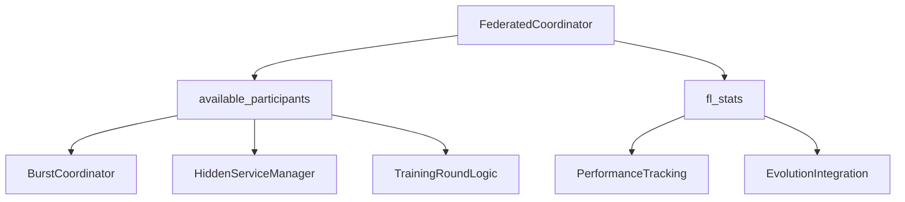

# State Management and Coordination Patterns Analysis

## Overview
The federated coordinator manages complex shared state across multiple unrelated domains, creating a web of interdependencies that violates the Single Responsibility Principle. This analysis examines the state management patterns and coordination mechanisms used throughout the system.

## Shared State Analysis

### 1. **Training State Management** (Core Domain)
**Lines**: 189-194  
**Scope**: Federated Learning Operations  
**Appropriateness**: ✅ Legitimate for ML coordinator

```python
# Training state
self.current_round: FederatedTrainingRound | None = None
self.training_history: list[FederatedTrainingRound] = []
self.global_model: nn.Module | None = None
self.is_coordinator = False
```

**State Lifecycle**:
1. `current_round` created in `run_distributed_training_round()`
2. Modified through 7 training phases (selection → evaluation)
3. Moved to `training_history` on completion
4. `global_model` updated with aggregated gradients

**Coordination Pattern**: State machine with phase transitions
- ✅ Well-encapsulated within training domain
- ✅ Clear lifecycle management
- ✅ Appropriate abstraction level

### 2. **Participant Management State** (Cross-Domain)
**Lines**: 195-197  
**Scope**: Device discovery, capabilities, and selection  
**Appropriateness**: 🚨 Mixed concerns - should be separated

```python
# Participant management
self.available_participants: dict[str, TrainingParticipant] = {}
self.participant_pool: set[str] = set()
```

**State Complexity Issues**:
- **TrainingParticipant** contains both FL-specific and general device info
- Participant capabilities used by burst coordinator and hidden services
- Device discovery mixed with FL-specific selection logic
- No clear ownership of participant lifecycle

**Cross-Domain Usage**:
```python
# BurstCoordinator accesses FL participant data directly
for node_id, participant in self.fl_coordinator.available_participants.items():
    if self._node_meets_requirements(participant, requirements):
        suitable_nodes.append(node_id)

# HiddenServiceManager uses FL participant selection
for node_id, participant in self.fl_coordinator.available_participants.items():
    if participant.contribution_score > 0.8:  # High reliability only
        suitable_nodes.append(node_id)
```

**Problems Identified**:
- ❌ Tight coupling between FL and marketplace services
- ❌ No separation between device capabilities and FL participation
- ❌ Shared mutable state accessed by multiple services
- ❌ No encapsulation of participant management logic

### 3. **Privacy Budget State** (Security Domain)
**Lines**: 199-201  
**Scope**: Differential privacy budget tracking  
**Appropriateness**: 🚨 Mixed with general device management

```python
# Privacy and security
self.privacy_budgets: dict[str, float] = {}
self.secure_aggregation = None  # Will be initialized when needed
```

**State Management Issues**:
- Privacy budgets mixed with general participant data
- No encapsulation of privacy-specific logic
- Budget updates scattered across training methods
- No privacy budget recovery or renewal mechanisms

**Usage Pattern**:
```python
# Privacy budget initialization (scattered logic)
def _initialize_privacy_budgets(self) -> None:
    initial_budget = 10.0  # Total privacy budget
    for device_id in self.available_participants:
        self.privacy_budgets[device_id] = initial_budget
        self.available_participants[device_id].privacy_budget_remaining = initial_budget

# Privacy budget consumption (multiple locations)
participant.privacy_budget_remaining -= self.config.differential_privacy_epsilon
```

### 4. **Performance Statistics State** (Monitoring Domain)
**Lines**: 203-212  
**Scope**: System-wide performance tracking  
**Appropriateness**: 🚨 Should be in dedicated monitoring service

```python
# Performance tracking
self.fl_stats = {
    "rounds_completed": 0,
    "total_participants": 0,
    "avg_round_time": 0.0,
    "convergence_rounds": 0,
    "privacy_budget_consumed": 0.0,
    "byzantine_attacks_detected": 0,
    "gradient_compression_ratio": 1.0,
}
```

**Problems**:
- Flat dictionary with no type safety
- Mixed FL-specific and general system metrics
- No aggregation across multiple coordinators
- Manual statistics updates scattered throughout code
- No time-series data or trend analysis

### 5. **Service Instance State** (Integration Layer)
**Lines**: 64-71, 185-187  
**Scope**: Integration with external services  
**Appropriateness**: 🚨 Should use dependency injection

```python
# Component instances
self.harvest_manager: FogHarvestManager | None = None
self.onion_router: OnionRouter | None = None
self.marketplace: FogMarketplace | None = None
self.token_system: FogTokenSystem | None = None
self.resource_manager: MobileResourceManager | None = None
self.quorum_manager: QuorumManager | None = None
self.sla_tier_manager: EnhancedSLATierManager | None = None

# Fog burst operations support
self.burst_coordinator = BurstCoordinator(self) if P2P_FOG_AVAILABLE else None
self.hidden_service_manager = HiddenServiceManager(self) if P2P_FOG_AVAILABLE else None
```

**Coordination Issues**:
- Services hold reference to coordinator (circular dependency)
- Optional service instances create conditional logic throughout
- No clear service lifecycle management
- No service health monitoring or fault tolerance

## Coordination Patterns Analysis

### 1. **Message-Based Coordination** (P2P Layer)
**Pattern**: Event-driven messaging with handler registration  
**Implementation**: `_register_p2p_handlers()` (Lines 222-239)

```python
async def _fl_dispatcher(message: P2PMessage, writer: asyncio.StreamWriter | None = None) -> None:
    msg_type = message.payload.get("type")
    
    if msg_type == "FL_CAPABILITY_ANNOUNCEMENT":
        await self._handle_capability_announcement(message)
    elif msg_type == "FL_GRADIENTS":
        await self._handle_gradient_submission(message)
    elif msg_type == "FL_GRADIENT_COLLECTION":
        await self._handle_gradient_collection_request(message)
    elif previous_handler:
        await previous_handler(message, writer)
```

**Issues**:
- FL-specific message handling mixed with general P2P transport
- String-based message type discrimination (not type-safe)
- Handler chaining pattern creates complex message flow
- No message validation or error handling
- Tight coupling between transport and application logic

### 2. **Direct Method Invocation** (Service Coordination)
**Pattern**: Services directly call coordinator methods  
**Example**: BurstCoordinator and HiddenServiceManager

```python
# BurstCoordinator directly accesses FL coordinator state
available_nodes = await self._find_burst_nodes(compute_requirements)

def _node_meets_requirements(self, participant: TrainingParticipant, requirements: dict) -> bool:
    caps = participant.capabilities  # Direct access to FL participant data
```

**Problems**:
- Bypasses encapsulation and abstraction layers
- Creates tight coupling between services
- No clear interface contracts
- Difficult to test services in isolation
- Changes in one service affect others

### 3. **Shared State Mutation** (Cross-Domain)
**Pattern**: Multiple services modify shared coordinator state  
**Examples**: Participant updates, statistics tracking, budget management

```python
# Multiple services update participant state directly
participant.contribution_score = min(1.0, participant.contribution_score + 0.05)
participant.participation_history.append(True)

# Statistics updated from multiple locations
self.fl_stats["byzantine_attacks_detected"] += byzantine_count
self.fl_stats["rounds_completed"] += 1
```

**Coordination Issues**:
- Race conditions in concurrent environments
- No atomic updates or transactions
- Inconsistent state when operations fail partially
- No audit trail for state changes
- Difficult to debug state corruption issues

### 4. **Callback-Based Coordination** (Evolution Integration)
**Pattern**: Integration through callback methods  
**Implementation**: `_integrate_with_evolution()` (Lines 1080-1098)

```python
async def _integrate_with_evolution(self, training_round: FederatedTrainingRound) -> None:
    # Trigger evolution based on FL results
    evolution_trigger_data = {
        "trigger_type": "federated_learning_round",
        "round_metrics": training_round.metrics,
        "model_performance": training_round.metrics.get("model_loss", 0.0),
        "participant_count": len(training_round.participants),
        "convergence_indicator": self.fl_stats["convergence_rounds"],
    }
    # This would trigger evolution in the evolution system
    # await self.evolution_system.trigger_evolution(evolution_trigger_data)
```

**Issues**:
- Commented-out actual integration code
- No error handling for evolution system failures
- Tight coupling between FL results and evolution triggers
- No abstraction layer for evolution integration

## State Consistency Patterns

### 1. **Eventual Consistency** (Distributed Participants)
The system uses eventual consistency for participant state across the network:

```python
# Participant capability announcements
async def _handle_capability_announcement(self, message: P2PMessage) -> None:
    device_id = message.sender_id
    if device_id not in self.available_participants:
        # Create new participant record
        self.available_participants[device_id] = TrainingParticipant(...)
    self.participant_pool.add(device_id)
```

**Issues**:
- No conflict resolution for participant updates
- No versioning or causality tracking
- Stale participant data may persist
- No coordination for participant state changes

### 2. **Strong Consistency** (Training Rounds)
Training rounds use strong consistency with centralized coordinator:

```python
async def run_distributed_training_round(self) -> FederatedTrainingRound:
    if not self.is_coordinator:
        raise ValueError("Only coordinator can initiate training rounds")
    
    # Single coordinator ensures consistent state transitions
    training_round.status = TrainingRoundStatus.PARTICIPANT_SELECTION
    # ... sequential phase transitions
```

**Benefits**:
- ✅ Clear state transitions
- ✅ Centralized control prevents conflicts
- ✅ Deterministic round progression

**Limitations**:
- Single point of failure (coordinator)
- No support for multiple coordinators
- Scalability bottleneck for large networks

### 3. **Optimistic Concurrency** (Resource Allocation)
Services use optimistic concurrency for resource allocation:

```python
# BurstCoordinator assumes resources remain available
burst_job = {
    "assigned_nodes": available_nodes,  # Nodes may become unavailable
    "start_time": time.time(),
    # No reservation or locking mechanism
}
```

**Issues**:
- No resource reservation mechanism
- Race conditions when multiple services request same resources
- No conflict detection or resolution
- Resource exhaustion not handled gracefully

## Cross-Service Communication Patterns

### 1. **Shared Data Access Pattern**
Multiple services access shared coordinator state:



**Problems**:
- No access control or permissions
- No data validation at access points
- Concurrent modification issues
- Tight coupling between services

### 2. **Service Dependency Chain**
Services have complex dependency chains:

```
TokenomicsService → WalletVerification → BurstCoordinator
                 → RewardCalculation → ParticipantManagement
                 → PaymentProcessing → MarketplaceService
```

**Issues**:
- Long dependency chains create brittleness
- Circular dependencies through coordinator
- No dependency injection or inversion of control
- Service failures cascade to dependent services

## Refactoring Recommendations

### 1. **Domain-Specific State Management**
Extract state management to domain-specific services:

```python
class DeviceRegistryService:
    def __init__(self):
        self._devices: Dict[str, DeviceCapabilities] = {}
        self._device_metrics: Dict[str, DeviceMetrics] = {}
    
    async def register_device(self, device: DeviceCapabilities) -> None:
        # Atomic device registration with validation
    
    async def get_devices_by_criteria(self, criteria: DeviceCriteria) -> List[DeviceCapabilities]:
        # Query devices without exposing internal state

class PrivacyBudgetService:
    def __init__(self):
        self._budgets: Dict[str, PrivacyBudget] = {}
    
    async def consume_budget(self, device_id: str, epsilon: float) -> bool:
        # Atomic budget consumption with validation
    
    async def renew_budget(self, device_id: str, amount: float) -> None:
        # Budget renewal with proper accounting
```

### 2. **Event-Driven Architecture**
Replace direct state mutation with events:

```python
class EventBus:
    async def publish(self, event: DomainEvent) -> None:
        # Publish domain events to interested services
    
    async def subscribe(self, event_type: Type[DomainEvent], handler: EventHandler) -> None:
        # Subscribe to domain events

# Example events
class DeviceRegisteredEvent(DomainEvent):
    device_id: str
    capabilities: DeviceCapabilities

class TrainingRoundCompletedEvent(DomainEvent):
    round_id: str
    metrics: TrainingMetrics
    participants: List[str]
```

### 3. **Service Interface Abstraction**
Define clear interfaces between services:

```python
class ParticipantSelectionService(Protocol):
    async def select_participants(self, criteria: SelectionCriteria) -> List[ParticipantInfo]:
        ...
    
    async def get_participant_capabilities(self, device_id: str) -> DeviceCapabilities:
        ...

class ResourceAllocationService(Protocol):
    async def allocate_compute(self, requirements: ComputeRequirements) -> AllocationResult:
        ...
    
    async def release_resources(self, allocation_id: str) -> None:
        ...
```

### 4. **State Synchronization Mechanisms**
Implement proper state synchronization:

```python
class StateManager:
    def __init__(self):
        self._locks: Dict[str, asyncio.Lock] = {}
        self._versions: Dict[str, int] = {}
    
    async def update_with_lock(self, resource_id: str, update_func: Callable) -> None:
        async with self._get_lock(resource_id):
            # Atomic updates with proper locking
    
    def get_version(self, resource_id: str) -> int:
        # Version-based conflict detection
```

## Conclusion

The current state management and coordination patterns in the federated coordinator create a tightly coupled, difficult-to-maintain system with numerous issues:

**Major Problems**:
- ❌ Shared mutable state across unrelated domains
- ❌ No encapsulation or access control for critical state
- ❌ Direct service-to-service coupling through coordinator
- ❌ Inconsistent coordination patterns (messaging vs. direct calls)
- ❌ No atomic operations or transaction support
- ❌ Race conditions and concurrency issues
- ❌ No clear state ownership or lifecycle management

**Refactoring Benefits**:
Breaking the monolithic state management into domain-specific services would:
- ✅ Eliminate shared mutable state issues
- ✅ Provide clear ownership and encapsulation
- ✅ Enable independent service scaling and testing
- ✅ Support proper transaction and consistency guarantees
- ✅ Reduce coupling between unrelated domains
- ✅ Improve system reliability and maintainability

The current architecture violates fundamental principles of distributed system design and should be refactored into a proper microservices architecture with clear boundaries, interfaces, and state management patterns.