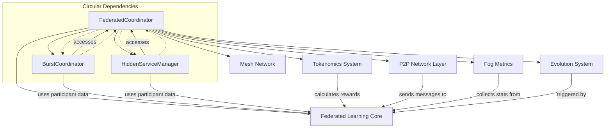
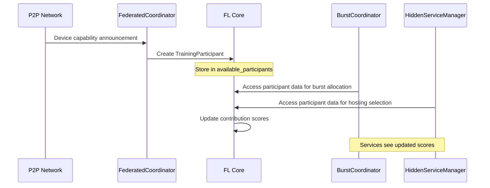
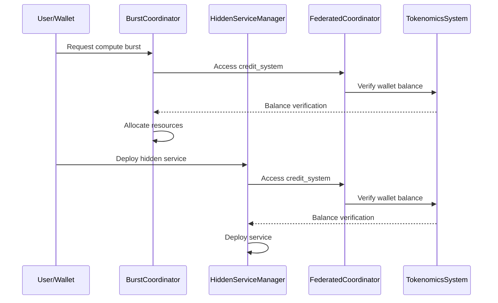
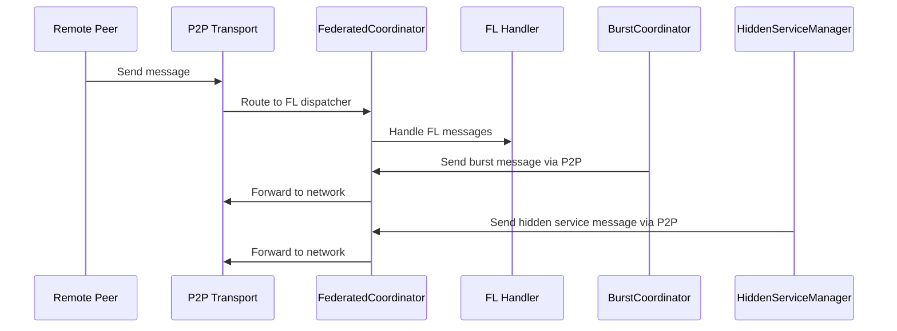

# Integration Points and Dependencies Mapping

## Overview
The federated coordinator creates a complex web of dependencies between subsystems that should be independent. This analysis maps all integration points, dependencies, and data flows to identify decoupling opportunities and service boundaries.

## Dependency Graph Visualization



## Integration Points Analysis

### 1. **Federated Learning ↔ P2P Network Integration**
**Integration Type**: Bi-directional message handling  
**Coupling Level**: HIGH 🔴  
**Lines**: 222-284

#### Data Flow:
```python
# FL → P2P: Outbound messages
await self.p2p_node.broadcast_to_peers("FL_CAPABILITY_ANNOUNCEMENT", announcement)
await self.p2p_node.send_to_peer(participant.device_id, invitation)
await self.p2p_node.send_to_peer(participant.device_id, distribution_message)

# P2P → FL: Inbound message handling
async def _fl_dispatcher(message: P2PMessage, writer: asyncio.StreamWriter | None = None):
    if msg_type == "FL_CAPABILITY_ANNOUNCEMENT":
        await self._handle_capability_announcement(message)
    elif msg_type == "FL_GRADIENTS":
        await self._handle_gradient_submission(message)
```

**Problems**:
- FL-specific message types mixed with general P2P transport
- Direct coupling between FL training logic and network transport
- No abstraction layer for message serialization/deserialization
- String-based message discrimination (not type-safe)

**Refactoring Opportunity**:
```python
# Proposed: Message-based interface
class FLMessageHandler(Protocol):
    async def handle_capability_announcement(self, device_id: str, capabilities: PeerCapabilities) -> None: ...
    async def handle_gradient_submission(self, device_id: str, gradients: Dict[str, Tensor]) -> None: ...

class NetworkTransport(Protocol):
    async def send_message(self, peer_id: str, message: Message) -> bool: ...
    async def broadcast_message(self, message: Message) -> List[str]: ...
    async def register_handler(self, message_type: Type[Message], handler: MessageHandler) -> None: ...
```

### 2. **BurstCoordinator ↔ Federated Learning Integration**
**Integration Type**: Direct state access  
**Coupling Level**: EXTREME 🔴🔴🔴  
**Lines**: 1283-1318

#### Problematic Coupling:
```python
class BurstCoordinator:
    def __init__(self, federated_coordinator: DistributedFederatedLearning):
        self.fl_coordinator = federated_coordinator  # Circular dependency

    async def _find_burst_nodes(self, requirements: dict) -> list[str]:
        # Direct access to FL participant data
        for node_id, participant in self.fl_coordinator.available_participants.items():
            if self._node_meets_requirements(participant, requirements):
                suitable_nodes.append(node_id)
    
    def _node_meets_requirements(self, participant: TrainingParticipant, requirements: dict) -> bool:
        # Uses FL-specific participant structure for marketplace needs
        caps = participant.capabilities
        if caps.compute_gflops < requirements.get("min_compute_gflops", 1.0):
            return False
```

**Issues**:
- Circular dependency: BurstCoordinator → FL → BurstCoordinator
- Direct access to FL internal state (available_participants)
- Marketplace service using FL-specific data structures
- No separation between device capabilities and FL participation

**Service Boundary Violation**:
The BurstCoordinator (marketplace service) should not access FL training participant data directly.

### 3. **HiddenServiceManager ↔ Federated Learning Integration**
**Integration Type**: Direct state access + message passing  
**Coupling Level**: HIGH 🔴  
**Lines**: 1402-1441

#### Coupling Mechanisms:
```python
class HiddenServiceManager:
    def __init__(self, federated_coordinator: DistributedFederatedLearning):
        self.fl_coordinator = federated_coordinator  # Circular dependency

    async def _select_hosting_nodes(self, privacy_level: str) -> list[str]:
        # Uses FL participant selection logic for privacy service
        for node_id, participant in self.fl_coordinator.available_participants.items():
            if participant.contribution_score > 0.8:  # High reliability only
                suitable_nodes.append(node_id)

    async def _distribute_website_data(self, service_id: str, data: bytes, nodes: list[str]):
        # Uses FL P2P infrastructure for privacy service
        await self.fl_coordinator.p2p_node.send_message(
            node_id, P2PMessage(...)
        )
```

**Problems**:
- Privacy service mixed with FL training concerns
- Uses FL contribution scores for privacy decisions
- No separation between device reliability for FL vs. privacy hosting
- Direct access to FL P2P infrastructure

### 4. **Tokenomics ↔ Multiple Services Integration**
**Integration Type**: Conditional optional integration  
**Coupling Level**: MEDIUM 🟡  
**Lines**: 177-179, scattered throughout

#### Integration Scattered Across Services:
```python
# In FederatedCoordinator
self.credit_system = credit_system
self.compute_mining = ComputeMiningSystem(credit_system) if credit_system and TOKENOMICS_AVAILABLE else None

# In BurstCoordinator
async def request_compute_burst(self, requester_wallet: str, ...):
    if self.fl_coordinator.credit_system:
        if not await self._verify_burst_budget(requester_wallet, max_cost_tokens):
            raise ValueError("Insufficient compute tokens for burst")

# In HiddenServiceManager
async def deploy_hidden_website(self, owner_wallet: str, ...):
    if self.fl_coordinator.credit_system:
        if not await self._verify_deployment_budget(owner_wallet, compute_budget):
            raise ValueError("Insufficient compute tokens for website deployment")
```

**Issues**:
- Optional tokenomics create conditional logic throughout all services
- No consistent interface for payment verification
- Services directly access coordinator's credit system
- Payment logic scattered across multiple services

### 5. **Evolution System ↔ Federated Learning Integration**
**Integration Type**: Callback-based integration  
**Coupling Level**: LOW 🟢  
**Lines**: 1080-1098

#### Integration Pattern:
```python
async def _integrate_with_evolution(self, training_round: FederatedTrainingRound) -> None:
    if not self.evolution_system:
        return
    
    evolution_trigger_data = {
        "trigger_type": "federated_learning_round",
        "round_metrics": training_round.metrics,
        "model_performance": training_round.metrics.get("model_loss", 0.0),
        "participant_count": len(training_round.participants),
        "convergence_indicator": self.fl_stats["convergence_rounds"],
    }
    # This would trigger evolution in the evolution system
    # await self.evolution_system.trigger_evolution(evolution_trigger_data)
```

**Assessment**:
- ✅ Relatively clean integration pattern
- ✅ Optional dependency handled gracefully
- ✅ One-way dependency (FL → Evolution)
- ❌ Commented-out implementation suggests incomplete integration

## Cross-Service Data Flow Analysis

### 1. **Device Information Flow**


**Problems**:
- Device information flows through FL-specific structures
- Multiple services depend on FL participant data
- No separation between device capabilities and FL-specific metadata
- Updates in FL affect other services

### 2. **Payment/Tokenomics Flow**


**Problems**:
- No consistent payment interface across services
- Services access tokenomics through coordinator
- Payment verification scattered across services
- No centralized payment processing or audit trail

### 3. **Message Routing Flow**


**Problems**:
- All messages route through coordinator
- No direct service-to-service communication
- FL message handling mixed with general routing
- Services can't use alternative transport protocols

## Dependency Inversion Violations

### 1. **High-Level Modules Depending on Low-Level Modules**
```python
# FederatedCoordinator (high-level) depends on specific implementations
from ..compute.harvest_manager import FogHarvestManager
from ..marketplace.fog_marketplace import FogMarketplace
from ..privacy.onion_routing import OnionRouter
from ..tokenomics.fog_token_system import FogTokenSystem

# Services (high-level) depend on coordinator (should be abstracted)
class BurstCoordinator:
    def __init__(self, federated_coordinator: DistributedFederatedLearning):
        self.fl_coordinator = federated_coordinator
```

### 2. **Concrete Dependencies Instead of Abstractions**
```python
# Should depend on interfaces, not concrete classes
self.p2p_node: P2PNode  # Concrete P2P implementation
self.evolution_system: InfrastructureAwareEvolution  # Concrete evolution system
self.credit_system: "VILLAGECreditSystem"  # Concrete tokenomics implementation
```

## Service Communication Anti-Patterns

### 1. **God Object Pattern**
The FederatedCoordinator acts as a centralized hub that all services depend on:
```python
# All services access coordinator state directly
self.fl_coordinator.available_participants
self.fl_coordinator.credit_system
self.fl_coordinator.p2p_node
self.fl_coordinator.fl_stats
```

### 2. **Tight Coupling Pattern**
Services are tightly coupled through shared data structures:
```python
# BurstCoordinator knows about FL-specific TrainingParticipant structure
def _node_meets_requirements(self, participant: TrainingParticipant, requirements: dict):
    caps = participant.capabilities  # FL-specific structure
    if caps.compute_gflops < requirements.get("min_compute_gflops", 1.0):
        return False
```

### 3. **Leaky Abstraction Pattern**
Services expose internal implementation details to other services:
```python
# FL internal state exposed to other services
for node_id, participant in self.fl_coordinator.available_participants.items():
    # Services directly access FL internal data structures
```

## Refactoring Strategy: Breaking Dependencies

### 1. **Extract Device Registry Service**
```python
class DeviceRegistryService:
    async def register_device(self, device: DeviceInfo) -> DeviceId:
        # Central device registration
    
    async def get_devices_by_criteria(self, criteria: DeviceCriteria) -> List[DeviceInfo]:
        # Query devices for any service
    
    async def update_device_reputation(self, device_id: DeviceId, score: float) -> None:
        # Update device reputation from any service

# Services use registry instead of FL participant data
class BurstCoordinator:
    def __init__(self, device_registry: DeviceRegistryService):
        self._device_registry = device_registry
    
    async def find_burst_nodes(self, requirements: ComputeRequirements) -> List[DeviceId]:
        criteria = DeviceCriteria.from_compute_requirements(requirements)
        return await self._device_registry.get_devices_by_criteria(criteria)
```

### 2. **Extract Payment Service**
```python
class PaymentService:
    async def verify_payment_capability(self, wallet: WalletId, amount: TokenAmount) -> bool:
        # Centralized payment verification
    
    async def process_payment(self, payment_request: PaymentRequest) -> PaymentResult:
        # Process payments for any service
    
    async def distribute_rewards(self, rewards: List[RewardAllocation]) -> None:
        # Distribute rewards to participants

# Services use payment service interface
class BurstCoordinator:
    def __init__(self, payment_service: PaymentService):
        self._payment_service = payment_service
    
    async def request_compute_burst(self, request: BurstRequest) -> BurstAllocation:
        if not await self._payment_service.verify_payment_capability(request.wallet, request.budget):
            raise InsufficientFundsError("Insufficient tokens for burst")
```

### 3. **Extract Communication Service**
```python
class CommunicationService:
    async def send_message(self, recipient: NodeId, message: Message) -> bool:
        # Send message using appropriate transport
    
    async def broadcast_message(self, message: Message, recipients: List[NodeId]) -> List[NodeId]:
        # Broadcast to multiple recipients
    
    async def subscribe_to_messages(self, message_type: Type[Message], handler: MessageHandler) -> None:
        # Subscribe to specific message types

# Services use communication interface
class FederatedLearningService:
    def __init__(self, communication: CommunicationService):
        self._communication = communication
    
    async def start_training_round(self, participants: List[NodeId]) -> None:
        message = TrainingStartMessage(...)
        await self._communication.broadcast_message(message, participants)
```

## Integration Interface Definitions

### 1. **Service Discovery Interface**
```python
class ServiceDiscovery(Protocol):
    async def register_service(self, service_info: ServiceInfo) -> None: ...
    async def discover_services(self, service_type: str) -> List[ServiceEndpoint]: ...
    async def health_check(self, service_id: str) -> HealthStatus: ...
```

### 2. **Resource Management Interface**
```python
class ResourceManager(Protocol):
    async def allocate_resources(self, request: ResourceRequest) -> ResourceAllocation: ...
    async def release_resources(self, allocation_id: str) -> None: ...
    async def get_available_resources(self) -> ResourceCapacity: ...
```

### 3. **Event Bus Interface**
```python
class EventBus(Protocol):
    async def publish_event(self, event: DomainEvent) -> None: ...
    async def subscribe_to_events(self, event_type: Type[DomainEvent], handler: EventHandler) -> None: ...
    async def unsubscribe(self, subscription_id: str) -> None: ...
```

## Conclusion

The current integration architecture creates a tightly coupled system with numerous dependency violations:

**Major Issues**:
- ❌ Circular dependencies between coordinator and services
- ❌ Services directly access each other's internal state
- ❌ No separation between domain concerns
- ❌ Violation of dependency inversion principle
- ❌ God object anti-pattern with coordinator as central hub
- ❌ Leaky abstractions between service boundaries
- ❌ Mixed transport and business logic concerns

**Breaking Dependencies Requires**:
1. **Extract Shared Services**: Device registry, payment service, communication service
2. **Define Clean Interfaces**: Protocol-based interfaces with dependency injection
3. **Implement Event-Driven Architecture**: Reduce direct service-to-service coupling
4. **Service Discovery Mechanism**: Allow services to find each other without coordinator
5. **Centralized Configuration**: Manage service dependencies and configuration

**Refactoring Benefits**:
- ✅ Independent service deployment and scaling
- ✅ Improved testability through dependency injection
- ✅ Clear separation of concerns and responsibilities
- ✅ Reduced coupling and increased cohesion
- ✅ Better fault isolation and resilience
- ✅ Support for multiple implementations of each service