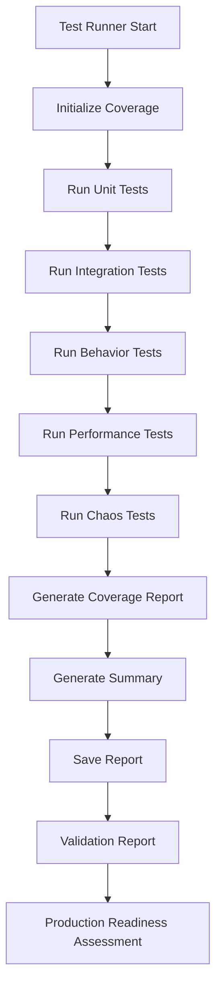

# Agent Abstract Method Testing Suite

A comprehensive testing framework for validating all abstract method implementations in the AIVillage agent system. This suite follows TDD London School methodology with extensive mocking, behavior verification, and chaos engineering.

## 🎯 Overview

This testing suite provides comprehensive validation for:
- **UnifiedBaseAgent** - Core agent implementation with all abstract methods
- **BaseAnalytics** - Analytics generation and reporting functionality  
- **ProcessingInterface** - Standardized processing operations interface

## 🧪 Test Coverage

### Unit Tests (90%+ Coverage Target)
- **Unified Base Agent Tests** (`test_unified_base_agent.py`)
  - Initialization scenarios
  - Task execution workflows
  - Communication protocols
  - RAG integration
  - Capability management
  - Advanced features (latent space, handoffs, evolution)
  - Layer testing (QA, Foundational, Learning, Architecture, Decision)
  - Edge cases and error conditions

- **Base Analytics Tests** (`test_base_analytics.py`)
  - Metric recording functionality
  - Plot generation with matplotlib
  - Analytics report creation
  - Abstract method enforcement
  - Edge cases (NaN, infinity, large datasets)
  - Concurrent access patterns

- **Processing Interface Tests** (`test_processing_interface.py`)
  - Core processing methods
  - Batch processing capabilities
  - Queue-based processing
  - Caching mechanisms
  - Capability management
  - Status and metrics tracking
  - Error handling and recovery

### Integration Tests
- Agent-Analytics integration
- Agent-Processor integration  
- Multi-agent system coordination
- Communication protocol integration
- Error handling across components
- Performance integration testing

### Behavior Tests
- Task processing workflows
- Adaptive behavior patterns
- Collaborative agent scenarios
- Workflow error recovery
- Learning and adaptation cycles

### Performance & Chaos Tests
- Latency benchmarking
- Throughput measurement
- Memory usage validation
- Scalability testing
- Error injection resilience
- Network partition simulation
- Memory pressure handling
- Concurrent chaos scenarios

## 🚀 Quick Start

### 1. Install Dependencies
```bash
cd tests/agent_testing
pip install -r requirements.txt
```

### 2. Run All Tests
```bash
# Run comprehensive test suite
python test_runner.py

# Or use pytest directly
pytest -v --cov=agents --cov-report=html
```

### 3. Run Specific Test Categories
```bash
# Unit tests only
pytest -m unit tests/agents/

# Integration tests
pytest -m integration tests/integration/

# Performance benchmarks
pytest -m performance tests/performance/

# Chaos engineering
pytest -m chaos tests/performance/

# Behavior tests
pytest -m behavior tests/behavior/
```

### 4. Generate Validation Report
```bash
python validation_report.py
```

## 📊 Test Execution Flow



## 🎨 Test Architecture

### Fixtures and Mocks (`conftest.py`)
- **Mock Infrastructure**: Vector stores, communication protocols, RAG pipelines
- **Test Data Generators**: Batch task generation, metrics data, processing data
- **Isolation Manager**: Automatic cleanup and resource management
- **Performance Thresholds**: Configurable performance benchmarks
- **Chaos Scenarios**: Predefined failure injection patterns

### Test Organization
```
tests/
├── agent_testing/           # Core testing infrastructure
│   ├── conftest.py         # Fixtures and test configuration
│   ├── test_runner.py      # Comprehensive test execution
│   ├── validation_report.py # Quality assessment and reporting
│   └── requirements.txt    # Testing dependencies
├── agents/                 # Unit tests
│   ├── test_unified_base_agent.py
│   ├── test_base_analytics.py
│   └── test_processing_interface.py
├── integration/            # Integration tests
│   └── test_agent_integration.py
├── behavior/               # Behavior-driven tests
│   └── test_agent_behavior.py
└── performance/            # Performance and chaos tests
    └── test_agent_performance.py
```

## 🔧 Configuration

### Pytest Configuration (`pytest.ini`)
- **Coverage**: 80% minimum, HTML reports
- **Markers**: Unit, integration, behavior, performance, chaos
- **Timeouts**: 5-minute test timeout
- **Logging**: Comprehensive test logging
- **Parallel**: Optional parallel execution

### Performance Thresholds
```python
performance_thresholds = {
    "task_execution_ms": 1000,      # Task execution latency
    "memory_usage_mb": 100,         # Memory usage limit
    "agent_initialization_ms": 500,  # Startup time
    "communication_latency_ms": 200, # Inter-agent communication
    "batch_processing_throughput": 10 # Items per second
}
```

## 📈 Quality Metrics

### Test Quality Standards
- **90%+ Test Coverage** - Comprehensive code coverage
- **95%+ Test Success Rate** - Reliable test execution
- **TDD London School** - Mock-heavy, behavior-focused testing
- **Fast Feedback** - Unit tests under 100ms each
- **Isolated Tests** - No test interdependencies
- **Deterministic** - Repeatable results every time

### Performance Benchmarks
- **Latency**: <100ms average task processing
- **Throughput**: >50 tasks/second sustained
- **Memory**: <200MB growth under load
- **Scalability**: 50%+ efficiency with 5x agents
- **Reliability**: 95%+ success rate under chaos

## 🛠️ Advanced Features

### Chaos Engineering
- **Error Injection**: Random failure simulation
- **Network Partitions**: Communication failure testing
- **Memory Pressure**: Resource constraint simulation
- **Concurrent Chaos**: Multiple failure modes simultaneously

### Adaptive Testing
- **Performance Baselines**: Historical comparison
- **Quality Trending**: Regression detection  
- **Failure Pattern Analysis**: Root cause identification
- **Capacity Planning**: Load prediction modeling

### Reporting & Analytics
- **HTML Reports**: Comprehensive visual reports
- **Coverage Maps**: Line-by-line coverage analysis
- **Performance Charts**: Latency and throughput visualization
- **Quality Dashboards**: Production readiness assessment

## 📋 Test Categories and Markers

| Marker | Description | Example |
|--------|-------------|---------|
| `unit` | Individual component tests | `pytest -m unit` |
| `integration` | Component interaction tests | `pytest -m integration` |
| `behavior` | Workflow and scenario tests | `pytest -m behavior` |
| `performance` | Benchmark and load tests | `pytest -m performance` |
| `chaos` | Resilience and failure tests | `pytest -m chaos` |
| `slow` | Tests taking >1 second | `pytest -m "not slow"` |
| `memory_intensive` | High memory usage tests | `pytest -m memory_intensive` |

## 🚦 Production Readiness Checklist

### ✅ Required for Production
- [ ] 90%+ test coverage across all components
- [ ] All unit tests passing (0 failures)
- [ ] Integration tests validate cross-component behavior
- [ ] Performance benchmarks meet SLA requirements
- [ ] Chaos tests demonstrate resilience
- [ ] Security validation passes
- [ ] Memory leaks eliminated
- [ ] Documentation complete

### ⚠️ Recommended Enhancements
- [ ] Mutation testing for test quality validation
- [ ] Load testing with realistic traffic patterns
- [ ] Monitoring and observability integration
- [ ] Automated regression detection
- [ ] Performance baseline establishment
- [ ] Capacity planning models

## 🔍 Troubleshooting

### Common Issues

**Tests Timing Out**
```bash
# Increase timeout for slow tests
pytest --timeout=600 -m slow
```

**Memory Issues** 
```bash
# Run tests with memory profiling
pytest --memory-profiler tests/performance/
```

**Coverage Issues**
```bash
# Generate detailed coverage report
pytest --cov=agents --cov-report=html --cov-report=term-missing
```

**Parallel Execution Issues**
```bash
# Disable parallel execution for debugging
pytest -n 0 tests/
```

### Debug Mode
```bash
# Run with detailed debugging
pytest -vvv --pdb --pdbcls=IPython.terminal.debugger:TerminalPdb
```

## 📚 Additional Resources

- [TDD London School Methodology](https://martinfowler.com/articles/mocksArentStubs.html)
- [Chaos Engineering Principles](https://principlesofchaos.org/)
- [Python Testing Best Practices](https://docs.python.org/3/library/unittest.html)
- [Pytest Documentation](https://docs.pytest.org/)
- [Coverage.py Documentation](https://coverage.readthedocs.io/)

## 🤝 Contributing

When adding new tests:
1. Follow existing naming conventions
2. Use appropriate test markers
3. Mock external dependencies
4. Maintain test isolation
5. Update coverage requirements
6. Add performance thresholds if applicable
7. Document complex test scenarios

## 📝 License

This testing suite is part of the AIVillage project and follows the same licensing terms.